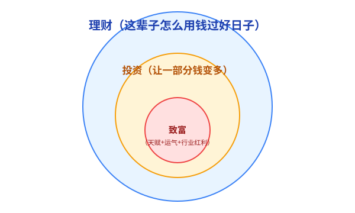
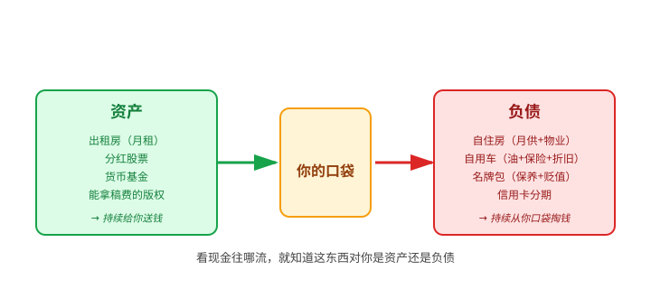
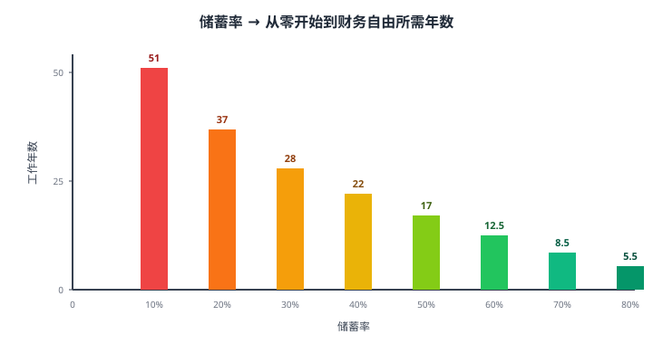
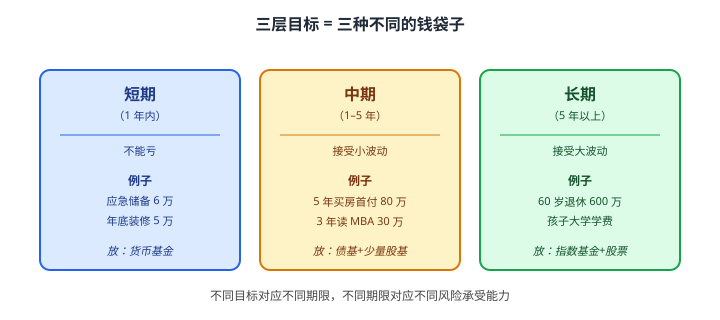

# 01 理财思维与目标设定

> **这一章要让你搞懂的事**
> 1. **理财、投资、致富**不是一回事——大多数人开口就问错问题
> 2. 学会用"钱进还是钱出"重新看自己的房子、车、信用卡
> 3. 会画两张最简单的"我的钱长什么样"的表
> 4. 知道**前 10 年最重要的不是收益率，是存钱比例**
> 5. 把"我要变有钱"翻译成可执行的人生目标
>
> **入门门槛**
> - 会基本算术（加减乘除、百分比）
> - 大致知道自己每月赚多少、花多少（不用精确到块）
>
> **声明**：本教程不构成投资建议；所有人物、产品、数字均为教学示例。

---

## 0. 先讲个故事

A 和 B 是大学室友，毕业 10 年后聚会。

- **A**：月入 1.5 万，做销售。爱买新款 iPhone、看到打折就囤、五一长假必定出国。10 年存款：**3 万**。
- **B**：月入 1.2 万，做程序员。手机用到坏才换，每月固定转 4,000 到基金账户。10 年净资产：**70 万**。

A 比 B 多挣 36 万，但 B 比 A 多攒 67 万。

**这就是这章要讲的一切**：理财不是"赚多少"，是"怎么对待手里的钱"。A 和 B 的差距不是天赋、不是运气、甚至不是收入——是**对钱的认知**。

读完这一章，你不会变富，但你会看清"为什么有人月入两万还月光，有人月入八千能买房"。

---

## 1. 理财 ≠ 投资 ≠ 致富

很多人一上来就问"买什么基金能涨"——这等于站在小学门口问"清华怎么考"。**不是问题不对，是顺序错了**。

三个词的范围大小如下图：

**翻译成人话**：

- **理财**：一辈子怎么花钱、攒钱、防风险——**所有人都得做**。
- **投资**：理财里的一个小动作，让某些钱"生钱"——**有钱才需要研究**。
- **致富**：跨越阶层那种"暴富"——**靠运气+天赋+时代，不能教**。

> 💡 **本教程教的是中间那一层（理财）的全部、和里面那一层（投资）的入门到中阶**。
> 任何标题写着"教你致富"的内容，大概率是想从你身上挣钱的人。

---

## 2. 资产 vs 负债：两个最常被混用的词

### 2.1 教科书定义（中性的）

| 词 | 是什么 | 例子 |
|---|---|---|
| **收入** | 一段时间内进你口袋的钱 | 工资、利息、租金 |
| **支出** | 一段时间内出你口袋的钱 | 房租、餐饮、按揭 |
| **资产** | 你拥有的、有价值的东西 | 房子、股票、现金 |
| **负债** | 你欠别人的钱 | 房贷、信用卡 |

注意：
- **收入和支出**是"一段时间内累计了多少"——叫**流量**
- **资产和负债**是"某一时刻有多少"——叫**存量**

打个比方：你家水表是流量（这个月用了 5 吨），你家水缸是存量（现在缸里有 200 升）。两件事。

### 2.2 富爸爸的"颠覆性"定义

罗伯特·清崎在《富爸爸穷爸爸》给了一个更扎心的定义：

> **资产 = 把钱放进你口袋的东西**
> **负债 = 把钱从你口袋掏走的东西**

**看图最直观**：

按这个定义重新看几样东西：

| 东西 | 教科书 | 富爸爸 | 怎么回事 |
|---|---|---|---|
| 出租房 | 资产 | **资产** | 收的房租 > 月供+物业 |
| 自住房 | 资产 | **负债** | 不收租，每月还得交月供+物业 |
| 自用车 | 资产 | **负债** | 油费+保险+逐年贬值 |
| 名牌包 | 资产 | **负债** | 不产生现金流，还要保养 |
| 分红股票 | 资产 | **资产** | 每年/每季度收分红 |

> ⚠️ **两种定义都对，看你做什么决策**：
> - **算总账、做家庭财务报表** → 用教科书定义
> - **决定要不要买某样东西** → 用富爸爸定义（看它会持续给你钱还是要你钱）

> 🇨🇳 **中国市场特别说明**：过去 20 年自住房因为房价单边上涨，"持有期升值 + 卖出兑现"实际上还是资产。但 2021 年后房价不再单边上涨，**用富爸爸定义会让你更冷静**——尤其当月供占收入 50% 以上时。

---

## 3. 你的两张财务表

要管钱，先得知道钱长什么样。**两张表足够**。

### 3.1 第一张：我现在有多少（资产负债表）

这是某一时刻的快照——比如"2026 年 6 月 1 日，张三的家底"：

| 资产（拥有的） | 金额（元） | 负债（欠的） | 金额（元） |
|---|---:|---|---:|
| 活期+余额宝 | 30,000 | 信用卡未还 | 8,000 |
| 定期存款 | 50,000 | 房贷剩余本金 | 1,200,000 |
| 基金+股票 | 80,000 | 车贷剩余本金 | 60,000 |
| 自住房（市值） | 1,800,000 | | |
| 车（折旧后） | 80,000 | | |
| **合计** | **2,040,000** | **合计** | **1,268,000** |

**净资产 = 资产 − 负债 = 204 万 − 126.8 万 = 77.2 万**

**人话**：张三看起来有 200 万家底，但还掉欠款实际上只有 77 万。这个 **77 万才是他真正"拥有"的钱**，金融上叫**净资产（Net Worth）**。

> 📌 **新手第一个动作**：花 30 分钟，照着这张表把自己的写一遍。多数人写完会发现——**净资产比想象中少很多**。这是正常的，承认现状是改变的起点。

### 3.2 第二张：我每个月钱进钱出（现金流量表）

这是"一个月内钱怎么进怎么出"——比如"张三 2026 年 5 月"：

| 收入 | 金额 | 支出 | 金额 |
|---|---:|---|---:|
| 税后工资 | 18,000 | 房贷月供 | 6,500 |
| 基金分红 | 200 | 车贷月供 | 1,800 |
| | | 餐饮 | 2,500 |
| | | 交通 | 800 |
| | | 其他 | 2,400 |
| **合计** | **18,200** | **合计** | **14,000** |

**当月结余 = 18,200 − 14,000 = 4,200 元**

这 4,200 元只有三种命运：

1. 存进银行 / 货币基金 → **资产变多**
2. 投入基金 / 股票 → **资产变多（投资类）**
3. 提前还房贷 → **负债变少**

不管哪种，都让你的**净资产上升**。

> 💡 **两张表的关系**：第二张表（一个月）的结余，会推动第一张表（年底）的净资产变化。**月月有结余的人，财富在长大；月月不结余的人，财富在原地踏步**。

---

## 4. 储蓄率：前 10 年最重要的一个数

### 4.1 什么是储蓄率

**大白话定义**：每个月赚的钱里，**没花掉的占多少比例**。

$$
\text{储蓄率} = \frac{\text{收入} - \text{支出}}{\text{收入}} \times 100\%
$$

张三这个月的储蓄率 = 4,200 / 18,200 ≈ **23.1%**。

| 储蓄率 | 描述 |
|---:|---|
| < 10% | 月光族 |
| 10%–20% | 大部分上班族的水平 |
| 20%–40% | 有意识理财的人 |
| 40%–60% | 节俭+有规划 |
| > 60% | 准备早退休 |

### 4.2 为什么前 10 年储蓄率比收益率重要

**直觉**：收益率是利率游戏，储蓄率是习惯游戏。前期本金太小，10% 收益不如多存 1,000 块。

两个人都月入 1 万、年化 5%：

| 月储蓄 | 储蓄率 | 一年累计本金 | 一年收益（5%） | 第一年净增加 |
|---:|---:|---:|---:|---:|
| 1,000 | 10% | 12,000 | 约 300 | **12,300** |
| 3,000 | 30% | 36,000 | 约 900 | **36,900** |
| 5,000 | 50% | 60,000 | 约 1,500 | **61,500** |

第一个人要靠收益率追上第三个人，得每年涨百分之几百——**不可能**。

> 🔑 **核心认知**：**没有任何稳健投资能弥补低储蓄率**。
> 任何告诉你"靠投资就能改命"的人，要么在卖课，要么在卖产品。

### 4.3 储蓄率决定你要工作多少年

如果你接受这两个假设：
- 退休后年化实际回报率（扣通胀后）≈ 5%
- 退休时按本金的 4% 每年取出（详见第 37 章退休规划）

那么有一张**经典对照表**：

> 📌 这张表最反直觉的点：**从存 10% 提到 20%，省下来的不是 10 年生活费，是 14 年人生**。
> 表的数学怎么来的？放到第 02 章（复利）会亲手推一遍。先记数字感。

### 4.4 三个最常见的误区

1. **"我收入太低，没什么好存的"** — 储蓄率是比率，跟绝对收入无关。月入 5,000 存 1,000（20%）比月入 50,000 存 5,000（10%）更早自由。
2. **"等我升职加薪再开始"** — 这叫**生活方式通胀（lifestyle inflation）**——大白话："收入涨多少，消费就涨多少，最后储蓄率不变"。等不到那天。
3. **"我用信用卡分期，每月只看分期金额"** — 信用卡分期的真实年化往往 13%–18%，比绝大多数稳健投资都高。**先还高息债，再谈投资**。

---

## 5. SMART 目标：把"我想理财"变成可执行的事

"我要变有钱"不是目标，是愿望。**SMART 原则**把愿望翻译成目标：

| 字母 | 意思 | 反例 → 正例 |
|---|---|---|
| **S** Specific（具体） | 干嘛、为什么 | "我要存钱" → "我要存应急储备" |
| **M** Measurable（可量化） | 有数字 | "存一笔" → "存 6 万" |
| **A** Achievable（够得着） | 跳起来够得到 | 月入 1.5 万的人一年存 30 万不现实 |
| **R** Relevant（相关） | 跟你人生对得上 | "买名牌包"对财务自由无帮助 |
| **T** Time-bound（有期限） | 有截止日期 | "存 6 万" → "2027-06 前存满 6 万" |

**对比**：

> ❌ "我要存钱买房。"
> ✅ "我要在 **2029-06** 前攒下 **80 万** 作为一线城市首付。从 **2026-07** 起每月定投指数基金 **8,000 元**，工资到账后**剩余的钱**转入货币基金以避免乱花。"

### 5.1 三层目标（建议每个人都写一份）

> 这张分层表会在第 06 章（资产配置）变成具体的**钱分别放哪儿**的决策。所以**一定要先写**，哪怕只是粗糙版本。

---

## 6. 财务自由：一个起点数字

你不需要现在就规划退休，但知道**目标数字**会让所有中间决策有锚。

**最朴素的公式**：

$$
\text{财务自由数} \approx \text{年支出} \times 25
$$

**翻译成人话**：本金达到你年支出的 25 倍，理论上你每年取 4%（即 1/25），这笔钱**永远花不完**。

为什么是 25？这是 **4% 法则**的倒数（1 ÷ 0.04 = 25）。这个法则源自美国学者 William Bengen 1994 年的研究——根据 1926–1976 年的美国股市数据回测，**如果退休后每年取出本金的 4%（按通胀调整），50%股票+50%债券的组合可以撑过任意 30 年**。详细推导留到第 37 章。

**例子**：张三月支出 1.4 万 → 年支出 16.8 万 → 财务自由数 ≈ **420 万**。

这只是个**数量级感觉**，不是精确数字。后面会教你按通胀、按健康预期、按医疗成本调整。

---

## 7. 进阶：常被忽略的三个真相

**入门读者可以先跳过本节**，等学完前 5 章再回来读。

### 7.1 净资产 ≠ 可支配财富

你的房子值 200 万，但你不能"切一块墙卖了买菜"。这叫**流动性问题（liquidity）**。
- **高流动性**：现金、货币基金、股票（1-2 天能变现）
- **中流动性**：债券、定期存款（几天到几个月）
- **低流动性**：房产、私募基金（几个月到几年，可能折价）

做财务规划时，**应急储备只能放高流动性资产**——这是第 07 章的核心。

### 7.2 收入和资产，是两个独立的游戏

打工是**用时间换钱**——上限被你的工作时长锁死。
理财是**用钱换钱**——上限只被本金和年化锁死，**不需要你时时刻刻在场**。

第 02 章会讲清楚为什么 **30 年的复利可以让"用钱换钱"超过"用时间换钱"**——这是这套教程存在的底层逻辑。

### 7.3 储蓄率天花板，藏在你的"必要支出"里

试试这个练习：算一下你**生存必需**支出（房租 + 水电 + 通勤 + 最基本伙食）占收入的比例。
- 如果 < 30% → 你的储蓄率天花板能到 50% 以上
- 如果 30%–50% → 储蓄率天花板大约 30%
- 如果 > 50% → 你需要先解决"开源"问题，而不是抠"节流"

**这就是为什么在一线城市租房的年轻人，理财的第一步往往是"换个房租比例低的住处"**——这一动作的杠杆，比任何投资都大。

---

## 8. 小结

1. **理财是大概念，投资只是其中一块**。本教程教前者。
2. **资产 vs 负债 两种定义都要会用**——做家庭报表用教科书定义，做单笔决策用富爸爸定义。
3. **两张表起步就够**：资产负债表（存量、净资产）+ 现金流量表（流量、月结余）。
4. **储蓄率是前 10 年的国王**。收益率追不上储蓄率的差距。
5. **目标必须 SMART，必须分三层**。没有目标的钱会被消费掉。
6. **财务自由数 ≈ 年支出 × 25**。先记数量级，后面再调。

> 🔗 **承上启下**：本章反复出现"复利""年化""现值"——它们的数学机制是下一章的内容。
> 第 02 章会回答："储蓄率 50% → 工作 17 年"这张表是怎么算出来的？

---

## 自测题

> 答案在文末折叠区。先自己算，再对照。

1. 月入 1.5 万，月支出 1.2 万。储蓄率是多少？
2. 接上题，按 25 倍年支出估算，张三的财务自由数大约是多少万？
3. 一辆每月油费+保险+折旧合计 2,000 元的自用车，是资产还是负债？分别给出**教科书定义**和**富爸爸定义**下的答案。
4. 用 SMART 原则改写：**"我打算明年开始攒钱给孩子留教育金。"**
5. 信用卡分期 12 期，每期手续费 0.7%。这笔分期的**名义年化费率**大约多少？（提示：用简化算法 0.7% × 12 估个数量级）
6. 写出你自己的三层目标，每层至少一条。**这是这一章最重要的作业**。

📖 参考答案（点击展开）

1. 储蓄率 = (15000 − 12000) / 15000 = **20%**。
2. 年支出 = 12000 × 12 = 14.4 万；财务自由数 ≈ 14.4 × 25 = **360 万**。
3. 教科书定义：**资产**（车是有市值的财物）。富爸爸定义：**负债**（每月持续掏你的口袋，没有现金流入）。
4. 示例："我打算从 **2027-01** 起每月定投 **2,000 元** 到一只低费率指数基金，目标在 **2042 年** 孩子上大学时累计本金+收益**达到 60 万**，作为本科学费储备。"
5. 简化估算：0.7% × 12 = **8.4%** —— 这是分期"标价"。但因为本金每月都在减少，**真实内含年化（IRR）大约 15%**。第 38 章 XIRR 会教精确算法。**结论**：信用卡分期是高息债，能不用就不用。
6. 没有标准答案。检查清单：✓ 三层都填了 ✓ 每条都有具体金额 ✓ 每条都有 deadline ✓ 每条对你都是"可实现但需要努力"。

---

## 延伸阅读

- 《富爸爸穷爸爸》—— 罗伯特·清崎（资产/负债的现金流视角）
- 《小狗钱钱》—— 博多·舍费尔（极简，一晚看完，适合零基础）
- 《邻家的百万富翁》—— Thomas Stanley（数据驱动地拆解"低调富人"的储蓄率）
- **Mr. Money Mustache** 博客：[The Shockingly Simple Math Behind Early Retirement](https://www.mrmoneymustache.com/2012/01/13/the-shockingly-simple-math-behind-early-retirement/)（储蓄率→退休年数推导，第 02 章会用）
- 国家统计局：[CPI 月度数据](http://www.stats.gov.cn/)（为第 03 章"通胀与实际收益"做准备）

---

## 下一章预告

**02 复利与时间价值** —— 会回答：
- 为什么爱因斯坦把复利称为"世界第八大奇迹"
- **72 法则**：心算多少年翻倍
- 现值/未来值/折现率的数学
- "储蓄率 → 工作年数"那张表是怎么推导出来的
