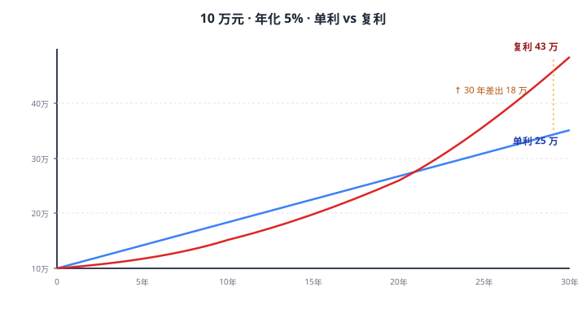
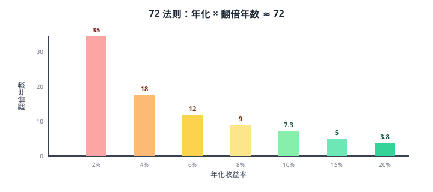
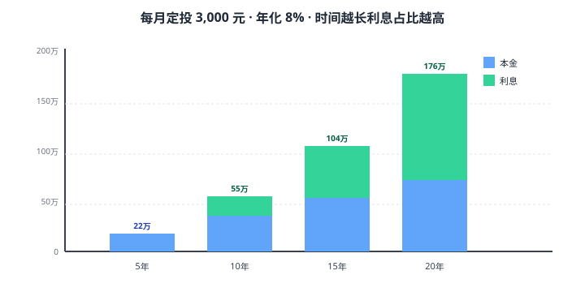

# 02 复利与时间价值

> **这一章要让你搞懂的事**
> 1. 用一句大白话解释"利滚利"为什么这么强
> 2. **72 法则**：心算"年化 X%，几年翻倍"
> 3. **现值/未来值/利率/年数** 四件套，让你能问出任何"钱的时间问题"
> 4. 每月定投 N 元，30 年后是多少钱？会算
> 5. **亲自推导**第 01 章那张"储蓄率 → 工作年数"表
> 6. 识破三个常见的复利骗局
>
> **入门门槛**
> - 第 01 章：储蓄率、净资产
> - 高中数学：指数、对数（会按计算器上的 `ln` `log` `^` 就够了）
> - 能打开 Excel 或随便一个能算 `(1+0.05)^30` 的工具
>
> **声明**：本教程不构成投资建议；所有数字仅作教学示例。

---

## 0. 先讲个故事

国王要赏赐发明象棋的人。发明者说："陛下不必给我金银，只要在第一格棋盘上放 1 粒米，第二格 2 粒，第三格 4 粒，每格翻一倍，把 64 格放满就行。"

国王觉得这要求太"谦虚"了，当场答应。

结果算下来需要 **1845 亿亿粒米**——相当于全世界 2000 年的稻米产量。

> **这个故事就是复利**。
> 每次"翻一倍"听起来不夸张，但翻 64 次后是不可想象的天文数字。
> 你的储蓄账户每年涨 8%，30 年后**翻 10 倍**——同样不可想象，但同样真实。

---

## 1. 单利 vs 复利：一个公式，两种命运

### 1.1 大白话定义

想象你借给朋友 100 元，约定每年给 5 元利息：

- **单利**：每年只给 5 元，第 10 年还本金 100 + 累计利息 50 = 150 元。**利息从不涨**。
- **复利**：第一年给你 5 元，但你不取走，**这 5 元也开始生利息**。第二年生 5.25 元，第三年生 5.51 元…… **利息在加速**。

写成公式（**这是后面 40 章一直在用的公式**，必须看懂）：

$$
\text{单利终值} = P \times (1 + r \times n)
$$

$$
\text{复利终值} = P \times (1 + r)^n
$$

| 符号 | 大白话 |
|---|---|
| $P$ | 本金（你一开始的钱） |
| $r$ | 每年利率（比如 5% 写成 0.05） |
| $n$ | 年数 |

**区别只在那个指数 $n$**——单利是乘 $n$，复利是 $n$ 次方。但这一个小区别，30 年后差出十几万。

### 1.2 一个具体例子：10 万元，年化 5%，存 30 年

| 年 | 单利本息 | 复利本息 | 差额 |
|---:|---:|---:|---:|
| 1 | 105,000 | 105,000 | 0 |
| 5 | 125,000 | 127,628 | 2,628 |
| 10 | 150,000 | 162,889 | 12,889 |
| 20 | 200,000 | 265,330 | 65,330 |
| 30 | 250,000 | **432,194** | **182,194** |

**画成图**：

> 💡 **第一个直觉**：30 年差出的 18 万，**不是利息变多了，是利息也跟着生利息了**。
>
> - 第 1 年差额：0 元
> - 第 10 年差额：1.3 万
> - 第 30 年差额：18.2 万
>
> **差额自己也在指数增长**——这就是复利的本质。

### 1.3 在中国，你真的会遇到单利吗？

会，而且很常见，只是大家没注意：

| 产品 | 计息方式 |
|---|---|
| 储蓄国债（凭证式 / 电子式）| **单利**（这是法规规定的） |
| 银行定期（到期一次还本付息）| **单利**（《储蓄管理条例》） |
| 大额存单（按月付息款）| 本金不变，**等同单利** |
| 货币基金 / 余额宝 / 债基 | **复利**（收益自动再投） |
| 房贷 | 本质是**复利折现**（看 §6） |

> ⚠️ **新手常犯的错**：以为存银行 3 年定期"利滚利"，其实**到期那笔利息没在过程中复利**。如果想真正复利，需要每年到期后**把本息一起再存**——这就是货币基金/债基相比定存的一个隐性优势。

---

## 2. 72 法则：心算多少年翻倍

### 2.1 怎么用

**口诀**：年化利率（百分数）除一下 72，就是翻倍年数。

$$
\text{翻倍年数} \approx \frac{72}{r\%}
$$

| 年化 | 实际翻倍年数 | 72 法则估算 | 误差 |
|---:|---:|---:|---:|
| 2% | 35.0 年 | 36 | +1.0 |
| 4% | 17.7 年 | 18 | +0.3 |
| 6% | 11.9 年 | 12 | +0.1 |
| 8% | 9.0 年 | 9 | 0 |
| 10% | 7.3 年 | 7.2 | -0.1 |
| 15% | 5.0 年 | 4.8 | -0.2 |
| 20% | 3.8 年 | 3.6 | -0.2 |

**6%–10% 这个区间几乎精确**——而这刚好是普通人能拿到的长期回报区间。

### 2.2 为什么是 72，不是 70 也不是 75？

精确解来自复利公式。设 $n$ 年翻倍：

$$
(1 + r)^n = 2 \quad\Longrightarrow\quad n = \frac{\ln 2}{\ln(1 + r)}
$$

用泰勒展开 $\ln(1+r) \approx r - \frac{r^2}{2}$，再代入 $\ln 2 \approx 0.693$：

$$
n \approx \frac{0.693}{r} \times \left(1 + \frac{r}{2}\right)
$$

当 $r = 8\%$ 时，括号项 ≈ 1.04，乘进去 0.693 × 1.04 ≈ 0.72，所以**分子取 72** 比 69.3 更准。

**翻译成人话**：72 是为了让"日常 6%–10% 的回报"算得最准而选的数字。
- 小利率（2%）：用 70 更准
- 大利率（20%+）：用 75 更准

> 📌 **倒过来用更有用**：某产品宣传"6 年翻倍"，那它年化大约 12%——**这在 2026 年的中国不可能是无风险的**。年化 12% 一定伴随波动和亏损可能性。

### 2.3 通胀也能用 72 法则

如果通胀年化 3%，那 $72 / 3 = 24$ 年后，你今天的 100 元只能买 50 元的东西——**购买力腰斩**。

这就是第 03 章"实际收益"为什么重要——**钱的数字在涨，但买东西的能力可能在缩**。

---

## 3. 四件套：现值 / 未来值 / 利率 / 年数

理财里几乎所有"算钱"问题，都可以拆成四个变量：

| 符号 | 大白话 | 术语名 | Excel 函数 |
|---|---|---|---|
| **PV** | 现在这笔钱多少 | 现值 Present Value | `PV()` |
| **FV** | 未来某时点多少 | 未来值 Future Value | `FV()` |
| **r** | 每期利率 | Rate | `RATE()` |
| **n** | 期数 | Number of Periods | `NPER()` |

核心关系只有一个：

$$
\boxed{\text{FV} = \text{PV} \times (1 + r)^n}
$$

**翻译成人话**：未来的钱 = 今天的钱 × 利滚利 n 年。

**最重要的事**：四个量**知道任意三个，就能求第四个**。Excel 里对应四个函数：`FV / PV / RATE / NPER`。

### 3.1 求 FV：未来值

> 现在存 10 万，年化 5%，10 年后有多少？

$$
\text{FV} = 100{,}000 \times (1.05)^{10} = 100{,}000 \times 1.6289 = 162{,}889 \text{ 元}
$$

Excel：`=FV(5%, 10, 0, -100000)` → **162,889**
（Excel 里 `pv` 用负号表示"你付出去的钱"，结果是正的"你收到"的钱。）

### 3.2 求 PV：现值（折现）

> 10 年后想拿到 100 万。如果年化 5%，**现在**要存多少？

$$
\text{PV} = \frac{1{,}000{,}000}{(1.05)^{10}} = 613{,}913 \text{ 元}
$$

这个动作叫**折现（Discounting）**——**大白话：把未来的钱按"反向利息"换算回今天**。$r$ 在这个语境里叫**折现率**。

> 💡 **折现是理财里最重要但最被忽略的思维**：未来的钱不能直接和今天的钱比，必须先折现到今天。
>
> 例子：保险销售跟你说"20 年后给你 30 万返还"。你以为很多。但用 4% 折现：$30 \div 1.04^{20} = 13.7$ 万——**今天 13.7 万的现金价值，能不能让你接受未来 20 年绑死的流动性？** 这才是判断储蓄型保险的正确思路（第 31 章细讲）。

### 3.3 求 r：年化收益率（CAGR）

> 5 万买基金，3 年后变成 7 万。年化复合增长率是多少？

$$
r = \left(\frac{\text{FV}}{\text{PV}}\right)^{1/n} - 1 = (7/5)^{1/3} - 1 \approx 11.87\%
$$

Excel：`=RATE(3, 0, -50000, 70000)` → **11.87%**

**注意**：**不是 $(7-5)/5/3 = 13.3\%$**——那是单利算法，会把收益率算高。

这个 CAGR 还有个常听到的名字叫**年化复合增长率（Compound Annual Growth Rate）**——以后任何基金/股票的"年化业绩"都默认指这个。

### 3.4 求 n：多少年达到目标

> 现有 30 万，年化 7%，多少年变 100 万？

$$
n = \frac{\ln(100/30)}{\ln 1.07} \approx 17.8 \text{ 年}
$$

Excel：`=NPER(7%, 0, -300000, 1000000)` → **17.79**

---

## 4. 年金：定投和月供的数学

上面四件套假设"只放进去一笔钱"。但生活中更常见的是**每月固定投一笔**——基金定投、房贷月供、保险年缴。

这类"周期性等额现金流"叫**年金（Annuity）**——大白话：每隔一段时间放一样多的钱进去。

### 4.1 年金终值：定投 N 年最后有多少

每期期末存入 $C$ 元，每期利率 $r$，存 $n$ 期，终值：

$$
\text{FV}_{\text{年金}} = C \times \frac{(1 + r)^n - 1}{r}
$$

**例子**：每月定投 3,000 元，年化 8%（月利率 8%÷12 ≈ 0.667%），定投 20 年（240 期）：

$$
\text{FV} = 3{,}000 \times \frac{(1.00667)^{240} - 1}{0.00667} \approx 1{,}765{,}000 \text{ 元}
$$

也就是说，**20 年总共投 72 万，最终拿到 176.5 万**——其中本金 72 万，利息 104.5 万。**利息超过了本金**。

Excel：`=FV(8%/12, 240, -3000, 0)` → **1,765,143**

**可视化**：

> 📌 **核心反直觉**：投入翻倍（10 年 → 20 年），**终值变成 3.2 倍**。
> 多出的那 1.2 倍，全是"时间"的复利红利——**你只是没卖、让它继续滚**。

### 4.2 年金现值：房贷月供怎么算

银行借给你 $L$ 元，月利率 $r_m$，分 $n$ 期还，月供 $M$：

$$
M = L \times \frac{r_m \cdot (1 + r_m)^n}{(1 + r_m)^n - 1}
$$

**例子**：贷款 100 万，年化 4.2%（月利率 0.35%），30 年（360 期）等额本息：

$$
M = 1{,}000{,}000 \times \frac{0.0035 \times 1.0035^{360}}{1.0035^{360} - 1} \approx 4{,}890 \text{ 元/月}
$$

Excel：`=PMT(4.2%/12, 360, -1000000)` → **4,890.31**

30 年总共还 4,890 × 360 ≈ 176 万，**利息 76 万**——这就是为什么"提前还款"在房奴里是个永恒话题。

> 🇨🇳 **中国房贷有两种**：
> - **等额本息**：每月还款一样，前期利息多本金少
> - **等额本金**：每月本金一样，利息随本金减少而递减，月供前高后低，**总利息少一些**
>
> 两个都是复利公式的应用，分摊节奏不同。

---

## 5. 兑现第 01 章的"债"：储蓄率 → 工作年数

第 01 章给了一张表（10% 储蓄率 → 51 年；50% → 17 年；80% → 5.5 年）。现在我们用上面的工具推导它。

### 5.1 模型设定（Mr. Money Mustache 的经典假设）

- 年税后收入 = 1（归一化）
- 储蓄率 = $s$，年支出 = $1 - s$
- 退休后年支出**不变**，仍为 $1 - s$
- 投资年化实际回报（扣通胀后）= 5%
- 退休按 4% 法则取出（本金需达到年支出 × 25）

### 5.2 推导

**财务自由所需本金**：

$$
W = (1 - s) \times 25
$$

**每年存 $s$，年化 5%，存 $n$ 年的终值**（年金公式）：

$$
\text{FV}(n) = s \times \frac{1.05^n - 1}{0.05}
$$

**令终值 = 目标本金**，解出 $n$：

$$
n = \frac{\ln\left(1 + \dfrac{25 \times 0.05 \times (1 - s)}{s}\right)}{\ln 1.05}
$$

### 5.3 代入验证

| $s$ | 计算 | $n$ |
|---:|---|---:|
| 10% | $\ln(12.25)/\ln 1.05$ | **51.3** ✓ |
| 30% | $\ln(3.917)/\ln 1.05$ | **28.0** ✓ |
| 50% | $\ln(2.25)/\ln 1.05$ | **16.6** ≈ 17 ✓ |
| 80% | $\ln(1.3125)/\ln 1.05$ | **5.6** ≈ 5.5 ✓ |

第 01 章那张表，**全部由复利公式推出**。

### 5.4 三个反直觉

1. **存款不为零的人，起点不变**。表的横轴是"从 0 开始"——你今天净资产是负的（房贷>资产），起点比 0 还差。
2. **收益率从 5% 变成 7%，对低储蓄率影响更大**。低储蓄率的人需要"更高收益+更长时间"双管齐下，但更高收益意味着更高风险，**普通人承担不起**。
3. **退休后支出降一档，年数大幅缩短**。如果你能接受退休后年支出降到原来的 70%，财务自由数立刻砍到 70%，所有年数缩短。**控制支出比追逐收益率，杠杆更大**。

---

## 6. 复利的三个常见骗局

### 6.1 骗局一：年化"标价"和真实年化不是一回事

**例 1**：理财产品宣传"7 日年化 3.5%"——这是**用最近 7 天的收益率换算成年化**，未来不保证。货币基金 7 日年化每天都在变。

**例 2**：信用卡分期"月费率 0.6%"。听起来年化 0.6% × 12 = 7.2%，但因为你本金每月在还，**真实内含年化（IRR）约 13%**——用第 38 章的 XIRR 算才准。

**例 3**：基金"成立以来收益 200%"。听起来很多，但如果成立了 15 年：

$$
(1 + r)^{15} = 3 \Rightarrow r = 3^{1/15} - 1 \approx 7.6\%
$$

只是个普通水平。**永远把累计收益换成 CAGR 再比较**。

### 6.2 骗局二：复利频率错配

同样标 5%，每年算一次和每天算一次差出来不少：

| 复利频率 | 实际年化（EAR） |
|---|---:|
| 年复利 | 5.000% |
| 月复利 | 5.116% |
| 日复利 | 5.127% |
| 连续复利 | 5.127% |

公式：$\text{EAR} = (1 + r/m)^m - 1$，$m$ 是每年复利次数。

差距虽然小，**但贷款合同里你算的应该是 EAR，不是名义利率**。

### 6.3 骗局三：复利曲线 ≠ 真实账户曲线

PPT 上的复利曲线是平滑向上的，但**真实投资曲线是带波动的，波动会吃掉复利**。

**举一个反例**：第 1 年涨 50%，第 2 年跌 50%。

- **算术平均**：(+50 − 50)/2 = **0%**
- **真实终值**：1 × 1.5 × 0.5 = **0.75**（亏 25%）
- **几何平均（CAGR）**：$0.75^{0.5} - 1 = -13.4\%$

**几何平均永远 ≤ 算术平均，波动越大，差距越大**。所以"年均回报 15%"不等于你的本金每年都涨 15%——这是第 04 章"风险与回报"的核心。

> 📌 **三句话总结**：
> 1. 看到"年化"先问：**累计还是 CAGR？什么复利期？**
> 2. 看到"贷款月费率"先乘 12 再 ×2，**心里预估真实利率**。
> 3. 看到"过去十年年均 X%"先问：**波动多大？最大回撤多少？**

---

## 7. 进阶：连续复利和指数函数的关系

**入门读者可以跳过本节**，等学完第 04 章再回来。

如果你每年复利无穷多次（连续复利），公式变成：

$$
\text{FV} = P \times e^{r \times n}
$$

其中 $e \approx 2.71828$，叫**自然常数**。

**为什么金融里这么爱用 $e$？** 因为：
- 连续复利的极限就是 $e^{rn}$
- 期权定价（Black-Scholes 公式）、利率衍生品建模都用连续复利
- 对数收益率 $\ln(P_t / P_{t-1})$ 可加，方便做时间序列分析

普通理财用不到连续复利，但**你看到金融论文里满纸 $e^x$，就知道是这个意思**——他们只是图数学好看。

---

## 8. 小结

1. **复利 = $P \times (1 + r)^n$**。一个公式，理财后续 40 章一直在用。
2. **72 法则**：$72 / r\%$ 年翻倍。来源是 $\ln 2 \approx 0.693$ 加 $1+r/2$ 修正，所以在 6%–10% 最准。
3. **PV / FV / r / n 四件套**：知三求一。Excel 函数 `FV / PV / RATE / NPER` 一一对应。
4. **年金公式**：定投和房贷都是它的两个方向应用。年化 8% 下，定投 20 年终值 ≈ 投入的 2.5 倍。
5. **储蓄率 → 工作年数表已被你亲手推导**。**控制支出比追求高收益杠杆更大**。
6. **三个骗局**：累计 ≠ 年化；月费率 ≠ 年化 × 12；算术平均 ≠ 几何平均。

> 🔗 **承上启下**：本章假设的"年化 5%""年化 8%"全是**名义收益**——还没扣通胀。
> 下一章引入通胀，把它换成**实际收益**，并解释"为什么银行 3 年定期 2.5% 实际上可能让你越存越穷"。

---

## 自测题

> 答案在文末折叠区。先自己算，再对照。

1. 现在存 5 万，年化 6%，**10 年后**有多少？
2. 某基金宣传"成立 5 年累计收益 80%"，它的 CAGR 是多少？算高还是低？
3. 用 72 法则估算：年化 4%，本金翻倍要几年？精确答案是多少？
4. 每月定投 2,000 元，年化 7%，15 年后终值大约多少？
5. 贷款 80 万，年化 4.5%，等额本息 30 年，月供多少？总利息多少？
6. **进阶题**：朋友说"我五年存了 100 万，年化平均 20%！"追问下去发现他第 1 年投入 80 万，第 5 年末账户里 100 万，中间没再投入。问：(a)"年化 20%"对吗？(b) 真实 CAGR 多少？
7. **作业题**：你今天 30 岁，希望 55 岁退休，每月可存 5,000 元，年化实际收益 5%。25 年后积累多少？按 4% 法则换算的"可持续年支出"是多少？够你过日子吗？

📖 参考答案（点击展开）

1. $50{,}000 \times 1.06^{10} = \mathbf{89{,}542}$ 元。
2. $(1+r)^5 = 1.8 \Rightarrow r = 1.8^{0.2} - 1 \approx \mathbf{12.5\%}$。在中国市场过去十年算**中等偏上**，但 5 年样本太短，不能假设未来仍能维持。
3. 72 法则：18 年；精确：$\ln 2 / \ln 1.04 = \mathbf{17.67}$ 年。误差 0.3 年。
4. `=FV(7%/12, 180, -2000, 0)` → **634,118 元**。本金 36 万，利息 27.4 万。
5. `=PMT(4.5%/12, 360, -800000)` → **4,053 元/月**。总还款 145.9 万，总利息 **65.9 万**。
6. (a) "年化 20%"是把总收益 25% 简单除以 5，**错**。(b) 真实 CAGR：$(100/80)^{1/5} - 1 \approx \mathbf{4.56\%}$——实际跑得比定存还慢，只是听起来唬人。
7. `=FV(5%/12, 300, -5000, 0)` ≈ **297.8 万**。年支出 = 297.8 × 4% = **11.9 万/年 ≈ 月 9,900**。够不够取决于：(i) 55 岁时所在城市生活成本；(ii) 通胀（假设是实际收益，则等同今天月 9,900）；(iii) 是否有社保、房产现金流补充。**一线城市可能不够，二三线可能够**——第 37 章细化。

---

## 延伸阅读

- 《漫步华尔街》—— Burton Malkiel：第 1-2 章对复利和长期收益的处理是入门必读
- 《股市真规则》—— Pat Dorsey：附录 A 系统讲了 DCF（贴现现金流），本质就是 PV 概念在估值里的应用
- **Mr. Money Mustache**：[The Shockingly Simple Math Behind Early Retirement](https://www.mrmoneymustache.com/2012/01/13/the-shockingly-simple-math-behind-early-retirement/)
- **Investopedia**：搜 *Time Value of Money*、*Compound Interest*、*Annuity Formula*，每个词条都附带 Excel 案例
- **Excel/WPS 自带函数手册**：`FV` `PV` `RATE` `NPER` `PMT` `XIRR`——至少把这 6 个函数的帮助文档读一遍

---

## 下一章预告

**03 通货膨胀与实际收益** —— 会回答：
- 银行 3 年定期 2.5%，跑赢通胀了吗？怎么判断？
- **CPI** 是怎么算出来的？为什么很多人感觉"统计局 CPI 和我体感不符"？
- **费雪方程**：把名义收益换成实际收益的唯一公式
- 不同通胀环境下，**现金/债券/股票/黄金**的实际表现差异
- 中国过去 20 年通胀数字，你的工资跑赢了吗？
