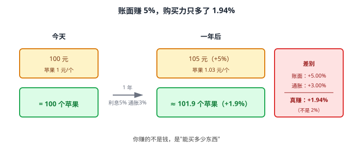
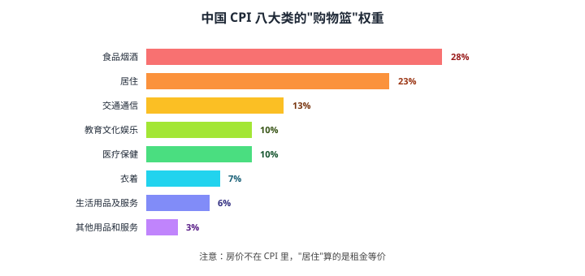
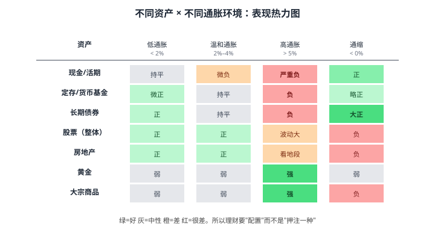

# 03 通货膨胀与实际收益

> **这一章要让你搞懂的事**
> 1. 用"购买力"重新理解：账面赚了不等于真的赚了
> 2. 知道 **CPI**（物价指数）怎么算、为什么和你的体感经常不符
> 3. 会用**费雪方程**把"账面利率"换成"真实利率"
> 4. 判断"银行 3 年定期 2.5%"在不同通胀下是赚是亏
> 5. 直观了解**现金/债券/股票/房产/黄金**在高/低通胀下的差异
> 6. 看懂中国过去 20 年 CPI、M2、工资三条线的关系
>
> **入门门槛**
> - 第 01 章：储蓄率、净资产
> - 第 02 章：复利、CAGR、PV/FV
>
> **声明**：本教程不构成投资建议；所有数字仅作教学示例。

---

## 📖 本章英文缩写速查

> 看到不认识的英文缩写，先回这张表查；完整术语见 [GLOSSARY.md](../GLOSSARY.md)。

| 缩写 | 英文全称 | 中文含义 |
|---|---|---|
| **CPI** | Consumer Price Index | 居民消费价格指数，衡量通胀 |
| **M2** | Money Supply M2 | 广义货币（M1+定期及储蓄存款），衡量市场钱量 |
| **GDP** | Gross Domestic Product | 国内生产总值 |
| **FV** | Future Value | 终值（未来值） |
| **CAGR** | Compound Annual Growth Rate | 复合年均增长率 |
| **PV** | Present Value | 现值 |
| **PPI** | Producer Price Index | 工业生产者出厂价格指数 |
| **M0** | Money Supply M0 | 流通中现金 |
| **M1** | Money Supply M1 | 狭义货币（M0+企业活期存款） |

---

## 0. 先讲个故事

你妈妈 1995 年把 1 万元存进银行 5 年期定期，利率 13.86%（**真实历史数据**，按当时规定单利计息：13.86% × 5 ≈ 69%）。
2000 年到期本息约 1.69 万——账面**赚了 69%**。

听起来很好。但存进去那年（1995 年）物价涨了约 **17%**：猪肉从约 6 元/斤涨到约 10 元/斤，方便面从 5 毛涨到 1 块，理发从 5 块涨到 10 块……**所有东西都在飞涨**。

把利息拿去对一下物价：13.86% 的利息追不上 17% 的物价——**存入当年，她的购买力实际缩水了约 2.7%**。利率看着是两位数，钱却在变薄。

> 这就是这一章要讲的事：**通胀（物价上涨）就像账面收益的"隐形税"**——账面是正的，购买力可能是负的。
>
> 而且这件事**今天仍在发生**——只是利率从 13.86% 变成了 2.5%，通胀从 17% 变成了 2%。规律没变。

---

## 1. 名义 vs 实际：先用购买力定义

### 1.1 一个最朴素的例子

想象苹果是世界上唯一的商品。今天 1 元一个，你有 100 元，能买 **100 个苹果**。

把 100 元存银行 1 年，利息 5%，一年后拿到 105 元。但同一年苹果涨到 1.03 元（通胀 3%），你能买：

$$
\frac{105}{1.03} \approx 101.94 \text{ 个苹果}
$$

**你的购买力只增加了 1.94%**——这才是你真正赚的。

### 1.2 三个核心词

| 词 | 大白话 |
|---|---|
| 名义收益率（Nominal Return） | 账面数字增长了多少 |
| 通胀率（Inflation Rate） | 同一时段物价涨了多少 |
| 实际收益率（Real Return） | 购买力真实增长了多少 |

### 1.3 三种命运

| 名义利率 | 通胀率 | 实际利率 | 你的购买力 |
|---:|---:|---:|---|
| 5% | 3% | ≈ 2% | 略增 |
| 3% | 3% | ≈ 0% | 不变 |
| 2% | 3% | ≈ -1% | **缩水**（账面正，购买力负） |
| 0%（钱放家里） | 3% | ≈ -3% | **每年缩水 3%** |

**最重要的认知**：账面利率为正，购买力可能为负。"我不投资，把钱放着"**不是零风险，是确定性亏损**。

---

## 2. CPI：通胀是怎么测出来的

### 2.1 一篮子商品

**CPI（消费者价格指数 Consumer Price Index）**的本质是一个**虚拟购物篮**：

1. 统计局调查"普通家庭"每月买什么，按支出占比定权重——形成一个"标准购物篮"
2. 每月去全国 50 万个采价点采价
3. 算出"今年这一篮子东西"比"基期同一篮子"贵了多少
4. 公布为 CPI 同比/环比

中国 CPI 八大类的**大致权重**（2021 年调整后）：

### 2.2 为什么"统计局 CPI 和我体感不符"

这是过去十年互联网上吵得最多的财经话题之一。**两边都有道理**，原因有四个：

**1）你的购物篮 ≠ 标准购物篮**

一线城市年轻白领的真实开销可能是"房租 40% + 外卖 20% + 房贷/教育/娱乐 ..."；统计局的篮子按全国平均做，**食品权重高、自有住房估算价格低**——所以一线城市年轻人体感的"生活成本上涨"会比 CPI 高。

**2）住房只算"租金"，不算"房价"**

中国 CPI 里"居住"是按**租金等价（rental equivalence）**估的——大白话："假设自有住房如果出租能收多少钱"。**房价本身不进 CPI**。这是国际通行做法（美国 CPI 也是这样），但意味着 **CPI 不反映资产价格泡沫**。过去十几年很多人感觉"通胀很厉害"——其实是**房价涨了**，不是 CPI 高。

**3）替代效应**

当猪肉涨价，大家会少买猪肉多买鸡肉——你的实际支出可能没变。CPI 会一定程度反映这种替代，但**"被迫降级消费"也是隐性通胀**。

**4）质量调整**

5 年前 4,000 元买一部手机，今天 4,000 元买的手机性能强 10 倍。CPI 会把这部分"质量提升"算成"降价"。逻辑正确，但你的**银行存款数字不会自动跟上手机性能**。

### 2.3 比 CPI 更适合你的"个人通胀"

| 指标 | 衡量的是 | 你应该关注它当 |
|---|---|---|
| CPI | 全国普通家庭物价 | 看政策、宏观 |
| 核心 CPI | 剔除食品/能源 | 看趋势性通胀 |
| PPI（工业品出厂价）| 工厂卖出价 | 预测未来 CPI |
| GDP 平减指数 | 整个经济体的价格 | 做长期资产对比 |
| M2 增速 vs GDP 增速 | "广义货币"超发程度 | 估算"被稀释速度" |
| **你自己的购物篮** | 你的真实生活 | **个人理财决策** |

> 💡 **建议**：每月固定记一笔"必要支出"（房租/房贷 + 水电 + 通勤 + 餐饮），跟 12 个月前比，**这个增长率才是你的"个人 CPI"**。一线城市过去 5 年这个数字往往在 3%–6%——比官方 CPI 高。

---

## 3. 费雪方程：名义 ⇄ 实际的唯一公式

### 3.1 精确版

20 世纪初经济学家 Irving Fisher 给出的公式：

$$
\boxed{(1 + r_{\text{名义}}) = (1 + r_{\text{实际}}) \times (1 + \pi)}
$$

其中 $\pi$ 是通胀率（pi 在经济学里常代表 inflation）。

变形求实际利率：

$$
r_{\text{实际}} = \frac{1 + r_{\text{名义}}}{1 + \pi} - 1
$$

**翻译成人话**：实际利率 = (1 + 账面利率) ÷ (1 + 通胀率) − 1。

### 3.2 近似版（小数情况下用）

当 $r$ 和 $\pi$ 都很小时，直接减就行：

$$
r_{\text{实际}} \approx r_{\text{名义}} - \pi
$$

**例子**：名义 5%、通胀 3%。
- 精确版：1.05 ÷ 1.03 − 1 = 1.942%
- 近似版：5% − 3% = 2%
- 误差：0.058 个百分点（可以忽略）

### 3.3 什么时候不能用近似版

当通胀**两位数**时，乘积项不能忽略。例子：名义 25%、通胀 20%。

- 精确版：1.25 ÷ 1.20 − 1 = 4.17%
- 近似版：25% − 20% = 5%
- 误差：0.83 个百分点

在土耳其、阿根廷这类高通胀国家，用近似版会**系统性高估实际回报**。中国大部分时间通胀 5% 以内，**近似版够用**。

### 3.4 把第 02 章的所有例子"打折"一遍

第 02 章我们算过：每月定投 3,000 元、年化 8%、20 年后约 **176.5 万**。

但如果同期通胀 3%：
- 实际年化：$1.08 / 1.03 - 1 \approx 4.85\%$
- 实际终值（折算成"今天的购买力"）：`=FV(4.85%/12, 240, -3000, 0)` ≈ **117.5 万**

**176.5 万的账面，只相当于今天的 117.5 万**——少了将近 60 万。

> 📌 **结论**：做长期规划时，**默认按实际收益率算**，否则会高估自己的财富。
> 简单做法：**所有名义收益率减 3%，当作实际收益率用**。

---

## 4. 银行 3 年定期 2.5% 划算吗？

### 4.1 看历史

中国 2015–2025 年 CPI 同比大致在 0.5%–3% 之间波动，平均约 **2%**。

| 假设通胀 | 实际利率 | 含义 |
|---:|---:|---|
| 1% | $1.025 / 1.01 - 1 = 1.49\%$ | 跑赢，但只赚一点 |
| 2% | $1.025 / 1.02 - 1 = 0.49\%$ | 几乎打平 |
| 3% | $1.025 / 1.03 - 1 = -0.49\%$ | 跑输 |
| 5% | $1.025 / 1.05 - 1 = -2.38\%$ | 严重跑输 |

**结论**：3 年定期 2.5% 在低通胀下能保本，在中高通胀下**确定亏购买力**。但它的优势是**几乎零波动 + 受存款保险条例保障（50 万以内）**——所以它在你的组合里仍有位置（详见第 07、08 章）。

### 4.2 一个被忽略的角度：税

中国**个人存款利息免征个税**（《个人所得税法》规定），所以 2.5% 就是 2.5%。但**银行理财、债基的收益要扣税**——名义利率要再打折一道。这点会在第 36 章（税务）展开。

### 4.3 "存款利率长期下行"是趋势

中国 5 年期定存利率在过去 30 年的轨迹：

| 年份 | 5 年期定存利率（近似） |
|---:|---:|
| 1995 | 13.86% |
| 2000 | 2.88% |
| 2007 | 5.85% |
| 2015 | 4.75% |
| 2020 | 2.75% |
| 2025 | ≤ 2.0% |

**长期方向是向下的**，伴随经济增长放缓和人口结构变化（详见第 11 章）。所以"我父母靠存款养老"这条路对你这一代**不再成立**——**你必须学会用风险资产对冲通胀**，这是本教程后续 30 多章存在的根本理由。

---

## 5. 不同资产在不同通胀下的表现

这是一张**直觉表**，不是预测：

### 5.1 为什么股票"长期能抗通胀"

公司收入和成本通常会**同步随通胀上调**，所以股票（一篮子公司）的盈利在长期是**实际值**——通胀越高，名义盈利和名义股价也跟着涨。但这只是**长期**的结论；**短期**高通胀往往伴随央行加息，股票会先跌。

### 5.2 为什么长债在高通胀下"挨揍"

债券到期还本付息是固定的（名义值），通胀越高，这笔固定钱的**购买力越低**。同时市场利率上升，**已发行的低息债券价格下跌**（详见第 11 章久期）。所以高通胀对长债是双重打击。

### 5.3 黄金的角色

黄金本身**不产生现金流**（不像股票分红、债券付息），它只是"全世界都认的稀缺金属"。在高通胀 + 货币贬值 + 地缘动荡时，黄金作为"无国籍硬资产"会被买入。详见第 28 章。

---

## 6. 中国过去 20 年的三条线

如果只能记一组数字，记这三条线的**大致量级**（精确数字以国家统计局/央行最新口径为准）：

| 指标 | 2005–2024 大致区间 | 20 年累计倍数 |
|---|---|---:|
| **CPI 年均** | 约 2.5% | × 1.6 |
| **城镇居民可支配收入年均增速** | 约 8% | × 4.6 |
| **M2 年均增速** | 约 11% | × 8.0 |

### 6.1 三个朴素观察

1. **工资跑赢了 CPI**：20 年 4.6 倍 vs 1.6 倍。这是为什么大家"感觉生活水平在上升"。
2. **M2 跑赢了工资**：8 倍 vs 4.6 倍。多印的钱**没全部进 CPI**——进了房产、股票、土地。所以"会算账的人感觉手里钱变薄了"和"统计局说 CPI 不高"可以**同时成立**。
3. **CPI 跑输 M2 ≠ 政府在骗人**。CPI 衡量"消费品价格"，M2 是"广义货币供应量"。多印的钱可以堆在资产里不进入流通消费——只要你不卖房卖股票，它就不会变成 CPI。

### 6.2 对你的两个推论

- **理财的本质是分一杯"M2 增速"的羹**。如果你的全部资产年化跑不赢 M2，你的**财富份额**在变小——哪怕账面在涨。
- **但你不需要追到 11%**。一来你不会一直处在高 M2 时代（中国 M2 增速已显著下降），二来追求高收益必然承担高波动，**目标应该是"实际收益 4%–6%"长期可持续，而不是名义收益 10%+ 不可持续**。

---

## 7. 进阶：通胀的两种成因

**入门读者可以跳过本节**，等学完前 5 章再回来读。

经济学把通胀大致分两类：

| 类型 | 怎么发生 | 例子 |
|---|---|---|
| **需求拉动型** | 大家都想买，供给跟不上，价格上涨 | 房地产黄金时期、消费升级期 |
| **成本推动型** | 原材料/工资/汇率成本上升，企业把成本转嫁给消费者 | 2022 年俄乌冲突推高原油 → 全球能源涨价 |

这两种通胀对资产的影响不同：
- **需求拉动通胀**通常伴随经济繁荣，股票表现较好
- **成本推动通胀**通常伴随经济停滞，**容易出现"滞胀"**（经济不增长 + 物价大涨），这是对资产配置最差的环境，几乎所有资产同时跌——1970 年代的美国就是

知道这个区别，你以后看新闻里"通胀 X%"时，会先问"是哪种？"——因为同样的数字，对你账户的含义完全不同。

---

## 8. 小结

1. **名义收益是账面，实际收益是购买力**。永远区分两者。
2. **CPI 是一个加权"购物篮"的价格指数**——结构性问题导致它和个人体感经常不符，但它仍是最广泛使用的通胀指标。
3. **费雪方程**：精确版 $(1+r_n) = (1+r_r)(1+\pi)$，近似版 $r_r \approx r_n - \pi$。通胀 < 5% 时近似版够用。
4. **银行 3 年定期 2.5%** 在 2% 通胀下几乎打平，在 3%+ 通胀下亏购买力。它是"流动性 + 保本"的工具，不是"理财"的目的地。
5. **不同资产在不同通胀环境下表现不同**——这就是为什么需要**资产配置**（第 06 章），而不是把所有钱押在一种资产上。
6. **中国的 CPI、工资、M2 三条线**告诉你：理财是为了"不掉队"，目标是跑赢通胀和不掉出货币扩张的份额，而不是"暴富"。

> 🔗 **承上启下**：本章我们讲了"通胀会侵蚀收益"，但还没回答"承担多少波动才能换来多少回报"。
> 下一章 **04 风险与回报** 会引入**波动率、最大回撤、夏普比率**——这是理解"承担风险 ≠ 一定多赚"的前提。

---

## 自测题

> 答案在文末折叠区。先自己算，再对照。

1. 某基金过去 5 年年化名义收益 10%，同期年均通胀 3%。它的**实际年化**精确值是多少？用近似版误差多少？
2. 你妈妈说她 1995 年存银行 5 年定期 13.86%，"利率多高啊"。怎么用本章工具解释"那时候的高利率其实没你想的那么爽"？给定性 + 定量回答。
3. 同事说"我把钱放余额宝，7 日年化 1.8%，肯定不亏"。指出他这句话错在哪，并算出在 2.5% 通胀下他的**实际收益**。
4. 把第 02 章作业 7 的答案（55 岁退休时积累 297.8 万、月可支配 9,900）按"实际收益 5%"重新解读：这笔钱**还能不能用今天的物价水平来想象生活**？为什么？
5. 看下面三种资产 10 年后的名义收益，按**实际收益**排序（假设期间年均通胀 3%）：
   - A：余额宝累计 18%
   - B：沪深 300 指数累计 60%
   - C：黄金累计 80%
6. **进阶题**：M2 增速 8%，名义 GDP 增速 5%，CPI 2%。这种状态下，资产价格（股票、房产）大概率怎么演变？说出你的直觉理由。
7. **作业题**：连续 3 个月记账，算出你自己的"个人 CPI"——把第 3 个月的必要支出和 12 个月前同月相比。这个数字和官方 CPI 差多少？

📖 参考答案（点击展开）

1. 精确：$1.10 / 1.03 - 1 = 6.80\%$；近似：$10\% - 3\% = 7\%$。误差 0.20 个百分点。
2. 1995 年中国 CPI 同比约 **17%**（高通胀期）。按费雪方程：$1.1386 / 1.17 - 1 \approx \mathbf{-2.7\%}$——存入当年她的购买力实际在缩水。**"高利率"通常伴随"高通胀"**，理财要看实际利率而非名义利率。（补充：1996 年后通胀快速回落到个位数，这笔定期后几年的实际利率转正——但这恰好再次说明：**判断划不划算，每年都要拿名义利率减当年通胀**。）
3. 错在没扣通胀。实际利率：$1.018 / 1.025 - 1 \approx \mathbf{-0.68\%}$。账面正、实际负。**他的购买力每年缩水约 0.68%**。
4. **可以**——因为题目假设的是**实际收益 5%**。"实际收益"已经扣除了通胀，所以终值的购买力等价于"今天的 297.8 万"。月 9,900 是"今天物价水平下的月 9,900"，可以直接用今天的物价感受生活水平。这就是为什么做退休规划**强烈推荐用实际收益率**。
5. 实际累计收益：
   - A：$1.18 / 1.344 - 1 \approx \mathbf{-12.2\%}$
   - B：$1.60 / 1.344 - 1 \approx \mathbf{+19.0\%}$
   - C：$1.80 / 1.344 - 1 \approx \mathbf{+33.9\%}$
   
   排序：**C > B > A**。A 是**负**的——余额宝跑不赢长期通胀。
6. 货币增速远超经济增长 + CPI，多余流动性会**外溢到资产端**，推高股票、房产等资产价格。这就是中国 2008–2018 年的故事——M2 高速增长 → 房价大涨 → CPI 看起来不高。**反过来**：当 M2 增速降到接近 GDP + CPI 之和（如近年），资产价格**单边大涨的环境就消失**了。
7. 没有标准答案。多数人会发现自己的"个人 CPI"在 **3%–6%**，明显高于官方 CPI（近年常 1%–2%）。差距主要来自：(i) 房租/房贷在你的篮子里权重更高；(ii) 你身在一线城市；(iii) 你消费的服务（餐饮、教育、医疗）涨得比商品快。

---

## 延伸阅读

- 《通胀真相》(*The Inflation Myth and the Wonderful World of Deflation*) —— Lars Tvede：对 CPI 测量的方法论批评，反主流但有意思
- 《伟大的博弈》—— John Steele Gordon：美国 200 年金融史，能看到通胀和资产价格的长周期关系
- **国家统计局**官网：[CPI 月度数据](http://www.stats.gov.cn/)，每月 9 日左右公布上月数据
- **中国人民银行**：[金融统计数据报告](http://www.pbc.gov.cn/)，M0/M1/M2 数据每月公布
- **Robert Shiller** 在线数据集：[Online Data](http://www.econ.yale.edu/~shiller/data.htm) ——美股 150 年通胀调整后收益数据，第 18、33 章会用
- 阅读建议：每月浏览一次国家统计局 CPI 数据公告，养成"看到名义利率就先减 CPI"的肌肉记忆

---

## 下一章预告

**04 风险与回报** —— 会回答：
- 同样年化 8%，A 基金年年涨 8%、B 基金有时 -30% 有时 +50%——为什么 B 实际收益反而更低？
- **标准差（波动率）**：用一个数字描述"颠簸程度"
- **最大回撤**：你愿意忍受账户腰斩吗？
- **夏普比率**：每单位风险换来多少超额回报
- 为什么"高风险 = 高回报"是营销话术，正确版本是"高风险 = 高**潜在**回报，伴随高潜在亏损"
