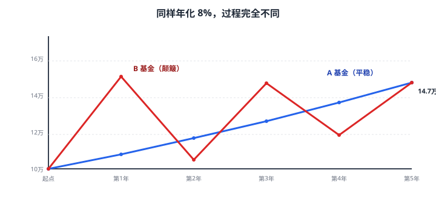
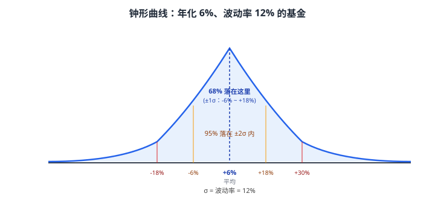
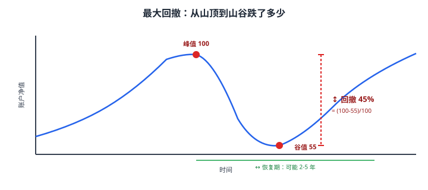
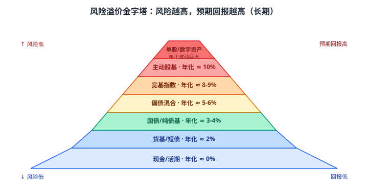

# 04 风险与回报

> **这一章要让你搞懂的事**
> 1. **"风险"在金融里到底是什么意思**——不是"会亏多少"，是"会颠多狠"
> 2. **波动率/标准差**：用一个数字描述账户每年颠多少
> 3. **最大回撤**：你这辈子能忍受账户腰斩吗？这个数字告诉你
> 4. **夏普比率**：每承担一份颠簸，换来多少额外回报
> 5. **风险溢价**：为什么有人愿意忍受股票的颠簸
> 6. 识破"高风险=高回报"这句话错在哪
>
> **入门门槛**
> - 第 02 章：CAGR、几何平均
> - 第 03 章：名义收益 vs 实际收益
> - 高中数学：平均数、方差（不会也没关系，§2 会重新讲一遍）
>
> **声明**：本教程不构成投资建议；所有数字仅作教学示例。

---

## 📖 本章英文缩写速查

> 看到不认识的英文缩写，先回这张表查；完整术语见 [GLOSSARY.md](../GLOSSARY.md)。

| 缩写 | 英文全称 | 中文含义 |
|---|---|---|
| **MDD** | Maximum Drawdown | 最大回撤：从最高点到最低点的最大跌幅 |
| **CAGR** | Compound Annual Growth Rate | 复合年均增长率 |
| **QDII** | Qualified Domestic Institutional Investor | 合格境内机构投资者，借道投资海外的渠道 |

---

## 0. 先讲个故事

两个基金，过去 5 年都赚了 47%（年化复合 8%）。

- **A 基金**：每年涨 8%，5 年都一样。
- **B 基金**：第 1 年 +50%，第 2 年 -30%，第 3 年 +40%，第 4 年 -20%，第 5 年 +25%。

如果你 5 年前各投 10 万，今天账户都是 14.7 万。

**问题**：你愿意持有 A 还是 B？

99% 的人会回答 A。**但同样的回报，绝大多数投资人会在 B 上亏钱**——因为他们撑不到第 5 年。第 2 年账户从 15 万跌到 10.5 万时，他们已经割肉了。

> 这就是这一章要讲的事：**回报只看终点，风险只看过程**。
> 终点同样是 14.7 万，但过程中颠多狠决定了你能不能拿到这个 14.7 万。

---

## 1. "风险"到底是什么

### 1.1 大白话和金融的区别

**大白话里的"风险"**：可能亏钱的概率，比如"这事风险高"通常指"容易出事"。

**金融里的"风险"**：**结果的不确定性**——账户接下来 1 年可能涨 30%，也可能跌 20%，**这个"范围"就是风险**。

| 资产 | 一年可能的回报范围 | 大白话 |
|---|---|---|
| 余额宝 | -0.5% 到 +3% | 范围窄 → 风险低 |
| 国债 | -3% 到 +5% | 范围中 → 风险中 |
| 沪深 300 | -40% 到 +80% | 范围宽 → 风险高 |
| 单只小盘股 | -80% 到 +200% | 范围超宽 → 风险极高 |

**反直觉点**：**赚得超出预期，也算"风险"**。
为什么？因为如果你能稳定预测"明年涨 50%"——那它就不是风险，是确定性收益。**任何超出预期的偏离都是风险**，包括往上偏。

> 💡 **这个定义在实务中常被批评**——"涨 50% 怎么也算风险？"
> 答案是：金融里用一个数字（标准差）描述风险，这个数字**不区分上下**。后面的"索提诺比率"会修正这点，只看下行风险（§7.2）。

### 1.2 风险的种类

| 风险类型 | 大白话 | 例子 |
|---|---|---|
| 市场风险 | 整个市场都跌，你买啥都亏 | 2008 年金融危机 |
| 信用风险 | 借钱给别人，他还不上 | 违约债券 |
| 流动性风险 | 想卖卖不掉 | 房子、私募基金 |
| 通胀风险 | 钱不变，物价涨 | 第 03 章 |
| 汇率风险 | 持有外币资产，汇率变了 | QDII 基金 |
| 政策风险 | 一纸文件让你的投资归零 | 教培行业 2021 |

本章只讲**市场风险**（最常见、最量化）。其他风险后续章节会专门讲。

---

## 2. 波动率（标准差）：用一个数字描述颠多少

### 2.1 一步一步算

假设某基金过去 5 年回报：+20%、-10%、+15%、-5%、+10%。

**第 1 步：算平均回报（算术平均）**

$$
\bar{r} = \frac{20 - 10 + 15 - 5 + 10}{5} = 6\%
$$

**第 2 步：算每年回报偏离平均多远**

| 年 | 回报 | 偏离（回报 − 平均） | 偏离平方 |
|---:|---:|---:|---:|
| 1 | +20% | +14% | 196 |
| 2 | -10% | -16% | 256 |
| 3 | +15% | +9% | 81 |
| 4 | -5% | -11% | 121 |
| 5 | +10% | +4% | 16 |
| | | | **合计 670** |

**第 3 步：算方差（偏离平方的平均）**

$$
\text{方差} = \frac{670}{5} = 134
$$

**第 4 步：开根号，得标准差**

$$
\text{标准差} = \sqrt{134} \approx 11.6\%
$$

**翻译成人话**：这只基金每年回报，**大概率在"平均 ± 11.6%"之间波动**——也就是 6% ± 11.6%，即 -5.6% 到 +17.6% 之间。

### 2.2 为什么要"平方再开根号"？

直接算"偏离平均的平均"是不行的——正偏和负偏会互相抵消，结果永远是 0。

**例**：偏离 +14、-16、+9、-11、+4 直接加 = 0。

平方后都变正数，再平均，再开根号——这一通操作叫**标准差**。它的本质是"**离平均的平均距离**"，只是数学上用了平方根的方式定义。

### 2.3 标准差 ≈ 波动率

在金融里，**标准差**和**波动率（Volatility）**几乎是同一个词。
- 标准差：统计学术语，描述"数据分散程度"
- 波动率：金融术语，描述"价格颠簸程度"

它们计算方法一样，**都用希腊字母 σ（sigma）表示**。

### 2.4 一个直观感受

正态分布（俗称"钟形曲线"）下，回报落在不同范围的概率：

| 范围 | 概率 |
|---|---:|
| 平均 ± 1σ（1 个标准差以内） | 约 **68%** |
| 平均 ± 2σ | 约 **95%** |
| 平均 ± 3σ | 约 **99.7%** |

**翻译成人话**：上图这只年化 6%、波动率 12% 的基金，**大约 68% 的年份里**，年回报会落在 -6% 到 +18% 之间。剩下 32% 的年份里，要么更好，要么更糟。

### 2.5 中国常见资产的年化波动率（量级感）

| 资产 | 年化波动率 |
|---|---:|
| 货币基金 | < 1% |
| 短期债基 | 1% – 3% |
| 中长期纯债基 | 3% – 6% |
| 二级债基（含少量股票）| 5% – 10% |
| 偏债混合 | 6% – 12% |
| 沪深 300 | 20% – 25% |
| 中证 500 / 1000 | 25% – 30% |
| 单只小盘股 | 40%+ |

**记忆口诀**：风险资产的年化波动率大致是它"长期年化收益的 2–3 倍"。也就是说，预期 10% 年化的资产，**单年亏 10%–20% 是家常便饭**。

---

## 3. 最大回撤：账户最糟时少了多少

### 3.1 什么是最大回撤

**大白话定义**：从你账户曾经的最高点，跌到后续最低点，跌了多少。

**术语名**：最大回撤（Maximum Drawdown, MDD）。

**为什么这个比波动率更"贴心"**：
- 波动率是平均"上下颠多少"——是一个抽象数字
- 最大回撤是"**最糟时少了多少**"——这是你**真实会经历的痛苦**

### 3.2 一些历史回撤参考

| 资产 / 时段 | 最大回撤 |
|---|---:|
| 标普 500 · 2007–2009（金融危机）| -55% |
| 上证综指 · 2007 高点到 2008 低点 | -72% |
| 沪深 300 · 2015 高点到 2016 低点 | -49% |
| 比特币 · 2017 高点到 2018 低点 | -84% |
| 比特币 · 2021 高点到 2022 低点 | -77% |

**这些都是真实历史**——任何告诉你"长期持有就一定赚"的人，**没有告诉你中间会经历什么**。

### 3.3 心理学事实：跌 50% 需要涨 100% 才回来

| 跌幅 | 需要后续涨多少才能回本 |
|---:|---:|
| -10% | +11% |
| -20% | +25% |
| -30% | +43% |
| -50% | **+100%** |
| -70% | **+233%** |

**翻译成人话**：跌 50% 后，市场要涨一倍才能让你回本——这可能需要 5–10 年。**这就是为什么"控制回撤"和"控制波动"是两个不同维度的事**——回撤是非对称的，跌得越深，回本越难。

---

## 4. 夏普比率：每承担一份风险换来多少

### 4.1 大白话

如果你有两个基金：
- **A**：年化 10%，波动率 5%
- **B**：年化 15%，波动率 25%

哪个更值得买？看起来 B 收益高，**但 B 的波动是 A 的 5 倍**——你承担的颠簸大太多了。

需要一个比例，**衡量"每承担一份波动，换来多少额外回报"**——这就是**夏普比率（Sharpe Ratio）**，由 1990 年诺贝尔经济学奖得主 William Sharpe 提出。

### 4.2 公式

$$
\text{夏普比率} = \frac{r_{\text{基金}} - r_{\text{无风险}}}{\sigma_{\text{基金}}}
$$

**逐项翻译**：

| 符号 | 大白话 |
|---|---|
| $r_{\text{基金}}$ | 基金的年化收益 |
| $r_{\text{无风险}}$ | "完全不冒险能拿到的利率"，通常用国债收益率，中国常用 10 年期国债，约 2.5% |
| $\sigma_{\text{基金}}$ | 基金的年化波动率 |

**分子是"超额收益"**——你比无风险多赚的部分。**分母是"承担的颠簸"**。两者一除，就是"每颠 1%，多赚百分之几"。

### 4.3 算一下 A 和 B

假设无风险利率 2.5%：

| 基金 | 年化收益 | 波动率 | 超额收益 | 夏普 |
|---|---:|---:|---:|---:|
| A | 10% | 5% | 7.5% | **1.50** |
| B | 15% | 25% | 12.5% | **0.50** |

**A 的夏普比率是 B 的 3 倍**——A 是更聪明的选择，因为你**用更少的颠簸换到更高的"风险调整后收益"**。

### 4.4 夏普比率的经验区间

| 夏普 | 评价 |
|---|---|
| < 0 | 还不如买国债 |
| 0 – 0.5 | 普通 |
| 0.5 – 1 | 良好 |
| 1 – 2 | 优秀 |
| > 2 | 罕见，长期保持的几乎不存在 |

**注意**：夏普比率必须是**长期**（至少 3–5 年）数据才有意义。**短期高夏普很可能只是运气**。

### 4.5 夏普的两个变体

| 比率 | 分母用什么 | 适合 |
|---|---|---|
| 夏普比率 | 波动率（标准差）| 通用 |
| **索提诺比率（Sortino）**| 下行波动率（只算亏的那些）| 看"亏起来多狠" |
| **卡玛比率（Calmar）**| 最大回撤 | 看"最糟时多惨" |

**翻译成人话**：
- 夏普看"颠多少"
- 索提诺看"颠的时候有多少是亏"
- 卡玛看"最糟那次少了多少"

公募基金报告里这三个数字都常见，**对小白投资者，卡玛比率比夏普更有用**——它直接告诉你"我可能要忍受多大的痛苦"。

---

## 5. 风险溢价：为什么有人愿意承担股票的颠簸

### 5.1 大白话

如果国债能给你 3% 无风险收益，你凭什么去买股票？答案是：**因为股票长期能给你更多**。

这个"更多"叫**风险溢价（Risk Premium）**——风险资产的预期回报，比无风险高出的那一截。

$$
\text{风险溢价} = r_{\text{风险资产}} - r_{\text{无风险}}
$$

### 5.2 历史数字

**美国市场（1928–2023）**：

| 资产 | 年化名义回报 | 风险溢价 |
|---|---:|---:|
| 短期国库券（无风险）| 3.3% | — |
| 长期国债 | 4.9% | +1.6% |
| 标普 500 | 9.8% | **+6.5%** |

**中国市场（2005–2024 量级）**：

| 资产 | 年化名义回报（近似）| 风险溢价 |
|---|---:|---:|
| 10 年期国债 | 3.5% | — |
| 沪深 300 全收益 | 8%–9% | **+4%–6%** |

### 5.3 这个数字会变

**注意**：风险溢价**不是常数**。它取决于：
- **当前市场估值**：股票越贵，未来回报越低，风险溢价越窄
- **利率环境**：无风险利率高时（如 2007），股票相对吸引力下降
- **市场情绪**：恐慌时风险溢价突然拉宽，乐观时收窄

第 18 章会讲股票估值时再细化。这里只需要记住：**长期看，承担更多风险有补偿；短期看，风险可能血本无归**。

---

## 6. 三个常见误区

### 6.1 误区一："高风险 = 高回报"

**错**。
**正确版本**：高风险 = **更宽的回报范围**——可能更高，也可能更低，还可能归零。

如果"高风险 = 高回报"是真的，那买高风险资产就是必胜方法——但大家都买，价格抬高，回报立刻降下来。**市场不允许免费午餐**。

### 6.2 误区二："只看波动率就够了"

**错**。波动率假设回报是**正态分布**（钟形曲线），但真实金融市场是**厚尾分布**——极端事件（崩盘、闪崩）出现的概率比正态分布预测的**高得多**。

例：标普 500 在 2008 年 10 月 15 日单日跌 9%。按历史波动率算这是 7σ 事件，**正态分布下数千万年才能见一次**——但 80 年里出了好几次。

> 📌 **教训**：波动率是"日常颠簸"的好指标，但**对极端事件无能为力**。所以要配合**最大回撤**和**情景测试**（"如果再来一次 2008 我能承受吗？"）一起看。

### 6.3 误区三："长期持有就一定赚"

**错**。
**正确版本**：**长期持有 + 全球分散 + 选对资产类别**，大概率赚。

反例：
- 日本日经 225 指数 1989 年高点 38,915，**33 年后的 2022 年才回到这个点**
- 上证综指 2007 年高点 6124，**18 年后的 2025 年仍未回到**（截至本教程写作时）

**单一市场可能 30 年回不来**——这就是为什么第 06 章会讲"全球分散配置"。

---

## 7. 进阶：风险测度的局限性

**入门读者可以跳过本节**，等学完第 06 章资产配置再回来。

### 7.1 厚尾、偏态、峰度

真实回报分布与正态分布的差别主要有两个：
- **厚尾（fat tail）**：极端事件比预测多
- **负偏态（negative skew）**：大跌比大涨更剧烈

度量这两个性质的统计量分别是**峰度（kurtosis）**和**偏度（skewness）**。普通投资者不需要算，但要记住：**财经新闻里"百年一遇"的危机，实际上每 10–20 年就来一次**。

### 7.2 索提诺比率（Sortino Ratio）

夏普比率把"涨"和"跌"都当波动算，但**投资者只讨厌跌**。

索提诺比率把分母换成**下行标准差**——只统计回报为负（或低于某阈值）的那些数据。

$$
\text{索提诺} = \frac{r_{\text{基金}} - r_{\text{目标}}}{\sigma_{\text{下行}}}
$$

通常**索提诺 > 夏普**（因为下行波动 < 总波动）。它更贴近投资者的真实痛感。

### 7.3 风险价值 VaR（Value at Risk）

**大白话**：在 X% 的置信度下，一段时间内最多亏多少？

例："95% VaR = 5 万"意思是"在 95% 的情况下，我下个月最多亏 5 万；剩下 5% 的可能性会亏更多"。

VaR 是银行和对冲基金风险管理的核心指标，但**对极端尾部事件依然失灵**（"那 5% 的可能性，可能就是 -80%"）。2008 年很多金融机构的 VaR 模型显示"安全"，结果一夜清零——这就是 *The Black Swan*（黑天鹅）一书所讲的事。

---

## 8. 小结

1. **金融里"风险" = 结果的不确定性**——包括上下两侧的偏离，不只是"亏的概率"。
2. **波动率（标准差 σ）**：用一个数字描述"每年颠多少"。正态分布下 ±1σ 覆盖 68% 的年份。
3. **最大回撤**：从历史最高点到后续最低点跌了多少——**比波动率更贴近投资者真实痛感**。
4. **跌 50% 要涨 100% 才回本**——回撤是非对称的，控制回撤比追求回报更重要。
5. **夏普比率 = (基金收益 − 无风险) / 波动率**——长期 > 1 是优秀。看不懂的指标，先看卡玛比率（分母用最大回撤）。
6. **风险溢价 = 风险资产收益 − 无风险收益**——这是你"忍受颠簸"的补偿。中国股票长期约 +4%–6%。
7. **三个误区**：高风险 ≠ 必然高回报；波动率管不了黑天鹅；单一市场长期可能回不来。

> 🔗 **承上启下**：本章教你**怎么衡量**风险。下一章教你**怎么知道自己能承担多少风险**——同样年化 8% 的基金，对 25 岁的人和 60 岁的人意义完全不同。

---

## 自测题

> 答案在文末折叠区。先自己算，再对照。

1. 某基金年化收益 12%，波动率 18%，无风险利率 3%。它的夏普比率是多少？属于哪个评价区间？
2. 你的账户从 100 万跌到 70 万。最大回撤是多少？要涨多少才回本？
3. 接上题，如果回本后又涨到 105 万，再跌到 84 万——最大回撤是多少？（注意：MDD 是历史最高到后续最低的最大跌幅，不是最近一次）
4. A 基金年化 8%、波动率 6%，B 基金年化 12%、波动率 18%。无风险利率 2.5%。哪个夏普更高？说明在风险调整后哪个更值得买。
5. 一个产品宣传"95% VaR = 1 万元（月）"。请用一句大白话给小白朋友解释这是什么意思。
6. **进阶题**：某主动基金过去 3 年年化 25%，波动率 35%。无风险 2.5%。它的夏普 0.64，看起来一般。但你看到它过去 1 年年化 80%——朋友说"夏普 2.0+，必须上车"。请用本章知识给出至少 2 个反驳。
7. **作业题**：上你关注的任一基金平台（天天基金 / 蚂蚁财富 / 雪球），找一只你感兴趣的基金，记下它的：(a) 近 3 年年化、(b) 近 3 年波动率、(c) 近 3 年最大回撤、(d) 夏普比率。判断它在你的风险承受范围内吗？

📖 参考答案（点击展开）

1. 夏普 = (12% − 3%) / 18% = **0.50**，属于"普通"区间（0–0.5 是普通，0.5–1 是良好）。
2. 最大回撤 = (100 − 70) / 100 = **30%**；回本需涨 (100 − 70) / 70 = **42.9%**。
3. 历史最高点变成 105 万，后续最低 84 万。MDD = (105 − 84) / 105 = **20%**。注意：之前 30% 的回撤已经回本了，但 MDD 在统计上仍是"任意峰值到后续谷值"的最大值——这道题里上次回撤 30% 比这次 20% 更大，所以历史 MDD 仍是 **30%**。
4. A 夏普 = (8 − 2.5) / 6 ≈ **0.92**；B 夏普 = (12 − 2.5) / 18 ≈ **0.53**。**A 风险调整后回报更高**——B 多赚的 4% 收益不够补偿它多承担的 12% 波动。
5. "下个月有 95% 的概率，我最多亏 1 万；剩下 5% 的可能性会亏更多，可能多很多。"
6. (a) **样本太短**：1 年数据不构成"风险调整后回报"的证据，可能只是运气好赶上风口。(b) **极端高收益常伴极端高波动**：年化 80% 的产品最大回撤大概率也巨大——可能曾经历过 -50% 的回撤，但被后期暴涨抹平。要查它的最大回撤而非只看夏普。(c) **均值回归**：过去 1 年涨 80% 后，往往伴随未来某段时间的回调。
7. 没有标准答案。检查清单：✓ 四个数字都记到了 ✓ 你对照过自己能否忍受那个最大回撤数字 ✓ 你判断了夏普所属区间。

---

## 延伸阅读

- 《漫步华尔街》—— Burton Malkiel：第 9 章对夏普比率和现代投资组合理论的处理
- 《黑天鹅》(*The Black Swan*) —— Nassim Taleb：对正态分布在金融市场中的根本性批评
- 《随机致富的傻瓜》(*Fooled by Randomness*) —— Nassim Taleb：用"幸存者偏差"和"概率"重新看待投资业绩
- 《非理性繁荣》(*Irrational Exuberance*) —— Robert Shiller：用 100 年数据论证"长期持有"在某些情景下不成立
- **Portfolio Visualizer**（[portfoliovisualizer.com](https://www.portfoliovisualizer.com)）：可以输入资产组合，自动算出波动率/夏普/最大回撤/历史回测
- 阅读建议：**任何买基金/股票前，先去基金详情页查这四个数字**（近 3 年年化、波动率、最大回撤、夏普）。形成肌肉记忆。

---

## 下一章预告

**05 个人风险偏好评估** —— 会回答：
- **风险承受能力** vs **风险偏好**——两个常被混用的不同概念
- 标准风险问卷长什么样？银行让你做的"风险测评"靠谱吗？
- **年龄、收入、家庭结构**怎么影响你能承担的风险
- 一个简单的"心理压力测试"：在脑子里跑一遍 -50% 场景，看你会不会失眠
- 为什么"年龄 = 债券比例"这个老规则在 2026 年已经过时
