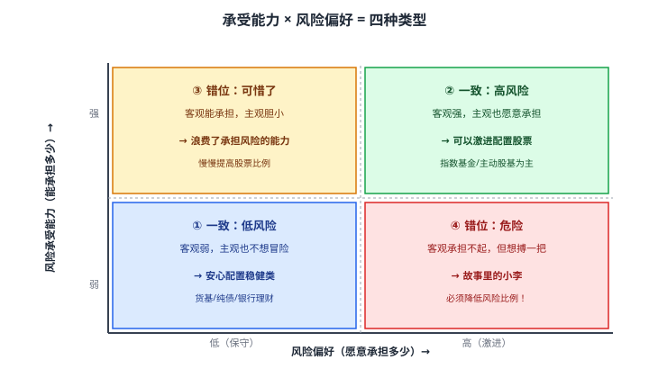
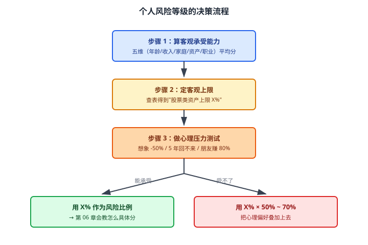

# 05 个人风险偏好评估

> **这一章要让你搞懂的事**
> 1. **"我能承担多少风险"** 和 **"我想承担多少风险"** 是两件不同的事
> 2. 银行/券商让你做的"风险测评"为什么经常不准——以及怎么自测才靠谱
> 3. 年龄、收入、家庭、职业、资产，这五个客观维度怎么决定你的"承受能力上限"
> 4. **三个心理压力测试**：在脑子里跑一遍 -50% 场景，看你会不会失眠
> 5. 为什么"年龄 = 债券比例"这个老规则在 2026 年已经过时
>
> **入门门槛**
> - 第 01 章：储蓄率、三层目标
> - 第 04 章：波动率、最大回撤
>
> **声明**：本教程不构成投资建议；所有人物、问卷、数字仅作教学示例。

---

## 0. 先讲个故事

**小王**和**小李**都做了券商的风险测评。

- **小王**：30 岁，月入 2 万，没房贷，父母身体好，存款 30 万。测评结果："积极型"。他买了 50 万股票基金（其中 20 万是融资借的）。
- **小李**：55 岁，月入 1.5 万，房贷还有 10 年，老婆刚做完手术。测评结果："积极型"（因为他问卷里都选了"我能承受 -30%"）。他也买了 50 万股票基金。

2024 年市场跌 30%。

- **小王**账户从 50 万跌到 35 万，扛住了——3 年后回本，又赚到 65 万。
- **小李**账户跌到 35 万的同时，老婆需要 20 万治疗费。**他被迫在最低点卖出**，亏损实化，10 年内没赚回来。

> 同样"积极型"的测评结果，**对小王是合适的，对小李是灾难**。
>
> 问题不在测评——问题在小李**搞混了两件事**：
> - "我**能不能**承担 -30%"（客观能力）
> - "我**愿不愿意**承担 -30%"（主观偏好）
>
> 小李心理上接受 -30%（他选"能承受"），但客观上他**根本承担不起**——因为他还有房贷、有医疗支出、收入不稳定。
>
> 这一章就讲清楚这两件事的差别，以及怎么科学评估它们。

---

## 1. 两个常被混用的概念

| 概念 | 大白话 | 性质 |
|---|---|---|
| **风险承受能力**（Risk Capacity）| 你**能**亏多少而不影响生活 | 客观，由收入/资产/家庭决定 |
| **风险偏好**（Risk Tolerance）| 你**愿意**承担多大波动 | 主观，由性格/经历决定 |

**两个都重要，但顺序不同**：

1. 先用**承受能力**画一个上限（"我最多能配置 X% 风险资产"）
2. 再用**偏好**在上限内选择具体比例（"在 X% 上限内，我想配置 Y%"）

### 1.1 四种组合

**关键认知**：
- **第 ① ② 象限**：一致——按结果配置即可
- **第 ③ 象限**：可惜了——可以慢慢提高风险比例（但不强求）
- **第 ④ 象限**：**最危险**——必须**按承受能力来配置**，不能按偏好

> 💡 **承受能力是"硬约束"，偏好是"软约束"**——硬约束永远优先。
> 你愿意梭哈不重要，关键是**梭哈失败你会不会破产**。

---

## 2. 风险承受能力：五个客观维度

这是**客观的、可量化的**——任何人按这五个维度打分，结论都差不多。

### 2.1 年龄

**核心逻辑**：年轻人有时间"扛过"市场下跌——长期投资 30 年的人，对单年 -40% 比退休 3 年的人耐受度高得多。

| 年龄段 | 投资时间窗口 | 承受能力（年龄维度）|
|---|---|---|
| 20–30 岁 | 30–40 年 | 极高 |
| 30–40 岁 | 20–30 年 | 高 |
| 40–50 岁 | 15–25 年 | 中 |
| 50–60 岁 | 5–15 年 | 偏低 |
| 60+ 岁 | < 10 年 | 低 |

> ⚠️ **年龄不是唯一标准**。一个 60 岁但有充足养老金 + 房产收租的人，比一个 30 岁但每月还信用卡的人，承受能力可能更高。年龄只是其中一个因素。

### 2.2 收入稳定性

**核心逻辑**：现金流越稳定，越能承担投资波动——因为不会被迫在低点割肉补贴生活。

| 收入类型 | 稳定性 |
|---|---|
| 公务员 / 国企正式工 | 极稳定 |
| 大公司技术/管理岗 | 稳定 |
| 销售/咨询/创业者 | 波动大 |
| 自由职业 / 网红 | 极不稳定 |

**翻译成人话**：稳定收入的人买股票像"用零花钱"——亏了不影响生活；不稳定收入的人买股票像"用救命钱"——一旦遇上断收入 + 市场跌的双重打击，必须卖在最低点。

### 2.3 家庭结构

**核心逻辑**：依赖你养的人越多，你的"安全垫"必须越厚。

| 家庭状态 | 承受能力 |
|---|---|
| 单身 / 丁克 | 高 |
| 双职工无孩 | 高 |
| 双职工 + 1 孩 | 中 |
| 单职工 + 孩 + 老人 | 偏低 |
| 自己是家庭唯一收入来源 + 多个依赖人口 | 低 |

特别注意：**老人的医疗支出**是中年人最大的不确定性来源——比养孩子还难预测。

### 2.4 资产负债比

**核心逻辑**：净资产越高、负债越少，你能承担的投资波动越大。

简化版指标：

$$
\text{风险缓冲} = \frac{\text{流动资产} - \text{6 个月必要支出}}{\text{月支出}}
$$

**翻译成人话**：除去 6 个月应急储备后，你账上还有几个月的钱可以"亏"。
- < 12 个月：**只能配置低风险**
- 12–36 个月：**可以配置 30%–50% 风险资产**
- > 36 个月：**可以配置 50%+ 风险资产**

### 2.5 职业与人力资本

**核心逻辑**：你这辈子未来还能赚多少（金融上叫**人力资本 Human Capital**），是你**最大的"债券型资产"**——稳定的薪资就像在持有长期国债。

| 职业 | 人力资本性质 | 投资里应该配 |
|---|---|---|
| 公务员（稳定工资）| 类债券型 | **可以多配股票**——你的人力资本已经是"债券" |
| 投行/PE/创业者（高收入但波动大）| 类股票型 | **应该多配债券**——避免"工作+投资"双杀 |
| 互联网（中等稳定、有期权）| 混合型 | 中间配置 |

**反直觉点**：**收入越稳的人，越应该配股票；收入越波动的人，越应该配债券**。这跟很多人的直觉相反，但金融上完全正确——这叫**人力资本对冲**。

### 2.6 综合一下：你的承受能力雷达图

把上面五个维度都打分（1-5 分），画成雷达图：

平均分对应配置建议（**只是参考，不是规则**）：

| 平均分 | 类型 | 股票类资产上限 |
|---|---|---|
| 1.0 – 2.0 | 保守型 | 10%–20% |
| 2.0 – 3.0 | 稳健型 | 20%–40% |
| 3.0 – 4.0 | 平衡型 | 40%–60% |
| 4.0 – 5.0 | 进取型 | 60%–80% |

---

## 3. 风险偏好：主观的心理维度

这是**主观的、因人而异的**——同样客观条件的两个人，可能一个胆大一个胆小。

### 3.1 影响风险偏好的因素

| 因素 | 怎么影响 |
|---|---|
| **性格** | 天生谨慎 vs 天生爱冒险 |
| **过往经历** | 有过暴富经历的更激进；有过爆仓经历的更保守 |
| **专业背景** | 学金融/数学的可能更激进（知道概率）；学医的可能更保守 |
| **当时市场情绪** | 牛市后期人人激进；熊市底部人人保守——**这是反过来的，要警惕** |

### 3.2 一个简单的小测试

| 问题 | 你的真实反应 |
|---|---|
| 100 万本金，一年后变 70 万 | □ 立刻卖出 □ 不动 □ 加仓 |
| 100 万本金，一年后变 50 万 | □ 立刻卖出 □ 不动 □ 加仓 |
| 100 万本金，3 年后还在 60 万 | □ 立刻卖出 □ 不动 □ 加仓 |
| 你的同事去年靠某基金赚了 200%，今年那基金大跌 50% | □ 庆幸没买 □ 抄底 |

**注意**：这不是"答对答错"的测试。**这是让你提前感受到那个场景**——人在没真亏过钱时，普遍高估自己的承受度。

### 3.3 银行风险测评为什么经常不准

按《商业银行理财业务监督管理办法》（2018），银行卖任何理财产品前必须做风险测评。常见问题有 8–15 题，分 R1（保守）到 R5（激进）五级。

**问题**：
1. **题目偏简单**——很多是"我能承受 -10% 还是 -20%"，但**真到 -20% 的瞬间，没经历过的人才知道自己是什么反应**
2. **存在引导**——销售希望你测出"更高风险等级"，能卖出更多产品
3. **静态**——做完一次管 1 年。但你的客观条件可能 6 个月就变了（生孩子、换工作、父母生病）
4. **混合两个概念**——题目里既问"你能不能"也问"你愿不愿"，最终给一个混合分数

> 📌 **建议**：银行测评做归做（合规需要），但**你自己要按本章的"五维 + 心理压力测试"重新评估一次**。每年重新做。

---

## 4. 三个心理压力测试

不要等真亏了才发现自己承受不住——**先在脑子里跑一遍**。

### 4.1 测试一：账户腰斩想象

**情景**：你账户里有 X 元（填你打算投入的真实数字）。明天打开 APP，发现变成 X/2。

**问自己 3 个问题**：
1. 我会失眠吗？
2. 我会立刻打开股票群/抖音找解套办法吗？
3. 我会"宁可不要本金也要赎回"地点卖出吗？

**如果任一问题答"是"**——你计划的股票比例**砍半**。

### 4.2 测试二：5 年回不来想象

**情景**：账户跌了 30%，**接下来 5 年一直在 -30% 到 -10% 之间徘徊**——没继续跌，但也不涨。

**问自己**：5 年后我会不会忍不住卖了换成存款？

**关键**：历史上 A 股的熊市平均 4 年，美股 1.5 年。**真实的"等回本"过程，比你想象的长得多**。

### 4.3 测试三：错过对照组

**情景**：你的同事/朋友买了某只暴涨基金赚了 80%。你按本章配置稳健组合赚了 8%。

**问自己**：你能坚持"我的目标不是赚最多，是不要在错误的时间亏太多"这个原则吗？还是会忍不住跟风？

**这是最难的一关**——很多人输不在熊市，输在**牛市末期的 FOMO（Fear of Missing Out 害怕错过）**。

### 4.4 小工具：模拟历史回测

不想"想象"？**直接看真实数据**。

打开任意一只指数基金的页面，把它的"近 3 年走势"和"2015 年走势"调出来：
- 2015 年 6 月 → 2016 年 1 月：**沪深 300 跌约 45%**
- 你看着那条曲线，问自己："如果这是我的账户，我会怎么操作？"

这比任何测评都准。

---

## 5. 把两者合并：你的最终风险等级

### 5.1 决策流程

### 5.2 一句话总结

> **最终风险比例 = min(客观承受能力, 主观偏好) × 调整系数**

**翻译成人话**：取两者中**较低的那个**。客观能承担 60% 但心理只能承担 40%——按 40% 配；客观只能承担 30% 但心理想配 60%——**必须按 30% 配**。

---

## 6. 经典规则与现代修正

### 6.1 "100 − 年龄 = 股票比例" 规则

**经典规则（1990 年代美国流行）**：
- 30 岁 → 股票 70%、债券 30%
- 60 岁 → 股票 40%、债券 60%

**逻辑**：年龄越大，投资时间窗口越短，应该越保守。

### 6.2 为什么这个规则在 2026 年过时了

**三个原因**：

**1）人均寿命延长**：1990 年中国人均预期寿命约 69 岁，2024 年约 79 岁。**退休后还有 20–30 年**，意味着 60 岁不应该太保守，否则钱花不到老。

**2）利率长期下行**：2026 年中国 10 年期国债收益率约 2.5%，**60% 配债的人实际收益可能负**（扣通胀后）。债券不再是"安全垫"，可能是"漏水的安全垫"。

**3）资产类别更丰富**：1990 年没有 REITs、QDII、商品 ETF。现在配置不止股债两类。

### 6.3 现代修正版

| 经典 | 现代修正 |
|---|---|
| 100 − 年龄 = 股票% | **110 ~ 120 − 年龄 = 风险资产%**（含股票+REITs+商品） |
| 股票 vs 债券二分 | **核心-卫星**：稳健核心 + 卫星仓位探索其他资产 |
| 不考虑人力资本 | **稳定职业 → 多配股票；不稳定职业 → 多配债券** |
| 一年调一次 | **生活大事件触发即调**（结婚/生子/换工作/亲人生病）|

详见第 06 章资产配置。

---

## 7. 进阶：风险偏好会变

**入门读者可以跳过本节**。

### 7.1 生命周期理论

经济学家 Franco Modigliani 提出的**生命周期假说**：人的消费/储蓄/风险偏好随年龄变化，呈现规律性曲线。

简化版：
- **20–35 岁**：风险偏好高（积累期）
- **35–50 岁**：风险偏好中（巩固期）
- **50–65 岁**：风险偏好降低（保护期）
- **65+ 岁**：风险偏好低（提取期，开始花钱）

### 7.2 市场情绪对偏好的影响

行为金融学发现：**人的风险偏好不是常数，会随市场情绪波动**——
- **牛市末期**：人人觉得自己是激进型
- **熊市底部**：人人觉得自己是保守型

**这是反过来的，正好做反**：
- 牛市末期是**降低风险**的时机
- 熊市底部是**提高风险**的时机

但绝大多数人做不到，因为他们的风险偏好已经被市场情绪劫持了。

详见第 35 章行为金融学。

### 7.3 目标日期基金（Target Date Fund）

美国市场常见的**目标日期基金（TDF）**会自动按你的退休日期，逐年调整股债比例——20 多岁时配 90% 股票，临近退休时降到 30%。

中国从 2018 年起也有类似产品（如"养老 2035 / 2040 / 2050"系列）。**对完全不想管理资产的人**，TDF 是一个"省心"的选择。详见第 23、37 章。

---

## 8. 小结

1. **承受能力**是客观的（年龄/收入/家庭/资产/职业），**偏好**是主观的（性格/经历/情绪）。**两者不要混**。
2. **承受能力是硬约束，偏好是软约束**——硬约束永远优先。
3. **五维评估**：年龄、收入稳定性、家庭结构、资产负债比、职业（人力资本）——平均分对应承受能力等级。
4. **反直觉点**：稳定收入的人**更应该多配股票**（人力资本对冲）。
5. **银行风险测评不要全信**——自己按本章方法重新评，每年评一次，生活大事件触发即评。
6. **三个心理压力测试**：账户腰斩想象、5 年回不来想象、错过对照组想象。提前体验，避免真到时崩溃。
7. **最终风险比例 = min(承受能力, 偏好)**——取较低的那个。
8. **"100 − 年龄" 规则在 2026 年过时了**——改用"110 ~ 120 − 年龄"作为现代版。

> 🔗 **承上启下**：你现在知道自己**适合多少风险**了。下一章告诉你**这些风险该具体怎么分**——10 万元在股票/债券/现金/黄金里各放多少。这就是**资产配置**。

---

## 自测题

> 答案在文末折叠区。先自己算，再对照。

1. 用一句话区分"风险承受能力"和"风险偏好"。
2. 故事里的小李问题出在哪？如果你是他的理财顾问，你会建议他配置多少股票？
3. 28 岁、月入 1.5 万、单身、没房贷、存款 20 万的程序员，按五维评分大约能拿几分？股票上限大约多少？
4. 一个人测评"激进型"，但你问"如果亏 30% 你怎么办"，他说"我会卖掉换余额宝"——他实际属于哪种类型？应该按什么配置？
5. "稳定收入的人更应该多配股票"为什么？用一句大白话解释"人力资本对冲"。
6. **进阶题**：35 岁的互联网员工，月薪 4 万但 30% 是期权（绑定公司股票）。按本章逻辑，他在金融投资里**应该多配什么？少配什么？**说理由。
7. **作业题**：照着 §2 给自己打五维分数，算平均分；再做 §4 的三个心理压力测试。把"客观结论"和"主观结论"写下来，看是否一致。不一致的话，说明你需要调整哪边。

📖 参考答案（点击展开）

1. 承受能力 = "**能**亏多少而不影响生活"（客观）；风险偏好 = "**愿意**承担多大波动"（主观）。
2. 小李把"主观愿意"和"客观能力"混了——他主观选"积极型"，但客观条件（年龄、家庭、负债、医疗风险）决定他承受能力很弱。按五维评估他大约 2.4/5，**股票应该 ≤ 20%**。
3. 年龄 5、收入 4、家庭 5、资产 4、职业 4，平均 ≈ **4.4**，**股票上限 60%–80%**。但实际配多少还要看他自己的主观偏好。
4. 测评"激进"是嘴上的，实际是"嘴硬心怂"——应该按"保守型"配置。这正是银行测评不准的典型例子。
5. 稳定收入相当于持有一只"债券"——每月给你固定现金流。金融组合里你已经有了"债券"部分，所以**金融资产里可以多配股票来平衡**；反之，收入波动大的人，"工作"本身已经是"股票"，金融资产里就该多配债券压风险。
6. **应该少配股票，尤其少配本公司行业的股票**（避免工作+持股双杀）。**应该多配债券和与本行业不相关的资产**（如 REITs、海外指数、商品）。如果他能行权，期权折现到现金后，**所得也应优先平衡到非股票资产**。这就是"集中风险分散化"。
7. 没有标准答案。如果客观 4 分但心理压力测试发现自己受不了 -30%，说明你**主观偏好弱**——按 50%–70% 调整系数配置；如果客观 2 分但心理觉得"我能扛 -50%"，说明你**高估自己**——必须按客观结论硬执行，否则就是故事里的小李。

---

## 延伸阅读

- 《思考，快与慢》—— Daniel Kahneman：第 25–26 章讲风险偏好的心理机制，诺奖得主写的
- 《行为投资者》—— Daniel Crosby：投资心理学专著，讲清楚"为什么聪明人在投资里做蠢事"
- 《不可不知的 25 项投资原则》—— Larry Swedroe：第 7 章专门讲"风险承受能力 vs 风险偏好"的实操评估
- **美国 Vanguard 投资者问卷**：[Investor Questionnaire](https://investor.vanguard.com/calculator-tools/investor-questionnaire)——比国内银行测评更详细，可作参考
- 中国证监会《证券期货投资者适当性管理办法》（2017）：法规原文，了解监管对"投资者适当性"的标准定义

---

## 下一章预告

**06 资产配置基础** —— 会回答：
- 知道自己适合多少风险后，**具体怎么分**——10 万元在股票/债券/现金/黄金里各放多少？
- **股债比**：经典 60/40、激进 80/20、保守 30/70 怎么选
- **再平衡**：什么时候、按什么规则把组合"拉回来"
- **核心-卫星策略**：稳健核心 + 探索性卫星
- **标准普尔家庭资产象限图**：把生活账户和投资账户分开
