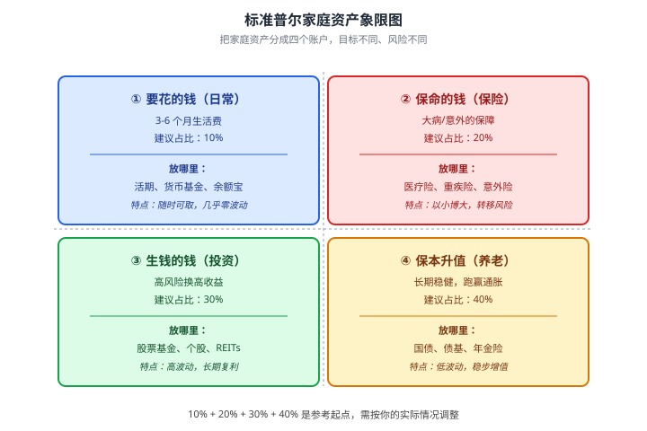
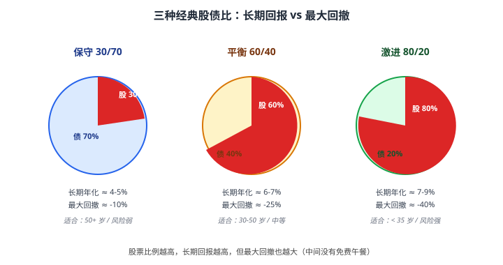
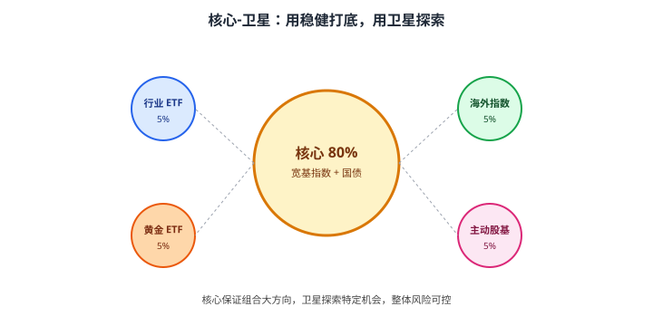

# 06 资产配置基础

> **这一章要让你搞懂的事**
> 1. **资产配置**到底在解决什么问题——为什么"多样化"不是废话
> 2. **标准普尔家庭资产象限**：用一张图把家里的钱分成四个账户
> 3. **股债比**：60/40、80/20、30/70 怎么选——以及为什么这是最关键的决定
> 4. **再平衡**：什么时候、按什么规则把跑偏的组合拉回来
> 5. **核心-卫星策略**：稳健核心 + 探索性卫星，怎么搭
> 6. 中国家庭可用的资产类别清单
>
> **入门门槛**
> - 第 01 章：三层目标
> - 第 03 章：实际收益
> - 第 04 章：波动率、最大回撤
> - 第 05 章：你的风险承受能力等级
>
> **声明**：本教程不构成投资建议；所有产品分类仅作教学示例。

---

## 📖 本章英文缩写速查

> 看到不认识的英文缩写，先回这张表查；完整术语见 [GLOSSARY.md](../GLOSSARY.md)。

| 缩写 | 英文全称 | 中文含义 |
|---|---|---|
| **ETF** | Exchange-Traded Fund | 交易所交易基金 |
| **MPT** | Modern Portfolio Theory | 现代投资组合理论 |
| **QDII** | Qualified Domestic Institutional Investor | 合格境内机构投资者，借道投资海外的渠道 |

---

## 0. 先讲个故事

老张和老王 2020 年同时退休，各拿出 100 万养老钱。

- **老张**：听邻居说"白酒永远涨"，**100 万全买了白酒主题基金**。
- **老王**：按"50% 沪深 300 ETF + 30% 债基 + 15% 货基 + 5% 黄金 ETF"分散配置。

**第 1 年（2021）**：白酒涨 60%。
- 老张账户：160 万。"早知道再多买点。"
- 老王账户：113 万。"看着邻居赚 60 万，我才赚 13 万，有点亏。"

**第 2-3 年（2022-2023）**：白酒板块连跌两年，累计 -50%。
- 老张账户：80 万。"……"
- 老王账户：110 万（股债对冲了下跌）。

**第 4 年（2024）**：市场反弹。
- 老张账户：100 万（白酒涨 25%）。**4 年原地踏步**。
- 老王账户：120 万。**4 年涨 20%**。

> 同样 100 万，同样 4 年。老张坐了一趟过山车回到原点，老王慢吞吞涨了 20 万。
>
> **这就是资产配置要解决的问题**：在你猜不准未来的前提下，**用"分散"来交换"稳定"**——你放弃极端情况下"赚最多"的机会，换来"大概率不破产"的保证。
>
> 这一章告诉你怎么分。

---

## 1. 资产配置是什么

### 1.1 一句话定义

**资产配置（Asset Allocation）= 把钱分成几类放在不同篮子里**。

这些篮子按"颠簸程度"和"涨跌规律"差别很大：
- 现金类：几乎不颠，但跑不赢通胀
- 债券类：略颠，长期跑赢通胀一点
- 股票类：很颠，长期跑赢通胀很多
- 黄金/商品类：和股债相关性低，分散风险
- 海外资产：和国内市场不同步，再分散一层

**资产配置的核心是相关性低**——当 A 跌的时候，B 不跌甚至涨，**整体波动就被磨平了**。

### 1.2 为什么"分散"能赚钱

举个极端例子。两只资产 A 和 B，**长期年化都是 8%**，但走势完全相反：
- 年 1：A 涨 30%、B 跌 10%
- 年 2：A 跌 10%、B 涨 30%
- 年 3：A 涨 30%、B 跌 10%
- ……

**单独持有任一只**：3 年累计 $1.3 \times 0.9 \times 1.3 = 1.521$，年化 ≈ **15%**。

但波动巨大——单年最差跌 10%。

**各持 50% 并每年再平衡**：每年都是 $0.5 \times 1.3 + 0.5 \times 0.9 = 1.1$，年化 **10%**。

**虽然组合年化只有 10%（不是 15%），但波动接近零**。
- 用"放弃 5% 收益"换"几乎零波动"——大多数人会选后者
- 更妙的是：如果每年再平衡，**实际拿到的收益比 8% 高**（数学上叫"再平衡红利"，§5 会讲）

### 1.3 资产配置的两个层面

| 层面 | 解决什么 | 例子 |
|---|---|---|
| **战略配置（Strategic）**| 长期股债基本比例 | "60% 股 + 40% 债"，长期不变 |
| **战术配置（Tactical）**| 短期根据市场调整 | "今年看空股票，临时调到 40% 股"|

**对小白**：**只做战略配置**。战术配置需要预测能力，**90% 的专业基金经理也做不好**。

---

## 2. 标准普尔家庭资产象限图

这是国内理财界最广为流传的入门图——把家里的钱分成**四个账户**，每个账户**目标不同、风险不同、放的资产也不同**。

### 2.1 四个账户的细节

| 账户 | 目标 | 关键数字 |
|---|---|---|
| **① 要花的钱** | 应对日常+小意外 | 至少能撑 **3-6 个月** 生活 |
| **② 保命的钱** | 大病/意外不返贫 | 重疾保额至少 **年收入 5 倍** |
| **③ 生钱的钱** | 长期复利增值 | **5 年以上不动**，能承受 -30%+ |
| **④ 保本升值** | 跑赢通胀，养老用 | 锁定 **10+ 年**，年化目标 4%–6% |

### 2.2 这张图的两个误区

**误区一：把比例当圣旨**。
"10:20:30:40" 只是个参考起点。一个 25 岁的程序员可能是 10:5:60:25，一个 60 岁的退休人可能是 20:10:20:50。**比例随生命周期变**。

**误区二：忘了第 ② 个账户**。
新手往往跳过保险直接谈投资，**这是大错**。一场大病可以让你十年积累归零——**保险是配置的基石**，详见第 31 章。

### 2.3 这张图主要解决"账户分离"

很多人理财失败不是因为不会投资，是因为**把钱混在一起**：
- 用应急储备炒股 → 一跌就被迫卖
- 用养老钱赌短期 → 输不起也赢不大
- 没买保险 → 大病一场，所有"投资"清零

**先把账户分开，再谈投资策略**。

---

## 3. 股债比：最重要的一个决定

第 ③ 账户（生钱的钱）+ 第 ④ 账户（保本升值）合在一起，**绝大多数家庭的"投资部分"就是这两块**。这两块怎么分——这就是经典的**股债比（Stock/Bond Ratio）**问题。

### 3.1 三种经典配置

### 3.2 数据从哪里来

上面的"长期年化"和"最大回撤"是基于这些假设：
- 股票部分用沪深 300 全收益（年化 ≈ 8.5%、波动率 ≈ 22%）
- 债券部分用中证全债（年化 ≈ 4.5%、波动率 ≈ 2%）
- 股债相关性按 0.1 计算（实际历史接近）

**关键结论**：每增加 10% 股票比例，长期年化大约 +0.4%，**但最大回撤增加 4-5%**。

**翻译成人话**：多承担 4-5% 的"最糟情况"，只换来 0.4% 的"平均回报"。这就是为什么**不要无脑梭哈股票**——边际不划算。

### 3.3 怎么选你的股债比

**两条规则配合使用**：

**规则一（现代版"年龄规则"，第 05 章引出）**：
$$
\text{股票比例} \approx (110 \sim 120) - \text{年龄}
$$
- 30 岁：80%–90% 股票
- 50 岁：60%–70% 股票
- 65 岁：45%–55% 股票

**规则二（按第 05 章风险等级）**：

| 第 05 章评分 | 类型 | 股票比例 |
|---|---|---|
| 1.0–2.0 | 保守 | 10%–20% |
| 2.0–3.0 | 稳健 | 20%–40% |
| 3.0–4.0 | 平衡 | 40%–60% |
| 4.0–5.0 | 进取 | 60%–80% |

**取两条规则中的较低值**——这就是保守的、安全的起点。

### 3.4 一个真实例子

35 岁的程序员小张，按第 05 章评分 3.8 分（接近进取型）。
- 年龄规则：110 - 35 = **75% 股票**
- 风险规则：3.8 分 → **40%-60% 股票**
- 取较低值：**50% 股票 + 50% 债券**

如果他想再激进一点，可以提到 60/40——但不要超过 75%（年龄规则的上限）。

---

## 4. 核心-卫星策略：再细分一层

确定了股债比之后，**每一块怎么投**？这就是**核心-卫星（Core-Satellite）**思想。

### 4.1 大白话

把投资组合想象成一个**太阳系**：
- **核心（Core）**：占 70%–90%，**指数化、低费率、不动**——像太阳一样稳坐中心
- **卫星（Satellite）**：占 10%–30%，**主动投资、行业 ETF、个股**——像行星一样围绕核心转

### 4.2 为什么这么设计

**核心**：用**指数基金**（沪深 300、中证 500、标普 500 等）+ **国债/纯债基**。
- 优势：**费率低**（年管理费 0.15%–0.5%）、跟踪市场、长期跑赢 80% 的主动基金
- 劣势：永远只能赚市场平均

**卫星**：用**行业 ETF、海外 QDII、商品 ETF、主动股基、个股**。
- 优势：**有机会跑赢市场**、表达个人观点
- 劣势：费率高、波动大、可能跑输

**整体效果**：核心提供"不输市场"的底线，卫星提供"有机会赢"的弹性。**输也输不多，赢也有机会**。

### 4.3 一个具体配置例子

35 岁、平衡型（50% 股 + 50% 债）的小张：

| 角色 | 类别 | 比例 | 具体可考虑 |
|---|---|---|---|
| 核心（股）| 沪深 300 ETF | 25% | 510300 这类（仅举例，下同） |
| 核心（股）| 中证 500 ETF | 10% | 510500 |
| 核心（债）| 中长期纯债基 | 35% | — |
| 卫星（股）| 标普 500 QDII | 8% | — |
| 卫星（股）| 黄金 ETF | 5% | — |
| 卫星（股）| 单只行业 ETF | 2% | 你看好的行业 |
| 卫星（债）| 短债基/货基 | 15% | 兼作应急储备 |

> ⚠️ **声明**：以上仅为教学示例，**不构成任何产品推荐**。基金代码会变、产品会下架，请按本章的"思路"自行筛选。

---

## 5. 再平衡：把跑偏的组合拉回来

### 5.1 为什么要再平衡

假设你年初配置 60% 股票 + 40% 债券。一年后股票涨了 30%、债券涨了 4%：
- 股票市值：60 × 1.3 = 78
- 债券市值：40 × 1.04 = 41.6
- 总值 119.6
- **现在比例：股 78/119.6 ≈ 65%、债 35%**

**组合已经偷偷变激进了**——风险超出了你最初设定的范围。

**再平衡（Rebalancing）**：卖出涨多的（股票），买入涨少的（债券），把比例拉回 60/40。

### 5.2 为什么再平衡能赚钱（再平衡红利）

**核心机制**：**强制让你"高抛低吸"**。
- 股票涨得多 → 卖出（高位卖）
- 债券涨得少 → 买入（低位买）

**长期效果**：每年再平衡的组合，比"buy and hold"（买了不动）的组合，**长期年化高约 0.3%–0.8%**。这叫**再平衡红利（Rebalancing Bonus）**。

**翻译成人话**：再平衡不仅控制风险，**还顺便赚钱**——因为它在情绪上做最难的事（高位减仓、低位加仓），而大多数人做不到。

### 5.3 三种再平衡规则

| 规则 | 触发条件 | 优缺点 |
|---|---|---|
| **时间规则**| 每年/每半年/每季度调一次 | 简单，但可能错过大偏离 |
| **阈值规则**| 任何资产偏离目标超过 ±5% 就调 | 反应快，但操作多 |
| **混合规则**| 平时按时间调，极端偏离触发立即调 | 推荐 |

**对小白**：**每年 1 月 1 日做一次再平衡**——简单、足够。

### 5.4 一个再平衡的简单步骤

1. 月初登录所有账户（基金/股票/理财），把市值都列出来
2. 算每类资产的当前比例
3. 对照目标比例，**算出每类需要买入/卖出多少**
4. 操作（**优先用"新增资金"买入欠配的，少卖出**——能省税）
5. 记录这次再平衡的日期、操作、原因

> 💡 **小技巧**：如果你每月有定投，**优先把定投的钱买入"当前最缺的资产"**——这样可以**少做主动卖出**，省掉一些交易摩擦。

---

## 6. 中国家庭可用的资产类别清单

把所有可能的"篮子"列出来，方便你按上面的框架挑：

| 大类 | 细分 | 风险 | 流动性 | 教程章节 |
|---|---|---|---|---|
| **现金类** | 活期/货基/银行短期理财 | 极低 | 极高 | 第 07-09 章 |
| **固定收益** | 国债/债基/可转债/银行理财 | 低-中 | 中-高 | 第 11-16 章 |
| **股票类** | A 股/港股/美股/指数基金/主动基金 | 高 | 高 | 第 17-24 章 |
| **另类资产** | 黄金/REITs/商品/外汇 | 中-高 | 中 | 第 28-30 章 |
| **保险类** | 重疾/医疗/年金/增额终身寿 | 极低 | 极低 | 第 31 章 |
| **不动产** | 自住房/投资房 | 中 | **极低** | 不在本教程主线 |
| **数字资产** | 比特币 等 | 极高 | 中 | 第 32 章（审慎）|
| **衍生品** | 期货/期权 | 极极高 | 高 | 第 25-27 章（不建议碰）|

**注意**：这张表只是"清单"，**不是配置建议**。具体选哪些、各放多少，要按上面的框架算。

---

## 7. 进阶：现代投资组合理论预览

**入门读者可以跳过本节**，等学完前 30 章再回来。

### 7.1 一个简单事实

经济学家 Harry Markowitz 在 1952 年发现一个反直觉的数学事实：

**两个高风险资产组合，可能比单个低风险资产的整体波动更小**——只要它们的相关性足够低。

这就是**现代投资组合理论（Modern Portfolio Theory, MPT）**的起点。Markowitz 因此拿了 1990 年诺贝尔经济学奖。

### 7.2 有效前沿（Efficient Frontier）

把所有可能的资产组合画在"风险 vs 回报"坐标上，会形成一条**向上凸的边界**。在边界上的组合叫**有效组合**——同样的风险水平下，**它们的回报是最高的**。

理论上每个人都应该选边界上的组合，而不是边界内的（"低效率"）组合。

### 7.3 这套理论的局限

MPT 假设：
- 收益率服从正态分布（**实际是厚尾**，第 04 章讲过）
- 历史相关性能预测未来（**实际相关性在危机时趋于 1**——大家一起跌）
- 投资者完全理性（**实际不理性**，第 35 章行为金融）

**所以 MPT 在课本上漂亮，实战中要打折用**。本教程不要求你算"有效前沿"——只要做到**简单分散 + 定期再平衡**，已经超越 80% 的散户。

详见第 33 章。

---

## 8. 小结

1. **资产配置 = 用"分散"换"稳定"**。放弃极端情况下"赚最多"的机会，换大概率"不破产"。
2. **标准普尔家庭资产象限**：把家里的钱分成 4 个账户——**先把账户分开，再谈投资策略**。
3. **股债比是最重要的一个决定**：每增加 10% 股票，长期年化 +0.4%，最大回撤 +4-5%。**不要无脑梭哈**。
4. **核心-卫星**：80% 用指数 + 国债（核心），20% 用行业/海外/黄金（卫星）。**输也输不多，赢也有机会**。
5. **再平衡**：每年一次，把跑偏的拉回目标——**控制风险 + 赚再平衡红利**。
6. **最简起步**：照标准普尔象限分账户 → 用年龄规则定股债比 → 全部用指数基金做核心 → 每年 1 月 1 日再平衡。**就这四步，能打败大多数散户**。

> 🔗 **承上启下**：00 基础篇到此结束。从下一章开始，**走出"原理"，进入"实操"**——
> 第 07-10 章讲**现金与储蓄**：应急储备金怎么存？货币基金怎么选？国债逆回购为什么是节假日小确幸？

---

## 自测题

> 答案在文末折叠区。先自己算，再对照。

1. 老张和老王故事里，老王的组合 4 年涨 20%，年化大约多少？这水平在中国市场算高还是低？
2. 28 岁，第 05 章评分 4.2，按本章两条规则算股债比，应该怎么配？
3. 你年初配 60% 股、40% 债，年末股票涨 50%、债券跌 5%。现在比例是多少？要做什么操作？
4. 标准普尔家庭资产象限里，"重疾险"属于哪个账户？为什么不算"投资"？
5. 核心-卫星策略里，"卫星"占比建议不超过多少？为什么不要让卫星超过这个比例？
6. **进阶题**：你按 60/40 配置 100 万，过去 5 年股票年化 12%、债券年化 3%，但你**没做再平衡**。5 年末组合比例变成多少？组合实际年化大约多少？如果做了再平衡呢？
7. **作业题**：照着本章框架，把你目前的所有资产（存款+基金+股票+理财+房产+……）列出来，**强行按标准普尔象限分类**，看现在每个账户占多少，**和建议的 10:20:30:40 差多少**。

📖 参考答案（点击展开）

1. $1.2^{1/4} - 1 \approx \mathbf{4.66\%}$。这水平相对沪深 300 长期年化 8% 算偏低，但**与他配置的"稳健倾向"组合预期一致**——稳健的代价就是收益降低，换的是"过程不痛苦"。
2. 年龄规则：110 − 28 = 82% 股票；风险规则：4.2 分 → 60%-80% 股票。取**较低值的上界 = 80% 股 + 20% 债**。
3. 股票市值 = 60 × 1.5 = 90，债券市值 = 40 × 0.95 = 38，总值 128。现在比例：股 90/128 ≈ **70.3%**、债 ≈ 29.7%。**需要卖出约 13.2 万股票，买入债券**，把比例拉回 60/40。
4. 属于 **② 保命的钱**。重疾险的逻辑是"花小钱保大风险"——一年几千块保几十万的大病额度，**它转移的是"医疗费用让家庭返贫"的风险**，不指望它增值，所以不算投资。
5. 一般建议 **不超过 20%-30%**。卫星太高 = 实质等同于赌单一行业/单一主题，丧失了"分散"的核心优势。卫星本质是"在保留分散基础上的小赌注"。
6. 5 年后股 60 × 1.762 = 105.7、债 40 × 1.159 = 46.4，总 152.1。比例变成 **股 69.5% + 债 30.5%**。
   - 没再平衡组合年化 = $1.521^{1/5} - 1 \approx \mathbf{8.74\%}$。
   - 如果每年再平衡，年化大约高 0.3%–0.5%，约 **9.1%**（数字依股债走势而异）。
   - 更关键的是：未再平衡组合**当前风险已超出你最初设定的范围**，下次股市暴跌时损失会更大。
7. 没有标准答案。检查清单：✓ 所有资产都归类了 ✓ 算出当前 4 个账户的占比 ✓ 找出最大的偏离方向 ✓ 制定 6-12 个月的"再平衡计划"。如果发现"② 保命的钱 = 0%"，那是**比任何投资问题都紧急的事**——先把保险补上。

---

## 延伸阅读

- 《有效资产管理》(*The Intelligent Asset Allocator*) —— William Bernstein：资产配置的圣经，数学不多但思想深刻
- 《全球资产配置》(*Global Asset Allocation*) —— Meb Faber：测试了 13 种经典资产配置方案的长期数据
- 《不落俗套的投资》(*Pioneering Portfolio Management*) —— David Swensen：耶鲁捐赠基金的配置方法论
- **Vanguard "Three-Fund Portfolio"** 理论：用 3 只指数基金（本国股、海外股、债券）打天下，是核心-卫星的极简版
- 中国证券业协会发布的《2023 年度全国公募基金投资者调查报告》：了解中国散户的真实配置现状（结论：**90% 散户严重缺乏配置概念**）

---

## 下一章预告

**07 应急储备金** —— 走出"原理"进入"实操"的第一章：
- 应急储备金到底要存多少？3 个月够不够？
- 应该放在活期、货币基金、还是短期债基？
- 应急金和保险的关系：保险不能替代应急金，但能让应急金少存一些
- 一线城市单身青年 vs 三孩家庭，应急金算法的差别

---

## 章末小广告

> 🎉 **恭喜！你已经完成了 00 基础篇的全部 6 章。**
> 接下来：写一篇 **00 基础篇复盘**——回答 3 个问题：
> 1. 这 6 章里最反直觉的一个点是什么？
> 2. 如果只能记住一句话，是哪一句？
> 3. 接下来要在自己的钱上做出的一个具体改变是什么？
>
> 这是 TODO.md 里规划的"阶段性复盘"环节。下次说"继续"我们会先写复盘，然后进入 01 现金与储蓄篇。
