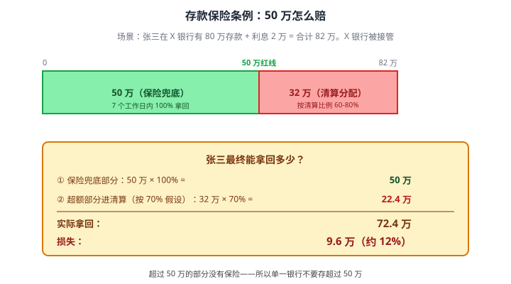
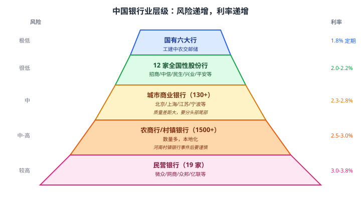
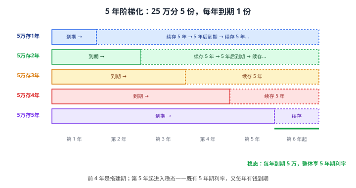

# 08 银行存款

> **这一章要让你搞懂的事**
> 1. **活期 / 定期 / 大额存单**到底有什么区别——以及为什么"大额存单"不是"大额理财"
> 2. **存款保险条例 50 万**是什么意思——超过 50 万银行倒闭你会损失多少
> 3. **国有大行 vs 城商行 vs 民营银行**：利率高 1% 是好事还是陷阱
> 4. **存款期限阶梯化（CD Ladder）**：让你既有流动性又有较高利率的经典技巧
> 5. **提前支取**和**靠档计息**：被忽略的小坑
> 6. 存款在你整个资产配置里的角色——什么时候用它、什么时候不用
>
> **入门门槛**
> - 第 04 章：流动性、安全性的概念
> - 第 06 章：标准普尔象限的 ① 号账户
> - 第 07 章：应急金的三阶梯
>
> **声明**：本教程不构成投资建议；所有银行、利率、产品均为教学示例，**利率每年变动，请以你看到本章时的市场数据为准**。

---

## 0. 先讲个故事

老李和老王 2024 年都拿到了 80 万拆迁款，决定"先存起来不动"。两人选择不同。

- **老李**：听说**某地方银行年化 3.2%**（远高于国有大行 1.8%），把 **80 万全存了进去**。"反正都是银行，国家兜底嘛。" 一年多赚 1.1 万利息。
- **老王**：分四家国有大行各存 20 万，年化 1.8%。"图省心。" 一年利息 1.44 万（合计）。

听起来老李赢了——多赚 11,000 块。

2025 年某月，这家地方银行因为大额对公贷款踩雷，**被监管接管**。

- **存款保险**条例规定：每家银行**每个储户 50 万以内本息全额兑付**
- 老李的 80 万 = **50 万拿回（保险兜底）** + **30 万进入破产清算**
- 清算结果，存款人对超额部分的受偿比例约 **70%**（已经算好的，差的可能只有 30-50%）
- 老李实际拿回：50 + 30 × 70% = **71 万**

老李：账面少赚 1.1 万 + 实际亏掉 9 万 = **损失 9 万元**。
老王：80 万本金 + 利息 1.44 万 = **稳稳的 81.44 万**。

> 同样 80 万、同样存银行——**老李为了多 1.4% 利率，承担了"本金可能亏 10%+"的风险**。这个风险一辈子可能不发生，但**一旦发生就把过去 10 年的利息差全吐回去**。
>
> 这章告诉你：**存款不是"零风险"，是"低风险"。如何把"低风险"做实，如何在低风险里榨出最大收益**。

---

## 1. 银行存款的三大类型

### 1.1 总览

银行存款其实就三种主流形态：

| 类型 | 大白话 | 利率参考（2026）| 流动性 |
|---|---|---|---|
| **活期存款** | 随时存随时取 | 0.15%–0.30% | ★★★★★ |
| **定期存款** | 锁定一段时间 | 1.0%–2.5% | ★★（提前支取按活期算）|
| **大额存单**（CD）| 20 万起的"高级定期" | 比同期定期高 20-50bp | ★★★（多数可转让）|

**翻译成人话**：
- **活期**：钱包。随时拿钱方便，但几乎不增值。
- **定期**：保险柜。锁起来一段时间，能多一点利息。
- **大额存单**：豪华保险柜。要 20 万起，利息再多一点，且可以转手卖给别人。

### 1.2 活期存款

| 项目 | 内容 |
|---|---|
| 利率 | 央行基准 0.35%（2024 起），实际多在 0.15-0.30% |
| 起存金额 | 1 元 |
| 取款 | T+0，随时 |
| 计息方式 | 按日计息、按季结息 |

**适合的场景**：
- 日常工资卡的留存（次日要交房租水电）
- 应急金第一档的极小部分（1-2 千块"紧急救命"）

**不适合**：作为应急金的核心——余额宝/货币基金完爆它。

### 1.3 定期存款

| 期限 | 利率参考（国有大行 2026）|
|---|---|
| 3 个月 | ~1.05% |
| 6 个月 | ~1.25% |
| 1 年 | ~1.35% |
| 2 年 | ~1.45% |
| 3 年 | ~1.95% |
| 5 年 | ~2.00% |

**注意几个反直觉点**：

**① "存得越久利率越高" 并不总成立**。2026 年 3 年和 5 年期利率差不多——这叫**期限倒挂**，说明银行不想再吸长钱了。

**② 提前支取按活期算**。这是定期存款最大的坑——你存了 3 年期 1.95%，第 35 个月急用钱取出来，**全部 35 个月利息按活期 0.2% 重算**。损失能让你哭。
  - 部分银行允许"部分提前支取"（取走的部分按活期，剩下的按原约定），但**不是所有银行都有**，且**只能操作一次**
  - 询问关键词："是否支持部分提前支取"

**③ 自动转存 vs 自动取现**。到期那天：
- 选**自动转存**：到期本息一起按新利率（可能比原利率低）续存
- 选**自动取现**：到期本息进活期，利率立刻掉到 0.2%
- **多数情况选自动转存** —— 至少不会让利息瞬间归 0

### 1.4 大额存单（Certificate of Deposit，CD）

**定义**：商业银行发行的、起点金额较高的**记账式定期存款凭证**。

| 项目 | 内容 |
|---|---|
| 起存金额 | 20 万（最早 30 万，2017 年调整） |
| 期限 | 1 月/3 月/6 月/9 月/1 年/2 年/3 年/5 年 |
| 利率 | 同期定期 + 20-50bp（约高 0.2-0.5%）|
| **可转让** | **多数支持** —— 这是核心差异 |
| 提前支取 | 部分支持靠档计息（**2021 年后被限制**）|

**核心差异点：可转让**。

普通定期存款锁 3 年就是 3 年，急用钱只能按活期赎。**大额存单可以挂到银行的"二级市场"转让给别人**——
- 急用钱 → 把存单挂出去，按现行收益率定价卖出
- 别人接手 → 替你继续持有到期
- 你拿回的钱 ≈ 已持有期间的利息 + 本金（按市场利率打折/溢价）

**翻译成人话**：大额存单 = 锁定期定期 + 二手转让市场。**牺牲少量起存门槛，换流动性**。

**靠档计息已经被取消**：
- 2019 年前：大额存单提前支取按"实际持有期对应的定期利率"算（持有 2 年按 2 年利率），损失小
- 2021 年 2 月起：**人民银行规定不允许靠档计息**
- 现在：提前支取按活期算（和普通定期一样惨），但**可以二级市场转让**绕开

---

## 2. 存款不是"零风险"：存款保险条例

### 2.1 一句话定义

**存款保险条例（2015 年 5 月施行）**：每家银行的每个储户，**本息合并 50 万以内由存款保险基金兜底全额兑付**。

### 2.2 来龙去脉

| 时间 | 事件 |
|---|---|
| 2014 年前 | 中国实质性的"国家信用兜底"——银行倒闭央行/政府救 |
| 2015-5 | 《存款保险条例》施行，**正式打破"国家全额兜底"** |
| 2019-5 | **包商银行**被监管接管，**正式启动存款保险偿付**——这是中国第一例 |
| 2020 后 | 锦州银行、河南村镇银行系列、贵州银行、辽宁多家... |

> 📌 **核心认知**：**2015 年是分水岭**。在那之前你说"反正都是银行国家兜底"是对的，那之后**这话不对**——银行真的会倒，超出 50 万的部分真的会亏。

### 2.3 50 万怎么算

### 2.4 关键细节

**几个常被搞错的地方**：

| 问题 | 答案 |
|---|---|
| 50 万是本金还是本息？ | **本息合计** |
| 同一银行多账户怎么算？ | **合并算 50 万**——同行多卡不能突破 |
| 同一银行不同支行？ | **合并算**——是法人银行级别 |
| 同一银行的活期+定期+大额存单？ | **全部合并算 50 万** |
| 不同银行呢？ | **分开算**——5 家银行各 50 万 = 250 万都安全 |
| 夫妻俩的存款合算吗？ | **不合算**（个人为单位），夫妻各 50 万 = 100 万 |
| 银行理财算吗？ | **不算**——理财不是存款（详见第 15 章） |
| 货币基金算吗？ | **不算**——基金不是存款（但货基有自己的安全机制，第 09 章） |
| 大额存单算吗？ | **算**——它本质就是存款 |

### 2.5 实用结论

> 🎯 **黄金 50 万规则**：
> 1. **任何单一银行存款 ≤ 50 万**（本息合并）——这是硬上限
> 2. 超过的部分**分散到不同银行**（不是不同支行）
> 3. 夫妻或家人可以**用不同主体**分散——但小心继承/共有问题

**例**：你有 200 万要全部存款。
- ❌ 不安全：在工行存 200 万
- ✓ 安全：分 5 家银行各 40-50 万（**留 5 万安全垫给利息生长**）

### 2.6 为什么 50 万够覆盖 99%

存款保险条例 2015 年定 50 万额度时，央行公开数据：**该额度可覆盖 99.6% 的存款账户**。

意思是 0.4% 的"超额账户"（多数是企业账户和富裕家庭）才会受影响。**普通家庭的存款规模，单银行 50 万足够**——除非你像故事里老李一样集中存了大额。

---

## 3. 银行不都一样：国有大行 vs 城商行 vs 民营银行

### 3.1 中国银行业的层级

### 3.2 怎么选

**两条原则**：

**① 50 万红线内，优先选利率高的**——反正有保险兜底。
- 比如 30 万要存：放城商行或民营银行（多 0.7-1.5% 利息），完全安全
- 民营银行的存款产品很多通过微信/支付宝销售，**注意要确认产品页是否明确写"存款"二字**（不是理财）

**② 50 万红线外，优先选系统重要性银行**。
- 中国央行公布的"系统重要性银行"名单 19 家，**这些银行的实质性"国家兜底"概率最高**
- 包括六大行 + 招商/兴业/浦发/民生/中信/平安/华夏/光大 + 北京/上海/江苏/宁波银行等
- 简单理解：**"大到不能倒"的银行**

> ⚠️ **不要看单一指标**：一些小银行用"7 天通知存款 4.5%""存款福利"等噱头吸储——这往往是**经营压力大的信号**，与"高利率 = 高风险"对应。

### 3.3 民营银行特别说明

民营银行（19 家）的特点：
- ✓ 利率显著高（同期高 1-1.5%）
- ✓ 全部加入存款保险——**50 万以内安全**
- ✗ 实力差距大（微众/网商背靠腾讯/阿里很强，部分小行经营较弱）
- ✗ 没有线下网点，全靠 APP
- ✗ 流动性管理不如大行——大额取现可能需要预约

**实用建议**：把民营银行作为**应急金第三档**或**专项储蓄**用是 OK 的，但**单家不超过 50 万**，且**优先选头部 3-5 家**（微众、网商、众邦、新网、亿联）。

---

## 4. 存款期限阶梯化：经典技巧

### 4.1 问题：长期高利率 vs 短期流动性

假设你有 25 万要存定期：

| 方案 | 利率 | 流动性 |
|---|---|---|
| A：全部存 5 年 | 2.0% | 极差（5 年不能动） |
| B：全部存 1 年 | 1.35% | 中等（每年到期） |
| C：阶梯化 | **接近 2.0%** | **每年都有一笔到期** |

阶梯化（**CD Ladder**）是"鱼与熊掌兼得"的经典技巧。

### 4.2 怎么做

把 25 万**等分成 5 份**，每份 5 万，分别存 1/2/3/4/5 年。

**第 1 年末**（1 年定期到期）：拿到 5 万 + 利息。
- **如果不需要用**：续存 5 年期 → 进入新一轮
- **如果需要用**：取走（无损失）

**第 2 年末**（原来的 2 年定期到期）：同上...

### 4.3 为什么这样能赚

**第 5 年开始**进入稳态——所有 5 个存单都是 5 年期，但**到期年份错开 1 年**。

效果：
- ✓ 你享受的是**5 年定期的利率（2.0%）**而不是 1 年的（1.35%）
- ✓ 每年都有 5 万到期可以"取出来不用承担提前支取损失"
- ✓ 如果年中急用钱 → 离最近的到期日不超过 12 个月 → 最长等 12 个月

**核心收益**：年化 ≈ 5 年定期利率 = 2.0%，比每年 1 年定期续存（1.35%）**多 0.65%**——25 万每年多赚 **1,625 元**。

### 4.4 几个简化变种

| 变种 | 描述 | 适合谁 |
|---|---|---|
| **3 年阶梯** | 分 3 份存 1/2/3 年 | 不想锁 5 年的人 |
| **季度阶梯** | 每季度存一个 1 年 CD | 流动性需求更高 |
| **大额存单阶梯** | 用大额存单替代普通定期 | 单笔 ≥ 20 万 |
| **多银行阶梯** | 5 个存单分散到 5 家银行 | 总额 > 50 万要分散 |

### 4.5 阶梯化的两个"陷阱"

**① 利率下行环境的"逆向"问题**：你 2024 年开了 5 年期 2.5%，2029 年到期续存时利率可能只剩 1.5%。**阶梯化不能避免长期利率下行**，但比"全部 1 年滚动"好——因为你**至少锁住了 5 年的高利率**。

**② 提前支取的痛**：如果某年要用的钱**超过 5 万**，超出部分只能提前支取最近的存单——这部分按活期算。**所以阶梯的"每份金额"应该≥ 你每年最大可能开销**。

---

## 5. 存款在资产配置里的真实角色

### 5.1 什么时候用存款

**适合存款的钱**：

| 用途 | 期限 | 推荐工具 |
|---|---|---|
| 应急金第二档主力 | 不确定 | 货基/T+0 理财（不是定期）|
| 3-5 年内会用的大额（首付、教育金）| 1-5 年 | 大额存单/定期/阶梯化 |
| 退休账户的"安全垫" | 长期 | 阶梯化 5 年存单 |
| 老人养老金 | 长期 | 国有大行定期（求稳）|

**不适合存款的钱**：

| 用途 | 为什么不适合 |
|---|---|
| 5 年以上的钱 | 长期来看跑不赢通胀 |
| 应急金核心 | 定期提前支取太痛，用货基/活期更好 |
| 进攻型仓位 | 收益太低，浪费时间价值 |

### 5.2 存款 vs 货基 vs 短债基金 vs 银行理财

**新手最常混的四个**：

| 工具 | 是不是存款 | 受存款保险 | 流动性 | 收益 |
|---|---|---|---|---|
| 银行存款（活期/定期/大额存单）| ✓ | ✓（50 万内） | 视种类 | 1.5-2.5% |
| 货币基金（余额宝等）| ✗ | ✗ | 极高 | 1.5-1.8% |
| 短债基金 | ✗ | ✗ | 高 | 2.5-3.5%（有少量回撤）|
| 银行**理财** | ✗ | ✗ | 中 | 2.5-4%（有波动） |

> 📌 **关键**：**"银行卖的"不等于"银行存款"**。银行理财、保险、基金都在银行卖，但**只有"存款"二字明确写在产品名/合同上的才受存款保险保护**。

### 5.3 长期利率下行的应对

**事实**：中国一年期存款利率从 2008 年的 4.14% 一路下行到 2026 年的约 1.35%——**18 年掉了将近 3 个百分点**。

**对你的影响**：
- 单纯靠存款"养老"在 2026 年已经**几乎不可能**——年化 1.5% 远跑不赢 2-3% 通胀
- 存款只能作为"压舱石"，必须搭配债基/股票/REITs 等长期成长资产
- 详见第 06 章资产配置

> 💡 **认知更新**：你父母那一辈"靠存款能养老"的逻辑，**对 2026 年的年轻人不成立**。存款是基础设施，不是核心策略。

---

## 6. 进阶讨论

**入门读者可以跳过本节**。

### 6.1 存款保险基金的钱够不够赔

存款保险基金由央行管理，资金来自所有商业银行缴纳的"保费"（按存款规模千分之 0.5 左右）。

**2024 年末规模约 800-900 亿**。听起来不大，但有 3 层后备：
1. **第一层**：保险基金直接支付（500 亿级别可应付）
2. **第二层**：央行**再贷款**（理论上无限）
3. **第三层**：财政部紧急拨付（极端场景）

**结论**：50 万以内的存款保险**实质性安全**——除非整个金融体系系统性崩溃，但那时候你担心的就不是存款了。

### 6.2 真实案例：包商银行 vs 河南村镇银行

**包商银行（2019）**：第一家被监管接管的银行
- 个人储户：**5 万以下 100% 兑付**，5 万-1000 万 ≤ 100% 兑付，**1000 万以上打折 80%-90%**
- 注：当时存款保险条例是 50 万限额，但包商案因系统性影响**实际兜底范围更宽**，是特殊安排

**河南村镇银行（2022）**：禹州新民生村镇银行等 4 家
- 储户损失主要因为**资金根本没进入银行系统**（赵某通过第三方平台导流的违法吸收）
- 这不是"银行倒闭"，是"诈骗"——**存款保险条例不适用诈骗**

**启示**：
- 真正的银行倒闭，**50 万以内储户基本不会损失**
- 但要警惕"看起来是存款实际不是"的骗局——**确认产品在银行 APP 内购买、产品名带"存款"字样**

### 6.3 "智能存款 / 创新存款" 的风险

2018-2020 年流行过一批"智能存款"——存款产品但通过"提前转让收益权"做到"随时取"。

**结局**：
- 2020 年 3 月，央行收紧——**这些产品本质是"假定期真活期"**，扰乱利率市场化
- 大量产品**被强制下架或调整**
- 后续衍生品"靠档计息存款"也在 2021 年 1 月被叫停

**启示**：**任何"利率高 + 流动性极好" 的存款类产品都值得警惕**——这违反金融基本规律。如果存在，要么有监管套利（迟早被堵），要么有隐藏风险。

### 6.4 国际对比：美国 vs 日本 vs 中国

| 国家 | 存款保险额度 | 一年定期利率（2026）|
|---|---|---|
| 中国 | 50 万人民币 | 1.35% |
| 美国 | 25 万美元（约 180 万 RMB） | 4-5%（高息周期）|
| 日本 | 1000 万日元（约 50 万 RMB） | 0.1-0.3% |
| 欧元区 | 10 万欧元（约 78 万 RMB） | 2-3% |

**几个启示**：
- **存款保险额度**与经济体量、储蓄文化、银行业结构相关——不是越高越好
- 日本利率长期 0 附近——这是**中国可能的长期趋势之一**（参考第 03 章通胀章）
- 美国高利率是阶段性现象（抗通胀），不是常态

### 6.5 关于"逆回购" "结构性存款" 的提醒

| 名字 | 是不是存款 | 风险点 |
|---|---|---|
| 国债**逆回购**（GC001 等） | **不是** | 是国债质押融资，但操作上很像"短期存款"，第 10 章细讲 |
| 结构性存款 | **算存款（部分）** | 本金部分受存款保险，挂钩的衍生品收益部分**有风险** |
| 协议存款 | **是存款** | 央行规定的大额机构存款，散户没机会 |

**结构性存款的坑**：宣传"保本，收益 0-7%"——保的是本金，**收益常常只能拿到 0% 或最低保底（如 1%）**。读合同关键看"预期最高收益"实现条件。

---

## 7. 小结

1. **存款三类**：活期（钱包）/ 定期（保险柜）/ 大额存单（豪华保险柜带二级市场）。**大额存单 ≠ 大额理财**——本质还是存款。
2. **存款不是零风险**：2015 年起"国家全额兜底"已成为历史。**单一银行存款超 50 万的部分进入清算分配**。
3. **黄金 50 万规则**：单一银行（不是支行）本息合计 ≤ 50 万；超额分散到不同银行；夫妻可分主体。
4. **银行有差**：国有 > 股份 > 城商 > 农商/民营。50 万红线内可选高利率，红线外只选系统重要性大行。
5. **阶梯化（CD Ladder）**：把钱分 5 份存 1/2/3/4/5 年，5 年后稳态享 5 年利率 + 每年到期。年化能多赚 0.5-0.7%。
6. **存款角色定位**：3-5 年内要用的大额、退休安全垫、老人养老的"压舱石"——**不是核心进攻仓**，是配置的"地板"。
7. **跑不赢通胀**：单纯靠存款养老在 2026 年已经不现实——必须搭配债基/股票/REITs，详见第 06 章。
8. **警惕"假存款"**：宣称"高利率 + 高流动性"的创新存款，往往是合规边缘——结构性存款、智能存款都曾被监管整改。

> 🔗 **承上启下**：定期存款 1.35% 太低，但**货币基金 1.5%+ 还能随时取**——这是怎么做到的？凭什么余额宝比银行活期高 7 倍？下一章 **09 货币基金** 解开"余额宝魔法"，并对比 T+0/T+1 限额、万份收益等真正重要的细节。

---

## 自测题

> 答案在文末折叠区。先自己算，再对照。

1. 老李在 A 银行（城商行，年化 3.2%）有定期存款 80 万，A 银行倒闭进入清算。按本章假设的 70% 清算受偿率，老李实际能拿回多少？
2. 张三在工行有活期 5 万、定期 30 万、大额存单 25 万，合计 60 万。工行**假设**倒闭（极小概率），张三能拿回多少？
3. 同一对夫妻，假设家庭总存款 100 万要分散——能不能都存在工行？如果不能，至少要分散到几家银行？
4. 大额存单提前支取的"靠档计息" 是什么？现在还能用吗？
5. 25 万元想做 5 年阶梯化定期，对比"全部存 5 年"和"全部 1 年滚动"，年化收益分别大约是多少？阶梯化的优势是什么？
6. 银行卖的"R2 级稳健理财，业绩比较基准 3.5%"——这算银行存款吗？50 万以内有存款保险吗？
7. **进阶题**：你 60 岁的父母有 200 万养老金想存起来。请设计一个方案，**同时满足**：①50 万红线内分散 ②每年有钱可取（医疗 / 生活备用） ③整体利率接近 5 年期。说出方案细节（银行选择、期限、阶梯方式）。
8. **作业题**：列出你现在所有的银行存款（活期/定期/大额存单/理财），按本章方法**重新归类**（哪些受存款保险、哪些不受），并检查每家银行是否超过 50 万。如果超过，制定一个 1-3 个月的分散方案。

📖 参考答案（点击展开）

1. 50 万（保险全额）+ 30 万 × 70% = **71 万**。损失 9 万（约 11%）。**关键**：本息合并算，所以"80 万本金"在加上未付利息后实际超额可能更大。
2. **拿回 50 万**。同一银行所有账户合并算 50 万——多余 10 万进入清算。这就是"单一银行不能超 50 万"。**提示**：很多人以为活期、定期、存单分开算 = 错。
3. **不能都在工行**。100 万 > 50 万。最少分 2 家银行（夫妻 2 人 × 工行 50 万 = 100 万也行，但**单身/账户在一人名下的情况下**必须分 2 家）。实务建议分 3 家以上，**留出利息生长空间 + 抗银行个别风险**。
4. 靠档计息 = 提前支取时按"实际存放期对应的定期利率"算（持有 18 个月按 1 年定期利率），而不是按活期。**2021 年 2 月起人民银行已禁止**——现在提前支取大额存单按活期算，但**可以通过二级市场转让**绕过。
5.
   - 全部存 5 年：年化 ≈ **2.0%**，但 5 年完全不能动
   - 全部 1 年滚动：年化 ≈ **1.35%**，每年可取
   - 阶梯化：稳态后年化 ≈ **2.0%**（享 5 年利率），且**每年到期 5 万**
   - 优势：**用流动性和操作复杂度的微小代价，换取年化 0.65% 的提升 + 应急灵活性**
6. **不算存款**，**不受存款保险保护**。银行理财本质是"银行代销的资产管理产品"——2018 年资管新规后已实行净值化，**可能亏损**。"业绩比较基准 3.5%" 是预期数字，不是承诺。详见第 15 章。
7. 一个参考方案：
   - **分散 5 家银行**：工行 + 建行 + 招行 + 1 家省级城商行 + 1 家头部民营银行
   - **每家约 40 万**（留出利息空间）
   - **每家内部做 5 年阶梯**（40 万 / 5 = 8 万一档）
   - 综合年化 ≈ 2.2-2.5%（混合了大行 + 城商行 + 民营的利率）
   - 每年到期资金 ≈ 8 万 × 5 = **40 万**（每家一档），完全够医疗 + 生活
   - **关键提示**：老人对银行 APP 不熟悉，**优先选国有大行 + 当地有网点的城商行**，避免纯线上民营银行
8. 没有标准答案。**重点检查**：
   - 每家银行的"存款"账户（活期+定期+大额存单）合计是否 ≤ 50 万
   - 是否把理财/基金错当成"存款"
   - 如果某家行超 50 万，分散方案是否在 3 个月内可完成（防止操作拖延）
   - 是否在 2-3 家银行有 50 万红线下的较高利率账户，而不是全堆在一家

---

## 延伸阅读

- 《存款保险条例》（国务院令第 660 号，2015 年）—— 法规原文，10 分钟可读完，**理财人必读**
- 中国人民银行：[金融稳定报告](http://www.pbc.gov.cn/)——每年发布的银行业风险分布数据
- 银保监会：[行政处罚信息公开](https://www.cbirc.gov.cn/)——查询你存钱的银行近年是否有合规问题
- 央行：[系统重要性银行名单](http://www.pbc.gov.cn/)——19 家"大到不能倒"的银行
- 《伟大的博弈》(*The Great Game*) —— John Steele Gordon：第 7-10 章讲美国 1933 年存款保险（FDIC）诞生的历史背景，理解为什么各国都需要这套制度

---

## 下一章预告

**09 货币基金** —— 应急金的真正主力：
- **余额宝**到底是什么？它和"工行余额"凭什么差 7 倍利率
- **7 日年化** vs **万份收益**：哪个是真的"今天能拿到的"
- 货币基金的资产穿透：你的钱实际上买了什么
- T+0 限额 1 万、T+1 大额赎回——背后的流动性管理
- 2013 年余额宝崛起到 2024 年规模收紧，监管如何看货币基金
- 货基会不会"破净"？历史上发生过吗
