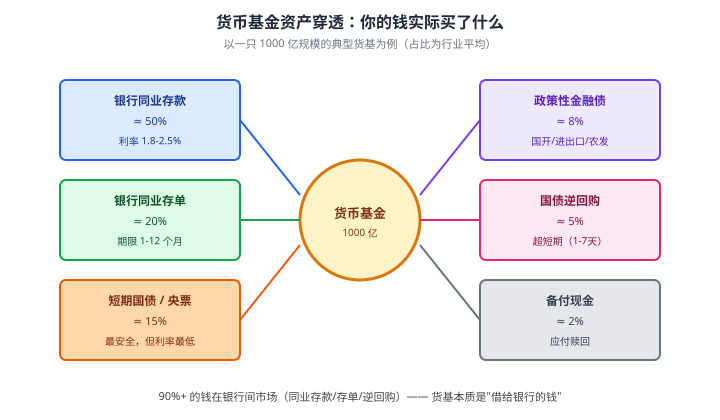
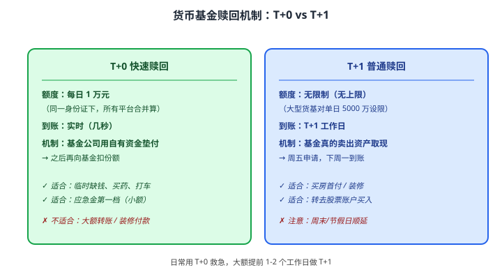

# 09 货币基金

> **这一章要让你搞懂的事**
> 1. **货币基金（Money Market Fund，MMF）**到底是什么——为什么余额宝比银行活期高 5-7 倍
> 2. 你的钱进余额宝之后，**实际买了什么**——资产穿透
> 3. **7 日年化** vs **万份收益**：哪个是真的、哪个是预测的
> 4. **T+0 限额 1 万 / T+1 大额赎回**——背后的"挤兑防火墙"逻辑
> 5. 货基会不会"破净"——历史上真的发生过
> 6. 主流货基怎么选，以及"规模越大越好"是不是对的
>
> **入门门槛**
> - 第 04 章：流动性、安全性的概念
> - 第 07 章：应急金的三阶梯定位
> - 第 08 章：银行存款 vs 非存款的区别
>
> **声明**：本教程不构成投资建议；所有产品、规模、利率均为教学示例，**货基收益每周变动，具体数字请查实时数据**。

---

## 0. 先讲个故事

2013 年 6 月，余额宝刚上线。两个刚毕业的年轻人——

- **小白**：工资 6,000 元到工行卡，**留活期**。"反正银行最稳。" 一年利息：6,000 × 0.35% = **21 元**。
- **小张**：每月把工资转入余额宝，**当时 7 日年化 6.5%**。一年下来按平均 6%：6,000 × 6% = **360 元**。

差距 **17 倍**，但金额都不大——只差 339 元。

然而真正的变化不在钱上。**小张第一次在 APP 上看到自己"每天都在赚钱"** ——哪怕只有 5 毛、1 块。

> 这种"每天看到钱在涨"的体验**重塑了一整代人的理财认知**。
>
> 之前的人：钱 = 存银行不动 = 慢慢被通胀吃掉
> 之后的人：钱 = 应该流动 + 能产生收益 = 至少跑赢活期
>
> 余额宝把"普通人接触金融"的门槛拉到了 **1 块钱**。它的意义远超它的收益率。

到了 2026 年，余额宝 7 日年化掉到 1.5% 左右，但**它依然是 1 亿+ 中国家庭应急金的主放置点**。这一章讲清楚：它是什么、为什么安全、还有没有更好选择。

---

## 1. 货币基金到底是什么

### 1.1 一句话定义

**货币基金 = 基金的一种，专门投资期限短、信用高、流动性强的"准现金"资产。**

注意"基金"两个字——这意味着：
- 你买的是**基金份额**（通常 1 份 = 1 元）
- 基金经理拿你的钱去**买各种短期资产**
- 你的收益 = 这些资产的利息收入 - 管理费

### 1.2 和银行存款的本质差别

这是初学者最容易混的：

| 维度 | 银行活期存款 | 货币基金（余额宝）|
|---|---|---|
| **法律关系** | 你借钱给银行 | 你买基金份额，基金代你投资 |
| **保护机制** | 存款保险 50 万 | **没有存款保险** |
| **本金风险** | 几乎零（保险内）| 极低，但理论可亏 |
| **收益来源** | 银行付你利息 | 基金投资的利息 - 管理费 |
| **持有什么** | 银行的债权 | 多种短期金融工具 |

> 📌 **关键认知**：余额宝**不是"放在银行里"**，是**放在基金公司里，基金公司再用这些钱去和银行做生意**。这个区别是后面所有问题的根源。

### 1.3 为什么货基比活期高这么多

简短答案：**因为银行内部利率市场是 "批发价"，个人活期是 "零售价"**。

举个比喻：
- 你 1 万元放工行活期 → 工行付你 0.3% 利息
- 工行**借给隔壁招行** → 招行付工行 1.8% 利息（**银行同业拆借**）
- 工行**从你拿 0.3%，转手以 1.8% 借给招行——利差 1.5% 是工行的利润**

货币基金做的事情：**绕过这个利差**——
- 把无数小钱聚成 1000 亿大钱
- **以"机构"身份**参与银行同业市场，享受 1.8% 的"批发价"
- 扣除少量管理费（年 0.2-0.3%）后，**1.5% 左右回给你**

> 💡 **本质**：货币基金是**散户的"团购"工具**——你以前个人享受不到的机构利率，现在通过基金"拼单"享受到了。这是金融市场"利率市场化"的产物。

---

## 2. 你的钱实际买了什么——资产穿透

打开任何一只货基的季报，会看到这样的资产配置：

**几个关键观察**：

| 资产 | 占比 | 风险评价 |
|---|---|---|
| 银行同业存款 + 同业存单 | ≈ 70% | 极低（大型银行的债权） |
| 短期国债 + 央票 + 金融债 | ≈ 23% | **几乎零风险**（国家信用） |
| 国债逆回购 + 现金 | ≈ 7% | 极低（国债抵押） |

**结论**：**70% 是借给银行的钱、23% 是借给国家的钱、7% 是高安全度短期工具**。这就是为什么货基"不算存款但比存款更安全的某些方面"——**因为它分散投资了银行**，单一银行出问题影响有限。

> 💡 **反直觉点**：表面上货基没有存款保险，但**实质安全性可能比把钱集中在一家中小银行还高**——因为它分散到了 N 家银行 + 国家信用债。

---

## 3. 7 日年化 vs 万份收益

打开余额宝，你会看到两个数字：
- **7 日年化收益率**：1.50%
- **万份收益**：0.4105

很多人不懂区别——它们关注的是**完全不同的事**。

### 3.1 万份收益（每日实际）

**定义**：每 1 万元基金昨天**实际赚了多少元**。

**公式**：

$$
\text{万份收益} = \frac{\text{基金当日利息净收入}}{\text{基金总份额}} \times 10000
$$

**翻译成人话**：你有 1 万元放余额宝，昨天它赚了多少分钱。万份收益 0.4105 = **赚了 4.105 毛**。

特点：
- ✓ **真实**——这是昨天**实际进账**的钱
- ✓ **每天更新**
- ✗ 单日噪音大——周末/假期、利率波动单日影响明显

### 3.2 7 日年化收益率（近期平均）

**定义**：过去 7 天的万份收益平均后**按年化算**的预测数字。

**公式**：

$$
\text{7 日年化} = \frac{\text{过去 7 天万份收益之和}}{7} \times \frac{365}{10000}
$$

实际上等于：（过去 7 天平均万份收益）× 365 / 10000

**翻译成人话**：**假设未来一年都按过去 7 天这个水平赚**，年化是多少。

特点：
- ✓ **平滑** —— 抹掉了单日波动
- ✓ **可比** —— 直接和其他理财产品的年化比
- ✗ **预测** —— 是"假设"，未来不一定保持

### 3.3 一个具体计算

万份收益 0.4105 → 7 日年化 ≈ 0.4105 × 365 / 10000 = **1.498%**

反过来：1.5% 年化 → 万份收益 ≈ 1.5% × 10000 / 365 = **0.411 元**

| 你的本金 | 万份收益 0.41 一天赚 | 7 日年化 1.5% 一年赚 |
|---:|---:|---:|
| 1 万 | 0.41 元 | 150 元 |
| 5 万 | 2.05 元 | 750 元 |
| 10 万 | 4.10 元 | 1,500 元 |
| 50 万 | 20.50 元 | 7,500 元 |

### 3.4 看哪个？

**短期决策**（今天该不该转钱）：看**万份收益**——它是真实的。
**长期决策**（要不要选这只货基）：看**7 日年化**——平滑后更稳定。
**比较产品**：用**7 日年化**——单位统一。

> ⚠️ **小坑**：节假日前万份收益可能"虚高"（节前买入逆回购，节后才结算利息一次性体现），不是该基金的常态。**新手最好看"近 1 个月"或"近 3 个月"的平均年化**，而不是单日数字。

---

## 4. 流动性：T+0 限额和 T+1 大额赎回

### 4.1 历史背景：为什么会有限额

| 时期 | 规则 | 背景 |
|---|---|---|
| 2013–2017 | T+0 不限额，**几乎和活期一样** | 余额宝快速崛起期 |
| 2018-6 | **T+0 单日 1 万限额** | 央行担心货基挤兑成系统性风险 |
| 2018 至今 | 单日 1 万 T+0 + 大额 T+1 普通赎回 | 平衡用户体验和系统稳定 |

> 📌 **逻辑**：货基持有的多是"几个月才到期"的资产，但允许 T+0 赎回 = **错配**。如果突然大量赎回（"挤兑"），基金被迫低价抛售资产 → 亏损。**1 万限额是给基金留缓冲时间**。

### 4.2 当前规则

### 4.3 实操技巧

**两个常被忽略的细节**：

**① 1 万限额是"按身份证合并"** —— 不是按 APP 算。
- 你余额宝（接入十几只货基）每天 1 万 T+0
- 微信零钱通每天 1 万 T+0
- 但**实际监管口径是 "同一身份证在所有平台合计 1 万"**
- 这条 2018 年规定中部分平台执行较松，但**未来可能收紧**——不要依赖"多平台叠加"

**② 大额赎回提前规划**
- 装修要付 20 万 → **提前 2 个工作日**做 T+1 赎回
- 买房首付 100 万 → **提前 3-5 个工作日**且确认基金平台单日上限
- 头部货基（余额宝、招行朝朝盈等）一般支持单笔 1 亿，**小货基可能单日 1000 万也吃力**

### 4.4 实际场景：周五急用钱

| 时间 | 余额宝可用方式 |
|---|---|
| 周五 09:00 申请 T+0（1 万） | 周五 09:01 到账 |
| 周五 09:00 申请 T+1（10 万） | **下周一**到账（中间隔了周六日）|
| 周五 16:00 后申请 T+1 | 下周二到账（错过当日截止时间） |

> 💡 **小提示**：每只货基有 **"截止时间"**——通常工作日 15:00 是当天确认份额的边界，超过即顺延一天。买入和卖出都是。

---

## 5. 安全性：货基会不会"破净"

### 5.1 摊余成本法：1 元的稳定来自哪

**核心机制**：货币基金使用**摊余成本法（Amortized Cost Method）**估值。

**对比两种估值方法**：

| 方法 | 怎么算 | 净值表现 |
|---|---|---|
| 市价法（普通基金）| 每天按市场价重新估值 | 上下波动 |
| **摊余成本法**（货基）| 持有到期收益 / 持有天数，**线性摊销** | **每天涨一点，几乎不跌** |

**翻译成人话**：你买了一张面额 100 元、半年后到期的债券，市场每天给它的报价可能 99.5 / 100.2 / 99.8 跳来跳去——**但摊余成本法只看"半年后我能拿到 100"，今天就当 99.17 元（按比例摊销）**。这样净值就稳定地往上走。

### 5.2 但这不是完全没风险

摊余成本法**回避了短期市场波动**，但不能回避：

**① 信用风险（持有的债违约）**：如果货基买的某只企业债违约 → 摊余成本崩盘 → 净值真的下跌。
- 2008 年美国 Reserve Primary Fund：持有雷曼商业票据，雷曼破产后净值跌到 0.97 美元——**"打破 1 美元"**（breaking the buck），引发整个货基行业挤兑
- 监管教训：之后中国对货基持仓限制更严（高评级、短期限）

**② 流动性风险（挤兑）**：大量赎回 → 被迫卖出资产 → 真实市值低于摊余成本 → 净值偏离过大触发"摆动定价"
- 中国规定：摊余成本与市价偏离超 0.5% 必须披露；超 0.25% 必须采取调整措施

**③ 极端利率冲击**：利率短期暴涨（如 2013 年 6 月"钱荒"）→ 持有的债券市价大跌 → 偏离扩大

### 5.3 中国货基的"破净"历史

**好消息**：**中国货基从未真正破净**（净值跌破 1 元）。

**坏消息**：2018 年和 2022 年都出现过"负偏离"扩大、监管干预的情况——只是没让储户感知到。

**机制**：
1. 偏离扩大时，**基金公司用自有资金"输血"**（暗中"刚兑"）
2. 大型货基（如余额宝）背后是**蚂蚁集团 + 天弘基金**双层兜底
3. 监管限制规模、限制集中度，**降低系统重要性**

> 💡 **现实评价**：中国货基的"刚性兑付"实质上还在——但**法律上不承诺**。监管的方向是逐步打破刚兑，让用户认知"货基也是有风险的"。**最坏情况：净值跌 1-3%，不是腰斩。**

### 5.4 一图看清"安全性梯度"

| 工具 | 法律保障 | 实质安全 | 综合评价 |
|---|---|---|---|
| 国债 | 国家信用 | 最高 | 100 分 |
| 国有大行存款 | 存款保险 | 极高 | 99 分 |
| **大型货币基金** | **无存款保险** | **极高（分散+监管）**| **98 分** |
| 中小银行存款（50万内）| 存款保险 | 极高 | 98 分 |
| 短期纯债基金 | 无 | 高（有波动）| 92 分 |
| 银行理财（R1-R2）| 无 | 较高 | 88 分 |

**结论**：货基的实质安全性**不输 50 万红线内的银行存款**——但它的"安全"是来自**分散持仓 + 监管 + 基金公司兜底**，而不是法律保障。

---

## 6. 货基怎么选

### 6.1 三个核心指标

| 指标 | 看什么 | 推荐范围 |
|---|---|---|
| **7 日年化** | 近 1-3 个月稳定性 | 比同类平均不低，不要追"突然飙高"的 |
| **规模** | 总份额（季报披露）| **100 亿 - 5000 亿** 之间最稳妥 |
| **基金公司** | 综合实力 | 大型公司 + 头部货基 |

### 6.2 为什么不是"规模越大越好"

**反直觉点**：
- **太小**（< 50 亿）：单笔大额赎回就能冲击净值，机构持有人可能"砸盘"
- **太大**（> 1 万亿）：被监管视为系统重要性，规模管控严，**收益反而偏低**
- **甜蜜点**：500 亿 - 3000 亿，规模够大但不太大

**实例**：余额宝（接入十几只货基）单只规模管控在 2000-3000 亿左右——**这是监管和效率的平衡**。

### 6.3 主流货基入口对比

| 入口 | 接入货基 | 7 日年化（2026 区间）| 特点 |
|---|---|---|---|
| **余额宝**（支付宝）| 接入十几只货基 | 1.4-1.6% | 体验最好、消费场景最多 |
| **微信零钱通**（财付通）| 多只 | 1.4-1.6% | 微信支付直连，方便发红包 |
| **银行 APP 的"T+0 理财"** | 自家货基 | 1.6-1.8% | 略高，但部分非货基（要看清）|
| **天天基金 / 蛋卷基金** | 全市场货基 | 1.5-1.8% | 选择多，但操作略复杂 |
| **券商账户场内货基**（如华宝添益 511990）| 单只 ETF 形态 | 1.4-1.6% | 可作股票账户的"现金管理"，秒级买卖 |

### 6.4 选不出来怎么办

**最简单方案**：
1. 应急金第一档 1 万：**余额宝 + 微信零钱通各放一半**——保证两个 T+0 通道
2. 应急金第二档主力 3-5 万：**银行 APP 内的 T+0 货基理财** 或 **券商货基**
3. 多余的零钱：**选规模 500-3000 亿、近 1 年年化前 30% 的任一只货基**

不要纠结 "余额宝 1.50% 和招行朝朝宝 1.55%" 谁更好——**差 0.05% 在 1 万本金上一年只差 5 元**。**别把时间花在这种优化上**。

---

## 7. 进阶讨论

**入门读者可以跳过本节**。

### 7.1 余额宝大事记

| 年份 | 事件 | 7 日年化 |
|---|---|---|
| 2013-6 | 余额宝上线，对接天弘增利宝 | 4.5% |
| 2013-6 | "钱荒"事件，银行同业利率飙升 | **6.5%** |
| 2014-1 | 规模突破 2500 亿 | 6% |
| 2016 | 规模过万亿，成为全球最大货基 | 2.5% |
| 2018-2 | 限购、限额、接入多家货基 | 4% |
| 2018-6 | T+0 单日 1 万限制 | 4% |
| 2024 | 利率下行通道 | 1.5-1.8% |
| 2026 | 全行业利率低位 | 1.4-1.6% |

> 💡 余额宝的兴衰**完美映射中国利率市场化进程**——从"野蛮高息"到"市场化常态"。

### 7.2 货基的"反季节性"

货基年化在某些时间窗口会"季节性升高"：
- **季度末**（3/6/9/12 月末）：银行需要满足存贷比考核 → 银行间资金紧 → 同业利率上升 → 货基收益上升
- **春节前**：现金需求高峰 → 同样推高利率
- **半年末**（6 月末）：MPA 考核 + 半年结算 → 利率小幅冲高

| 平时年化 | 季末年化 |
|---|---|
| 1.5% | 1.8-2.2% |
| 1.4% | 1.7-2.0% |

**可利用的小技巧**：
- 大额理财购买**避开季末 1-3 天**（货基收益高的时候去定期不划算）
- 货基资金**短期保留到季末**（多享受几天高收益）

但**对小钱意义不大**——10 万元 × 0.5% × 5 天 = 70 元。**别让"优化"占用太多注意力**。

### 7.3 货基 vs 美国 MMF（Money Market Fund）

| 维度 | 中国货基 | 美国 MMF |
|---|---|---|
| 监管 | 证监会 + 银保监 | SEC（证券交易委员会）|
| 估值 | 摊余成本法 | 浮动净值（机构类）/ 固定 1 美元（零售）|
| 破净案例 | 无（实质） | 2008 年雷曼事件后多次 |
| 规模 | 11 万亿 RMB（2024）| 6 万亿 USD（2024）|

**美国 MMF 在 2008 后实行严格分级**：
- Retail MMF（散户）：可继续 $1 固定净值
- Institutional MMF（机构）：必须浮动净值，每天涨跌

中国未来可能跟随这个方向——**已经有 "浮动净值型货币基金（市值法）"** 试点，但规模很小。

### 7.4 货基与 "T+0 理财"、"现金管理类理财" 的边界

2018 年资管新规后，银行原有"开放式理财"被规范——**很多产品改名为"现金管理类理财"**。

**关键区别**：

| 维度 | 货币基金 | 现金管理类理财 |
|---|---|---|
| 监管主体 | 证监会 | 银保监会 |
| 投资范围 | 严格限制（短债 +存款 + 国债）| 相对宽松（可买更长债）|
| 估值 | 摊余成本法 | 大部分摊余成本法 |
| 流动性 | T+0 限 1 万 | 看产品（多数 T+0/T+1）|
| 收益 | 较低 | 通常**高 20-40 bp** |

**结论**：银行 APP 内的"T+0 理财"如果是"现金管理类理财"，**收益略高、安全度相近、规则相似**——是货基的好替代品。**但产品名要看清，别买成"非现金管理类理财"**（那些是有波动的）。

### 7.5 货基会被取代吗

可能的未来：
- **数字人民币**普及后，央行直接支付场景增加 → 部分小额货基需求被替代
- **货基的"高于活期"溢价**继续压缩——预计 2030 年前后年化可能稳定在 1-1.3%
- 更**便利的银行存款产品**（现金管理理财）会蚕食货基的份额

**但完全替代不太可能**——货基的灵活性 + 监管定位让它在中国金融体系里有不可替代位置。

---

## 8. 小结

1. **货币基金是"基金的一种"**——你买的是份额，不是存款。**没有存款保险**。
2. **70% 钱在借给银行（同业），23% 借给国家（国债）**——本质是散户的"团购利率"工具。
3. **看万份收益判断"今天赚多少"**，看 7 日年化判断"长期水平"——后者是预测，前者是真实。
4. **T+0 每日 1 万** 应对小额急用，**T+1 大额赎回**应对装修/首付。**1 万限额按身份证合并算**。
5. **摊余成本法让净值稳定**，但**不是不亏损的承诺**——美国 2008 年雷曼事件就让 Reserve Primary Fund 破净。
6. **中国货基从未真破净**——靠监管 + 基金公司兜底，但**法律上不承诺刚兑**。
7. **选货基**：规模 500-3000 亿、大基金公司、稳定年化即可。**不要追"突然高收益"**。
8. **货基的核心定位**：应急金第二档主力 + 工资中转站 + 投资账户的"现金管理"。**不是长期投资工具**。

> 🔗 **承上启下**：货基 1.5% 年化，但有没有"零风险、几乎和货基一样灵活、但有时年化能到 3-5%"的工具？有 —— **国债逆回购**。下一章 **10 国债逆回购** 讲清楚这个上班族的"小确幸"工具：什么时候年化飙到 10%、节假日效应、券商账户怎么操作。

---

## 自测题

> 答案在文末折叠区。先自己算，再对照。

1. 余额宝和工行活期存款相比，本质区别在哪？为什么余额宝收益能高 5-7 倍？
2. 万份收益 0.4 元 对应 7 日年化是多少？反过来，1.8% 年化对应万份收益是多少？
3. 货币基金 70% 的钱投在银行同业存款/存单——这意味着如果某家中型银行倒闭，货基会不会大幅亏损？为什么？
4. 你周五下午 16:30 在余额宝申请赎回 10 万元（T+1）。这笔钱什么时候到账？
5. 中国货基为什么"从未真正破净"，但美国 MMF 在 2008 年破过？说出 2 个差别。
6. **进阶题**：你有 5 万元应急金，现在余额宝 7 日年化 1.5%，某 P2P 平台宣传"活期理财 5%"。从风险/流动性/合规三个角度，为什么不该把应急金挪到 P2P？
7. **作业题**：打开你的余额宝（或微信零钱通），找到当前持有的货基的"基金季报"（基金详情页可下载）。穿透到具体持仓，**记录前 5 大资产**。看看是否符合本章描述的"70% 同业 + 23% 国债"结构。

📖 参考答案（点击展开）

1. **本质区别**：活期是你借钱给银行（直接债权）；余额宝是你买基金份额，基金代你投资（间接持有）。
   **高 5-7 倍原因**：余额宝通过"团购"享受银行间同业利率（1.8-2.5%），而个人活期是"零售价"（0.3%）。中间的"利差"以前是银行利润，现在通过货基机制还给了散户。

2. 0.4 × 365 / 10000 = **1.46% 年化**；1.8% × 10000 / 365 = **0.493 元 万份收益**。**速算公式**：年化（%）× 10000 / 365 ≈ 万份收益元；万份收益 × 365 ≈ 年化（基点）。

3. **不会大幅亏损**——因为货基的持仓是**分散在十几到几十家银行**，单一银行倒闭最多影响 2-5% 的资产。即使按 8% 清算受偿率算，整只基金净值最多偏离 -1% 到 -2%。加上基金公司兜底机制，**实际感知亏损接近 0**。这就是分散持仓的力量。

4. **下周二**到账。原因：① 周五 16:30 超过 15:00 截止 → 顺延到周一确认 → 周二到账。② 即使在 15:00 前申请，T+1 也是"工作日后一日"，周五 T+1 = 下周一到账。**实操经验**：大额赎回**最好周一-周三 14:00 前操作**，避免周末/节假日叠加。

5. **差别 1（监管）**：中国监管对货基持仓限制更严（高评级、短期限），2008 年那种持有低评级商业票据在中国不被允许。**差别 2（兜底）**：中国基金公司 + 监管事实上的"刚性兑付"——偏离扩大时基金公司用自有资金输血。**差别 3（市场结构）**：中国货基 70% 是银行同业，美国 MMF 大量持有商业票据（企业短债）——前者基础信用更稳。

6. **风险**：5% 年化对应的资产**不可能是"零风险流动性资产"**——金融基本规律决定，超过国债利率 1.5 倍的"流动性产品"几乎必然有隐藏风险（信用、流动性、合规）。**流动性**："活期" 5% 的产品多数有提取限制或排队赎回，真急用拿不出。**合规**：2018 年后 P2P 网贷已被全面清退，"宣传 5% 活期理财"的平台几乎全部是违规甚至诈骗。**应急金的命题是流动性 + 安全，不是收益**——见第 07 章。

7. 没有标准答案。**重点观察**：
   - 同业存款 + 存单占比是否在 50-75% 之间
   - 是否有"长期债券"（>397 天）—— 没有则符合货基定义
   - 单一持仓集中度（前 5 大）—— 应该比较分散
   - 如果你发现某只货基重仓 30% 在某只资产 → 风险偏高
   - 与"中证货币基金指数"成分对比

---

## 延伸阅读

- 《公开募集证券投资基金运作管理办法》—— 中国证监会，关于货基持仓规则的法规
- 《货币市场基金监督管理办法》（2015）—— 货基专项监管文件
- 中国证券投资基金业协会：[基金季报数据库](https://www.amac.org.cn/)—— 查任意货基的真实持仓
- 《大而不倒》(*Too Big to Fail*) —— Andrew Sorkin：第 24-25 章讲 Reserve Primary Fund 破净引发的系统性危机
- 央行：[中国货币市场报告](http://www.pbc.gov.cn/) —— 每季度发布，跟踪货基行业整体数据

---

## 下一章预告

**10 国债逆回购** —— 上班族的小确幸：
- 逆回购是什么？为什么和"国债"挂钩
- 节假日前年化为什么会飙到 5-15%
- GC001（沪市）vs R-001（深市）有什么区别
- 在券商账户怎么操作（10 万起，但 1000 元也能玩）
- 一年下来到底能多赚多少
- 对比货基：什么时候该用逆回购、什么时候用货基
