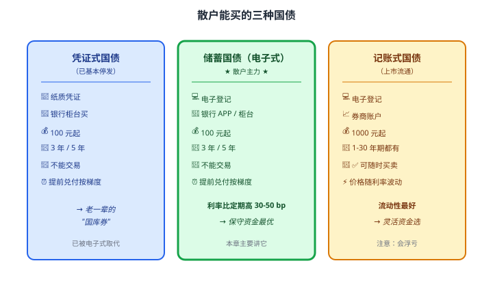
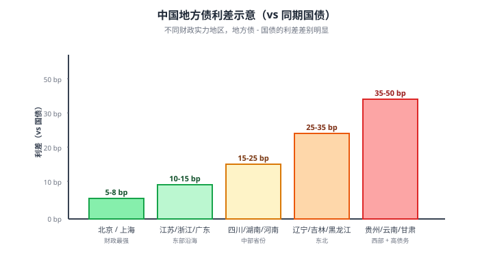

# 12 国债与地方债

> **这一章要让你搞懂的事**
> 1. **国债**为什么是"最安全的资产"——以及散户能买的三种国债到底有什么区别
> 2. **储蓄国债**比同期定期存款多 30-50 bp——但为什么柜员永远不主动跟你说
> 3. 每月 **10 日 8:30** 抢国债的"秒杀"——以及没抢到的备选方案
> 4. **提前兑付的"梯度利率"**：储蓄国债"不能提前取"是错的，但取早了真的亏
> 5. **地方政府债**：江苏的债和贵州的债凭什么差 30 bp
> 6. **国债期货**是什么——为什么散户最好别碰
>
> **入门门槛**
> - 第 08 章：存款保险、定期存款利率
> - 第 11 章：YTM、久期、信用评级
>
> **声明**：本教程不构成投资建议；所有利率、产品均为教学示例，**国债发行时间和利率每期变动，以财政部公告为准**。

---

## 0. 先讲个故事

**老王，58 岁，做了 30 年小学语文老师**。理财就两件事：

1. **每月 10 日早上 8 点 25 分**——准时坐到电脑前
2. **8:30 整**——打开工行手机银行，点"储蓄国债"，秒下单 5 万元

他这么做了 5 年。

5 年下来，老王买的储蓄国债**平均年化 3.4%**——同期国有大行 3 年定期 **2.1%**。

50 万本金 × (3.4% - 2.1%) × 5 年 = **多赚 3.25 万元**

老王的"秘籍"被儿子知道后吓一跳：

> "爸，这事这么好你怎么不早说？"
> "我跟柜员问了好几次，柜员每次都说'国债不好买/卖完了/还不如理财'。我自己摸出来了：**每月 10 号 8:30 准时抢**。"
> "为什么柜员不愿意卖给你？"
> "因为**国债没多少手续费**，柜员卖银行理财才有奖金。"

这章告诉你：
1. **国债是市面最安全、最被低估的散户工具**——比理财、定存都更适合保守资金
2. 但**银行没有动力推销**——你必须自己知道怎么买
3. **学会"国债思维"，你的固收基本盘就稳了**

---

## 1. 国债到底是什么

### 1.1 一句话定义

**国债 = 国家发行的债券**。借款人是中央政府（财政部），还款来源是国家税收。

**信用等级**：**主权信用**——理论上不会违约（除非国家破产，那时候你担心的也不是这笔钱了）。

**对照**：第 11 章我们讲过债券有"票面利率、面值、到期日"三要素——国债完全适用。**关键不同是发行人是国家，所以最安全**。

### 1.2 散户能接触的三种国债

中国国债按"卖给谁、怎么卖"分三类，散户都能买，但**适合的场景完全不同**：

**一句话区分**：
- **凭证式**：纸质，已基本退出
- **储蓄国债（电子式）**：**散户主力**，比定期高一点，**锁 3-5 年**
- **记账式**：**可交易**，但**价格会波动**

---

## 2. 储蓄国债：定期存款的"升级版"

这是 90% 散户应该首选的国债类型。

### 2.1 长什么样

| 项目 | 储蓄国债（电子式）|
|---|---|
| 发行人 | 中华人民共和国财政部 |
| 期限 | **3 年 / 5 年**两种 |
| 计息方式 | **每年付息一次**（到账你的银行卡）|
| 起点金额 | **100 元**，整数倍 |
| 购买额度 | 单期通常不超过 300 万 |
| 提前兑付 | 可以，按"梯度利率" |
| 流通 | **不能转让**（不能卖给别人）|

### 2.2 利率：比定期高多少

**2024-2025 年部分期次实例**（教学示例）：

| 期次 | 期限 | 利率 | 同期国有大行定期利率 | 差额 |
|---|---|---|---|---|
| 2024-1 | 3 年 | 2.38% | 1.95% | **+43 bp** |
| 2024-1 | 5 年 | 2.50% | 2.00% | **+50 bp** |
| 2024-9 | 3 年 | 1.95% | 1.55% | **+40 bp** |
| 2024-9 | 5 年 | 2.10% | 1.70% | **+40 bp** |

**翻译成人话**：储蓄国债**几乎永远比同期定期高 30-50 bp**——这是国家**对储户的"小红包"**。

**为什么国债能给得起更高利率**：
- 银行卖定期需要付出渠道、理财人员、网点等成本，所以利率压低
- 国债**省去了银行中介**，直接是国家对储户——**省下的成本反哺利率**

### 2.3 信用与安全性

| 维度 | 国债 | 同期定期 |
|---|---|---|
| 信用主体 | **国家**（财政部） | 商业银行 |
| 法律保障 | 主权信用 | 存款保险 50 万 |
| 单次额度 | **无 50 万限制** | 50 万红线 |
| 银行倒闭影响 | 无（在国家系统）| 50 万以外可能损失 |

> 💡 **超过 50 万的保守资金，国债比存款更安全**——因为它**没有 50 万红线**。一笔 200 万要存 3 年，分散存 5 家银行 vs **直接买 200 万储蓄国债**，后者更省事且更安全。

### 2.4 为什么柜员不主动推荐

**银行的动力机制**：

| 产品 | 银行收益（中间业务 + 利差）|
|---|---|
| 定期存款 100 万 × 5 年 | 银行靠"存款利差"赚约 2-3% × 5 年 = **10-15 万** |
| 银行理财 100 万 × 1 年 | 销售费率 0.5-1% = **5,000-10,000 元**（一年一次性）|
| 储蓄国债 100 万 | 财政部给银行的代销费 ≈ 0.1% = **1,000 元** |

**柜员的考核**：储蓄国债**几乎没奖金**，理财/存款有大额业绩。**所以柜员的"利益激励"和你"买国债"是相反的**。

> 📌 **现实**：你走进银行问"我想买国债"——柜员会礼貌但敷衍地说"卖完了""下次再来""不如来看看这款理财"。**你必须自己知道发行时间，自己下单**。

### 2.5 怎么抢：每月 10 日 8:30

**发行节律**：财政部每月发行一次，但**3 年期和 5 年期不是每月都有**——常规是 3-11 月（**12 月-2 月停发**），具体看公告。

**两个渠道**：

| 渠道 | 开始时间 | 优势 |
|---|---|---|
| **银行手机 APP / 网银** | **每月 10 日 8:30** | **首选** —— 不用排队 |
| **银行柜台** | 9:00 | 适合不会用 APP 的老人 |

**实操要点**：
1. **提前 1 天**：登录工行/建行 APP，确认"储蓄国债" 入口可用
2. **当天 8:25**：打开 APP 停在购买页面
3. **8:30 整**：刷新 → 输入金额 → 提交
4. **如果显示"已售罄"**：今天没抢到，**等下个月 10 日再来**

**抢不到时间**：热门期次（3 月、9 月）通常**1-5 分钟卖光**；冷门期次（11 月）可能**当天都还有**。

> 💡 **多账户备份**：在工行+建行+招行都开账户，**同时打开 3 个 APP**，哪家有抢哪家。配偶/父母名下账户也可以分开抢，**夫妻俩 100 元起 × 2 = 200 元起**（但**不能合并算购买额度**）。

### 2.6 提前兑付：梯度利率

很多人以为储蓄国债"只能持有到期"——**错**。**可以提前兑付，但要扣利息**。

**梯度规则**（以 5 年期为例）：

| 持有时间 | 扣息天数 | 实际拿到利息 |
|---|---|---|
| < 6 个月 | **不计息** | 0（罚没全部）|
| 6 个月 - 24 个月 | **扣 180 天利息** | 持有期票息 - 半年利息 |
| 24 个月 - 36 个月 | **扣 90 天利息** | 持有期票息 - 3 个月利息 |
| 36 个月 - 60 个月 | **扣 60 天利息** | 持有期票息 - 2 个月利息 |
| ≥ 60 个月 | 不扣息 | 全额收益 |

**例**：你买 10 万元 5 年期国债（票息 2.5%），**持有 28 个月后**急用钱提前兑付。

- 持有期票息 = 100,000 × 2.5% × 28/12 = **5,833 元**
- 扣 90 天利息 = 100,000 × 2.5% × 90/365 = **616 元**
- **实际拿到** = 5,833 - 616 = **5,217 元** + 本金 100,000

**等效年化** = 5,217 / 100,000 / (28/12) = **2.24%**

**比同期定期 1.95% 还高**——所以**即便提前兑付，储蓄国债依然有竞争力**。

> 💡 **关键认知**：储蓄国债"提前兑付惩罚"比**定期存款"提前支取按活期算"温和得多**。定期 5% 利率提前取 → 按 0.3% 算 → 损失 95% 的利息。**国债是损失 10-20% 的利息**。

---

## 3. 记账式国债：上市流通的"成熟版"

### 3.1 是什么

**记账式国债 = 在交易所和银行间市场流通的国债**。机构主导，但散户也能参与。

**特点**：
- 期限丰富：**1 年 / 3 年 / 5 年 / 7 年 / 10 年 / 30 年 / 50 年**
- 可在**券商账户**像股票一样买卖
- **价格每天波动**（受市场利率影响）
- 单笔 1000 元起

### 3.2 怎么买

| 步骤 | 操作 |
|---|---|
| 1 | 开通券商账户（任意一家）|
| 2 | 在交易软件输入国债代码（如 019635 = 23 国债 17）|
| 3 | 像买股票一样输入"买入价 + 数量" |
| 4 | 成交后持有 → 每年收票息、到期收本金 |

**例**：23 国债 17（10 年期国债）
- 票面利率 2.62%
- 面值 100 元
- 当前市场价 102 元 → YTM 约 2.4%
- 你买 10 张 = 1020 元 → 每年收 26.2 元利息

### 3.3 价格波动

第 11 章讲过：**市场利率涨 → 价格跌**。

| 场景 | 记账式国债（10 年）|
|---|---|
| 利率涨 0.5% | 价格跌 ≈ **-4.3%** |
| 利率跌 0.5% | 价格涨 ≈ **+4.3%** |
| 持有到期 | 一定按 100 元还本，无论中间多波动 |

### 3.4 记账式 vs 储蓄国债：怎么选

| 需求 | 推荐 |
|---|---|
| 锁定 3-5 年的保守资金 | **储蓄国债** |
| 需要灵活进出的资金 | 记账式 |
| 想博利率下行的收益 | 记账式（长期）|
| 只想"安全 + 比定期高一点" | **储蓄国债** |
| 在券商账户已有钱 | 记账式（顺手）|

**结论**：**90% 散户买储蓄国债**就够了。记账式适合**已经懂利率走势 + 有灵活资金需求**的人。

---

## 4. 地方政府债

### 4.1 是什么

**地方债 = 省 / 直辖市 / 计划单列市政府发行的债**。

历史上中国地方政府长期靠**地方融资平台（城投公司）**举债，2015 年后逐步规范，**地方政府债**成为合法主要工具。

**类型**：

| 类型 | 资金用途 |
|---|---|
| **一般债** | 公益项目、城市建设（财政统筹偿还） |
| **专项债** | 有现金流的项目（地铁、水务，靠项目自身还）|
| **再融资债** | 借新还旧（"借的债还旧债")|

### 4.2 信用：准国家级

法律上：**地方政府是独立信用主体**，理论上可以违约。
现实中：**财政部隐性背书**——历史上**从未有过省级地方债违约**。

> 💡 这就是"**中央兜底地方**"的中国特色信用体系。**和国债的实质信用差距不大**，但市场给的利率却高 20-50 bp。

### 4.3 凭什么比国债高这点利息

**两个原因**：

**① 流动性溢价**：成交量小、买卖盘薄 → 卖家想脱手得让步几个 bp
**② 区域风险溢价**：投资者对**财政弱省份**要求更高补偿

**翻译成人话**：贵州的地方债比江苏的多给 25-40 bp——**市场认为贵州财政更弱、风险更高**。但**两者都没违约过**——这部分溢价对你来说就是"白赚"。

### 4.4 散户怎么买地方债

**渠道**：**券商账户**（交易所市场）。代码以 14/15 开头（如 158123）。

**起点**：1000 元。

**实际操作的难处**：
- **流动性极差**：很多地方债**日成交量为 0**——你想卖卖不出去
- **买入靠运气**：上市后多数被机构买走，散户能买的有限

> ⚠️ **结论**：地方债**不适合散户直接买**。如果想配置，**通过债券基金（持有大量地方债）间接持有**更现实。

---

## 5. 国债期货（散户最好别碰）

### 5.1 是什么

**国债期货 = 以国债为标的的期货合约**。

中国 2013 年重启国债期货（**5 年期 TF**），后来加入 **2 年期 TS、10 年期 T、30 年期 TL**。

**作用**：
- **机构**：对冲利率风险（保险公司、基金公司用得最多）
- **投机**：博利率走势

### 5.2 散户为什么不该碰

| 风险点 | 说明 |
|---|---|
| **杠杆** | 保证金约 2-3%，**杠杆 30-50 倍** |
| **强平** | 行情快速变动可能爆仓 |
| **门槛** | 验资 50 万 + 知识测试 + 5 天模拟 |
| **复杂** | "最廉券（CTD）"机制、基差交易、空头逻辑 |

**举例**：10 年国债期货 T 合约面值 100 万。保证金 3% = 3 万。**利率波动 0.1% → 价格波动约 1% = 1 万元损益 → 占保证金 33%**。

**散户做国债期货 ≈ 拿 3 万去赌利率走势**。亏起来不是"亏几个 bp"，是"亏 30-50%"。

### 5.3 这章只是提一下存在性

国债期货放在**第 26 章衍生品**详讲。**现在你只需要知道：它存在、机构在用、散户慎入**。

---

## 6. 散户买国债的完整路径

### 6.1 五种渠道对比

| 渠道 | 起点 | 流动性 | 收益 | 适合 |
|---|---|---|---|---|
| **储蓄国债**（银行 APP）| 100 元 | 提前梯度 | 比定期 +30-50 bp | **90% 保守资金** |
| **记账式国债**（券商）| 1000 元 | 可交易 | YTM 随市场 | 灵活 + 懂利率的 |
| **地方债**（券商）| 1000 元 | **极差** | YTM + 利差 | 不推荐散户直接买 |
| **国债 ETF**（券商）| 100 元 | T+0 交易 | 跟踪国债指数 | **替代**直接买，**流动性好** |
| **纯债基金**（基金平台）| 1 元 | T+1 赎回 | 经理管理 | **新手最优选** |

### 6.2 推荐策略

**保守型 100 万配置示例**（教学场景）：

| 工具 | 金额 | 期限 |
|---|---|---|
| 储蓄国债 5 年期 | 40 万 | 5 年锁定 |
| 储蓄国债 3 年期 | 30 万 | 3 年锁定 |
| 国债 ETF（场内）| 20 万 | 灵活 |
| 货基/T+0 理财 | 10 万 | 应急 |

- **综合年化** ≈ 2.5%
- **流动性**：10 万 + 20 万 = 30 万随时可动
- **本金安全**：储蓄国债保本，国债 ETF 有少量波动（久期约 5）

---

## 7. 进阶讨论

**入门读者可以跳过本节**。

### 7.1 国债的"准货币"地位

国债之于金融市场，相当于**"流动性的基准"**：
- **央行操作**：央行通过买卖国债调节市场流动性（公开市场操作 OMO）
- **质押融资**：国债可以质押融资（你做逆回购的对手方就在用国债质押）
- **机构资产**：银行 / 保险 / 基金的"安全资产"基本都是国债
- **国际储备**：美国国债是全球外汇储备的核心；中国国债逐步国际化

### 7.2 国债收益率 = 无风险利率

**金融学经典定义**：**无风险利率（Risk-Free Rate）≈ 同期国债 YTM**

- 1 年国债 YTM = 1 年无风险利率
- 10 年国债 YTM = 10 年无风险利率

**应用**：
- 股票估值（DCF 模型）的折现率 = 无风险利率 + 风险溢价
- 任何投资的"机会成本" = 持有同期国债的收益
- 任何高于无风险利率的资产 → 必然有某种"风险"或"流动性"代价

### 7.3 中美国债收益率对比（2025-2026 区间）

| 期限 | 中国国债 | 美国国债 | 利差 |
|---|---|---|---|
| 1 年 | 1.5% | 4.5% | -300 bp |
| 5 年 | 1.9% | 4.3% | -240 bp |
| 10 年 | 2.3% | 4.5% | -220 bp |
| 30 年 | 2.7% | 4.7% | -200 bp |

**中美利差倒挂**已经持续 2 年——这是**人民币国际化、资本流动**的核心议题。**对个人投资者影响**：QDII 美债产品收益看着诱人，但要承担汇率风险（详见第 30 章）。

### 7.4 特别国债：财政部的"特殊工具"

历史上中国发行过几次**特别国债**（不计入赤字、有特定用途）：

| 时间 | 规模 | 用途 |
|---|---|---|
| 1998 | 2700 亿 | 补充四大国有银行资本 |
| 2007 | 1.55 万亿 | 成立中投公司（外汇投资）|
| 2020 | 1 万亿 | 抗疫特别国债 |
| 2023 | 1 万亿 | 灾后重建 |
| 2024 | 1 万亿 | 超长期特别国债 |

**对散户的意义**：
- 抗疫特别国债（2020）**部分零售**，**普通人也能买**
- 超长期特别国债（2024 起，**30 年期、50 年期**）也面向个人——但**期限太长，散户慎重**

### 7.5 国债的国际化

**2017 年**：中国国债被纳入彭博巴克莱全球综合指数
**2019 年**：纳入摩根大通新兴市场政府债指数
**2020 年**：纳入富时世界国债指数

**境外投资者持有中国国债的比例**：从 2017 年的 4% 增长到 2024 年的 11%（持有规模约 2 万亿元）。

**意义**：
- 中国国债定价**逐步与全球接轨**
- 国债收益率波动**不再只看国内**——美联储动作直接影响
- 个人投资者要理解：**中国债市不再是"自闭"市场**

---

## 8. 小结

1. **国债 = 最安全的资产**——主权信用，**没有 50 万限制**。超过 50 万的保守资金，国债比存款更优。
2. **三种国债**：凭证式（已退）/ 储蓄国债（散户主力）/ 记账式（可交易）。**90% 散户买储蓄国债就够了**。
3. **储蓄国债比定期高 30-50 bp** —— 国家给储户的"小红包"。但**柜员没动机推荐**——你得自己抢。
4. **每月 10 日 8:30** 银行 APP 开抢。热门期次 1-5 分钟卖光。**多账户备份+提前进入页面**。
5. **提前兑付按梯度** —— 比定期"按活期算"温和得多。**即使提前取，年化通常还高于同期定期**。
6. **记账式国债** 适合**懂利率波动**的人。**散户优选国债 ETF** 替代直接买记账式。
7. **地方债**：信用准国家级，利差 20-50 bp。**流动性极差，散户直接买不现实**，通过债基持有。
8. **国债期货**：散户慎入——杠杆 30-50 倍，门槛 50 万，详见第 26 章。

> 🔗 **承上启下**：国债 / 地方债 = **零信用风险的世界**。**下一章 13 企业债与城投债** 进入**有信用风险的世界**——为什么 AAA 公司债也能违约？信用利差是怎么定价的？永煤事件给散户的教训是什么？

---

## 自测题

> 答案在文末折叠区。先自己算，再对照。

1. 储蓄国债和记账式国债的最大区别是什么？哪个适合"5 年不动的钱"，哪个适合"可能随时要用的钱"？
2. 同一笔 80 万的保守资金，存 5 年定期 vs 买 5 年储蓄国债——分别说出 3 个差别（利率、信用、灵活性等维度）。
3. 你抢国债没抢到。柜员说"我们有个一年期理财年化 3.2%，比国债还高"。你应该买吗？说出 2 个判断角度。
4. 你买 5 万元 5 年期储蓄国债，票息 2.5%。**持有 18 个月**急用钱提前兑付。
   - 持有期票息是多少？
   - 提前兑付要扣多少利息？
   - 实际拿回多少？年化是多少？
5. 同样 5 年期，江苏地方债 YTM 2.45%，贵州地方债 YTM 2.75%。**为什么有 30 bp 差距**？这 30 bp 你应该追吗？
6. 国债期货保证金 3%，相当于多少倍杠杆？为什么散户慎入？
7. **进阶题**：你 60 岁，刚退休拿了 200 万养老金。打算"30% 灵活流动 + 70% 锁定 3-5 年"，最大化安全 + 收益。请设计配置方案。
8. **作业题**：打开你常用的银行 APP（工行/建行/招行），找到"储蓄国债" 入口。**截屏记录**：① 入口在哪 ② 是否需要提前签约 ③ 下一期发行时间。**做完这一步，你下个月 10 日就有机会抢到**。

📖 参考答案（点击展开）

1. **最大区别**：储蓄国债**不能转让**，记账式国债**可在券商账户随时买卖**。
   - **5 年不动的钱**：储蓄国债（锁定期 + 比定期高 + 提前梯度温和）
   - **可能随时要用**：记账式国债 或 国债 ETF（流动性好，但**接受价格波动**）

2. ① **利率**：储蓄国债比定期高 30-50 bp。② **信用**：储蓄国债 = 国家信用（无 50 万限），定期 = 银行信用（受存款保险 50 万限）。③ **灵活性**：定期提前取按活期（损失 90%+ 利息），储蓄国债按梯度（损失 10-20% 利息）。④ **额度限制**：储蓄国债无 50 万限，定期超 50 万要分散银行。

3. 应该警惕，**至少问 2 个问题**：
   - **这是存款还是理财**？理财不受存款保险保护、净值化后可能亏（第 15 章）
   - **业绩比较基准 3.2% 和"保证收益"是两件事** —— 理财可能只拿到 2.5% 甚至更低
   - **柜员的奖金从哪来** —— 理财奖金多，他自然推
   **结论**：3.2% 听起来比国债 2.5% 高，但**承担了"可能亏本金"的风险**。**保守资金还是国债更适合**——下个月继续抢。

4.
   - 持有期票息 = 50,000 × 2.5% × 18/12 = **1,875 元**
   - 18 个月在 6-24 个月区间，扣 180 天利息 = 50,000 × 2.5% × 180/365 = **616 元**
   - 实际拿回利息 = 1,875 - 616 = **1,259 元** + 本金 50,000
   - 等效年化 = 1,259 / 50,000 / (18/12) = **1.68%**
   - **观察**：比定期提前支取按活期 0.3% 算好得多。**储蓄国债的"惩罚"是温和的**。

5. **30 bp 差距来自**：① **流动性溢价**（贵州债成交少）② **区域风险溢价**（市场认为贵州财政更弱）。
   **该不该追**：**理性来看**——历史上从未有过省级地方债违约，**这 30 bp 接近"白赚"**。但 **散户直接买不现实**（流动性差、买入难）——所以**通过持有"地方债"占比高的债基间接享受**。

6. 杠杆 = 1/3% ≈ **33 倍**。意味着标的价格变动 1%，你的保证金变动 33%。利率波动 0.3% → 标的变动 3% → **保证金变动 100% = 爆仓**。**散户慎入**的核心原因：① 利率走势难预测 ② 杠杆放大让"小判断错误"变成"大亏损" ③ 50 万门槛说明监管也认为不适合普通散户。

7. 一个参考方案：
   - **70% = 140 万 锁定型**
     - **储蓄国债 3 年期**：60 万（利率 ≈ 2.0%）
     - **储蓄国债 5 年期**：60 万（利率 ≈ 2.2%）
     - **国债 ETF**（场内灵活）：20 万
   - **30% = 60 万 灵活型**
     - 货币基金 + 银行 T+0 理财：30 万
     - 国债逆回购（节假日做）：10 万
     - 大额存单（应急备用）：20 万
   - **综合年化** ≈ 2.0-2.3%
   - **关键提示**：60 岁的人**不要重仓长债 / 长期定期**——保留"医疗应急 + 子女应急"的可用度比追求 0.5% 收益更重要。

8. 没有标准答案。**重点检查**：
   - **入口位置**：多数银行在"理财" → "国债"，也有放在"代销" → "储蓄国债"
   - **签约**：首次购买通常要"开通国债托管账户"——**提前签好，下次直接买**
   - **发行时间**：APP 内会显示"下期发行 X 月 X 日"，多数 3 月-11 月每月 10 日
   - **小贴士**：把"下期发行日"加入手机日历，**前一天晚上设闹钟 8:25**——这一步做了你就比 95% 散户更专业。

---

## 延伸阅读

- 财政部：[国债发行公告](http://www.mof.gov.cn/) —— 权威发布每期储蓄国债的发行时间、利率
- 中国国债协会：[国债知识](http://www.ndaa.org.cn/) —— 散户友好的国债科普
- 《中国债券市场 30 年》—— 中国货币市场研究丛书：理解国债市场的发展史
- 《利率市场化与中国债券市场发展》—— 牛志静：从宏观看国债定价
- 银行间市场清算所：[中债收益率曲线](http://www.chinaclear.cn/) —— 实时国债收益率数据

---

## 下一章预告

**13 企业债与城投债** —— 进入"有信用风险的世界"：
- **企业债 / 公司债 / 中期票据**：发行人不同，规则不同
- **城投债**："准市政债" 还是"暗藏地雷"？
- **永煤事件（2020-11）**：AAA 国企违约怎么发生的
- **信用利差怎么定价**——市场比评级机构更敏感
- **散户买公司债的"地雷清单"**：哪些迹象意味着该跑
- 为什么"高收益债基 = 高风险"——不是票面 5% 就稳赚 5%
