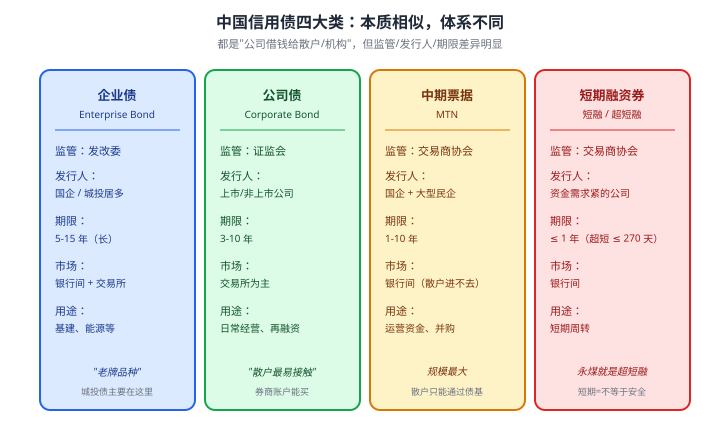
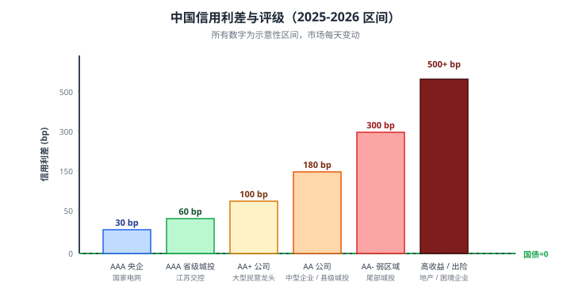

# 13 企业债与城投债

> **这一章要让你搞懂的事**
> 1. **企业债 / 公司债 / 中期票据 / 短融**——名字像绕口令，本质是什么
> 2. **城投债**为什么被称为"信仰债"——以及为什么"信仰"开始松动
> 3. **永煤事件（2020-11）**：AAA 国企怎么突然违约，给散户留下了什么教训
> 4. **信用利差**怎么定价——为什么它**比评级机构反应更快**
> 5. **散户买公司债的 8 个"地雷信号"**——看到哪个就该跑
> 6. **高收益债基**为什么是"高风险债基"的代名词
>
> **入门门槛**
> - 第 11 章：YTM、久期、信用评级
> - 第 12 章：国债、无风险利率
>
> **声明**：本教程不构成投资建议；所有事件、债券名为教学示例，**散户接触公司债前请咨询券商专业人员**。

---

## 📖 本章英文缩写速查

> 看到不认识的英文缩写，先回这张表查；完整术语见 [GLOSSARY.md](../GLOSSARY.md)。

| 缩写 | 英文全称 | 中文含义 |
|---|---|---|
| **AAA/AA/A/BBB…** | Credit Rating | 债券信用评级：AAA 最高，BBB- 及以上为投资级，以下为高收益（垃圾）级 |
| **YTM** | Yield to Maturity | 到期收益率（债券） |
| **CDS** | Credit Default Swap | 信用违约互换（相当于违约保险） |
| **ABS** | Asset-Backed Securities | 资产支持证券 |
| **QDII** | Qualified Domestic Institutional Investor | 合格境内机构投资者，借道投资海外的渠道 |
| **HY** | High Yield | 高收益债（俗称垃圾债） |
| **AIG** | American International Group | 美国国际集团（2008 危机中被救助） |

---

## 0. 先讲个故事

**2020 年 11 月 10 日上午 10 点 14 分**——一条公告刷遍金融圈：

> "永城煤电控股集团有限公司"宣布：未能按时兑付一只 10 亿元的超短融——**实质违约**。

这是一只**AAA 级国企债券**。距到期还剩 几个月。市场没人想到会违约。

**几个数字**：
- 永煤评级：**AAA**（中诚信、联合资信，最高级）
- 违约前一个月：信用利差**正常**，市场毫无预兆
- 违约后一周：所有河南国企债**集体暴跌 10-30%**
- 持有永煤债的债基：单日净值**-3% 到 -8%**

**老吴的故事**：散户老吴 2019 年通过券商账户买了 **5 万元**某 AAA 评级城投债，YTM **5.5%**——"看着比国债高 3 个点，还 AAA，肯定稳"。

永煤事件后他打开账户：那只城投债**价格从 100 元跌到 85 元**——账面 -15%。"我没买永煤啊？"
经纪人说："**市场怕你买的这家也违约**——它们都在永煤同一区域，市场重新定价了所有'同类'AAA 债。"

老吴的债没违约，但他从此明白一件事：

> **AAA 不等于安全，"准市政"不等于政府兜底，"高 YTM"不是免费午餐**。
>
> 这一章告诉你：永煤事件不是孤例。城投债、企业债、公司债——**这些"看起来比国债高 2-3%"的债，每一份额外收益背后都有相应的风险**。
>
> 散户能不能买？能。但要先学会**识别地雷**。

---

## 1. 一堆名字的辨析：企业债 / 公司债 / 中票 / 短融

这是新手最容易晕的部分。**4 个名字本质都是"公司发行的债"，但分属不同体系**。

**记住三个核心区别**：

| 维度 | 企业债 | 公司债 | 中票 / 短融 |
|---|---|---|---|
| 监管 | 发改委 | 证监会 | 交易商协会（央行下）|
| 散户能直接买吗 | △（部分上市）| **✓** | **✗**（银行间）|
| 典型发行人 | 央企/地方国企/城投 | 上市公司 | 大型国企+大民企 |
| 典型期限 | 5-15 年 | 3-10 年 | 1-10 年 |

**对散户的实操含义**：
- **能直接买**：公司债（券商账户）+ 部分企业债
- **只能通过基金**：中票 / 短融

> 💡 **新手 First Lesson**：监管名字别管太多——**记住"信用债"这个统称**：所有非政府债（≠国债 / 地方债）都叫信用债，因为它们都有信用风险。

---

## 2. 城投债：中国特色"信仰债"

### 2.1 城投公司是什么

**城投公司**：地方政府成立的投融资平台，名字常见的有：
- "XX 城市建设投资有限公司"
- "XX 交通投资集团"
- "XX 国有资产经营公司"
- "XX 经济技术开发区开发公司"

**业务**：替地方政府**搞基建、买土地、做城市运营**——但**法律上是独立企业**。

### 2.2 为什么叫"信仰债"

历史上，城投债**从未实质违约**——市场形成了"信仰"：

> "**城投不会倒。即使经营不行，地方政府也会兜底。**"

**这个信仰的合理性**：
1. 城投是地方政府的"亲儿子"——倒了让政府没面子
2. 城投承担基础设施任务——倒了基建烂尾
3. 城投违约 → 区域所有城投融资成本飙升 → 地方政府承受不起

**所以投资者敢买高 YTM 的城投债**——他们其实在赌**政府救助**。

### 2.3 信仰开始松动：43 号文之后

**2014 年国务院 43 号文**——明确**地方政府不为城投债兜底**：
- 城投债 = 企业债务，**不是政府债务**
- 政府不再承担"无限连带责任"

**实际执行**：
- 2014-2020：政策喊话，但仍**没有真违约**——信仰还在
- **2020-2024**：开始**展期、置换、"技术性违约"**——信仰**松动**
- 2024 年 11 月：**财政部 12 号文** —— **6 万亿化债**置换城投隐性债

### 2.4 化债是好事还是坏事

**化债 = 把"高利率城投债"换成"低利率特殊再融资债"**。

**对城投债持有人**：
- **存量债**：原本怕违约 → 现在**确认能拿到本息** → **利好**
- **未来债**：城投发新债更难、利率更低、规模收缩 → **存量稀缺，利好**

**但是**：化债不是免费的——**地方政府债务规模没变，只是换了一个名字**。**根本问题（地方财政可持续性）没解决**。

**结论**：**化债延长了"信仰"的寿命，但没有真正打破或拯救它**——散户对城投债的态度应该是"**短期可投、长期警惕**"。

### 2.5 城投债的分层

不是所有城投都一样：

| 层级 | 描述 | 风险 |
|---|---|---|
| **省级城投** | 直接省政府的核心平台 | 极低 |
| **核心地级市城投** | 省会、计划单列市 | 低 |
| **普通地级市城投** | 中部、东部一般地级市 | 中 |
| **县级 / 区级城投** | 县城、区级平台 | **较高** |
| **三四线城市平台公司** | 弱财政地区的城投 | **高（接近违约边缘）** |

> 💡 **散户买城投债的简单规则**：**只买省级 + 核心地级市**——这两级才符合"准市政"标签。**县级/区级城投，散户碰不得**。

---

## 3. 永煤事件：AAA 怎么突然违约

### 3.1 时间线

| 时间 | 事件 |
|---|---|
| 2020-10 | 永煤业绩平平，但 AAA 评级"稳定" |
| 2020-10-23 | 永煤完成 10 亿元中票发行（市场无异常）|
| 2020-11-10 | 突然公告：1 只 10 亿超短融**违约** |
| 2020-11-11 | 评级机构下调到 BB → 投资者哗然 |
| 2020-11-13 | 永煤母公司（豫能化）多只债集体下跌 |
| 2020-11-20 | 整个煤炭行业债集体下跌，蔓延到河南所有国企 |
| 2020-12 | 永煤"展期+部分兑付" 处置方案 |
| 2021 至今 | 持续重整，部分债券**最终回收率 50-70%** |

### 3.2 这件事为什么震惊市场

**几个反常的点**：

1. **AAA 国企**违约 —— 之前市场认为"AAA 国企 = 零违约"
2. **违约前一个月还在发新债** —— 用新发行的钱补不上窟窿
3. **关联方资产被转移** —— 母公司在违约前剥离了优质资产（涉嫌"恶意逃废债"）
4. **评级机构反应滞后** —— 违约后才下调，**等于事后诸葛亮**

### 3.3 散户能学到什么

**永煤事件留给散户的 5 个教训**：

| 教训 | 含义 |
|---|---|
| ① **AAA 不等于无风险** | 评级是参考，不是保证。要看**财报、行业、股东** |
| ② **国企不等于政府兜底** | 国资委不会替国企还散户的钱 |
| ③ **市场比评级机构敏感** | 信用利差扩大 = 市场"提前预警"，比评级下调早 1-3 个月 |
| ④ **集中持仓是大忌** | 老吴 5 万元都买永煤 → 直接 -50%。**分散是唯一防线** |
| ⑤ **"高 YTM" 是补偿，不是甜头** | 5.5% 高于国债 3% = 市场给的 2.5% 风险溢价。**风险真的存在** |

> 📌 **关键认知**：信用债的 YTM 不是"利息"，是**"风险定价"**。**5% YTM 不是"赚 5%"，是"承担 X% 违约概率换 5%"**。

---

## 4. 信用利差：市场比评级机构敏感

### 4.1 信用利差是什么

**信用利差 = 公司债 YTM − 同期国债 YTM**

意思是：投资者**额外要求多少补偿**，才愿意承担信用风险。

**例**：
- 同期 5 年国债 YTM = 2.3%
- 某 AA 公司 5 年期债 YTM = 3.5%
- **信用利差** = 3.5% - 2.3% = **120 bp**

### 4.2 不同评级对应的利差

**翻译成人话**：
- AAA 央企 +30 bp ≈ "几乎零违约"补偿
- AA+ +100 bp ≈ "极小概率违约"补偿
- AA +180 bp ≈ "1-3% 违约概率"补偿
- AA- +300 bp ≈ "5-10% 违约概率"补偿
- A 以下 +500+ bp ≈ "市场已经认为有问题"

### 4.3 利差先于评级反应

**关键事实**：**信用利差**比评级机构动作**快 1-3 个月**。

**机制**：
- 公司基本面变差 → 机构投资者**先卖出**该公司债 → 价格跌 → YTM 涨 → **信用利差扩大**
- 评级机构看到财报恶化 / 行业问题 → 调研 → **3-6 个月后才下调评级**

**所以**：**看信用利差变化比看评级变化更早预警**。

> 💡 **散户的简单工具**：在天天基金等平台查"近 1 个月信用利差变化"——**异常扩大就是危险信号**。

---

## 5. 散户买公司债的"地雷清单"

### 5.1 八个地雷信号

如果你看到下面任何一个**就该考虑卖出（或别买）**：

| 地雷 | 信号 | 含义 |
|---|---|---|
| ① **评级被下调** | AAA → AA+ → AA → AA- 一路下行 | 已经晚了，但还能止损 |
| ② **YTM 异常高于同评级** | 同样 AAA，市场给 5%，行业平均 3.5% | **市场已经"心里有数"** |
| ③ **频繁发公告** | 公司频繁"重大事项变更"、停牌 | 内部不稳定 |
| ④ **实控人/股东变动** | 大股东减持、控制权变更 | 信用基础动摇 |
| ⑤ **审计意见非标** | "保留意见"、"无法表示意见" | 财务有问题 |
| ⑥ **行业系统性问题** | 房地产、过剩产能 | 大趋势不可逆 |
| ⑦ **债务规模过大** | 资产负债率 > 80%（一般行业）| 借新还旧链条紧 |
| ⑧ **经营现金流持续为负** | 财报"经营性现金流"长期负 | 真实经营出问题 |

### 5.2 怎么自查

打开天天基金 / 东方财富 → 输入公司债代码 → 查看：

**第一层**：基本信息
- 评级 + 最近半年评级变动
- 主体公司 + 实控人

**第二层**：财务
- 资产负债率
- 经营性现金流（近 3 年）
- 是否有大额商誉减值

**第三层**：市场
- 近 30 天价格变化
- YTM 与同评级对比

**散户能做的最实在的事**：**遵守"三不"原则**

| 三不 | 内容 |
|---|---|
| 不买 | **不买 AA 及以下的债**（散户没专业判断能力）|
| 不集中 | **不让单只债超过总固收的 10%** |
| 不长期 | **不买 5 年以上的公司债**（不确定性放大）|

### 5.3 真实案例：常见雷区

| 案例 | 雷在哪 | 散户该看到什么 |
|---|---|---|
| 永煤（2020）| 母公司"恶意逃废债" | 关联方资产剥离公告 |
| 恒大（2021）| 行业系统性出险 | 房地产 ABS 大面积停止 |
| 紫光（2020）| 半导体大并购融资 | 资产负债率 80%+ |
| 华夏幸福（2021）| 环京地产业务模式 | 环京楼市冰封早就显现 |
| 北大方正（2019）| 股权混乱 | 大学背景 ≠ 国家信用 |

> 📌 **每一个"暴雷"的债，事后看都有信号**。关键是散户**没有动力 / 没有时间** 去查 —— 所以**最实际的方案是让基金经理替你查**。

---

## 6. 散户怎么参与公司债

### 6.1 路径对比

| 路径 | 起点 | 适合 |
|---|---|---|
| **直接买公司债**（券商账户）| 1,000 元 | 你**很懂这家公司**，且能持有到期 |
| **信用债基金**（中等风险）| 1 元 | **多数散户**——基金经理替你筛 |
| **高收益债基**（高风险）| 1 元 | **危险**——本质是赌垃圾债 |
| **混合债基**（含股票）| 1 元 | 看股债 60/40 那种风险偏好 |

### 6.2 "高收益债基" 的真相

**名字陷阱**：

| 名字 | 真相 |
|---|---|
| **高收益债基** | 持有 AA-/A 评级及以下债券，**违约风险大** |
| **垃圾债基**（国际称呼）| **就是同一个东西**，老实名字 |
| **海外 / 美元高收益债基** | 美国 BB 以下评级，**违约率历史 4-7%/年** |
| 中国市场"高收益" | 通常已经是出险或濒临出险的债 |

**风险特征**：
- 平时收益 5-8%（看起来比中长债基好）
- 大跌时**单次 -10% 到 -30%**（2022 年地产美元债基跌 30%+）
- 流动性差 —— **大额赎回时基金可能延迟兑付**

> ⚠️ **新手原则**：**任何宣传"年化 5%+ 的债基"都要警惕**。中国当前国债+1.5% 信用溢价的合理水平是 3-4%。**5% 以上**通常意味着：① 持有出险债 ② 加杠杆 ③ 久期很长（利率风险）—— **都不是免费午餐**。

### 6.3 推荐的散户策略

| 风险偏好 | 推荐 |
|---|---|
| **极保守** | 只买国债 / 储蓄国债（不碰信用债）|
| **保守** | 短期纯债基金 + 货基（隐含 AAA 信用债）|
| **平衡** | 中长期纯债基金（适度信用债）+ 国债基金混搭 |
| **激进（懂行）** | 添加少量"二级债基" / 部分公司债个券 |
| **不要** | 高收益债基 / 垃圾债 / 出险房企债 |

具体怎么选债基 → **第 16 章详讲**。

---

## 7. 进阶讨论

**入门读者可以跳过本节**。

### 7.1 信用利差的"信号意义"

**全市场信用利差**是经济情绪的**晴雨表**：

| 利差水平 | 经济状态 |
|---|---|
| AA 利差 < 80 bp | "信用过度乐观"——危险信号 |
| AA 利差 80-150 bp | 正常状态 |
| AA 利差 150-250 bp | 经济担忧、避险情绪起 |
| AA 利差 > 300 bp | 信用危机（如 2018 民企潮、2020 疫情初）|

**应用**：信用利差扩大 → 减仓信用债、加仓利率债。

### 7.2 房地产美元债违约潮（2022-2023）

**背景**：2010-2020 中国房企在海外发行了**约 3000 亿美元**的"美元债"——多为高收益（票息 8-15%）。

**2021 年下半年**：恒大率先违约 → 多米诺骨牌：
- 融创、世茂、佳兆业、龙光、富力...
- 2022 年中国地产美元债平均价格**从 80 元跌到 20-40 元**
- 持有海外房企债的 QDII 基金净值**腰斩**

**教训**：**"高收益"对应"高风险"**——8-15% 票息已经是市场对违约风险的定价。**事后看，多数都违约了**。

### 7.3 中国 vs 美国信用债

| 维度 | 中国 | 美国 |
|---|---|---|
| 市场规模 | 50 万亿 | $13 万亿 |
| 投资级占比 | 95%（评级"通胀"）| 60-70% |
| 平均年违约率（投资级）| < 0.5% | 0.1% |
| 平均年违约率（垃圾级）| 5-15% | 4-7% |
| 散户直接参与度 | 极低 | 较低（多通过基金）|

**关键差异**：**美国"高收益债（HY）"是个成熟、流动性好的市场**，机构常态化交易。**中国"高收益债"几乎等于"出险债"**——已经走在违约路上的债。

### 7.4 信用衍生品（CDS）

**信用违约互换（Credit Default Swap）**：本质是"信用风险保险"。
- 你持有 AA 公司债 → 买一个 CDS → 公司违约时由 CDS 卖方赔你
- 散户接触不到（国内合约规模都是亿级）
- 2008 年金融危机的核心工具 —— **AIG 卖了过多 CDS，雷曼违约时赔不起**

中国 2016 年推出 CDS 试点，但**规模极小**——市场还在发展中。

### 7.5 城投化债的几个工具

| 工具 | 含义 |
|---|---|
| **特殊再融资债** | 地方政府发新债置换城投隐性债 |
| **银行展期** | 城投到期还不上 → 银行给延 1-3 年 |
| **债务重组** | 多家债权人协商：本金打折、利息减免、期限延长 |
| **国企接盘** | 央企/省级国企接手"困难城投" |
| **核销** | 极小部分实质性核销（接近违约处置）|

**对持有人的影响**：
- 多数情况下"本金保住"
- 但**利息可能被压低、期限被拖长**
- **YTM 实质性下降**

---

## 8. 小结

1. **四大信用债**：企业债（发改委）/ 公司债（证监会）/ 中票（交易商协会）/ 短融（交易商协会）。**散户主要接触公司债**。
2. **城投债 = 中国特色"信仰债"**：曾从未实质违约，2014 年 43 号文后开始松动，2023 化债延长寿命但没根治。
3. **永煤事件（2020）打破"AAA 国企不会违约"** —— 5 个核心教训：AAA 不等于无风险、国企不等于兜底、市场比评级快、集中是大忌、高 YTM 是风险定价。
4. **信用利差按评级递增**：央企 30 bp、省级城投 60 bp、AA 公司 180 bp、AA- 弱区域 300 bp、出险企业 500+ bp。**这些数字是风险补偿，不是免费红利**。
5. **8 个地雷信号**：评级下调、YTM 异常高、频繁公告、股东变动、审计非标、行业系统性问题、资产负债率过高、经营现金流为负。
6. **散户三不原则**：不买 AA 及以下 / 不集中（≤ 10%）/ 不长期（≤ 5 年）。
7. **"高收益债基"是危险代名词** —— 年化 5%+ 的债基通常持有出险债或加杠杆。**正常债基年化 2.5-4%**。
8. **新手最优解**：通过**短期 / 中长期纯债基金**间接持有信用债——基金经理替你做信用筛选。**别想自己买公司债**。

> 🔗 **承上启下**：信用债的世界讲完了。但有一种特殊的债——**可以转股、攻守兼备**，叫**可转债**。它既是债，也是"打折的股票"，是中国债市最有趣的品种。**下一章 14 可转债** 讲：转股价、转股溢价率、强赎、双低策略、为什么 2024 年是"可转债历史最大转债"年。

---

## 自测题

> 答案在文末折叠区。先自己算，再对照。

1. 用一句话区分"企业债" "公司债" "中票"。散户最容易直接买到的是哪一种？
2. 城投债"信仰债"的逻辑是什么？2014 年 43 号文之后这个逻辑发生了什么变化？
3. 永煤事件的 5 个核心教训，请说出其中至少 3 个。
4. 同期国债 YTM 2.5%，某 AA 公司债 YTM 4.3%。这只债的信用利差是多少 bp？这个利差水平对应市场怎样的违约预期？
5. 你看到一只**AAA 评级**的城投债，YTM 6.0%（同期国债 2.3%）。市场对这只债的真实评价是什么？
6. "高收益债基"年化 5.5%——比中长期纯债基的 3.5% 高 2 个点。该不该买？说出 2 个判断角度。
7. **进阶题**：某省级城投发行 5 年期债，票面 4.5%，主体评级 AAA。同时同省一只县级城投发 5 年期，票面 6.5%，主体评级 AA+。**两者利差 200 bp**，分别该不该买？请从风险/收益/流动性三个角度回答。
8. **作业题**：打开任意债券基金 APP，找一只"中长期纯债基"。**查看它的前 10 大持仓**（基金季报）：
   - ① 持仓的债券类型（国债 vs 信用债占比）
   - ② 信用债的评级分布（AAA/AA+/AA 各多少）
   - ③ 是否有"行业集中"（如全是地产/煤炭）
   - ④ 是否有出现过违约的公司
   验证这只基金的"信用风险敞口"和它的宣传是否一致。

📖 参考答案（点击展开）

1. **企业债**主要是国企/城投（发改委监管），**公司债**主要是上市/非上市公司（证监会监管），**中票**主要在银行间市场流通（交易商协会监管）。**散户最容易直接买到的是公司债**——券商账户即可。

2. **信仰逻辑**：城投是地方政府"亲儿子"，倒了让政府没面子、基建烂尾、区域融资成本飙升 → 政府不会让它违约。**43 号文变化**：法律上明确"地方政府不为城投债兜底"——城投债 = 企业债务，不是政府债务。但实际上**至今没有过省级城投真实违约**——信仰被"延续"而非"打破"，2023-2024 化债更是延长了寿命。

3. 任答 3 个：
   - ① AAA 不等于无风险
   - ② 国企不等于政府兜底
   - ③ 市场比评级机构敏感（信用利差是更好预警）
   - ④ 集中持仓是大忌（5 万元都买一只直接 -50%）
   - ⑤ 高 YTM 是风险定价，不是免费红利

4. 信用利差 = 4.3% - 2.5% = **180 bp**。对应市场预期 **1-3% 违约概率**（5 年累计违约率约 5-10%）—— **中等信用风险**。如果是个人投资者直接买，承担的是"小概率但不可忽略的违约"，**通过基金分散更合适**。

5. AAA 城投合理利差 **30-80 bp** → 该利差 370 bp 严重偏离 → **市场已经"心里有数"**——大概率是：① 该城投实质评级**远低于** AAA（评级机构滞后）② 区域风险已暴露③ 可能是县级 / 弱区域的"挂着 AAA 招牌"。**即使评级写着 AAA，散户也应该避开**——市场永远更准。

6. **不该买**。两个判断角度：
   - **风险角度**：5.5% - 国债 2.3% = **320 bp 信用溢价** → 暗示持仓**包含 AA- 甚至更低评级 的债**。常态下中长期纯债基 3.5% 接近合理水平，**5.5% 必然有"故事"**。
   - **历史角度**：2018 年民企违约潮、2020 永煤、2022 地产潮——历次出险时"高收益债基"跌幅 10-30%。**多赚 2% 的代价是"可能亏 20%"——不对等**。

7. 两者之间相差 200 bp，反映了"省级 AAA vs 县级 AA+" 的明确分层。
   - **省级 AAA 票面 4.5%**：在 AAA 中已经偏高（合理 30-80 bp，这里有 220 bp）—— **谨慎**。可能是欠发达省份。
   - **县级 AA+ 票面 6.5%**：完全不适合散户。**县级城投 = 风险敞口大**——化债覆盖优先级低，市场流动性极差。
   - **散户结论**：两个都**不直接买**——通过基金间接持有省级那只可以，**县级的无论如何不碰**。

8. 没有标准答案。**重点观察**：
   - **国债 / 利率债占比** > 50%：偏保守，相对安全
   - **信用债评级分布**：AAA > 70% 是稳健配置；如果"AA / AA-" 占 20%+ 要警惕
   - **行业集中度**：单一行业占 30%+（尤其房地产、煤炭、城投）是危险信号
   - **历史违约**：如果前 10 大持仓里有"已展期 / 已违约"的债 → 这只基金净值会受拖累
   - **基金宣传"中低风险"但持仓 AA 占比 30%+** → 风险与宣传不符，警惕

---

## 延伸阅读

- 《信用债投资分析与实务》—— 中信证券资管部：国内信用债实务派教材
- 国家金融监督管理总局 / 中国证监会：[行政处罚信息](http://www.cbirc.gov.cn/) —— 查询发行人合规问题
- 中国债券信息网：[信用债违约统计](http://www.chinabond.com.cn/) —— 历史违约数据库
- 《这次不一样：800 年金融危机史》(*This Time Is Different*) —— Reinhart & Rogoff：跨越 800 年的违约史，看清"信用周期"规律
- 《大空头》(*The Big Short*) —— Michael Lewis：2008 年次贷危机里看清评级机构和市场的脱节
- 财政部、央行《关于规范地方政府债务管理的意见》（43 号文，2014）：原文，读完更能理解"城投信仰"的法律基础

---

## 下一章预告

**14 可转债** —— 进入债市最有趣的品种：
- **可转债** = "债底保护 + 股性弹性"——为什么号称"攻守兼备"
- **转股价 / 转股溢价率 / 纯债价值 / 转股价值**：四个核心概念
- **强赎**：发行人的"赎回武器"——为什么 130 元是关键线
- **下修转股价**：发行人的"求和武器"
- **双低策略**：被验证 10 年的可转债经典策略
- 2024 年 6 月**搜特退**——可转债历史首次违约的教训
