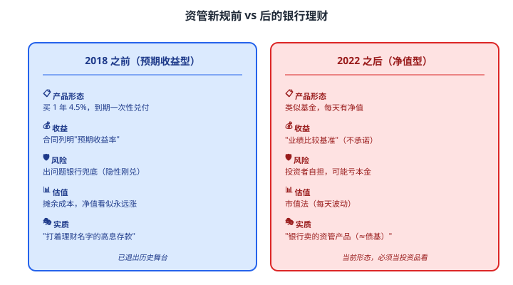
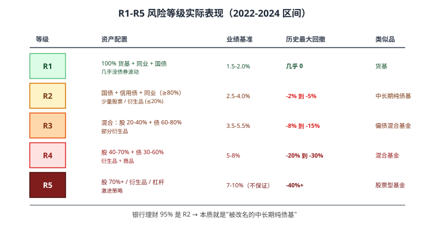
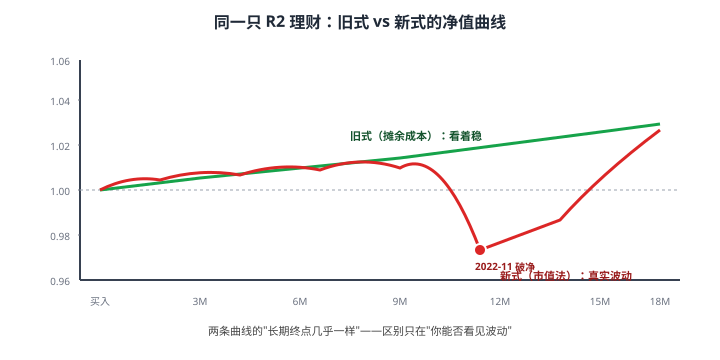

# 15 银行理财产品

> **这一章要让你搞懂的事**
> 1. **银行理财**到底是什么——为什么明明在银行 APP 上买，**却没有存款保险**
> 2. **2018 资管新规**：银行理财为什么从此"不保本"——这是一场监管革命
> 3. **R1-R5 风险等级**：实际意味着什么，**R2 是"假温和"**
> 4. **理财子公司**：和银行总行的关系，2019 后的"新生物种"
> 5. **业绩比较基准 ≠ 收益承诺**——很多人不知道的"超额收益陷阱"
> 6. **2022 年 11 月债灾**：银行理财首次大面积破净，这件事永久改变了行业
>
> **入门门槛**
> - 第 08 章：银行存款 vs 非存款
> - 第 11 章：YTM、债券价格波动
> - 第 13 章：信用债
>
> **声明**：本教程不构成投资建议；所有产品、净值、收益均为教学示例。

---

## 📖 本章英文缩写速查

> 看到不认识的英文缩写，先回这张表查；完整术语见 [GLOSSARY.md](../GLOSSARY.md)。

| 缩写 | 英文全称 | 中文含义 |
|---|---|---|
| **AAA/AA/A/BBB…** | Credit Rating | 债券信用评级：AAA 最高，BBB- 及以上为投资级，以下为高收益（垃圾）级 |
| **YTM** | Yield to Maturity | 到期收益率（债券） |
| **QDII** | Qualified Domestic Institutional Investor | 合格境内机构投资者，借道投资海外的渠道 |

---

## 0. 先讲个故事

**2022 年 11 月某天**，58 岁的周阿姨打开手机银行——她持有的某"**稳健型理财，业绩比较基准 3.5%**"产品：

| 时间 | 净值 |
|---|---|
| 6 月买入 | 1.0000 |
| 9 月 | 1.0125 |
| 10 月 | 1.0080 |
| **11 月 16 日** | **0.9750** ← **首次跌破 1.0000** |

周阿姨吓了一跳：**5 万本金账上变 4.875 万**——亏了 1,250 元。

她冲到银行柜台：

> "你们这'稳健理财'怎么会亏？保本的吧？"
> "阿姨，**2018 年资管新规之后已经全部'净值化'**——不保本了。"
> "你们之前不是说'比较基准 3.5%'吗？"
> "**'比较基准'不是承诺收益**，是参考。**实际收益每天波动**。"
> "我 5 年前买的就保本啊……"
> "5 年前那是'**预期收益型**'，2022 年完全消失了。"

周阿姨愣住了——**她以为银行理财还是"换了名字的定期存款"**。事实上，她买的是**和债券基金本质几乎相同的资管产品**。

**故事的结尾**：周阿姨坚持持有到 2023 年 3 月，净值回到 **1.0080**，最终拿回本金 + **80 元利息**——只能说"没亏"。

这一章告诉你：
1. **银行理财已经不是"存款替代品"**——它是真正的投资产品，会亏
2. **R1-R5 风险等级、业绩比较基准、净值化** 必须搞清楚
3. **2022-11 债灾**是分水岭——之后的银行理财必须按"投资品"来看

---

## 1. 银行理财到底是什么

### 1.1 本质：银行（理财子）发行的"资产管理产品"

**银行理财产品 = 银行（或它的理财子公司）募集你的钱，去投资各种金融资产**。

类比：
- **存款**：你把钱借给银行 → 银行付你固定利息
- **银行理财**：你委托银行 → 银行用你的钱买债券/股票/同业资产 → 收益归你（亏损也归你）

**和基金的区别**：
- 基金：由基金公司管理，证监会监管
- 银行理财：由银行/理财子公司管理，**银保监会**监管
- **资产配置上越来越相似** —— 都是"代客理财"

### 1.2 不是存款（最重要）

| 维度 | 银行存款 | 银行理财 |
|---|---|---|
| **法律性质** | 存款合同 | 委托理财（信托关系）|
| **存款保险** | ✓ 50 万 | **✗ 无保护** |
| **本金保证** | 保证 | **不保证** |
| **收益保证** | 合同利率 | 浮动 |
| **管理人** | 银行总行 | 银行 / **理财子公司** |
| **每天估值** | 按合同利率 | **每天净值变动** |

> 📌 **核心认知**：**"在银行 APP 买的" ≠ "存款"**。打开任何理财产品页面，**只要不带"存款"二字（如活期存款、定期存款、大额存单），就不受存款保险保护**。

### 1.3 你的钱去了哪里

银行理财不是"放着不动" —— 它去投资各种资产。**资产配置决定风险**：

| 类型 | 主要持仓 | 风险 |
|---|---|---|
| **现金管理类** | 货币基金类资产（短债 + 同业）| 极低 |
| **固定收益类**（占大头）| 国债 + 信用债 + 同业存单 | 低-中 |
| **混合类** | 部分股票 + 主体债券 | 中 |
| **权益类** | 大部分股票 | 高 |
| **商品及金融衍生品类** | 商品、衍生品 | 高 |

**国内现状**（2025 区间数据）：
- **固定收益类占 95%+** —— 银行理财本质是"债基的近亲"
- 真正的权益类、混合类不到 5%
- **银行理财的风险，基本就是债券的风险**

---

## 2. 资管新规：2018 年的分水岭

### 2.1 历史背景：资管新规前的"灰色繁荣"

**2018 年之前**的银行理财：
- **预期收益型** —— "买 1 年期 4.5%" 像存款一样
- **隐性刚兑** —— 出问题时银行用自有资金兜底
- **资金池运作** —— 多只理财共享底层资产，"借新还旧"
- **多层嵌套** —— 银行理财 → 信托 → 资管计划 → 底层资产，**风险被层层包装**

**问题**：
- 散户以为"保本"——风险被掩盖
- 银行实际承担了"表外风险"——可能引发系统性问题
- **影子银行**规模过大，央行难以监控

### 2.2 2018-4-27 《资管新规》出台

正式名称：**《关于规范金融机构资产管理业务的指导意见》**。

**核心三条**：

| 条 | 内容 |
|---|---|
| **① 打破刚性兑付** | 银行**不得承诺保本保收益**；出现亏损由投资者承担 |
| **② 净值化估值** | 必须**按市价**给资产估值，不能用"摊余成本法"虚饰 |
| **③ 期限匹配 / 不嵌套** | 资金池禁止；多层嵌套禁止 |

### 2.3 过渡期：2018-2021

监管给了 **3 年过渡期**（后延长到 2021 年底）：
- 2018-2021：老产品逐步退出
- **2022-1-1 起**：所有银行理财必须**完全净值化** —— 没有"预期收益型"了

### 2.4 资管新规前后对比

---

## 3. R1-R5 风险等级：你必须看懂

### 3.1 监管定义

银行理财必须按风险分为 **R1-R5 五级**：

| 等级 | 名称 | 风险描述 |
|---|---|---|
| **R1** | 谨慎型 / 极低风险 | 极小可能亏损本金 |
| **R2** | 稳健型 / 低风险 | 一般情况下不亏损本金 |
| **R3** | 平衡型 / 中风险 | 可能小幅亏损 |
| **R4** | 进取型 / 中高风险 | 可能较大亏损 |
| **R5** | 激进型 / 高风险 | 可能损失大部分本金 |

**关键**：购买前必须做**风险测评**——测评结果决定你能买到哪一档。

### 3.2 各级的"实际"含义

监管文字是抽象的，**实际表现**才有意义：

### 3.3 R2 是"假温和"

**关键认知**：

| 误区 | 真相 |
|---|---|
| "R2 = 稳健 = 不会亏" | 错。R2 历史最大回撤 -2% 到 -5%（2022-11 债灾）|
| "R2 = 低波动" | 错。每天净值都波动，**只是平均回报相对平稳** |
| "R2 = 接近存款" | 错。**R2 本质 = 中长期纯债基**，受利率/信用影响 |
| "R2 业绩基准 3.5% = 保 3.5%" | 错。**业绩基准不是承诺**，可能拿 2.5%，也可能 -1% |

> 📌 **行业潜规则**：超过 **80% 的散户购买的是 R2 产品**——大家以为它"稳"。**事实上 R2 的真实风险被严重低估**。

### 3.4 R1 与 R3+ 的辨识

| 类别 | 适合谁 | 不适合谁 |
|---|---|---|
| **R1（现金管理类）** | 应急金第二档备选 | 想要"高于货基" 收益的人 |
| **R2** | **保守资金，可接受 -3% 波动**的人 | 把它当"存款"的人 |
| **R3** | 平衡型投资者 | 把它当"R2 升级版"的人 |
| **R4/R5** | 有股票经验的进取型 | 几乎所有普通散户 |

---

## 4. 理财子公司：2019 后的新物种

### 4.1 什么是"理财子"

**理财子公司 = 银行 100% 控股的、专门做资管业务的独立法人**。

**起源**：2018 年资管新规要求"银行理财业务必须独立运营"。2019 年 6 月**建信理财**成立——中国第一家理财子公司。

**目前主要玩家**（2024 区间）：

| 银行系 | 理财子名字 | 规模（粗略）|
|---|---|---|
| 工行 | 工银理财 | 1.8 万亿 |
| 建行 | 建信理财 | 1.6 万亿 |
| 招行 | **招银理财** | **2.5 万亿**（业内最大）|
| 中行 | 中银理财 | 1.5 万亿 |
| 农行 | 农银理财 | 1.5 万亿 |
| ... | ... | ... |

**还有**：合资理财子（如**汇华理财**= 中银+东方汇理）、外资银行系。

### 4.2 理财子 vs 总行的关系

| 维度 | 银行总行 | 理财子公司 |
|---|---|---|
| **法律地位** | 商业银行 | **独立法人** |
| **风险隔离** | 母公司风险 | **独立资产负债表** |
| **监管** | 银保监会 | 银保监会（专门管理办法）|
| **存款保险** | ✓ 50 万 | **✗** 不覆盖理财产品 |
| **销售渠道** | 银行 APP / 网点 | 主要通过母行销售，部分代销 |

**关键事实**：
- 你在工行 APP 买的"理财"产品，**法律上属于工银理财**，不属于工商银行
- 万一工银理财投资失败 → **工商银行不承担兜底责任**（理论上）
- 实际中：母行**有"声誉风险"** → **通常会在必要时输血**，但**法律上不强制**

### 4.3 理财子的优势 vs 缺陷

**优势**：
- 投资范围更广（**可投股票**，传统银行理财受限）
- 决策更专业（独立投资团队）
- 产品设计灵活
- 资管能力提升

**缺陷**：
- "独立法人"意味着风险更显性化
- 部分理财子**投资能力远低于公募基金**
- **管理费、销售费"层层抽水"**——多数理财产品费率高于同类基金

---

## 5. 业绩比较基准：不是承诺收益

### 5.1 定义

**业绩比较基准（Performance Benchmark）= 资管产品给客户提供的"参考收益"**——**不是承诺、不是保底**。

举例：某 R2 产品"业绩比较基准 3.5%"——
- 含义：管理人认为这只产品"大致能拿到 3.5% 年化"
- **不含义**：3.5% 是保底 / 必须达到 / 否则赔偿

### 5.2 实际达成率

**好年景（如 2020-2021）**：业绩基准 3.5% 的 R2 → 实际 3.8-4.2%（**超额达成**）
**正常年景（如 2024）**：业绩基准 3.5% 的 R2 → 实际 2.5-3.5%（**勉强达成或略低**）
**坏年景（如 2022 11 月）**：业绩基准 3.5% 的 R2 → 实际 0% 甚至 -2%（**远低于基准**）

### 5.3 "超额收益"陷阱

**最容易被忽略的费用结构**：

| 收益区间 | 投资者拿到 | 管理人提成 |
|---|---|---|
| 0 - 业绩基准 | **100%** | 0% |
| 业绩基准 - 上限 | **20-50%** | **50-80%（"超额业绩报酬"）** |

**翻译成人话**：业绩基准 = 你能拿到全部收益的"天花板"。**超过基准的部分，大头被管理人拿走**。

**举例**：业绩基准 3.5%，超额提成 80%：
- 实际年化 5% → 你拿 3.5% + (5%-3.5%) × 20% = **3.8%**
- 实际年化 3% → 你拿 **3%**（没有超额，但也没有提成）
- 实际年化 -2% → 你拿 **-2%**（亏自己扛）

**反思**：这种结构意味着——**管理人无激励大幅超越基准（80% 归他们但客户嫌少；客户嫌业绩平庸但管理人觉得"刚好达成基准"）**。**所以多数银行理财业绩平庸**。

---

## 6. 净值化的真实影响

### 6.1 净值每天波动

资管新规之前：理财净值像存款利率——**单调上升**（用"摊余成本法"虚构）。
资管新规之后：理财净值每天**真实波动**——**可以涨、可以跌**。

**核心**：你看到的是**真实的市场价值**，不是"会计美化"。

### 6.2 摊余成本法 vs 市值法

| 方法 | 怎么算 | 净值表现 |
|---|---|---|
| **摊余成本法** | 把"到期收益"线性摊销 | 净值平稳上升（看着稳）|
| **市值法** | 每天按市场价估值 | 净值每天波动（真实但难看）|

**2022 年后**：
- **现金管理类**（"准货基"）：仍可用摊余成本法
- **其他所有理财**：**必须用市值法**

**影响**：以前"看着稳" 的理财 → 现在"看着波动"——本质没变，只是你看到了真相。

### 6.3 现金管理类理财："准货基"

**特点**：
- 可用摊余成本法估值 → 净值稳定上升
- T+0 赎回（部分有限额）
- 投资范围限制（短债 + 同业 + 国债等）

**和货币基金比较**：

| 维度 | 货币基金 | 现金管理类理财 |
|---|---|---|
| 监管 | 证监会 | 银保监会 |
| 估值 | 摊余成本（货基专享）| 摊余成本 |
| 收益 | 1.5-1.6%（2026 估算）| **1.7-1.9%**（略高）|
| T+0 限额 | 1 万 | 看产品（多数有限额）|

**结论**：现金管理类理财是货基的"略升级版"——收益高 0.2%。**作为应急金第二档的替代品很好用**。

### 6.4 同一只理财的"两个时代"

**关键洞察**：**实质上没区别，只是"看不看得见"**。

**长期看**：摊余成本法和市值法的**终点几乎重合**——投资者最终拿到的钱差不多。
**短期看**：市值法暴露了"日常波动"——**周阿姨的心理冲击来自"看到了"，而不是"亏了"**。

---

## 7. 2022 年 11 月债灾：永久改变行业

### 7.1 时间线

| 时间 | 事件 |
|---|---|
| 2022-10 | 防疫优化预期 → 经济复苏 → 利率上行预期 |
| 2022-11-11 | 防疫"二十条" → 长债利率单日大涨 |
| 2022-11-14 | 10 年国债收益率单日 +10 bp（大事件）|
| 2022-11-16 | **银行理财大面积"破净"**——R2 产品跌 -1% 到 -3% |
| 2022-11 中下旬 | **赎回潮**——投资者恐慌赎回 → 基金公司被迫卖债 → 利率进一步上行 → **更大破净** |
| 2022-12 | 央行降准 + 监管"流动性救助" → 危机化解 |
| 2023-Q1 | 净值逐步修复 |

### 7.2 跌幅

| 类型 | 11 月最大回撤 |
|---|---|
| 现金管理类 | -0.1% 到 -0.3% |
| **R2 中短债理财** | **-1% 到 -3%** |
| **R2 中长期纯债理财** | **-3% 到 -5%** |
| 偏债混合 | -5% 到 -10% |

### 7.3 这次事件的"启示"

| 启示 | 含义 |
|---|---|
| ① **R2 不等于稳定** | 历史最大单月回撤 -3% 在 R2 是真实的 |
| ② **净值化的真实代价** | 投资者要"接受波动"——这是一种心理训练 |
| ③ **赎回潮加剧危机** | 集中赎回 → 卖债 → 净值跌 → 更多赎回 → **自我强化的螺旋** |
| ④ **理财子的"母行兜底"考验** | 部分母行**确实输血**保护客户——但**法律上不强制** |
| ⑤ **新生代客户教育** | 散户**第一次集体接触"理财会亏"**——长期看是好事 |

### 7.4 监管的反应

**短期**：央行降准、增加流动性。
**长期**：
- 强化"投资者适当性"——风险测评更严
- 鼓励"理财产品估值方法多元化"——部分允许摊余成本法（但严格限制）
- 推广"封闭式产品"——锁定期减少赎回潮

---

## 8. 怎么选银行理财

### 8.1 三大筛选

| 维度 | 怎么看 |
|---|---|
| **风险等级** | 必须匹配你的承受能力（R2 是大众选择，但要明白其真实风险）|
| **业绩基准** | **不要追高**——比同类高 50 bp 以上的，大概率持仓更激进 |
| **理财子背景** | 优选**头部理财子**（招银/工银/建信）—— 投研能力强 |

### 8.2 其他重要细节

| 细节 | 注意 |
|---|---|
| **持有期** | 选**开放式 / 短封闭期**——避免长锁定 |
| **历史业绩** | 看"近 1 年回报" + "最大回撤"——基准是参考 |
| **底层资产** | 季报披露的持仓 —— 国债占比高 = 真稳健 |
| **管理人** | 看**理财子的过往业绩**，不只是品牌 |

### 8.3 误区清单

| 误区 | 真相 |
|---|---|
| "银行卖的都安全" | 错，**只有"存款"才有存款保险** |
| "R2 就是稳健" | 错，R2 历史最大回撤可 -5% |
| "业绩基准 3.5% 就能拿 3.5%" | 错，**这是参考不是承诺** |
| "理财子破产母行兜底" | 错，**法律上不强制** |
| "净值跌就赎回" | 错，**多数情况持有到期就回本** |
| "理财比基金安全" | 错，**本质相似**（多数是债基的"换装"）|

### 8.4 推荐策略

| 风险偏好 | 推荐产品 |
|---|---|
| 极保守 | 国债 / 储蓄国债 / 大额存单（不买理财）|
| 保守 | **现金管理类理财**（R1，应急金第二档）|
| 平衡 | **R2 短中债理财**（接受 -2% 内波动）|
| 偏激进 | R3 混合（接受 -10% 内波动）|
| 激进 | 直接买基金，不要买 R4/R5 理财（理财费率太高）|

---

## 9. 进阶讨论

**入门读者可以跳过本节**。

### 9.1 期限错配的法律边界

资管新规要求"**资管产品的资金来源和投向期限要匹配**"——禁止"借短钱投长资产"。

**但实际上**：
- 多数"6 个月期" 理财产品持有大量**1-3 年期债券**——隐性期限错配
- 监管对**封闭式产品**要求严，**开放式产品**有"流动性管理工具"
- **赎回潮**就是错配的代价

### 9.2 现金管理类 vs 货基的细微区别

| 维度 | 货基（监管：证监会）| 现金管理类（监管：银保监会）|
|---|---|---|
| 投资范围 | 严格（397 天内）| 较宽（部分 1 年+）|
| 久期限制 | 120 天 | 240 天 |
| 信用要求 | AAA 占主导 | AA+ 也可少量持有 |
| 收益高低 | 略低 | 略高 20-40 bp |
| 风险 | 极低 | 略高（实质风险差距小）|

**结论**：日常用差别不大，现金管理类略香，但**理论上风险略高**。

### 9.3 理财子的中外比较

| 维度 | 中国理财子 | 外资资管（贝莱德等）|
|---|---|---|
| 起源 | 银行母行剥离（2019）| 独立机构起家（1980s）|
| 规模分布 | 集中在固收（95%+）| 股票/固收/另类均衡 |
| 投研能力 | 起步阶段，固收强股弱 | 全球化 |
| 主要收入 | 管理费 + 销售费 + 超额提成 | 管理费为主 |

**外资理财子**（如**贝莱德理财**、**汇华理财**）2020 起进入中国，**带来全球化视角**，但规模仍小。

### 9.4 "代销骗局" 警惕

历史上发生过：银行**柜台员工**销售"飞单"——把**非银行自营理财**当成行内理财卖给客户，出问题银行不认。

**怎么辨识**：
- 在**银行 APP 内**购买（不是"被柜员推荐去某个网站/APP"）
- 产品页**明确写"XX 理财（理财子全称）"**
- **不签独立纸质合同**——APP 内电子签即可
- **不直接转账给"陌生公司"账户**

**核心**：**理财必须在银行的官方电子渠道购买**——任何其他形式都警惕。

### 9.5 理财市场的"未来形态"

预测（2026-2030）：
- 头部理财子集中度提高（招银 / 工银 / 建信占 50%+）
- **股票投资能力**逐步建立——R3/R4 产品比例上升
- **跨境业务**扩展——QDII 理财、海外资产配置
- **数字化销售**——AI 投顾、智能定投

但银行理财**永远不会回到"保本时代"**——这是行业根本性的变化。

---

## 10. 小结

1. **银行理财 = 银行/理财子的资管产品**，**不是存款，不受存款保险保护**。任何"银行 APP 内 没有'存款'二字的"产品都不在 50 万保护内。
2. **2018 资管新规是分水岭**：打破刚兑、净值化、不嵌套。2022 年起完全净值化——**"预期收益型"成为历史**。
3. **R1-R5 风险等级**：
   - **R1 ≈ 货基** + 略高
   - **R2 ≈ 中长期纯债基**（历史最大回撤 -3% 到 -5%）
   - R3 ≈ 偏债混合
   - R4/R5：**散户慎入**
4. **R2 是"假温和"** —— 80% 散户买的就是它，**但它的真实风险被严重低估**。
5. **业绩比较基准 ≠ 收益承诺**。**超额收益的大头被管理人拿走** —— 这是行业激励机制问题。
6. **理财子是 2019 后的新物种**：法律上独立法人，**母行不法定兜底**。头部理财子（招银/工银/建信）投资能力较强。
7. **2022-11 债灾**永久改变行业 —— 投资者第一次集体接触"理财会亏"。**长期看是健康的市场教育**。
8. **散户怎么选**：保守资金 → 国债/存款；平衡资金 → R1 现金管理 + R2 短债理财；进取资金 → 直接买基金（不买高级别理财）。

> 🔗 **承上启下**：到这一章为止，"信用债 + 净值型产品"基本讲完。**下一章 16 债券基金** 是"02 固收"模块的收官 —— 我们会讲：纯债基 / 一级债基 / 二级债基的真实差别、久期策略、利率走势对债基的影响、**怎么选债基（基金经理 / 规模 / 历史最大回撤）**、**为什么"债基定投"是个伪概念**。

---

## 自测题

> 答案在文末折叠区。先自己算，再对照。

1. "在银行 APP 买的理财产品受 50 万存款保险保护"——这句话对吗？为什么？
2. 资管新规之前和之后的银行理财，最大的区别是什么？说出 3 个差别。
3. R2 风险等级的"实际风险"是什么样的？历史最大回撤多少？
4. "业绩比较基准 3.5%"意味着什么？投资者实际能拿到多少收益？
5. 2022 年 11 月银行理财大面积破净——为什么会发生？给散户的最大教训是什么？
6. **进阶题**：你 60 岁，看到银行推销"R2 稳健理财，业绩基准 4.0%"。柜员说"比定期存款 1.95% 高一倍"。你应该买吗？请从风险、流动性、性价比三个角度分析。
7. 现金管理类理财和货币基金有什么区别？哪个更适合应急金第二档？
8. **作业题**：打开你常用的银行 APP，找一只你已购买或考虑购买的理财产品。**仔细查看**：
   - ① 风险等级（R1-R5）
   - ② 业绩比较基准（不要看成"承诺收益"）
   - ③ **持有期限 + 赎回规则**（开放/封闭/T+1/T+N）
   - ④ **季报披露的底层持仓**（国债 vs 信用债占比）
   - ⑤ **管理费 + 销售费 + 超额业绩报酬**（这些都吃掉你的收益）
   - ⑥ **历史最大回撤**（不仅看 1 年年化）
   你能拿到这只产品的真实收益吗？

📖 参考答案（点击展开）

1. **错**。**只有"存款"二字明确的产品才受存款保险**——理财、基金、保险都不受。即使在工行 APP 买的"工银理财 XX 产品"，工银理财是独立法人，**理财本金不受存款保险保护**，理财子破产理论上可能本金损失（实际有"声誉风险"促使母行救助，但**法律上不强制**）。

2. 三个差别：
   - **保本性**：之前隐性刚兑，**之后投资者自担**
   - **估值方法**：之前摊余成本法（看着稳），**之后市值法**（每天波动）
   - **资金运作**：之前资金池+多层嵌套，**之后独立账户+穿透监管**
   - 其他可答："预期收益型 vs 净值型" "保证收益 vs 业绩基准" 等

3. R2 是"假温和"：
   - 资产配置**80%+ 是债券 + 同业**，少量股票/衍生品 ≤ 20%
   - **本质 = 中长期纯债基的近亲**
   - **历史最大回撤 -2% 到 -5%**（2022-11 债灾）
   - **不等于"稳定不亏"**——只是"长期看正收益概率高"

4. 业绩比较基准 = 管理人**预估能达到的收益**。**不是承诺、不是保底**。
   - 好年景：实际可能 3.8-4.2%（**超额部分多归管理人**）
   - 正常年景：实际 2.5-3.5%（勉强达成）
   - 坏年景：实际 0% 甚至负（**远低于基准**）
   - **"超额收益陷阱"**：超过基准的收益**大头归管理人**——这是行业激励问题。

5. **原因**：防疫优化→利率上行预期→长债跌→理财净值跌→**投资者赎回潮**→基金被迫卖债→**利率再上行**→更大破净→自我强化的螺旋。
   **最大教训**：
   - "净值化"是真的——**理财会亏**
   - "稳健"不等于"稳定"
   - **集中赎回反而加剧问题**——持有到期通常修复
   - "理财 ≈ 债基"——**投资者必须接受波动的事实**

6. **谨慎建议不买**。三个角度：
   - **风险角度**：60 岁退休资金最怕本金损失。R2 历史最大回撤 -3% 到 -5%——如果赶上债灾期间需要用钱（如医疗），可能被迫低位赎回。
   - **流动性角度**：多数 R2 有 30-180 天最短持有期。**老人应急用钱被锁住的代价大**。
   - **性价比角度**：4.0% 基准看着诱人，但**实际可能 3.0-3.5%**——比定期 1.95% 高 1-1.5%，**但承担"-3% 亏本风险"**。**如果当成应急金，1.95% 定期更安心**。
   - **替代方案**：储蓄国债 3.5%（**比 R2 安全得多、还接近基准回报**）；现金管理类 R1（1.7-1.9%）。**60 岁的人，0.5% 多余收益不值得"亏本风险"**。

7. **区别**：
   - **监管**：货基（证监会）vs 现金管理类（银保监会）
   - **投资范围**：货基更严（397 天内 + AAA 主导）；现金管理类略宽（240 天 + AA+ 也可少量）
   - **收益**：现金管理类**通常高 20-40 bp**
   - **风险**：差距小，但理论上现金管理类略高
   - **应急金第二档**：两者都合适，**头部理财子（招银/工银）的现金管理 + 头部货基（余额宝/微信零钱通）各放一半** = 分散托管风险 + 双 T+0 通道。

8. 没有标准答案。**重点检查**：
   - **风险等级**：是 R1 还是 R2 ——决定波动范围
   - **业绩基准**：是参考不是承诺，看是否合理（同期同评级 +50 bp 内）
   - **赎回规则**：T+1 还是 T+30？影响应急性
   - **底层持仓**：国债 + 同业 ≥ 70% = 真稳健；AAA 信用债 ≥ 80% = 较稳；含 AA 信用债 ≥ 20% = 警惕
   - **费率合计**：管理费 + 销售费 + 托管费 总和 > 0.8% 偏高
   - **超额业绩报酬比例**：超过基准的部分**管理人拿 50%+ 是常态，>80% 是高**
   - **最大回撤**：近 2 年最大单日 / 最大累计——这是"心理体验"的依据

---

## 延伸阅读

- 银保监会：[《商业银行理财业务监督管理办法》（2018）](http://www.cbirc.gov.cn/) —— 法规原文
- 央行 + 银保监会 + 证监会 + 外汇局：[《关于规范金融机构资产管理业务的指导意见》](http://www.pbc.gov.cn/)（资管新规，2018-4-27）—— 必读
- 银行业理财登记托管中心：[中国理财市场年度报告](http://www.chinawealth.com.cn/) —— 每年发布，最权威的行业数据
- 《资管新规下的银行理财业务》—— 中国银行业协会：从业者视角的教材
- 《影子银行内幕》—— Andrew Sheng：理解资管新规背后的"风险逻辑"

---

## 下一章预告

**16 债券基金** —— "02 固收"模块收官：
- **纯债基 / 一级债基 / 二级债基**：实际差别有多大
- **短债基金 vs 中长债基金**：什么时候选哪个
- **久期策略**：基金经理怎么应对加息/降息
- 怎么选债基：**基金经理 / 规模 / 历史最大回撤** 三大指标
- 为什么"债基定投"是个伪概念
- 一线债基公司：易方达、博时、招商、广发的固收风格对比
