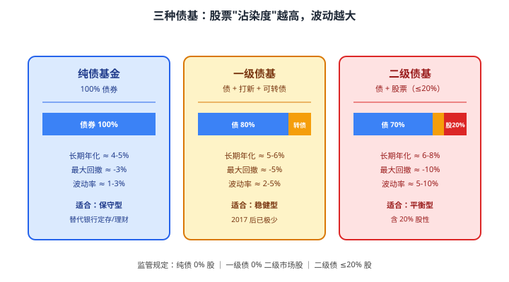
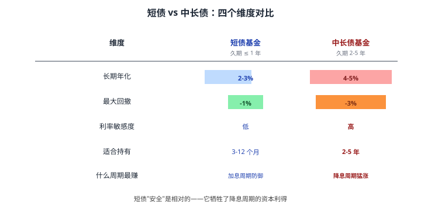
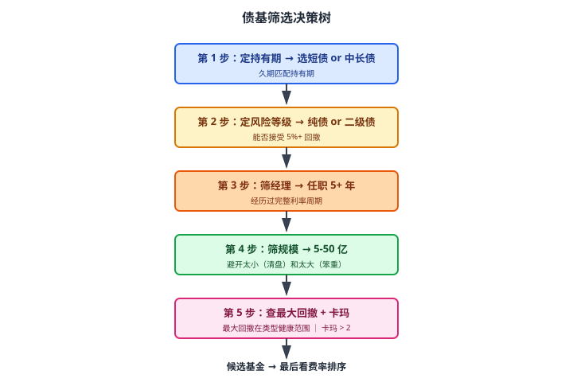

# 16 债券基金

> **这一章要让你搞懂的事**
> 1. **债基**到底是什么——和"自己买债券"差在哪
> 2. **纯债 / 一级债基 / 二级债基**：名字差一个字，本质差一个台阶
> 3. **短债 vs 中长债**：什么时候选哪个，"短债更安全"是真的吗
> 4. **久期策略**：基金经理在加息/降息周期怎么操作
> 5. **怎么挑债基**：基金经理 / 规模 / 最大回撤 / 夏普——四个最重要的指标
> 6. **为什么"债基定投"是个伪概念**——大部分人在这件事上做错了
>
> **入门门槛**
> - 第 11 章：YTM、久期、信用评级
> - 第 13 章：信用债、违约风险
> - 第 15 章：净值化、业绩比较基准、2022 债灾
>
> **声明**：本教程不构成投资建议；所有产品/数字仅作教学示例。

---

## 📖 本章英文缩写速查

> 看到不认识的英文缩写，先回这张表查；完整术语见 [GLOSSARY.md](../GLOSSARY.md)。

| 缩写 | 英文全称 | 中文含义 |
|---|---|---|
| **AAA/AA/A/BBB…** | Credit Rating | 债券信用评级：AAA 最高，BBB- 及以上为投资级，以下为高收益（垃圾）级 |
| **YTM** | Yield to Maturity | 到期收益率（债券） |
| **BP** | Basis Point | 基点，1BP = 0.01% |

---

## 0. 先讲个故事

退休的老李在第 15 章学了一个教训——银行理财不保本，2022 年差点亏 5%。
他想："那我直接买**债券基金**总行了吧？基金公司专业，应该比银行理财更稳。"

他在某基金 APP 上看到一只产品："**XX 短债 A · 近 3 年年化 4.2%**"。
他点击买入，投了 50 万，等着稳稳收年化 4%。

**结果**：
- 2022 年 11 月：账面亏 1.8%
- 2023 年 6 月：回本，赚 0.8%
- 2024 年全年：赚 3.5%
- 2025 年 3 月：再次回撤 -0.6%

他不解："不是说**短债基金最安全**吗？怎么还在亏？"

> 这一章会告诉你：
>
> 1. 债基**不保本**——本质上和股票基金一样会波动，只是波动小一些
> 2. "短债"也会亏——只是亏得少、亏得短
> 3. **老李的真问题不是买错产品，是买错时机**——他在 2022 年 10 月（利率最低位、债券价格最高位）追高买入
>
> 想搞懂这个，先要理解债基的本质。

---

## 1. 债券基金是什么

### 1.1 大白话

**债券基金（Bond Fund）**：基金公司把很多人的钱集中起来，买**一堆债券**，按比例分给大家。

**和你自己买债券的区别**：

| 维度 | 自己买债券 | 买债基 |
|---|---|---|
| 门槛 | 国债 100 元起；企业债 1000 元起；银行间债券 100 万起 | **1 元起** |
| 数量 | 你自己挑 1-2 只 | 基金一般持 **50-200 只** |
| 操作 | 你研究、挑选、监控 | **基金经理代劳** |
| 收益 | 等同票息 + 持有期价格变动 | 净值反映**所有债券组合**变动 |
| 费用 | 几乎没有 | 管理费 0.3%-0.7% + 托管费 0.1% |
| 流动性 | 部分债券难卖 | **T+1 或 T+2 到账** |

**核心差别**：债基把"挑债+管债"这件事**外包**给了基金公司。你付管理费，换专业人员帮你做。

### 1.2 债基怎么赚钱

债基的收益来自三块：

$$
\text{债基收益} = \text{票息收入} + \text{资本利得} + \text{杠杆收益}
$$

| 来源 | 大白话 |
|---|---|
| 票息收入 | 持有期内债券支付的利息 |
| 资本利得 | 债券价格涨/跌带来的浮盈浮亏（这是**净值波动**的主要原因）|
| 杠杆收益 | 基金公司用质押回购融资再买债，**放大收益和风险** |

**翻译成人话**：你以为债基"稳稳收利息"，其实**每天净值在跟着市场利率波动**——利率涨 → 债券价格跌 → 你账面亏；利率跌 → 债券价格涨 → 你账面赚。

这就是为什么 2022 年央行预期收紧流动性时，所有债基（连"短债"都）齐刷刷回撤。

---

## 2. 三种债基：名字差一个字，本质差一个台阶

国内债基按"是否持有股票"分三类。

### 2.1 纯债基金（Pure Bond Fund）

**定义**：100% 投资债券，**完全不持股票**。

**子类**：
- **短期纯债**：组合久期 ≤ 1 年（**短债基金**）
- **中长期纯债**：组合久期通常 2-5 年
- **超长债基**：组合久期 5 年+（如 30 年国债基金）

**适合谁**：想替代银行定存/理财、追求稳健、能承受 -3% 以内的回撤。

### 2.2 一级债基（Tier-1 Bond Fund）

**定义**：以债券为主，可以参与**新股申购（打新）**和持有**可转债**，**但不能直接在二级市场买股票**。

**为什么 2017 后越来越少**：
- 2017 年新股申购规则修改——一级债基的"打新红利"几乎消失
- 大部分一级债基**改造成纯债或二级债基**
- 目前市场上"严格意义上的一级债基"已经很少

**翻译成人话**：一级债基这个分类**几乎成历史名词**，现在选债基主要在"纯债"和"二级债"之间二选一。

### 2.3 二级债基（Tier-2 Bond Fund）

**定义**：以债券为主，**可以在二级市场买股票，但股票比例 ≤ 20%**。

**关键认知**：
- **20% 的股票，能让整体年化提高 1-2 个百分点**——长期看是甜头
- **但 20% 的股票，也让最大回撤翻 2-3 倍**——股市暴跌时跟着遭殃

**例**：2022 年 4 月 A 股大跌，**许多二级债基单月回撤 -3% ~ -5%**，而同期纯债基只回撤 -0.5% ~ -1%。

**适合谁**：能接受"债基偶尔像偏债混合基金"的人。**很多人买二级债基是冲着"听起来稳"的名字**，实际买的是"小型债 + 股票组合"。

### 2.4 一张速查表

| 你要 | 选 |
|---|---|
| 替代定期存款，求稳 | **短期纯债** |
| 长期吃利息，能忍 1-3% 回撤 | **中长期纯债** |
| 想博一点股票收益，能接受 -10% | **二级债基** |
| 自由选股 + 自由选债，想要更激进 | **偏债混合基金**（已超出债基范畴）|

---

## 3. 短债 vs 中长债：选哪个

新手最常问的问题。先看一张对比图：

### 3.1 短债基金

**特点**：组合久期短（≤1 年），主要持有**短融券、短期国债、央票**等。

**优势**：
- **回撤小**——即使利率上升 1%，净值大约只跌 -1%（久期 1）
- **流动性好**——T+1 赎回基本到账
- **比货基收益高一些**——年化 2-3% vs 货基 1.5-2%

**劣势**：
- **错过降息红利**——利率下降时，短债资本利得很少
- **本质是"加强版货基"**——别期望它"涨"得多

### 3.2 中长期纯债

**特点**：组合久期 2-5 年，主要持有**中期国债、政金债、信用债**。

**优势**：
- **长期年化更高**——拿足票息 4-5%
- **降息周期收益爆发**——比如 2020 年上半年（央行降息），中长债基普涨 3-5%

**劣势**：
- **加息周期挨揍**——比如 2022 年 11 月，部分中长债基单月回撤 -2%
- **持有期至少 2 年**——否则可能踩进"申购时利率最低、赎回时利率上升"的尴尬区间

### 3.3 选择口诀

> **你打算持有多久？**
> - **3-12 个月** → 短债
> - **1-2 年** → 短债 + 一点中长债
> - **2-5 年** → 中长债为主
> - **5 年+** → 中长债 + 一点二级债

> 📌 **关键认知**：
> - "短债更安全"**只在短期内成立**。如果你打算持有 3 年，**短债的累积收益反而可能输给中长债**——因为你少赚的票息会越拉越大。
> - **久期匹配持有期**是债基投资的核心规则。

---

## 4. 久期策略：基金经理在做什么

第 11 章讲过：**久期（Duration）= 利率变 1% 时，债券价格大约变多少**。

债基经理的核心工作之一是**动态调整组合久期**。

### 4.1 三种久期策略

| 策略 | 怎么做 | 适合判断 |
|---|---|---|
| **拉久期（Duration Extension）**| 把短债换成长债 | 经理预期**利率会下降** |
| **降久期（Duration Compression）**| 把长债换成短债 | 经理预期**利率会上升** |
| **哑铃策略（Barbell）**| 同时持有大量短债 + 大量长债，少持中期 | 不确定利率方向，但**预期收益率曲线变陡或变平** |

### 4.2 一个真实例子：2022 年的债基经理们

**2022 年 1-10 月**：央行多次降准降息，利率走低 → **拉久期**的债基大赚（年化 6-8%）。

**2022 年 11 月**：央行预期收紧 + 防疫政策优化预期 → 利率一周内反弹 30 个基点 → **没及时降久期的债基暴跌**（短期回撤 -1% ~ -3%）。

**关键反思**：
- 经理拉久期是想多赚钱——但**赌错方向就是大回撤**
- **你买债基时，其实在替经理的久期判断买单**
- 这就是为什么"债基经理的判断能力"比股基经理更重要——**因为利率方向不像股票那么难判断，但一旦错就立刻反映在净值上**

### 4.3 怎么知道一只债基的久期

**在基金季报里找**——"投资组合"一栏会披露：
- 平均剩余期限
- 平均久期

或者**用简化方法**：看基金名称
- "短债"、"30天滚动持有"等字眼 → 久期 < 1
- "稳健"、"中短"、"双季度"等字眼 → 久期 1-2
- "长债"、"5 年"、"政金债 5-10 年" → 久期 3+

---

## 5. 怎么挑债基：四个最重要的指标

### 5.1 指标一：基金经理任职年限

**为什么重要**：债基经理需要经历**至少一个完整的利率周期**（约 5-7 年）才知道好坏。**只看 1-2 年业绩没意义**。

**怎么查**：天天基金 → 基金详情 → "基金经理" → 看"任职日期"。

**好债基经理画像**：
- 任职年限 **5+ 年**
- 经历过 **2013 钱荒、2016 债灾、2020 疫情降息、2022 债灾**
- 同时管理多只基金且业绩**稳定**（不是单只爆款）

### 5.2 指标二：基金规模

**理想规模**：**5-50 亿元**。

**为什么**：
- 太小（< 5 亿）：清盘风险高、调仓不灵活
- 太大（> 100 亿）：调仓困难（大象转身慢）、收益被规模拖累

**特别警惕**：**短期内规模暴涨的债基**——常是某理财经理在大力推荐，规模激增后**业绩往往倒退**。

### 5.3 指标三：历史最大回撤

**这是债基最关键的"风险刻度"**——比波动率更直观。

| 债基类型 | 健康最大回撤范围 |
|---|---|
| 短期纯债 | -0.5% ~ -1.5% |
| 中长期纯债 | -1% ~ -3% |
| 一级债基 | -2% ~ -5% |
| 二级债基 | -3% ~ -10% |

**如果某只基金的历史最大回撤明显高出这个范围**，意味着：
- **要么久期暴露过高**（赌方向）
- **要么信用下沉过激**（买了高息但低评级债）
- **要么杠杆过高**

无论哪种，**都是"经理在用风险换收益"**——不一定差，但你要知道在买什么。

### 5.4 指标四：夏普比率（卡玛比率更好）

第 04 章讲过：
- 夏普 = 超额收益 / 波动率
- 卡玛 = 超额收益 / 最大回撤

**债基的健康区间**：
- 夏普 > 1 是优秀
- **卡玛 > 2 是优秀**（债基的卡玛通常很高，因为回撤小）

### 5.5 决策树

---

## 6. 为什么"债基定投"是个伪概念

这是新手最大的误区之一。

### 6.1 定投股基为什么有效

**第 02 章和第 04 章**讲过：股票波动大、长期向上。**定投**能让你在低点多买、高点少买——"摊平成本"。

### 6.2 债基"不需要"定投的三个理由

**理由 1：债基波动小**

债基年化波动 1-5%，**根本没有"低点高点"可言**——你定投买入的成本和一次性买入的成本，**长期看几乎一样**。

**理由 2：债基"持续向上"**

债基净值长期增长曲线**几乎是平滑向上**（除了 2022 年这种极端事件）。**晚买不如早买**——你的钱在场外吃货基 1.5%，但场内是 4-5%，每天都亏 1% 的差额。

**理由 3：债基应该"按周期一次性买入"**

债基的关键变量是**利率周期**，不是"成本摊平"。
- 利率高位 → 一次性买入中长债 → 等待降息周期
- 利率低位 → 一次性买入短债 → 等待加息周期

**定投反而会让你在"利率高位时买得少（错过机会）、利率低位时买得多（追高）"**——和"低买高卖"完全反过来。

### 6.3 那应该怎么操作

| 场景 | 操作 |
|---|---|
| 我有一笔大钱要进入债基 | **一次性买入**（或分 2-3 笔在 1-2 个月内分批） |
| 我每月有 1 万结余想配置债基 | **每月一到账就买**（不需要分散到不同价位）|
| 我想做"债基定投"以摊平成本 | **不需要**——债基没有需要"摊平"的波动 |

> 📌 **总结**：**定投是股基的工具，不是债基的工具**。把它套到债基身上是工具错配。

---

## 7. 进阶：摊余成本法 vs 市值法

**入门读者可以跳过本节**，等学完第 24 章再回来。

### 7.1 两种估值方法

国内债基有两种**净值核算方式**：

**摊余成本法**：
- 按债券**票面利率**平均分摊到每一天
- 净值**永远只涨不跌**（除非违约）
- **隐藏了真实市场价格波动**

**市值法**：
- 按债券**当前市场价格**计算
- 净值**反映真实波动**——市场利率涨它就跌
- 2018 资管新规后**强制使用**

### 7.2 历史变迁

| 时间 | 状况 |
|---|---|
| 2018 年之前 | 大量货基、债基、银行理财用**摊余成本法** → 看起来"零波动" |
| 2018-2022 年 | 资管新规要求**逐步切换市值法** → 但货基和部分定开债基保留 |
| 2022 年 11 月 | 大量市值法债基/理财首次集中破净 → **市场认识到债基也会亏** |
| 2026 现状 | 短债基金、中长债基金**全部市值法**；货基保留摊余成本法 |

### 7.3 对你的影响

**短债 / 中长债基** = **市值法** = **每天净值有真实波动**——买入前要做好"今天可能跌 0.3%"的心理准备。

**唯一仍用摊余成本法的债基**：定期开放型（如 3 个月、6 个月一开）——封闭期内净值"平滑"，但开放期才能赎回，**牺牲流动性换平滑**。

---

## 8. 进阶：信用下沉策略

**入门读者可以跳过本节**。

部分债基为了多赚收益，会去买**低评级信用债**（AA-、A+ 等）——这叫**信用下沉（Credit Spread Trading）**。

**潜在收益**：低评级债收益率比国债高 200-500 个基点（2-5 个百分点）。

**风险**：
- **单只债违约 → 净值瞬间跌 5% 以上**（基金被迫减计）
- **2020 永煤违约、2021 华夏幸福违约**等事件中，多只信用债基大幅回撤

**怎么识别**：看基金季报的"持仓评级分布"——
- AAA 占比 > 80% → 保守
- AA+ 占比 > 30% → 中等
- AA 及以下 > 20% → **风险高**

> 📌 **小白建议**：买债基**优先看 AAA 比例**，避免被"高收益"诱惑去买信用下沉激进的基金。

---

## 9. 小结

1. **债基 = 基金公司代你买一堆债**——你付管理费换专业服务和流动性。
2. **三类债基差一个台阶**：纯债（0 股）→ 一级债基（≈ 纯债）→ 二级债基（≤20% 股）。**很多人在不知情下买了二级债基**。
3. **短债 vs 中长债**：短债波动小但收益低，中长债反之。**久期匹配持有期**是核心规则。
4. **久期策略**是经理的核心工作——经理拉久期是赌利率下降，**赌错就是大回撤**。
5. **挑债基四指标**：经理任职年限 5+、规模 5-50 亿、最大回撤在健康范围、卡玛 > 2。
6. **债基不要定投**——定投是股基的工具，债基应该按利率周期"一次性 + 分批"买入。
7. **2018 资管新规后债基全部市值法**——每天净值有真实波动，没有"保本"幻觉。
8. **警惕信用下沉**：看 AAA 占比、避开"高收益但低评级"的债基。

> 🔗 **承上启下**：00 基础 + 01 现金 + 02 固收，到此为止 **16 章打下"防御型理财"的完整框架**——
> 你已经能在不碰股票的前提下，**用储蓄 + 国债 + 债基组合一份能跑赢通胀的资产配置**。
>
> 下一章起进入**权益篇（股票与基金）**——这是"进攻型理财"的开始，也是普通人长期超越通胀的核心来源。

---

## 自测题

> 答案在文末折叠区。先自己算，再对照。

1. 老李买的"短债基金"为什么 2022 年还会亏？用本章知识解释。
2. 你打算把一笔 30 万的钱放 6 个月（明年初要装修），应该选短债还是中长债？为什么？
3. 同一基金公司的两只产品：A "稳健 30 天滚动" 久期 0.5，B "信用债精选" 久期 4。央行下周可能降息 25 个基点，理论上 A 和 B 谁会涨更多？大约涨多少？
4. 某二级债基近 1 年涨 12%，远超同类。你查它的持仓发现 20% 是某只股票。可能是什么情况？要担心什么？
5. 朋友说"我每月定投 5,000 元到一只中长债基，3 年了"，问你这样对不对。你怎么回答？
6. **进阶题**：某债基季报披露：AAA 占 50%、AA+ 占 30%、AA 占 18%、未评级 2%。这只基的信用风险水平如何？和"AAA 占 90% 以上"的同类相比，预期年化大约高多少？预期最大回撤呢？
7. **作业题**：去任一基金平台（天天基金 / 蚂蚁财富），用本章的"四指标"筛 1 只你愿意持有的债基，写下它的：(a) 经理任职年限、(b) 规模、(c) 近 3 年最大回撤、(d) 卡玛比率。判断是否符合你的持有期 + 风险等级。

📖 参考答案（点击展开）

1. 老李在 2022 年 10 月（利率最低位、债券价格最高位）买入。11 月利率反弹，债券价格下跌，**短债基久期虽小（≈1），但 1% 的利率上升就会导致 -1% 净值损失**。"短债更安全"是相对而言，**不是绝对零回撤**。本质问题是他**追高买入**。
2. **短债**。久期匹配持有期是核心规则。6 个月持有期，选短债（久期 ≤ 1）能避免"被迫在利率上升时赎回"的损失。中长债适合 2+ 年持有。
3. 利率下降 25 BP（0.25%）。A 价格变动 ≈ 久期 × 利率变动 = 0.5 × 0.25% = **+0.125%**；B 变动 ≈ 4 × 0.25% = **+1.0%**。**B 涨得更多**——这就是中长债在降息周期的优势。**反之加息周期 B 跌得更狠**。
4. 二级债基股票上限 20%，他买到上限了，且**这只股票涨了很多带动整体净值**。要担心的是：(i) 集中度过高，单只股票回撤会让整个基金挨揍；(ii) 这种业绩**不可持续**——再次买入时可能正赶上股票回调。**这是"伪债基"现象**——本质已经是股债混合产品。
5. **不对**——债基不需要定投。中长债基长期平滑向上，"定投"反而错过了早买的复利（场外货基年化 2% vs 场内债基年化 4%，每天亏 2%/365 的差额）。建议改为"每月到账后**一次性买入**"——这不是定投，是"积累式买入"。
6. AA 及以下占 20%，**信用风险偏高**。这种基金通常比 AAA 主导的同类**预期年化高 0.5-1 个百分点**，但 **最大回撤可能多 1-2 个百分点**，尤其在违约事件爆发时（如 2020 永煤）。用本章 §8 标准：**风险高，要警惕**。
7. 没有标准答案。检查清单：✓ 经理 5+ 年 ✓ 规模 5-50 亿 ✓ 最大回撤在类型健康范围 ✓ 卡玛 > 2 ✓ 你的持有期匹配基金的久期类型 ✓ AAA 占比足够。如果某项不达标，**换一只**——基金市场债基有几千只，没必要将就。

---

## 延伸阅读

- 《固定收益证券》(*Fixed Income Securities*) —— Bruce Tuckman：债基经理的入门教材，第 4-6 章讲久期策略
- 《债券与债券组合管理》—— Frank Fabozzi：被译成中文的"债券大全"，新手可看前 3 章
- 银保监会：[《公开募集证券投资基金运作管理办法》（2014 + 2024 修订）](http://www.csrc.gov.cn/) —— 债基分类的法规依据
- **晨星基金研究中心**：[cn.morningstar.com](https://www.morningstar.cn/) —— 提供债基的久期、AAA 占比、回撤等数据
- 中国证券投资基金业协会：[基金经理数据库](http://www.amac.org.cn/) —— 查经理任职年限、管理基金数

---

## 下一章预告

**17 股票市场结构** —— "03 权益与证券"的开门章：
- A 股 / 港股 / 美股：**三个市场的本质区别**
- **交易所**：上交所、深交所、北交所、港交所、纽交所、纳斯达克的定位
- **板块**：主板、创业板、科创板、北交所——名字背后的"游戏规则"
- **T+1 / T+0**：为什么 A 股不能"今天买今天卖"，对你影响多大
- **涨跌停板**：A 股的 10%/20%/30%/无限制——谁是哪种
- **打新**：A 股打新和港股美股有什么不同
- **股票分红**：除权除息日是什么、为什么"现金分红 + 股价下调"等于没分红
