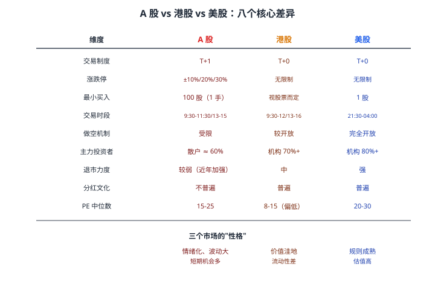
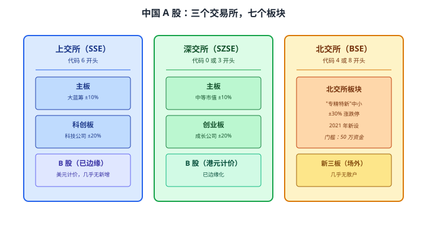
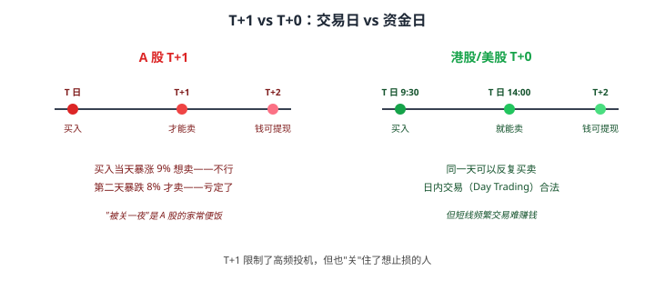
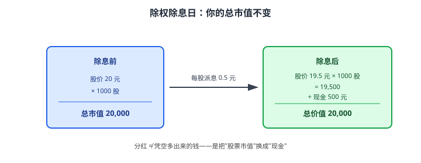

# 17 股票市场结构

> **这一章要让你搞懂的事**
> 1. **股票**到底是什么——为什么"买股票就是买公司"这句老话其实只对一半
> 2. **A 股 / 港股 / 美股** 三个市场的本质区别——以及为什么同一家公司在不同市场估值差几倍
> 3. **交易所、板块**：上交所、深交所、北交所、港交所、纽交所、纳斯达克——它们是谁、收谁、长什么样
> 4. **T+1 / T+0、涨跌停板、最小买入单位**——A 股那些"反常识规则"的来历
> 5. **打新**：三个市场的逻辑完全不同
> 6. **除权除息**：为什么"现金分红 + 股价下调"等于没分红
>
> **入门门槛**
> - 第 04 章：波动率、最大回撤
> - 第 05 章：风险偏好评估
> - 第 06 章：资产配置（知道股票在组合里的位置）
>
> **声明**：本教程不构成投资建议；所有公司、股票代码均为教学示例。

---

## 0. 先讲个故事

三个朋友 2024 年第一次买股票，分别选了不同市场，都"水土不服"。

- **小张（A 股）**：买入一只主板股票，第二天涨 9.8% 想卖。点击"卖出"——**没成交**，因为有 1% 的卡位"靠到涨停"。第三天直接跌停，**他被关了 T+1 一夜**，第四天才能卖出，又少赚 5%。
- **小李（港股）**：在港股看到一只低价股 0.05 港币/股，买了 100 万股，**结果一卖发现要按"手"卖**——这股票 1 手 = 50,000 股，他买的"100 万股"实际是 20 手。流动性差到**挂单 3 天才慢慢成交**。
- **小王（美股）**：看到一家科技股财报亮眼，**盘后涨 15%** 兴冲冲想买，但中国券商的 QDII 通道不支持盘后交易。**第二天开盘价已经涨过去了**，他追高买入，结果当天就回调 -8%。

> 三个市场，三种"规则盲区"。
>
> **这就是这一章要讲的事**：在你了解任何具体股票之前，先要搞清楚**它在哪个市场、按什么规则玩**——否则你赚的是知识的钱，亏的是规则的钱。

---

## 1. 股票是什么

### 1.1 一句话

**股票（Stock / Share）**：**一家公司的所有权凭证**——你持有 1 股，你就拥有这家公司的 **1/总股本** 那么多。

举例：贵州茅台总股本约 12.56 亿股。你买 100 股茅台，你就拥有茅台公司的 **100 / 12.56 亿 = 0.000008%**——听起来很少，但按 2025 年茅台市值 2 万亿算，**这一点点对应约 16 万元的"公司价值"**。

### 1.2 "买股票就是买公司"对吗

**对一半**。

| 这句话对的部分 | 这句话错的部分 |
|---|---|
| 你拥有公司部分所有权（法律意义上）| 你**没有经营权**——除非你持股超 5%（举牌线） |
| 公司赚钱你能分到（分红 + 股价反映）| 公司不分红你**收不到一分钱**——只能盼股价涨 |
| 公司破产你能按比例分财产 | 你**最后才分**——员工、税务、债权人都排你前面 |

**翻译成人话**：**你拥有的是"权益"，不是"控制权"，更不是"现金流"**。普通散户买股票 99% 的回报来自股价波动，不是分红。

### 1.3 股票为什么会涨

**长期看**（5 年+）：股价 = 公司每股盈利 × 估值倍数。盈利涨、估值不变 → 股价涨。
**短期看**（1 年内）：股价 ≈ 市场情绪 × 资金流 × 消息面。**和公司基本面关系不大**。

这就是为什么**第 18 章会讲估值（如何判断"贵不贵"）、第 19 章会讲基本面（如何判断公司"好不好"）**——这两件事决定了你的长期回报。

---

## 2. 三个市场的本质区别

普通中国人能接触的股票市场主要有三个：A 股、港股、美股。**它们的规则差异，比"中文 vs 英文"的差别还大**。

### 2.1 同一家公司估值差几倍

很多大公司**同时在多个市场上市**——同样的业务、同样的财报、**股价却完全不同**。

| 公司 | A 股 | H 股（港股）| 美股 ADR | 差异 |
|---|---|---|---|---|
| 工商银行 | A 股 PE ≈ 5.5 | H 股 PE ≈ 4 | — | A 股贵约 35% |
| 中国平安 | A 股 PE ≈ 8 | H 股 PE ≈ 6 | — | A 股贵约 30% |
| 阿里巴巴 | — | 港股 PE ≈ 12 | 美股 PE ≈ 12 | 接近 |
| 中芯国际 | A 股 PE ≈ 40 | H 股 PE ≈ 15 | — | A 股贵 2 倍多 |

**为什么差距这么大**：
- **A 股**：散户占比高 + 资金不能自由出入 → **流动性溢价 + 情绪溢价**
- **港股**：开放给全球资金 + 机构主导 → **理性定价**
- **美股**：全球流动性最好 + 但只看公司基本面 → 优质公司估值高

> 📌 **小白核心认知**：**同一家公司，不同市场买，结果不一样**。
> 如果你能选，**优先选 H 股（港股）/ 美股 ADR**——同样的资产，价格更便宜。但要先解决"跨境账户"问题（详见 §8 进阶）。

---

## 3. 中国的三个交易所与七个板块

A 股不是一个市场，是**三个交易所、七个板块**。

### 3.1 上交所的两个板块

**主板**：
- 代码 60 开头（如 600519 茅台、601318 平安）
- **大盘蓝筹股**为主：金融、白酒、能源、地产
- 涨跌停 ±10%
- ST 股票（被特别处理的）涨跌停 ±5%

**科创板**：
- 代码 688 开头（如 688981 中芯国际）
- **硬科技公司**为主：半导体、生物医药、新能源
- 涨跌停 ±20%
- **门槛**：开户前 20 个交易日日均资产 ≥ 50 万元 + 2 年证券交易经验

### 3.2 深交所的两个板块

**主板**：
- 代码 00 开头（如 000333 美的、000651 格力）
- **中型公司**为主：消费、制造、医药
- 涨跌停 ±10%

**创业板**：
- 代码 30 开头（如 300750 宁德时代）
- **成长型科技公司**为主
- 涨跌停 ±20%
- **门槛**：开户前 10 个交易日日均资产 ≥ 10 万元 + 2 年交易经验（新规已放宽到无门槛但需评测）

### 3.3 北交所

**北交所板块**：
- 代码 4 或 8 开头（如 920016 弘业期货从新三板转板）
- **"专精特新"中小企业**为主
- 涨跌停 ±30%
- **门槛**：日均资产 ≥ 50 万元

**新三板**（基础层 / 创新层）：
- 几乎不在散户视野——**精选层**已升级为北交所

### 3.4 一张速记表

| 板块 | 代码 | 涨跌停 | 公司类型 | 门槛 |
|---|---|---:|---|---|
| 沪市主板 | 600/601/603/605 | ±10% | 大蓝筹 | 无 |
| 科创板 | 688 | ±20% | 硬科技 | **50 万** |
| 深市主板 | 000/001/002 | ±10% | 中型 | 无 |
| 创业板 | 300/301 | ±20% | 成长 | 10 万 |
| 北交所 | 920/430/831/832/833 | **±30%** | 专精特新 | **50 万** |

> 💡 **新手建议**：先在**沪市主板 + 深市主板**练手——涨跌停 ±10%、无门槛、流动性最好。等熟悉了再考虑科创板、创业板。**北交所流动性差，新手别碰**。

---

## 4. 交易规则：A 股那些"反常识"

### 4.1 T+1：今天买的不能今天卖

**A 股 T+1 制度**：
- **T 日（交易日）**买入的股票，**T+1 日（次日）**才能卖出
- 但卖出的钱**当天就能用来再买股票**，只是 **T+1 才能转账出去**

**A 股为什么是 T+1**：1995 年制度沿用至今，初衷是**抑制投机、防止过度交易**。利弊都有，未来是否改 T+0 一直在讨论。

### 4.2 涨跌停板：一根线挡住所有

**A 股的涨跌停板**：
- **沪市主板 + 深市主板**：±10%
- **科创板 + 创业板**：±20%（2020 年改）
- **北交所**：±30%
- **ST 股票**：±5%
- **新股上市首 5 日**：科创板/创业板/北交所**无涨跌限制**

**为什么有涨跌停**：
- **抑制单日剧烈波动**——给散户冷静时间
- **防止"庄家"洗盘**

**副作用**：
- **流动性瞬间消失**——一个跌停板挂卖单可能要排队 1 小时
- **"封停"现象**——大量买盘把价格顶到涨停后无成交，第二天直接高开 → 散户买不到、卖不出

### 4.3 最小买入单位：100 股 = 1 手

A 股最小买入 **100 股（1 手）**。**例外**：
- **卖出可以零股**（剩余不到 100 股可以一次性卖出）
- **新股申购按"号"**，不是按"股"
- **ETF / LOF** 最小 100 份

**为什么是 100 股**：历史原因，1990 年代起就这样。**港股 1 手可以是 100/500/1000/2000 股**（视股票而定），美股 **1 股起买**。

> 📌 **散户常见痛点**：股价 1000 元的茅台，1 手就要 **10 万**——散户难以建仓。这导致 **A 股有"低价股偏好"**——5-15 元的股票成交最活跃。

### 4.4 集合竞价：开盘前 15 分钟

**集合竞价（Call Auction）**：开盘前一段时间内，所有买卖单**集中撮合，按"成交量最大"原则定开盘价**。

**A 股集合竞价时段**：
- 9:15-9:25 早盘集合竞价（**9:20-9:25 不能撤单**）
- 14:57-15:00 收盘集合竞价（**全程不能撤单**）

**为什么要懂**：
- 9:25 出来的"开盘价"就是集合竞价结果
- 你想在开盘前挂单，**要在 9:15 之前**——9:20 后挂的单可能没法撤回
- **大单冲击**：有些机构故意在 9:20-9:25 挂巨量买单/卖单影响开盘价

---

## 5. 打新：三个市场玩法完全不同

**打新（IPO Subscription）**：新公司上市，第一次公开发行股票时**普通投资者也能申购**。如果中签 → 通常上市首日大涨。

### 5.1 A 股打新

**机制**：
- **市值配售**：你账上要有 1 万元市值的沪市股票（或深市股票）才能打**对应市场**的新
- **打新免费**：申购不冻结资金，**中签后再缴款**
- **中签率极低**：通常 0.05% - 0.3%

**为什么 A 股新股"必涨"**：
- **发行定价偏低**（受 23 倍 PE 限制传统）
- **打新如中签即赚 50%-200%**——但能不能中是看运气

**注意**：
- 新规已逐步放开发行价格——**未来"必涨"会减弱**
- 注册制下**新股破发已成常态**（科创板/创业板/北交所约 20% 新股首日破发）

### 5.2 港股打新

**机制**：
- **预冻结资金**——申购时冻结全额（如申购 1 万 → 冻结 1 万）
- 部分公司**提供融资打新**（10 倍杠杆，但要付利息）
- **中签率较高**——通常 30%-100%（小盘股几乎人人有份）

**风险**：港股新股破发率约 50%，**散户参与需谨慎**。

### 5.3 美股打新

**机制**：
- 普通散户**几乎拿不到打新额度**
- 99% 配给机构和大户
- 散户只能在上市后的二级市场买入

**结论**：美股普通人**别想打新**，专注二级市场。

---

## 6. 股票分红与除权除息

### 6.1 现金分红是怎么回事

公司每年盈利后，可以选择：
1. **再投资公司**（不分红 → 期待股价涨）
2. **现金分红**给股东（每股派 X 元）
3. **股票分红 / 送股**（每股送 X 股）
4. **股票回购**（公司用钱回购自己股票 → 推高每股价值）

### 6.2 除权除息日（XD / XR）

**关键反直觉点**：**分红那天，股价会同步下调，让你的总市值不变**。

**例子**：你持有某股 1000 股，股价 20 元，总市值 2 万。
- 公司宣布每股派息 0.5 元（年化股息率 2.5%）
- **除息日**：股价开盘自动调整为 **19.5 元**，你账上多了 **500 元现金**
- 你的总价值：1000 × 19.5 + 500 = **20,000 元**（不变）

### 6.3 那分红到底有没有意义

**有意义**：
- **强制释放公司盈利**——公司不能挪用，必须给股东
- **股息率高的公司通常质量稳定**（如银行股、电信股）
- **再投资可以复利**——你可以用收到的现金继续买股票

**但很多人误解**：
- **"现金分红"不是免费午餐**——股价同步下调
- **A 股有红利税**（持股不满 1 个月 20%、1 个月-1 年 10%、1 年以上 0%）——短线频繁交易**反而亏钱**

### 6.4 三个关键日期

| 日期 | 含义 |
|---|---|
| **股权登记日** | 这一天收盘时持有该股票的人才有分红资格 |
| **除权除息日** | 股价自动下调的那天（通常是登记日次日）|
| **分红到账日** | 现金/股票实际到账（通常是除息日后 1-7 个工作日）|

> 📌 **小白别中招**：看到某股"明天分红 5%"千万别冲过去买——你买入后第二天股价会自动下调 5%，**等于没赚**。

---

## 7. 进阶：跨境账户与做空机制

**入门读者可以跳过本节**。

### 7.1 内地居民怎么买港股 / 美股

**港股三条路**：
1. **沪港通 / 深港通**（最方便）：用 A 股账户直接买港股，门槛 50 万；**有标的限制**（只能买大盘股）
2. **香港券商**：开户后能买所有港股美股，门槛低，但**需要香港身份证或外汇转账**
3. **互联网券商**（如某 Tiger、富某 X）：境外公司，需用 QDII 通道转账 → **2024 年后受限**

**美股三条路**：
1. **QDII 基金**：通过国内基金间接持有（如标普 500 QDII）——**最合规但有溢价**
2. **港美股券商**：同上港股第 3 条，**有汇率风险 + 资金出入境限制**（个人年度购汇 5 万美元）
3. **股指期权 / CFD**：不推荐散户尝试

### 7.2 融资融券（两融）

**融资**：向券商借钱买股票（杠杆 1.5-2 倍）
**融券**：向券商借股票卖出（做空）

**A 股融券限制**：
- 标的限制（只能做空指定股票）
- 借券难（券池小）
- T+0 限制（融券卖出当天可以买回，但当天不能再卖普通仓）

**美股做空**：
- **完全自由**——任何上市公司都能借券做空
- 沽空机构盛行（如浑水、香橼）

**对小白**：**做空不要碰**。做错方向损失无上限——你买股票最多亏 100%，做空亏可以亏 1000%（股价涨 10 倍）。

### 7.3 期权与权证

- **期权**：第 25-27 章会专门讲，对小白基本结论是"不要碰"
- **权证**：港股有大量"轮证（涡轮）"，本质是期权——**散户陷阱**，第 26 章讲

---

## 8. 小结

1. **股票 = 公司所有权凭证**——但散户拥有的是"权益"，不是"控制权"和"现金流"。
2. **三个市场性格不同**：A 股情绪化、港股价值洼地、美股规则成熟。同一家公司在不同市场**估值能差几倍**。
3. **A 股 = 三个交易所 × 七个板块**：沪市主板 / 深市主板 / 科创板 / 创业板 / 北交所 / B 股 / 新三板。**代码开头能看出板块**。
4. **T+1 + 涨跌停 + 100 股起买**——A 股三大反常识规则的来历是"1990 年代抑制投机"，沿用至今。
5. **打新**：A 股市值配售 + 中签率超低；港股预冻资金 + 破发率高；美股散户基本无份。
6. **除权除息**：分红 = 股价同步下调 + 现金到账 → **总市值不变**。"分红 5%"不是免费午餐。
7. **小白入场顺序建议**：先沪深主板（无门槛、±10%、流动性最好）→ 熟悉后碰创业板 → 想要海外资产用 QDII 基金（合规、间接）→ 不到必要不开两融、不要碰做空和期权。

> 🔗 **承上启下**：你现在懂了"哪里买、按什么规则买"。下一章告诉你**怎么判断一只股票"贵不贵"**——PE、PB、PEG、股息率、ROE 五个指标的含义、用法、和局限。

---

## 自测题

> 答案在文末折叠区。先自己算，再对照。

1. A 股的最小买入单位是多少？股价 800 元的股票，1 手要多少钱？
2. 你 9:25 提交了买入挂单，但 9:24 你已经反悔了。你能撤单吗？为什么？
3. 同一家公司的 A 股 PE 是 8，H 股 PE 是 5。从估值角度，哪个更便宜？为什么会有这种差距？
4. 你早上 10:00 买入某沪市主板股，下午 14:30 股票涨了 8% 你想卖。能卖吗？
5. 某股 12 元，宣布每股派息 0.6 元，除息日前后你的总市值应该怎么变？
6. **进阶题**：A 股某创业板新股发行价 30 元，对应 PE 50 倍。上市首日涨到 90 元（涨 200%）。一年后股价跌到 25 元。这种"上市暴涨后回归"的现象，本章哪一节解释过原因？
7. **作业题**：打开你的券商 APP，找出一只你感兴趣的股票，记录：(a) 在哪个交易所、哪个板块；(b) 代码开头；(c) 涨跌停限制；(d) 是否有"门槛限制"（如科创板的 50 万）。把这些信息和股票的近期波动率结合，判断它是否适合你。

📖 参考答案（点击展开）

1. 100 股（1 手）。800 × 100 = **80,000 元**——单笔 8 万的资金门槛意味着大部分散户买不起茅台这种高价股。
2. **不能撤单**。A 股集合竞价 9:20-9:25 是禁止撤单的时段。你只能等开盘后（9:30）再操作（如果买入了就只能持有；如果没成交才能取消）。
3. **H 股更便宜**——PE 越低，意味着同样的盈利对应的股价越低。差距来源于：(i) A 股散户主导→情绪溢价；(ii) A 股资金不能自由出入→流动性溢价；(iii) 港股开放给全球资金→更理性定价。
4. **不能**——A 股 T+1 制度，今天买的只能明天卖。**这就是 T+1 的痛点**——你看着浮盈消失却动不了手。
5. 假设你持有 1000 股：除息前市值 12,000；除息后股价变 11.4 元，市值 11,400 + 现金 600 = **12,000**（不变）。本质是"把股票市值换成了现金"。
6. **§5.1 A 股打新**——发行价受 PE 限制偏低，首日大涨；但**实际公司估值可能远高于 PE 30**——市场情绪推到极致后必然回归。这就是"打新中签必赚"的逻辑，也是"二级市场追高必亏"的来源。
7. 没有标准答案。检查清单：✓ 你能正确识别板块 ✓ 你知道这只股票的涨跌停限制 ✓ 你判断它的波动率是否在你的承受范围（第 04-05 章）。如果发现自己的股票账户里**全是创业板 / 科创板 ±20% 的小盘股**——你可能在不知情中承担了远超自己承受能力的风险。

---

## 延伸阅读

- 上海证券交易所：[上交所交易规则](http://www.sse.com.cn/) —— 官方完整规则文本
- 深圳证券交易所：[深交所交易规则](http://www.szse.cn/) —— 同上
- 香港交易所：[HKEX Markets](https://www.hkex.com.hk/) —— 港股规则中英文都有
- 美国 SEC：[Investor.gov](https://www.investor.gov/) —— 美股投资者教育中心
- 中国证监会：[关于在科创板设立并试点注册制的实施意见](http://www.csrc.gov.cn/)（2019）——理解科创板、注册制改革的核心文件
- 《股市动力学》—— 陈江挺：A 股市场的散户视角，有些观点值得商榷但贴近实战

---

## 下一章预告

**18 股票估值入门** —— 进入"股票怎么选"的核心：
- **PE（市盈率）**：用一句话讲清楚——它的高低代表什么
- **PB（市净率）**、**PEG**、**股息率**、**ROE**：四个最常用指标的含义与公式
- "**便宜 ≠ 值得买**"——为什么很多 PE = 5 的银行股一直便宜下去
- **估值的局限性**：PE 在不同行业差几十倍，怎么"同行业比较"
- **PE-Bands**（市盈率带）：判断当前估值在历史什么位置
- 一个"行业 PE 速查表"：消费、金融、科技、医药的常态区间
