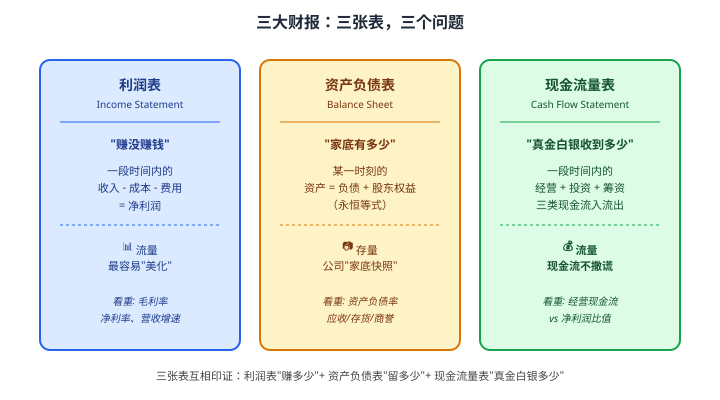
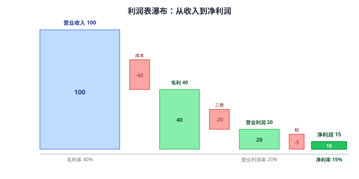
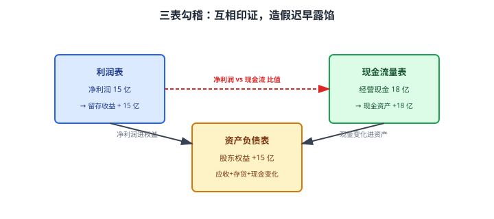
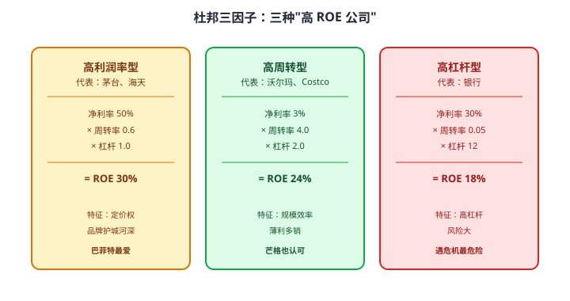
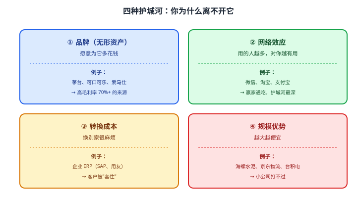

# 19 基本面分析

> **这一章要让你搞懂的事**
> 1. **三大财报**：资产负债表、利润表、现金流量表，**每张表回答一个问题**
> 2. **"现金流不撒谎"**：为什么聪明的投资者最先看现金流量表
> 3. **三表勾稽关系**：三张表之间互相印证，造假的公司迟早露馅
> 4. **杜邦分析**：把 ROE 拆成三段——"利润率 × 周转率 × 杠杆"
> 5. **护城河**：品牌、网络效应、转换成本、规模——四种"长期赚钱的理由"
> 6. **30 分钟读完一份年报**：抓什么、跳过什么
>
> **入门门槛**
> - 第 18 章：PE、PB、ROE 五个估值指标
> - 第 01 章：资产与负债的差别
>
> **声明**：本教程不构成投资建议；所有公司、数字仅作教学示例。

---

## 0. 先讲个故事

两家公司——**A 公司**和 **B 公司**：

| 指标 | A 公司 | B 公司 |
|---|---:|---:|
| 营业收入 | 100 亿 | 100 亿 |
| 净利润 | 15 亿 | 15 亿 |
| ROE | 18% | 18% |
| PE | 15 | 15 |

**新手看到这表，会觉得两家完全一样。但翻开现金流量表**：

| 指标 | A 公司 | B 公司 |
|---|---:|---:|
| 经营现金流净额 | **18 亿**（高于净利润）| **-2 亿**（负的！）|
| 应收账款占收入比 | 8% | **45%** |
| 存货周转天数 | 30 天 | **180 天** |

**2 年后**：
- **A 公司**：经营稳健，股价 +60%
- **B 公司**：暴雷，应收账款大额计提 → 亏损 30 亿 → **股价 -80%**

> **B 公司就是典型的"利润漂亮 + 现金流恶心"组合**——账面赚 15 亿但实际只收回 -2 亿。
>
> 这就是这一章的核心：**只看利润和 PE 会被骗，三张表合起来看才能看清公司**。

---

## 1. 基本面分析是什么

### 1.1 一句话

**基本面分析（Fundamental Analysis）= 通过财务报表 + 商业模式 + 行业地位，判断公司"好不好"**。

第 18 章的估值告诉你**"贵不贵"**，本章告诉你**"好不好"**——

$$
\text{投资决策} = \text{贵不贵（估值）} \times \text{好不好（基本面）}
$$

**翻译成人话**：
- 好公司 + 便宜 = **大赚**
- 好公司 + 贵 = **持平或小亏**
- 烂公司 + 便宜 = **价值陷阱**（第 18 章 §10）
- 烂公司 + 贵 = **大亏**

### 1.2 基本面分析包含什么

| 层面 | 分析什么 | 工具 |
|---|---|---|
| **财务层** | 报表数字 | 三大财报 + 杜邦分析 |
| **商业模式** | 公司怎么赚钱 | 商业模式画布 |
| **行业地位** | 竞争优势 | 护城河、波特五力 |
| **管理层** | 谁在管这家公司 | 高管背景、薪酬结构、股权 |

本章重点讲**财务层**和**商业模式（护城河）**。

---

## 2. 三大财报：三张表，三个问题



---

## 3. 利润表：公司怎么赚钱

### 3.1 利润表的"瀑布"结构

从顶到底，利润一层层"扣"下来：

```
营业收入（顶部）
  - 营业成本
  ─────────────────
  = 毛利润
  - 销售费用
  - 管理费用
  - 研发费用
  ─────────────────
  = 营业利润
  + 营业外收入
  - 营业外支出
  ─────────────────
  = 利润总额
  - 所得税
  ─────────────────
  = 净利润（底部）← 这是大家关心的"赚了多少"
```



### 3.2 利润表最值得看的四个数字

**1）毛利率（Gross Margin）**

$$
\text{毛利率} = \frac{\text{毛利}}{\text{营业收入}}
$$

**翻译成人话**：每 100 元收入，剩下多少是"加工费"（除掉直接成本）。

| 毛利率 | 含义 |
|---|---|
| > 70% | 极强（茅台、奢侈品、软件 SaaS）|
| 40% – 70% | 强（消费品、医药、品牌制造）|
| 20% – 40% | 普通（家电、汽车）|
| 5% – 20% | 弱（钢铁、零售）|
| < 5% | 极弱（航空、低端制造）|

**核心认知**：**毛利率越高，定价权越强**——茅台能定 70% 毛利，因为没人能替代它。

**2）净利率（Net Margin）**

$$
\text{净利率} = \frac{\text{净利润}}{\text{营业收入}}
$$

**翻译成人话**：每 100 元收入，最终能落袋多少。

**3）营收增速**

$$
\text{营收增速} = \frac{\text{今年收入} - \text{去年收入}}{\text{去年收入}}
$$

**关键认知**：**营收增长比利润增长更"难造假"**——增加销售要真实订单。

**4）三费率（销售 + 管理 + 研发）**

三费率高 → 经营负担重；三费率低 → 公司有规模优势。

### 3.3 利润表的两个常见陷阱

**陷阱一：净利润远高于经营性利润**
- 例：某公司净利润 10 亿，但其中 8 亿是"卖了一栋楼"
- 卖楼是**一次性**收入，**明年没了**
- 看"扣非净利润"（扣除非经常性损益的净利润）才靠谱

**陷阱二：毛利率突然飙升**
- 例：某公司毛利率从 30% 突然涨到 60%
- 可能是：(i) 真正的产品升级；(ii) **修改会计政策造假**
- 没明确原因的"突然变好"——多半有鬼

---

## 4. 资产负债表：公司家底

### 4.1 永恒等式

$$
\boxed{\text{资产} = \text{负债} + \text{股东权益}}
$$

**翻译成人话**：公司拥有的东西（资产），要么是借的（负债），要么是股东的（权益）。这是会计的"地心引力"——**永远成立**。

### 4.2 资产端的关键科目

```
流动资产（一年内变现）
├── 货币资金 ← 现金，越多越好
├── 应收账款 ← 客户欠你的钱（坏账风险）
├── 存货 ← 还没卖的商品
└── 交易性金融资产
非流动资产
├── 固定资产 ← 厂房、机器
├── 无形资产 ← 专利、商标
├── 商誉 ← 收购溢价（雷区！）
└── 长期股权投资
```

**新手必须警惕的三个"雷区"科目**：

**1）应收账款占收入比**

$$
\text{应收账款占比} = \frac{\text{应收账款}}{\text{营业收入}}
$$

- < 15%：健康
- 15% – 30%：警惕
- > 30%：**严重警惕**

**翻译成人话**：账面上"卖了 100 亿"，但其中 30 亿是客户欠你的——**这 30 亿可能收不回来**。

**2）存货周转天数**

$$
\text{存货周转天数} = \frac{\text{存货} \times 365}{\text{营业成本}}
$$

- 不同行业差别大：超市 30 天 vs 白酒 1000 天（茅台是"陈酿越久越值钱"）
- **同行业横向对比**有意义；**单看绝对值没意义**

**3）商誉**

$$
\text{商誉} = \text{收购价} - \text{被收购公司净资产}
$$

**翻译成人话**：公司花 100 亿收购另一家公司，对方账面只有 30 亿净资产——多出来的 70 亿就是"商誉"。

**风险**：如果被收购公司没达预期，商誉**要计提减值**——直接吞噬当年利润。

- 商誉 / 净资产 > 30% → **重大风险信号**
- 案例：2018 年 A 股一波商誉减值潮，多家公司单年亏损几十亿

### 4.3 负债端的关键

**资产负债率**：

$$
\text{资产负债率} = \frac{\text{总负债}}{\text{总资产}}
$$

**不同行业的健康水平**：

| 行业 | 健康资产负债率 |
|---|---|
| 银行 | 90%+（本质是杠杆生意）|
| 房地产 | 70-80% |
| 制造业 | 40-60% |
| 消费品 | 30-50% |
| 软件 / 互联网 | 20-40% |

**关键认知**：负债率本身没有好坏，要**看现金流能否覆盖利息**——这是下一张表的事。

---

## 5. 现金流量表：真金白银

### 5.1 为什么"现金流不撒谎"

利润表的"利润"可以**用各种会计方法美化**：
- 把客户欠款记为"已确认收入"
- 把存货积压记为"未售商品价值"
- 把开发支出记为"无形资产"

但现金流量表记录的是**真金白银的进出**——很难造假。

> 💡 **巴菲特名言**：**"我宁愿要不规则的高现金流，也不要平稳的高账面利润"**。

### 5.2 三类现金流

```
经营活动现金流 ← 真正的"主业赚钱"
  + 投资活动现金流 ← 买/卖资产、投资
  + 筹资活动现金流 ← 借钱、还钱、分红
  ─────────────────
  = 现金及等价物净增加
```

| 类型 | 健康公司 | 警示信号 |
|---|---|---|
| **经营活动** | **正且高**（主业赚钱）| **负**（主业不赚钱）|
| **投资活动** | 通常负（在扩张）| 突然大幅正（卖资产填洞）|
| **筹资活动** | 适度正负 | 持续大额负（还不起债）|

### 5.3 黄金指标：经营现金流 / 净利润

$$
\text{现金流质量} = \frac{\text{经营活动现金流净额}}{\text{净利润}}
$$

| 比值 | 解读 |
|---|---|
| > 1.2 | 极好（茅台、海天等长期 > 1.5）|
| 1.0 – 1.2 | 健康 |
| 0.7 – 1.0 | 偏弱 |
| **< 0.7 或负** | **警示**——利润可能是"账面" |

**故事里的 B 公司**：经营现金流 -2 亿、净利润 +15 亿 → 比值 **-0.13**——**赚的全是纸**。

---

## 6. 三表勾稽关系

三张表不是孤立的，**互相印证**：



### 6.1 三个最关键的勾稽点

| 勾稽关系 | 检验什么 |
|---|---|
| 净利润 vs 经营现金流 | 利润是不是"纸面的" |
| 营收增速 vs 应收账款增速 | 销售是不是"虚增" |
| 净利润 vs 股东权益增加 | 利润是不是"留下了" |

**关键认知**：财务造假很难**三张表同时一致**——多看一张表，造假就难一分。

---

## 7. 杜邦分析：把 ROE 拆成三段

ROE 高的公司有三种：**赚得多的、转得快的、敢杠杆的**。**杜邦分析**把 ROE 拆成这三段。

### 7.1 公式

$$
ROE = \underbrace{\frac{\text{净利润}}{\text{营业收入}}}_{\text{净利率}} \times \underbrace{\frac{\text{营业收入}}{\text{总资产}}}_{\text{资产周转率}} \times \underbrace{\frac{\text{总资产}}{\text{股东权益}}}_{\text{杠杆}}
$$

**翻译成人话**：**赚多少（利润率）× 转多快（周转率）× 借多少（杠杆）= 股东赚钱效率**。

### 7.2 三种典型 ROE 高的公司



### 7.3 杜邦分析的价值

**1）判断公司"靠什么赚钱"**
- 高 ROE 不等于好公司——**杠杆撑起来的 ROE 在危机里会爆炸**（如 2008 雷曼）

**2）发现公司"经营变化"**
- 例：一家公司 ROE 从 20% 跌到 15%，是利润率跌？周转率跌？还是杠杆降？
- 三个原因对应完全不同的应对——杜邦分析能告诉你**问题在哪**

**3）跨公司比较**
- 同样 ROE 20%，茅台靠利润率、银行靠杠杆——**质量天差地别**

---

## 8. 护城河：长期赚钱的理由

巴菲特最重要的投资概念之一：**护城河（Moat）= 公司抵御竞争的持续优势**。

### 8.1 四种主流护城河



### 8.2 护城河怎么识别

| 信号 | 护城河可能存在 |
|---|---|
| 长期高 ROE（>15% 持续 10 年）| **极可能有** |
| 毛利率长期 > 50% | 品牌或定价权 |
| 客户重复购买率 > 80% | 转换成本或网络效应 |
| 行业 CR5 > 60%（前 5 家份额）| 规模或网络效应 |
| 新进入者多年没成功 | 综合护城河 |

### 8.3 护城河也会消失

**典型案例**：
- 柯达（曾经的品牌护城河）—— 被数码相机+智能手机淘汰
- 报纸（曾经的网络效应）—— 被互联网淘汰
- 诺基亚（曾经的规模优势）—— 被 iPhone 淘汰

**关键认知**：**没有永恒的护城河**——技术变革会摧毁很多看似坚固的优势。所以即使买"护城河深"的公司，也要**定期审视**。

---

## 9. 30 分钟读完一份年报

### 9.1 直接跳过的部分

- 董事长致辞（"取得了优异成绩……"）→ **公关稿**
- 公司基本情况（你买了肯定知道）
- 大段战略描述（多半是泛泛之谈）

### 9.2 必须看的五个部分

**1）三大财报本表（5 分钟）**
- 营收和净利润同比
- 经营现金流 vs 净利润
- 应收 / 存货 / 商誉占比

**2）经营情况讨论（10 分钟）**
- 分产品 / 分地区收入结构
- 主要产品的销量、单价变化
- 主要客户和供应商集中度

**3）关键比率（5 分钟）**
- 毛利率、净利率历史趋势
- ROE、ROA 历史
- 资产负债率

**4）异常项目（5 分钟）**
- 商誉是否减值？
- 是否有"非经常性损益"撑利润？
- 关联方交易是否过多？

**5）股东和高管（5 分钟）**
- 大股东是否质押过多？
- 高管最近增持还是减持？
- 高管薪酬是否合理？

### 9.3 警示信号清单

| 信号 | 含义 |
|---|---|
| 经营现金流连续 3 年 < 净利润 | 利润纸面化 |
| 应收账款占收入 > 30% | 销售可能虚增 |
| 商誉占净资产 > 30% | 减值随时爆雷 |
| 大股东质押率 > 70% | 控制权风险 |
| 频繁变更审计机构 | 财务可能有问题 |
| 关联方交易占比 > 30% | 可能利益输送 |
| 跨界并购多、子公司多 | 易藏雷 |

---

## 10. 进阶：财务造假识别

**入门读者可以跳过本节**，看完后续股票案例章节再回来。

### 10.1 经典造假手法

**1）虚增收入**
- 通过关联方"假交易"
- 信号：应收账款激增、经营现金流远低于净利润

**2）虚减成本**
- 把当期成本"挂账"延后确认
- 信号：毛利率突然飙升、存货异常

**3）虚增资产**
- 拿"假货币资金"撑账面
- 信号：账上"几百亿现金"却同时大量借贷（康美 300 亿现金不见了）

**4）少记负债**
- 用"表外融资"藏债
- 信号：净资产高但债务不少、利息支出异常

### 10.2 常用识别工具

**1）比价分析**
- 同行业横向对比毛利率、净利率、周转率、ROE
- 显著偏离同行——多半有鬼

**2）现金流验证**
- 净利润 vs 经营现金流：连续 3 年差距大 → 警惕

**3）应收/存货/商誉合计**
- 占总资产 > 50% → 高风险

**4）审计意见**
- 标准无保留意见 → 安全
- 带强调事项 / 保留意见 / 否定意见 / 拒绝表示 → **立即逃**

> 📌 **小白终极防线**：**遇到看不懂的财报，宁可错过，不要买入**。A 股几千只股票，看不懂的留给专业机构去研究。

---

## 11. 小结

1. **三大财报 = 三个问题**：利润表问"赚了吗"、资产负债表问"家底多少"、现金流量表问"真金白银多少"。
2. **现金流不撒谎**——经营现金流 / 净利润 > 1 是健康线，< 0.7 是警示线。
3. **三表勾稽**：互相印证，造假迟早露馅。
4. **杜邦分析**：ROE = 利润率 × 周转率 × 杠杆——同样的 ROE 质量天差地别。
5. **护城河四种**：品牌、网络效应、转换成本、规模——**长期高 ROE 的根本原因**。
6. **30 分钟读年报**：直接看三表 + 经营讨论 + 关键比率 + 异常项目 + 股东动向。
7. **新手原则**：宁可错过，不要错买。看不懂的财报留给专业机构。

> 🔗 **承上启下**：到此为止，**第 17-19 章覆盖了"股票市场结构 + 估值 + 基本面"**——这三章合起来就是"价值投资"的完整框架。
>
> 下一章 **20 技术面分析（理性看待）** 会讲 K 线、均线、成交量——并解释**为什么纯技术派难赚钱**，以及技术分析在 long-term 投资中的有限作用。

---

## 自测题

> 答案在文末折叠区。先自己算，再对照。

1. 故事里 B 公司"净利润 15 亿、经营现金流 -2 亿"——这告诉你什么？
2. 某公司毛利率 70%、净利率 30%、ROE 20%。请用杜邦分析判断它属于哪种类型？
3. 某公司商誉占净资产 50%。这意味着什么风险？
4. 一家公司经营现金流 / 净利润 = 1.5，这表示什么？
5. 资产负债率 80%——这一定是危险信号吗？为什么？
6. **进阶题**：某互联网公司 ROE 30%、PB 8、净利率 25%。预测未来 3 年盈利增速 40%。你怎么综合判断？应该买入吗？
7. **作业题**：去理杏仁 / 雪球 / 巨潮资讯网，找一只你感兴趣公司的最新年报，用本章 §9 的"30 分钟方法"快速过一遍：记下 (a) 营收和净利润同比、(b) 经营现金流 / 净利润、(c) 应收账款占比、(d) 商誉占净资产、(e) 大股东质押率、(f) 大致护城河类型。综合判断这家公司是不是"好公司"。

<details>
<summary>📖 参考答案（点击展开）</summary>

1. **典型的"利润纸面化"**——账面赚 15 亿，但真金白银收回 -2 亿。可能的解释：(i) 应收账款激增（客户欠钱）；(ii) 存货堆积（卖不出去但记了收入）；(iii) 会计造假。**不论哪个，都是大风险**，应该立刻深挖。
2. ROE 20% = 30% × 周转率 × 杠杆 → 周转率 × 杠杆 = 0.67。如果杠杆 1（不借债），周转率 0.67——这就是**高利润率型**，类似茅台、海天那种品牌护城河公司。
3. 收购溢价占了净资产的一半。如果被收购公司经营不达预期，**商誉随时可能大额减值**——一次减值就可能让公司当年大幅亏损。重大风险信号，新手应规避。
4. 经营现金流比净利润还高 50%——**典型的"赚到的钱比账面更多"**——可能原因：(i) 现金销售为主（如餐饮）；(ii) 应收账款回款好；(iii) 折旧摊销大于资本开支。这是健康公司常见特征。
5. **不一定**。要看行业：银行业 90%+ 是正常的（本质是杠杆生意）；房地产 80% 也常见。**关键看"经营现金流能否覆盖利息支出"**——如果年利息支出 50 亿但经营现金流 100 亿，80% 负债率仍然安全。
6. ROE 30% 极高、净利率 25% 极强、增速 40%——**质量很好**。但 PB = 8 → 长期回报 ≈ ROE/PB = 3.75%，**回报不高**，因为估值已经反映了高质量。判断要点：(i) 增速能否持续 3-5 年？(ii) 当前 PE 历史百分位？(iii) 行业有没有不可控冲击？综合答案：**好公司但不便宜**——可以分批买入或等回调。
7. 没有标准答案。检查清单：✓ 六项数据都查到 ✓ 经营现金流 / 净利润 > 0.7 ✓ 应收账款占比 < 30% ✓ 商誉占净资产 < 30% ✓ 大股东质押率 < 50% ✓ 能讲出至少一种护城河。如果任何一项严重不达标——**这家公司不适合新手碰**。

</details>

---

## 延伸阅读

- 《财务报表分析与公司估值》—— 拉特利夫等：美国会计教材，扎实严谨
- 《手把手教你读财报》—— 唐朝：A 股语境的财报入门，新手最友好
- 《巴菲特的护城河》—— Pat Dorsey：本章 §8 护城河的完整版
- 《数字背后的财务问题》—— Howard Schilit：财务造假的经典识别教材
- 巨潮资讯网：[cninfo.com.cn](http://www.cninfo.com.cn/) —— A 股所有上市公司年报、季报的官方公告平台
- 雪球：[xueqiu.com](https://xueqiu.com/) —— 个股 F10 财务模块，比 APP 详细

---

## 下一章预告

**20 技术面分析（理性看待）** —— 在"价值"和"技术"之间画清边界：
- **K 线**：阴线阳线、上影线下影线、十字星——到底有用还是占卜
- **均线**：5 日 / 20 日 / 60 日 / 250 日，"均线粘合""金叉死叉"
- **成交量**：量价配合的两条铁律
- **MACD / KDJ / RSI**：三大常见技术指标——什么时候用、什么时候废
- **为什么纯技术派难赚钱**：信息已被定价 + 自我实现的局限性
- **技术面在长期投资中的"有限作用"**：择时辅助 vs 主要工具
