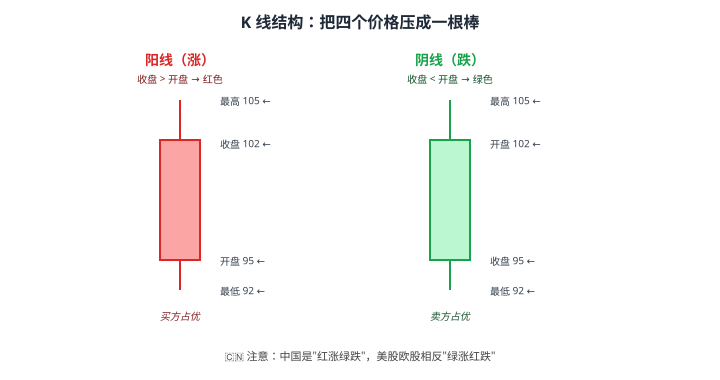
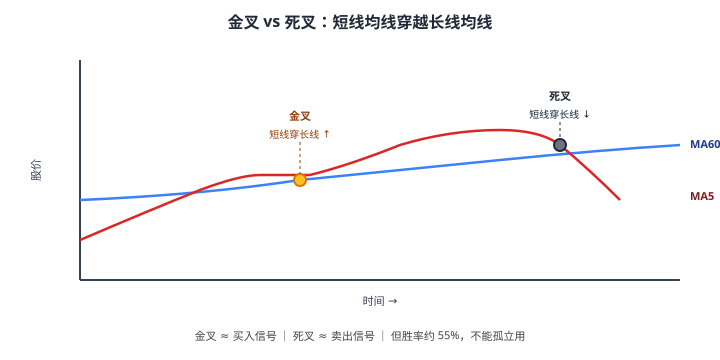
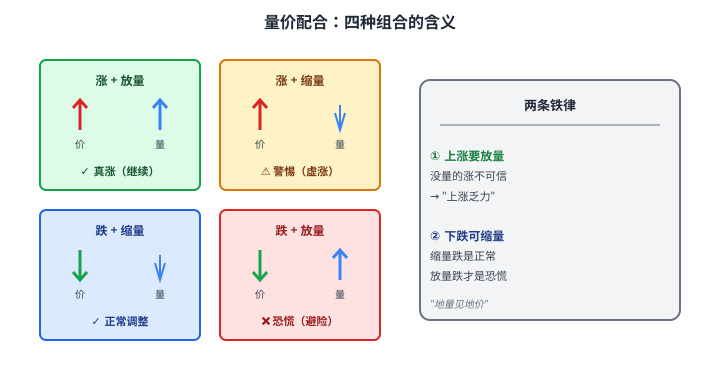

# 20 技术面分析（理性看待）

> **这一章要让你搞懂的事**
> 1. **K 线**：股价的"四个数字"压成一根棒——能看出什么、看不出什么
> 2. **均线**：用"过去 N 天平均价"看趋势——为什么大家盯着 5/20/60/250
> 3. **成交量**：判断 K 线"有没有底气"——量价配合的两条铁律
> 4. **MACD / KDJ / RSI**：三大常见指标——什么时候有用、什么时候废
> 5. **为什么纯技术派难长期赚钱**——三个根本原因
> 6. **技术面的合理用法**：辅助择时，而不是主要决策依据
>
> **入门门槛**
> - 第 17 章：股票市场结构、涨跌停
> - 第 18 章：估值
> - 第 19 章：基本面分析
>
> **声明**：本教程不构成投资建议；所有图形、信号、案例均为教学示例。

---

## 0. 先讲个故事

**老王**和**老李**都在 2020 年初投入 20 万到 A 股。

- **老王**：**纯技术派**。每天盯盘 4 小时，用 MACD、KDJ、均线、K 线形态做短线。
- **老李**：**纯价值派**。买入 3 只低估值蓝筹股就放着，每年看 1 次财报。

**5 年后（2024 年底）**：
- **老王**：账户 24 万。**5 年累计 +20%**（年化 3.7%），其中包括了无数次"今天突破""明天死叉"的紧张。
- **老李**：账户 32 万。**5 年累计 +60%**（年化 9.9%），中间只看过几次手机。

老王没做错——他抓到过几次大涨。**问题是手续费 + 频繁犯错 + 心理消耗 + 错过长期持有的红利**——这些加起来吞掉了大部分收益。

> 这不是说技术分析没用——**而是说"用技术分析做主要决策"几乎一定输给"用基本面做主要决策"**。
>
> 这一章会告诉你：
> 1. 技术指标到底在测什么
> 2. 哪些有"统计依据"哪些是"占卜"
> 3. 怎么把技术面放在正确的位置——**辅助工具**，不是核心。

---

## 1. 技术面分析是什么

### 1.1 一句话

**技术面分析（Technical Analysis）= 通过股价历史走势 + 成交量，预测未来短期价格**。

它和基本面的根本差别：

| 维度 | 基本面 | 技术面 |
|---|---|---|
| 看的是 | 公司"内在价值" | 股价"行为模式" |
| 时间尺度 | 长期（年）| 短期（天 / 周 / 月）|
| 假设 | 价格 = 内在价值（长期）| 历史会重复（重复出现的形态会再次发生）|
| 适合 | 长期持有 | 短期交易 |

### 1.2 三大基本假设

**1）市场行为反映一切**
- 所有信息（公司基本面、政策、情绪）都已经反映在股价里
- → **你不用研究基本面，看股价就够了**

**2）价格沿趋势运动**
- 涨的会继续涨、跌的会继续跌
- → **趋势是朋友**

**3）历史会重复**
- 同样的形态（如"头肩顶"）历史上预示着同样的结果
- → **形态识别就能赚钱**

### 1.3 为什么有人坚信、有人反对

**支持者**：
- 短期股价确实有"动量效应"（涨势会延续）
- 自我实现：很多人都用同样的指标 → 信号触发 → 集体买卖 → 信号"应验"

**反对者**：
- 第一假设"反映一切"和"看图就够了"自相矛盾
- 历史不会精确重复——形态识别本质是事后归因
- 大量学术研究表明：**纯技术派长期跑不赢"买入并持有"**

**理性结论**：技术分析**有局部价值，但不是核心工具**。本章讲清楚边界。

---

## 2. K 线：股价的"四个数字"

### 2.1 一根 K 线在说什么

每根 K 线把**一段时间（日/周/月）**内的 4 个价格画在一起：
- **开盘价**（Open）
- **收盘价**（Close）
- **最高价**（High）
- **最低价**（Low）

**翻译成人话**：
- **实体**（粗的部分）：开盘和收盘之间的范围
- **上影线**：最高价超过实体的部分（"被打压回来"）
- **下影线**：最低价低于实体的部分（"被拉起来"）

### 2.2 几种常见 K 线形态

| 形态 | 长什么样 | 一般解读 |
|---|---|---|
| **大阳线** | 实体很长的阳线、影线短 | 强势上涨 |
| **大阴线** | 实体很长的阴线、影线短 | 强势下跌 |
| **十字星** | 实体很小、上下影线长 | 多空分歧、可能反转 |
| **锤子线** | 下影线很长、实体小 | 跌势末尾的反转信号 |
| **吊颈线** | 形状同锤子线 | 出现在涨势末尾 → 反转下跌 |
| **三只乌鸦** | 连续三根大阴线 | 加速下跌 |
| **红三兵** | 连续三根大阳线 | 强势上涨延续 |

> ⚠️ **重要警告**：**单根 K 线意义有限**。任何"看到锤子线就抄底"的策略，**统计胜率只比掷硬币略高**。
>
> K 线的价值在于"**结合趋势 + 成交量 + 关键价位**"使用——单独看就是占卜。

### 2.3 不同周期的 K 线

| 周期 | 适合 |
|---|---|
| 1 分钟 / 5 分钟 K 线 | 日内交易（量化用，散户别碰）|
| 日 K 线 | 短中线交易（最常用）|
| 周 K 线 | 中线判断 |
| 月 K 线 | 长线判断 |

**核心原则**：**周期越短，噪音越大**。日 K 线大约 60% 是噪音，1 分钟线 95% 是噪音。

---

## 3. 均线：股价的"平滑器"

### 3.1 什么是均线

**均线（Moving Average, MA）= 过去 N 天收盘价的平均值**。

例：MA20 = 过去 20 个交易日收盘价的平均。

**为什么平均**：股价每天上下跳动有噪音，**平均能让"趋势"显出来**。

### 3.2 四条最常用的均线

| 均线 | 代表 | 含义 |
|---|---|---|
| MA5 | 5 日均线 | 短期趋势（一周）|
| MA20 | 20 日均线 | 中短期（一个月）|
| MA60 | 60 日均线 | 中期（一个季度）|
| MA250 | 年线 | 长期趋势（一年）|

**经验规则**：
- **股价 > MA250** → 长期牛市
- **股价 < MA250** → 长期熊市
- **MA250 向上** → 大方向向上
- **MA250 向下** → 大方向向下

### 3.3 金叉、死叉、均线粘合

**金叉（Golden Cross）**：短期均线**从下往上**穿过长期均线 → 偏多信号。
**死叉（Death Cross）**：短期均线**从上往下**穿过长期均线 → 偏空信号。

**均线粘合**：多条均线几乎挤在一起 → 趋势停滞，可能即将"选方向"——粘合后突破，往往伴随大波动。

> 📌 **小白警示**：**单凭"金叉买入、死叉卖出"的胜率约 55%**——只比 50% 高一点。考虑手续费和滑点后，**净胜率往往降到 50% 以下**。
>
> 金叉死叉**适合作为辅助参考**，不适合作为唯一决策依据。

---

## 4. 成交量：K 线的"底气"

### 4.1 量价配合的两条铁律

**铁律一：上涨要放量**
- 股价上涨 + 成交量放大 → **真涨**（很多人买）
- 股价上涨 + 成交量萎缩 → **假涨**（少数人推上去）

**铁律二：下跌可缩量**
- 股价下跌 + 成交量萎缩 → **正常调整**（没人急着卖）
- 股价下跌 + 成交量放大 → **真跌**（恐慌抛售）

### 4.2 一句话总结

**单看 K 线，可能是骗局；K 线 + 成交量，更难骗**。

成交量是"参与者的真实热度"——**这是技术分析中最有统计意义的指标之一**。

### 4.3 量比

**量比** = 当前时段每分钟成交量 / 过去 N 日同期均值

- 量比 > 2 → 成交活跃
- 量比 > 5 → 异动（可能有消息）
- 量比 < 0.5 → 冷清

---

## 5. 三大常用技术指标

### 5.1 MACD（均线趋同发散）

**简介**：MACD 是均线的"加强版"——把短期和长期均线的差距画出来。

**核心三个值**：
- **DIF**：短均线 - 长均线
- **DEA**：DIF 的均线
- **MACD 柱**：DIF - DEA

**经典用法**：
- DIF 上穿 DEA → **金叉**（买入）
- DIF 下穿 DEA → **死叉**（卖出）
- MACD 柱由负转正 → 趋势转好
- **顶背离**（股价创新高但 MACD 没创新高）→ **高位警告**
- **底背离**（股价创新低但 MACD 没创新低）→ **低位回升迹象**

> 📌 **背离是 MACD 最有价值的信号**——金叉死叉胜率一般，**背离的预警率明显更高**。

### 5.2 KDJ（随机指标）

**简介**：衡量股价在"最近 N 天"的相对高低位置。

**经典用法**：
- KDJ 三线都 > 80 → 超买（短期顶）
- KDJ 三线都 < 20 → 超卖（短期底）
- K 线上穿 D 线 → 金叉
- K 线下穿 D 线 → 死叉

**KDJ 的问题**：**钝化**——在强趋势中，KDJ 会一直停在 > 80 或 < 20，发出无效信号。

### 5.3 RSI（相对强弱指标）

**简介**：衡量"近期涨幅"和"近期跌幅"的比值。

| RSI | 含义 |
|---|---|
| > 70 | 超买区 |
| 50 – 70 | 偏强 |
| 30 – 50 | 偏弱 |
| < 30 | 超卖区 |

**经典用法**：
- RSI > 80 持续多日 → 严重超买，警惕回调
- RSI < 20 持续多日 → 严重超卖，可能反弹

**RSI 的问题**：同 KDJ——**在强趋势中钝化**。

### 5.4 三大指标的共同特点

| 特点 | 描述 |
|---|---|
| 都是**滞后指标** | 它们基于过去数据计算，**信号出现时趋势已经走了一半** |
| 都依赖参数 | RSI(6) 和 RSI(14) 信号完全不同——**参数不同，结论不同** |
| 都容易"骗线" | 主力可以制造假金叉、假突破 → **散户被反复"洗"** |
| 都需要组合用 | 单独看任何一个胜率都不高 |

> 💡 **核心认知**：三大指标更适合**"印证"**而不是**"预测"**。如果你已经因为基本面想买/卖，技术指标可以帮你**找一个相对合适的时点**。但**不应该被它们驱动决策**。

---

## 6. 几种"经典形态"

技术派常说"看图就够"——下面是被反复提及的几个形态。我们看看它们到底有多准。

### 6.1 头肩顶（顶部反转）

**形状**：三个峰，中间最高（"头"），左右两个差不多（"肩"）。
**信号**：跌破颈线 → **趋势可能反转向下**
**胜率**：约 55-60%

### 6.2 双底（W 底）

**形状**：两次探到差不多的低点，中间反弹一下。
**信号**：突破颈线 → **可能转为上涨**
**胜率**：约 55-65%

### 6.3 三角形整理

**形状**：高点逐步走低 + 低点逐步走高 → 收口
**信号**：突破方向 = 后续趋势方向
**胜率**：选对方向后约 60%，但**选错方向 = 假突破常见**

### 6.4 一句话总结

**所有形态的胜率都在 50% – 65% 之间**——比硬币好，但远没到"必胜"。

**关键反直觉**：**"形态识别"本质是事后归因**——你打开图，能找到无数个"完美形态"——但**事前没人能 100% 识别**。事后看像头肩顶，事前看可能是"震荡 + 假突破"。

---

## 7. 为什么纯技术派难长期赚钱

### 7.1 三个根本原因

**原因一：信息已被定价**

**有效市场假说**（第 04 章预告、第 18 章铺垫）：
- 股票市场的所有公开信息都已经反映在价格里
- → 通过 K 线、均线"挖出"未来信号是逻辑矛盾的

**反驳**：完全有效市场不存在——市场确实有低效。
**但**：技术派能用的信号，**机构早就用程序化算法割走了**。**散户技术派 = 在机构后面捡碎屑**。

**原因二：自我实现的局限**

很多人坚信"金叉就是买入信号"——所以金叉时大家集体买入，**信号"应验"了**。
但当机构知道"所有人都看金叉"，**他们会主动制造假金叉**——拉一拉、跌下来。**散户买入站岗**。

**这就是 A 股有名的"信号杀"现象**。

**原因三：交易成本侵蚀**

技术派 = 短线交易 → 频繁买卖 → 巨额手续费。

例：A 股一买一卖大约 0.3-0.5% 交易成本。如果一年换手 10 次，**单纯成本就吞掉 3-5%**——超过很多基金的年化超额收益。

### 7.2 学术数据

**多个长期研究表明**：
- 巴克莱研究：1997-2017 年，**纯技术派散户长期年化跑输大盘 4-6%**
- 中国证券业协会数据：A 股活跃散户**约 70% 长期亏损或仅小赚**
- 美股研究：**频繁交易者跑输被动持有者每年平均 6.5%**

### 7.3 例外情况

技术分析**确实有效的场景**：
- 高频量化交易（机构、用算力 + 速度）
- 期货市场（杠杆 + 短期波动放大）
- 部分技术信号在**趋势市**中胜率较高（但震荡市完全失效）

**对散户的结论**：**你不会成为那个例外**。

---

## 8. 技术面的合理用法

虽然纯技术派难赚钱，但**完全不看技术面的价值派也会犯错**——比如在"跌跌不休"的下降趋势中过早抄底。

合理的用法：**技术面作为"择时辅助"**，不作为决策核心。

### 8.1 三个合理用法

**用法一：辅助择时**
- 你通过基本面认定"某股值得买"
- 用技术面判断"现在是不是好时点"
- 例：股价远高于 MA250 + RSI > 80 → 等等再买

**用法二：避免逆势抄底**
- 看到"便宜的股票"想抄底前
- 检查 MA250 走势 → 如果向下 → **降低仓位、分批进**

**用法三：止损执行**
- 你买入后设了止损线（如 -10%）
- 跌到止损位 + 跌破 MA60 → 严格执行
- **避免"再看看吧"陷阱**

### 8.2 一张速查表

| 决策 | 该看 |
|---|---|
| 买什么股票 | **基本面（第 19 章）** |
| 这个价位贵不贵 | **估值（第 18 章）** |
| 现在买还是再等等 | 技术面辅助（本章）|
| 该不该止损 | 技术面 + 纪律 |

### 8.3 给小白的最终建议

| 你想 | 建议 |
|---|---|
| **学技术分析做短线**| **建议不要**——99% 散户长期跑不赢指数 |
| **完全忽略技术面** | 也不必——基本知识有助"看懂行情" |
| **混合用** | 推荐——**基本面 80% + 技术面 20% 的择时** |

---

## 9. 进阶：技术面背后的市场心理学

**入门读者可以跳过本节**。

### 9.1 道氏理论

技术分析的"开山祖师" Charles Dow（道琼斯指数创始人）的核心观点：
- 市场分**主要趋势**（年）、**次要趋势**（月）、**短期波动**（日周）
- 主要趋势有**三阶段**：建仓期 → 跟风期 → 派发期
- 趋势确立后会持续，直到反转信号明确

### 9.2 群体心理

技术分析的有效性，本质上来自**人性的相对稳定**：
- 在高点贪婪买入 → 形成"头部"
- 在低点恐慌抛售 → 形成"底部"
- 在突破阻力位时一致行动 → "突破有效性"

**翻译成人话**：技术指标在"测"的不是股票，是**人类心理**——而人类心理几十年没多大变化。

### 9.3 行为金融学的视角

第 35 章会详细讲行为金融。技术分析中很多概念在学术上有对应：
- "动量效应" ↔ "下注最近赢的"心理
- "支撑/阻力" ↔ "锚定效应"
- "头肩顶" ↔ "群体一致行动后的反转"

**这就是为什么技术分析有局部价值——它和真实的人性挂钩**。

---

## 10. 小结

1. **技术分析 = 通过价格 + 量预测短期走势**——基本面看"价值"，技术面看"行为"。
2. **K 线**是基础语言——单根 K 线意义有限，**结合趋势 + 量才有用**。
3. **均线**揭示趋势——**MA250 是长期方向的关键**。金叉死叉胜率只有 55%。
4. **成交量是技术分析中最有统计意义的指标**——**量价配合两条铁律**值得记住。
5. **三大指标（MACD/KDJ/RSI）**适合"印证"而非"预测"——**MACD 背离是最有价值的信号**。
6. **形态识别本质是事后归因**——胜率多在 50-65%，且容易"骗线"。
7. **纯技术派长期难赚钱**——信息已被定价 + 自我实现的局限 + 交易成本侵蚀。
8. **合理用法**：基本面 80% + 技术面 20%——技术面用于**择时辅助、避免逆势抄底、止损执行**。

> 🔗 **承上启下**：到此为止，你已经懂了股票市场的"结构 + 估值 + 基本面 + 技术面"——能自己评估一只股票了。
>
> 但**普通人不一定要直接买股票**——下一章 **21 指数与指数基金** 会告诉你：**为什么"买指数 = 买中国/美国的未来"是更优秀的策略**，以及如何用 50 块钱就能买到"沪深 300 一篮子"。

---

## 自测题

> 答案在文末折叠区。先自己算，再对照。

1. 一根 K 线长这样：开盘 100、收盘 95、最高 102、最低 90。请描述它的颜色、实体长度、上下影线长度。
2. 股价 60 元、MA250 = 75 元。这意味着什么？该不该买入？
3. "金叉买入"的胜率大约多少？为什么"看起来神奇"但实际效果不好？
4. 某股票连续 5 天上涨，但每天成交量在递减。这是什么信号？
5. RSI 一直 > 80 持续 10 天，朋友说"超买，必跌"。你怎么回答？
6. **进阶题**：你通过基本面确定"某蓝筹股值得买"，但当前股价 35 元，MA250 = 50 元（向下），RSI 25。你怎么操作？
7. **作业题**：选一只你关注的股票，打开它的日 K 线图：(a) 当前股价在 MA60 上方还是下方？(b) MA250 趋势向上还是向下？(c) MACD 在 0 轴上方还是下方？(d) 近 20 天有没有量价配合的"放量上涨"或"放量下跌"信号？综合判断它当前的技术面是偏多还是偏空。

📖 参考答案（点击展开）

1. 阴线（收盘 < 开盘 → 中国是绿色）；实体长度 = 100-95 = 5；上影线 = 102-100 = 2（开盘 100 是实体顶）；下影线 = 95-90 = 5（收盘 95 是实体底）。
2. 股价**远低于年线**，说明长期处于下跌趋势中。**单纯技术面不该买**。但如果基本面足够好（如 ROE 持续 > 15%、PE 历史低位），可以**分批小仓位试探**，但要做好"还会跌"的心理准备。
3. 胜率约 **55%**——比硬币高一点点。看起来神奇是**事后归因**——你只记得"金叉后涨了"的次数，**忘了"金叉后跌了"的次数**。考虑手续费后**净胜率往往 < 50%**。
4. **量价背离**——上涨 + 缩量 → "虚涨"信号。可能意味着上涨动能不足，**接下来可能回调**。这是量价配合的经典反例。
5. **不对**。RSI 持续 > 80 是**强势市场的特征，不是回调信号**。在 2020 年新能源、2024 年部分 AI 股票上，RSI 长时间钝化在 80+ 而股价持续上涨。**RSI 在强趋势中失效**——单凭超买信号做反向操作是常见亏损方式。
6. 这是**基本面+技术面冲突**的典型场景。建议：(i) **分批买入**（如 30% 仓位）；(ii) 等技术面好转后加仓——例如等股价突破 MA60 + RSI 修复到 40+；(iii) **设止损**——如再跌 15% 严格止损。**不要一次性满仓"抄底"**——下降趋势中"便宜还能更便宜"。
7. 没有标准答案。检查清单：✓ 四项数据都看到了 ✓ 综合判断（不孤立看任何一个）。如果发现自己"基本面看好但技术面持续偏空"，**这是分批进、保留弹药的好时机**——不是All In的好时机。

---

## 延伸阅读

- 《股票大作手回忆录》(*Reminiscences of a Stock Operator*) —— Edwin Lefèvre：技术派的圣经，但更多是"投机心理"
- 《金融市场技术分析》—— John Murphy：技术分析的标准教材
- 《非凡的成功》(*Winning the Loser's Game*) —— Charles Ellis：用数据论证为什么"被动持有 > 主动交易"
- 《一个交易者的资金管理系统》—— Bennett A. McDowell：技术派的资金管理（如果你坚持要做技术派）
- 学术论文：Brock, Lakonishok, LeBaron (1992)《Simple Technical Trading Rules and the Stochastic Properties of Stock Returns》——技术指标有效性的实证研究
- 《漫步华尔街》—— Burton Malkiel：第 6-7 章批评技术分析，与本章观点呼应

---

## 下一章预告

**21 指数与指数基金** —— 进入"普通人最优策略"：
- **指数**是什么——沪深 300、中证 500、创业板指、纳斯达克 100 怎么算出来的
- **指数基金**：用 50 块钱买"一篮子股票"
- **宽基 vs 行业 vs Smart Beta**——三种指数的差别
- **沪深 300、中证 500、上证 50、中证 1000**——A 股四大宽基的定位
- **为什么"指数基金 + 长期持有"是普通人 95% 适合的策略**——巴菲特立遗嘱推荐
- **Smart Beta**：红利、低波、价值——"指数升级版"
