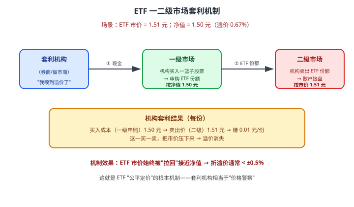

# 22 ETF 与 LOF

> **这一章要让你搞懂的事**
> 1. **ETF** 到底比"普通指数基金"好在哪——为什么管理费能压到 0.15%
> 2. **LOF**：场内场外都能买的"两栖基金"——以及它为什么"样样不精"
> 3. **一二级市场套利机制**——为什么 ETF 折溢价"不会太离谱"
> 4. **申赎清单（PCF）**：ETF 背后"实物申赎"的核心
> 5. **跟踪误差**为什么会出现——以及怎么挑误差最小的
> 6. **杠杆 ETF / 反向 ETF / 跨境 ETF**：散户最容易踩的坑
>
> **入门门槛**
> - 第 17 章：股票市场结构（交易所、T+0/T+1）
> - 第 21 章：指数与指数基金
>
> **声明**：本教程不构成投资建议；所有 ETF 代码、规模、费率均为教学示例。

---

## 📖 本章英文缩写速查

> 看到不认识的英文缩写，先回这张表查；完整术语见 [GLOSSARY.md](../GLOSSARY.md)。

| 缩写 | 英文全称 | 中文含义 |
|---|---|---|
| **ETF** | Exchange-Traded Fund | 交易所交易基金 |
| **LOF** | Listed Open-Ended Fund | 上市型开放式基金 |
| **QDII** | Qualified Domestic Institutional Investor | 合格境内机构投资者，借道投资海外的渠道 |
| **PCF** | Portfolio Composition File | ETF 申赎清单 |
| **IOPV** | Indicative Optimized Portfolio Value | ETF 实时参考净值 |
| **RMB** | Renminbi | 人民币 |
| **NAV** | Net Asset Value | 基金/资产净值 |

---

## 0. 先讲个故事

**小张**和**小李** 2020 年同时看好沪深 300，各拿出 50 万。

- **小张**走"传统路线"：在天天基金 APP 买**"易方达沪深 300 指数基金（LOF）"**——年管理费 0.6%，T+1 申购、T+2 到账。
- **小李**走"场内路线"：开了券商账户，买**"华泰柏瑞沪深 300 ETF"（510300）**——年管理费 0.15%，T+0 实时成交。

**5 年后**（假设沪深 300 累计涨 30%）：

| 项目 | 小张（LOF）| 小李（ETF）|
|---|---|---|
| 本金 | 50 万 | 50 万 |
| 累计回报 | 30% × （1 - 0.6% × 5）= **+27%** | 30% × （1 - 0.15% × 5）= **+29.25%** |
| 5 年终值 | 63.5 万 | **64.6 万** |
| 差额 | — | **+1.1 万** |

小李多赚 1.1 万——**仅仅因为换了"载体"**。

**但故事还没完**：2021 年某天小李发现自己买入的 ETF 当天**比净值贵 0.8%**（溢价）——他买亏了。又有一次他想卖时**比净值便宜 0.3%**（折价）—— 卖亏了。

> 这一章告诉你三件事：
> 1. **ETF 是指数基金的"加强版"**——费率更低、流动性更好
> 2. **但 ETF 有"折溢价"这个新概念**——你必须懂"市价 vs 净值"
> 3. **杠杆 / 反向 / 跨境 ETF 是另一回事**——别拿它们当"普通 ETF"持有

---

## 1. ETF 到底是什么

### 1.1 名字解释

**ETF = Exchange Traded Fund，交易所交易基金**。

三个词，三个特征：

| 词 | 含义 |
|---|---|
| **Exchange**（交易所）| 在沪深交易所**上市挂牌**，有代码、有买卖盘 |
| **Traded**（交易）| 像股票一样**实时买卖**——T+0 / T+1 |
| **Fund**（基金）| 本质是基金——背后有"一篮子股票" |

### 1.2 ETF 的三大特征

### 1.3 ETF 的"两个价格"

这是 ETF 区别于普通基金最重要的点：

| 价格 | 含义 | 更新频率 |
|---|---|---|
| **净值（NAV）** | 一份 ETF 背后的资产实际值多少钱 | 每天 1 次（盘后公布） |
| **市价（Price）** | 交易所撮合成交的实时价 | **每秒变化** |

**例**：某沪深 300 ETF
- 昨日净值 1.500 元/份
- 今天市价区间 1.498 - 1.502 元/份
- 你**实时成交的是市价**——不是净值

### 1.4 中国 ETF 历史

| 年份 | 事件 |
|---|---|
| 2004 | 中国第一只 ETF——**上证 50 ETF（510050）**上市 |
| 2005-2010 | 缓慢发展 |
| 2012 | 沪深 300 ETF 上市，规模快速增长 |
| 2018-2020 | 行业 ETF / Smart Beta ETF 爆发 |
| 2024 | 中国 ETF 总规模突破 **2.5 万亿**，**沪深 300 ETF 总规模超 5000 亿** |

---

## 2. LOF 是什么

### 2.1 名字解释

**LOF = Listed Open-Ended Fund，上市型开放式基金**。

意思是：**在交易所"挂牌"的开放式基金**。它有"两栖"特征：
- 在**场外**（基金 APP）按净值申购赎回
- 在**场内**（券商账户）按市价买卖

### 2.2 ETF vs LOF 的核心区别

| 维度 | ETF | LOF |
|---|---|---|
| **本质** | 实物申赎 | 现金申赎 |
| **场外申赎** | **通常不能**（要券商账户）| ✓ 可以 |
| **场内交易** | ✓ | ✓ |
| **管理费** | 0.15-0.5% | 0.5-1.0% |
| **跟踪误差** | 极小（< 0.5%）| 较大（0.5-1.5%）|
| **流动性** | 通常好 | 一般 |
| **典型用途** | 指数投资主力 | 部分主动型 LOF |

### 2.3 为什么 LOF "样样不精"

**LOF 的初衷**：让"场外基金"也能在场内交易——增加流动性。

**但实际上**：
- **场内成交量小**——多数 LOF 日成交几百万，流动性差
- **场外申赎**——和普通基金没区别
- **场内场外价差**——经常出现 1-3% 的折溢价但**没有套利机制压制**

> 💡 **结论**：LOF 是个"过渡形态"——**多数情况下 ETF 是更好的选择**。LOF 适合**只有 LOF 形式没有 ETF 形式的特殊指数 / 主动基金**。

---

## 3. ETF 的"一二级市场"机制

这是 ETF **最核心、也最容易让人迷惑的部分**。

### 3.1 两个市场

| 市场 | 谁参与 | 怎么交易 |
|---|---|---|
| **一级市场**（申赎）| **大型机构**（券商、做市商）| 用**一篮子股票**换 ETF 份额（或反过来）|
| **二级市场**（买卖）| **所有人**（含散户）| 在交易所**用现金买卖** ETF |

**关键**：散户**只能在二级市场**买卖 ETF；机构**可以两个市场都玩**。

### 3.2 实物申赎是什么

**普通基金**：你给基金公司 1 万元 → 基金公司用这 1 万元去买股票 → 给你 1 万元/净值 份额。

**ETF 实物申赎**：你（机构）给基金公司 **300 万元一篮子沪深 300 成分股**（按 PCF 清单的精确配比）→ 基金公司给你**一筐 ETF 份额**（"申赎单位"100 万份）。

**为什么这样设计**：
- 基金公司**不用动手交易**——降低成本
- **散户的赎回不影响其他人**——基金不用卖股套现

### 3.3 申赎清单（PCF, Portfolio Composition File）

**定义**：基金公司每天公布的"今天申购/赎回一筐 ETF 需要交付/收回哪些股票"的清单。

**举例**：沪深 300 ETF 的 PCF 可能写：
- 工商银行 800 股
- 贵州茅台 5 股
- 宁德时代 25 股
- ……（300 只股票）
- + 约 1% 现金

**机构如何用**：
- 想申购：去市场扫货这 300 只股票 → 提交给基金公司 → 拿 ETF 份额
- 想赎回：把 ETF 份额给基金公司 → 拿回这 300 只股票

### 3.4 申赎机制的图示

**反过来——ETF 折价（市价 < 净值）**：
1. 机构在**二级市场**买入折价 ETF
2. 在**一级市场**赎回 → 拿一篮子股票
3. 把股票卖掉 → 收回现金 + 赚差价
4. 这一买一卖把市价**推回净值**

### 3.5 这给散户的启示

**好消息**：你在二级市场买 ETF，**价格基本公允**——不会买到"严重溢价"的 ETF。

**坏消息**：套利机制**不是 100% 完美**——以下场景套利失灵：
- **小规模 ETF**（< 5 亿）：流动性差，机构懒得套利 → 折溢价可能 1-3%
- **跨境 ETF**（QDII-ETF）：境外股票当时不交易（时差）→ 套利不及时 → 折溢价可能 3-5%
- **极端行情**：单日大涨大跌时，套利机构来不及反应

---

## 4. 折溢价：散户的"小波段"机会

### 4.1 如何判断折溢价

**实时溢价率（IOPV）**：交易所每 15 秒计算一次"理论净值"——叫 **IOPV**（Indicative Optimized Portfolio Value）。

**公式**：

$$
\text{溢价率} = \frac{\text{市价} - \text{IOPV}}{\text{IOPV}} \times 100\%
$$

**多数 ETF 软件直接显示这个数字**。

### 4.2 散户的简单规则

| 情况 | 怎么做 |
|---|---|
| 溢价 > 0.5% | **暂缓买入**——等几分钟通常会回归 |
| 折价 > 0.5% | **可以买入**——便宜买"打折货" |
| 跨境 ETF 溢价 > 3% | **绝对不要追**——容易被"杀溢价"|

### 4.3 跨境 ETF 的"溢价陷阱"

**典型案例**：纳斯达克 100 ETF（513100）等跨境产品。

**机制**：
- 美股夜盘 / 节假日 → 中国市场仍开盘 → 但美股不交易
- 中国投资者预期"明早美股开盘要涨" → 抢着买跨境 ETF → 推高溢价
- **2022 年**：某美股 ETF 单日溢价 **40%+**
- **基金公司公告**："本基金存在大额溢价风险"
- 套利无效（QDII 额度受限）→ 溢价持续
- 某天**美股突然跌** → 中国 ETF 市价大跌 → **杀溢价 + 杀股价 = 双杀**

> ⚠️ **散户血泪教训**：跨境 ETF 看到 5%+ 溢价时**坚决不追**。一旦溢价回归，**你比标的指数多亏 5-40%**。

---

## 5. 跟踪误差：选 ETF 的核心指标

### 5.1 什么是跟踪误差

**跟踪误差（Tracking Error）= ETF 实际回报与指数回报之间的偏差**。

理想情况：ETF 完美复制指数 → 跟踪误差 = 0
实际：永远有误差（费用 + 操作摩擦）

### 5.2 跟踪误差的来源

| 来源 | 影响 |
|---|---|
| **管理费 + 托管费** | 永久拖累（每年 -0.15% 到 -0.5%）|
| **现金留存** | 5% 留存现金应付赎回 → 指数涨时拖累 |
| **分红时间差** | 成分股分红到 ETF 收到现金有滞后 |
| **复制方式** | "完全复制"误差小；"抽样复制"误差大 |
| **调仓成本** | 指数调样时被迫交易，有买卖差价 |
| **新股 / 停牌股处理** | 估值偏差 |

### 5.3 优秀 ETF 的标准

| 跟踪误差 | 评价 |
|---|---|
| < 0.3%/年 | 优秀（头部宽基 ETF）|
| 0.3-0.7%/年 | 合格 |
| 0.7-1.5%/年 | 一般 |
| > 1.5%/年 | 差（需排查原因）|

### 5.4 怎么查跟踪误差

- **基金季报 / 年报**：必披露"跟踪误差"
- **基金平台**（天天基金、雪球）：基金详情页直接显示
- **简单算法**：（ETF 涨幅 - 指数涨幅）的绝对值年化

---

## 6. ETF 的特殊种类：散户的雷区

### 6.1 杠杆 ETF / 反向 ETF

| 类型 | 含义 | 例子（境外）|
|---|---|---|
| **2 倍杠杆** | 指数涨 1% → ETF 涨 2% | TQQQ（纳斯达克 3 倍）|
| **反向** | 指数涨 1% → ETF 跌 1% | PSQ（纳斯达克反向）|
| **3 倍反向** | 指数涨 1% → ETF 跌 3% | SQQQ |

**中国市场**：**目前没有杠杆 / 反向 ETF**（监管未批），但有 **"分级基金"** 的杠杆 B 类，**2020 年已全部清盘**。境外有大量。

### 6.2 为什么不建议长期持有——"波动磨损"

**核心问题**：杠杆 / 反向 ETF **每天重设杠杆**——长期持有会因为复利结构出现"磨损"。

**例**：指数 100 → 涨 10% 到 110 → 跌 9.1% 回到 100（指数完美回归）

| 工具 | 第 1 天 | 第 2 天 | 净变化 |
|---|---|---|---|
| 指数 | +10% | -9.1% | **0%** |
| 2 倍 ETF | +20% → 120 | -18.2% → 98.16 | **-1.84%** |
| 3 倍 ETF | +30% → 130 | -27.3% → 94.51 | **-5.49%** |

**翻译成人话**：指数原地不动一年后，2 倍 ETF 可能**亏 10-20%**，3 倍 ETF 可能**亏 30-50%**——纯粹来自"每日重置杠杆"的数学损耗。

> ⚠️ **黄金法则**：杠杆 / 反向 ETF **只适合"几天到几周"的短线**。**绝对不要长期持有**——即使你看对方向，时间也会吞噬你的本金。

### 6.3 商品 ETF

| 类型 | 例子 | 注意 |
|---|---|---|
| **黄金 ETF** | 华安黄金（518880）| 跟踪现货金 + 持有实物 |
| **白银 ETF** | 国泰白银（518880 类似）| 类似黄金 |
| **原油 ETF** | 南方原油（501018）| 跟踪原油期货——**有展期成本** |

**原油 ETF 的展期陷阱**：
- 原油 ETF 持有的是**原油期货**，不是实物原油
- 期货合约**到期前必须换月**——叫"展期"
- 升水市场（远月价 > 近月价）→ 每次展期亏一点 → **长期持有"磨损严重"**
- 2020 年中行"原油宝"事件就和展期 / 移仓机制相关

### 6.4 跨境 ETF

| 类型 | 例子 | 风险 |
|---|---|---|
| **QDII-ETF** | 纳指 100（513100）、标普 500（513500）| 时差 + 汇率 + 额度限制 |
| **港股 ETF** | 恒生 ETF（159920）| 港股 T+0，时差小 |
| **海外行业** | 中概互联（513050）| 双重风险（行业 + 跨境）|

**散户使用 QDII-ETF 的注意**：
- 看到 **3%+ 溢价坚决不追**
- 美股节假日时**国内 QDII 市价是"猜的"**——不要重仓
- 优先**场外 QDII 基金**——按净值申赎，无溢价

---

## 7. ETF vs LOF vs 普通指数基金

### 7.1 三者对比

| 维度 | ETF | LOF | 普通指数基金 |
|---|---|---|---|
| **场所** | 场内（券商账户） | 场内 + 场外 | 场外（基金 APP） |
| **交易方式** | 实时（T+0 / T+1）| 实时 / 申赎 | 仅申赎（T+1 / T+2） |
| **管理费** | 最低（0.15%）| 中（0.5%）| 中等（0.3-0.5%）|
| **最小金额** | **100 元**（1 手）| 不固定 | **10 元** |
| **定投** | 部分券商支持 | 支持 | **最方便** |
| **跟踪误差** | 最小 | 中 | 中 |
| **股息处理** | 默认分红 | 默认分红 | **可选再投资** |

### 7.2 选哪个

| 用户场景 | 推荐 |
|---|---|
| 已有券商账户 + 单笔投入 ≥ 5000 元 | **ETF** |
| 想定投 + 单笔金额小 + 不爱看盘 | **普通指数基金** 或 **ETF 联接基金** |
| 特殊指数只有 LOF 形式 | LOF |
| 想用红利再投资省时间 | **普通指数基金** |

> 💡 **"ETF 联接基金"**：是基金公司发行的"投资单一 ETF 的场外基金"——本质是 **"场外可定投的 ETF 包装"**。比如"沪深 300 ETF 联接（A/C 类）"投资的就是沪深 300 ETF。**适合喜欢场外定投又想要 ETF 低费率的人**。

---

## 8. 实操指南

### 8.1 怎么开通场内 ETF

1. 开**券商账户**（必须，任意一家：华泰/中信/招商/东方财富等）
2. 默认开通的是**A 股账户** —— **可以直接买 ETF**（无需额外权限）
3. 部分**特殊 ETF 需要权限**：
   - 跨境 ETF：通常自动开通
   - 商品 ETF（如黄金）：自动开通
   - 期权 ETF：需"金融期权"权限（验资 50 万 + 经验测试）

### 8.2 交易费率

| 费用 | 金额 |
|---|---|
| **佣金** | 万 1 到 万 2.5（与股票相同）|
| **印花税** | **免**！（ETF 免印花税，股票 0.05%）|
| **管理费** | 已包含在净值里 |
| **过户费 / 经手费** | 极小（万 0.04）|

**结论**：**ETF 交易成本比股票低**——尤其没有印花税这一项，**短线频繁交易 ETF 比股票省 50%+ 成本**。

### 8.3 选 ETF 的四步

| 步骤 | 怎么看 |
|---|---|
| **① 选指数** | 沪深 300 / 中证 500 / 标普 500……（详见第 21 章）|
| **② 选规模** | **优选规模 > 50 亿** —— 流动性好、套利活跃 |
| **③ 比费率** | 跟踪同指数的多只 ETF，**选最低费率的** |
| **④ 比误差** | 1 年跟踪误差 < 0.5% 优先 |

**例**：买"沪深 300 ETF"——市场上有 20 多只
- 华泰柏瑞沪深 300（510300）：规模 5000+ 亿，费率 0.15%
- 易方达沪深 300（510310）：规模 1000+ 亿，费率 0.15%
- 嘉实沪深 300（159919）：规模 200+ 亿，费率 0.5%

**选哪个**：**第一个**——规模最大、费率最低、流动性最好。

### 8.4 ETF 怎么定投

**两种方式**：

| 方式 | 怎么做 | 适合 |
|---|---|---|
| **场内手动定投** | 每月固定日期在券商 APP 买入 1 笔 | 喜欢自己控制 |
| **场外 ETF 联接定投** | 在基金 APP 设置自动定投 | 懒人模式 |

**ETF 联接基金代码**：通常在 ETF 代码末尾 +"A" 或"C"。例如：
- 沪深 300 ETF：510300（场内）
- 沪深 300 ETF 联接 A：110020（场外）
- 沪深 300 ETF 联接 C：007339（场外，**无申购费但 0.4% 销售服务费**）

> 💡 **C 类适合频繁操作的人**（无申购费），**A 类适合长期持有的人**（销售服务费长期累计高）。

---

## 9. 进阶讨论

**入门读者可以跳过本节**。

### 9.1 ETF 的"做市商制度"

中国 ETF 实行**主做市商制度**：
- 基金公司指定 1-3 家券商做"主做市商"
- 主做市商有**义务提供双向报价**——保证流动性
- **激励**：套利收益 + 管理费返点

**结果**：头部 ETF（如华泰柏瑞 300）双向报价价差通常 **< 0.05%**——可以"贴着净值"成交。

### 9.2 ETF 期权

**期权 ETF**：50ETF 期权（510050）、沪深 300ETF 期权（510300 / 159919）。

- **开户门槛**：50 万元 + 经验测试 + 模拟交易
- **用途**：套保、增强收益、投机
- 详见第 27 章（期权基础）

### 9.3 全球 ETF 生态

| 国家 | 总规模（2024）| 主要厂商 |
|---|---|---|
| 美国 | **$7 万亿** | iShares（贝莱德）/ Vanguard / SPDR |
| 欧洲 | $1.5 万亿 | iShares / Lyxor |
| 日本 | $0.5 万亿 | Nomura / Daiwa |
| 中国 | 2.5 万亿 RMB（≈ $0.35 万亿）| 华夏 / 易方达 / 华泰柏瑞 |

**美国 ETF 多样性极高**：
- 主题（云计算、网络安全、机器人）
- 因子（动量、低波、价值）
- 高级（基于 AI 选股的 ETF）
- 加密资产（比特币 ETF 2024 年获批）

中国 ETF 正在快速追赶——预计 2030 年突破 8 万亿 RMB。

### 9.4 主动管理 ETF（Active ETF）

**新趋势**：ETF 不仅可以是被动的（跟踪指数），也可以是**主动管理**的。

**例**：美国 ARK 创新 ETF（Cathie Wood 管理）——主动选股、ETF 形态。

**中国**：2024 年**首批"主动管理 ETF"获批**，但规模仍小。**未来可能改变 ETF "= 指数" 的传统认知**。

### 9.5 ETF 的"集中度问题"

**问题**：随着头部 ETF 规模过大（如沪深 300 ETF 5000 亿），出现新现象：
- ETF 持有沪深 300 成分股**比例过高**
- 指数调样时**冲击成分股股价**（被动买卖压力）
- **市场定价效率**可能下降——"垃圾股也涨"

学界争论：被动投资过度普及是否导致市场"无效"？目前没有定论。

---

## 10. 小结

1. **ETF = 在交易所上市的"实时交易基金"**。三大特征：像股票交易、管理费极低（0.15-0.5%）、实物申赎。
2. **ETF 有"两个价格"**：净值（每日 1 次）vs 市价（实时）。**实时成交按市价**。
3. **LOF = 场内 + 场外都能买的两栖基金**。但**多数情况下 ETF 更优**——LOF 适合"只有 LOF 形式"的特殊产品。
4. **一二级市场套利机制**让 ETF 折溢价**通常 < ±0.5%**。但**跨境 ETF、小规模 ETF、极端行情**下套利会失灵。
5. **散户的折溢价规则**：溢价 > 0.5% 暂缓；折价 > 0.5% 可买；**跨境 ETF 溢价 > 3% 坚决不追**。
6. **跟踪误差**：< 0.3%/年优秀。选 ETF 看**规模 + 费率 + 跟踪误差**三大指标。
7. **杠杆 / 反向 ETF 不要长期持有** —— "每日重置杠杆"导致波动磨损，**指数原地不动 = 你长期亏损**。
8. **场内 ETF vs 场外联接基金**：单笔大额选场内 ETF；定投选场外 ETF 联接 C 类。**两者本质一样**。

> 🔗 **承上启下**：到此为止你掌握的都是 **"被动投资"** 工具——指数基金 / ETF 跟踪市场，不靠基金经理。但市场上还有海量**主动型基金**——它们能不能跑赢指数？为什么"明星基金经理"经常让人失望？下一章 **23 主动型基金** 会回答这些问题，并讲清楚**"主动 vs 被动"**这场持续 50 年的辩论。

---

## 自测题

> 答案在文末折叠区。先自己算，再对照。

1. ETF 和"普通指数基金"的最大区别是什么？为什么 ETF 的管理费能压到 0.15%？
2. 你想买沪深 300 ETF，开盘后看到：净值 1.500、市价 1.510。该不该立刻买入？
3. 一二级市场套利是怎么工作的？为什么它能让 ETF 折溢价"不会太离谱"？
4. 跨境 QDII-ETF 经常出现 5%+ 的溢价。这种情况下你应该怎么做？为什么？
5. 某 ETF 跟踪沪深 300 指数：
   - 第 1 天：沪深 300 涨 5%
   - 第 2 天：沪深 300 跌 4.76%（完美回归）
   - 如果是 2 倍杠杆 ETF，这两天的累计变化是多少？
6. ETF 比股票交易便宜在哪里？说出 2 个具体的费用差异。
7. **进阶题**：你有 10 万元想投资沪深 300。两个选择：
   - 选项 A：买华泰柏瑞沪深 300 ETF（场内），费率 0.15%
   - 选项 B：买沪深 300 ETF 联接 C 类（场外），费率 0.15% + 销售服务费 0.4%/年
   你计划持有 5 年。两者哪个划算？多多少？
8. **作业题**：打开你的券商账户，搜索"沪深 300 ETF"。**记录**前 5 只跟踪该指数的 ETF：
   - ① 名称 + 代码
   - ② 规模（基金详情可看）
   - ③ 管理费率
   - ④ 近 1 年跟踪误差
   按"规模 + 费率 + 误差" 综合排序，**选出你认为最优的一只**。说明理由。

📖 参考答案（点击展开）

1. **最大区别**：ETF 在**交易所实时交易**（T+0/T+1），普通指数基金**按净值申赎**（T+1/T+2）。
   **管理费低的原因**：ETF 使用**实物申赎**——基金公司不用动手买卖股票（机构带着一篮子股票来换），降低交易成本 + 调仓成本 + 现金管理成本，所以管理费能压到极低。

2. **不该立刻买**——市价 1.510 比净值 1.500 溢价 0.67% > 0.5% 的常态范围。**等几分钟或换一只同类 ETF**——溢价通常会被套利机构压回。**多花 0.67% 等于白送 670 元/10 万**——不值得。

3. **机制**：
   - **溢价时**：套利机构在一级市场（按净值）申购 ETF → 在二级市场（按市价）卖出 → 赚价差 → 卖出压力让市价下降 → 溢价消失。
   - **折价时**：反之——机构二级买入 → 一级赎回 → 卖股套现 → 推高市价。
   - **结果**：折溢价不会持续偏离 → 通常 ±0.5% 内。**这就是 "ETF 公平定价" 的根本机制**——套利机构相当于市场的"价格警察"。

4. **坚决不要追**。**原因**：
   - **套利失灵**：跨境 ETF 因 QDII 额度限制，机构无法自由申赎 → 溢价持续
   - **杀溢价风险**：一旦海外市场未达预期，市价会**先于海外指数大跌**——溢价回归 = 双重亏损
   - **历史教训**：2022 年某美股 ETF 溢价 40%+ 后腰斩
   - **替代方案**：买**场外 QDII 基金**（按净值申赎，无溢价问题）

5. 
   - 沪深 300：100 → 105 → 100（+0% 净）
   - 2 倍杠杆 ETF：
     - 第 1 天：100 × (1 + 5% × 2) = 110
     - 第 2 天：110 × (1 - 4.76% × 2) = 110 × (1 - 9.52%) = 99.53
   - **累计变化 -0.47%**——指数原地，杠杆 ETF 亏 0.47%
   - 长期看，这种"波动磨损" 累积非常可观——**一年下来杠杆 ETF 可能亏 5-15%，即使指数原地不动**。

6. ① **印花税**：股票卖出收 0.05%，**ETF 免印花税**——卖 10 万元省 50 元
   ② **佣金率**：相同，但 ETF 没有"过户费 vs 大宗交易差价"等细节
   ③ **管理费**：ETF 已含在净值里，不需额外付（股票无管理费但有市场利差等隐性成本）
   ④ 综合：**短线频繁交易 ETF 比股票省 50%+ 成本**。

7. 5 年总成本：
   - **选项 A（ETF）**：0.15% × 5 = **0.75%**
   - **选项 B（C 类）**：(0.15% + 0.4%) × 5 = **2.75%**
   - 差 2% × 10 万 = **2,000 元**
   - **选项 A 更划算**——尤其大额长期持有。**但选项 A 需要券商账户 + 手动操作**，选项 B 可定投。如果你能管住每月手动买入 → 选 A；如果你想"设了就忘"自动定投 → 选 B 牺牲 2,000 元换便利。

8. 没有标准答案。**重点检查**：
   - 头部 ETF 一般都是 华泰柏瑞 510300、易方达 510310、嘉实 159919、华夏 510330——前 2 名规模通常超 1000 亿
   - **优选标准**：规模 > 100 亿 + 费率 0.15% + 跟踪误差 < 0.3%
   - **避坑**：规模 < 5 亿的"小 ETF" —— 流动性差、可能清盘
   - **小贴士**：在券商交易软件按"成交额"排序 ETF——成交额前几名通常是流动性最好的

---

## 延伸阅读

- 《ETF 投资圣经》(*The ETF Book*) —— Richard Ferri：ETF 投资的全球综述
- 《指数基金投资指南》—— 银行螺丝钉：偏 A 股语境，ETF 实战导向
- 《华尔街教父：本杰明·格雷厄姆》—— 经典价值投资圣经，理解被动投资的哲学起点
- 中证指数官网：[csindex.com.cn](http://www.csindex.com.cn/) —— 查 ETF 跟踪的指数细节
- 沪深交易所：[ETF 公告](http://www.sse.com.cn/) / [深交所](http://www.szse.cn/) —— 查 PCF、规模、做市商
- **集思录** [jisilu.cn](https://www.jisilu.cn/)：ETF 实时溢价数据 + 折溢价历史
- **天天基金 / 雪球**：ETF 详情页可看跟踪误差、规模历史

---

## 下一章预告

**23 主动型基金** —— 持续 50 年的"主动 vs 被动"辩论：
- 主动基金到底是什么——和指数基金的本质区别
- **基金经理**：明星制度的兴起与衰落
- **规模魔咒**：为什么基金涨太多就会变差
- **明星基金的均值回归**：今年第一名，明年大概率不是
- 主动基金的费率结构——为什么"业绩提成"是双刃剑
- 中国主动基金的"风格漂移"和"老鼠仓"风险
- 怎么看一只主动基金：基金经理 + 持仓 + 风格 + 业绩稳定性
