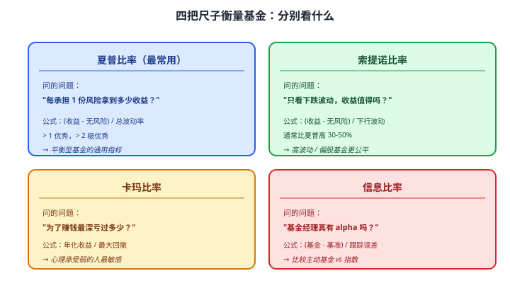
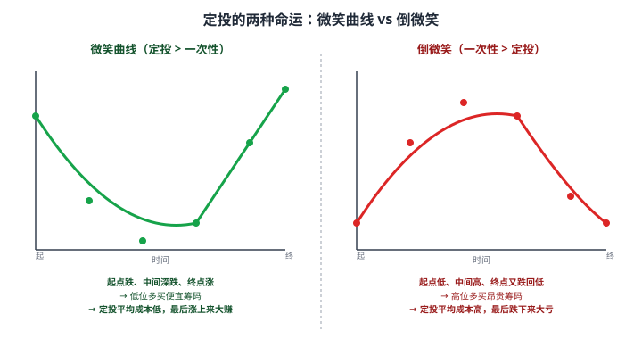

# 24 基金筛选与持有

> **这一章要让你搞懂的事**
> 1. **夏普 / 索提诺 / 卡玛 / 信息比率**：定量比较基金的 4 把尺子
> 2. **晨星评级**：5 颗星怎么算的，能信吗
> 3. **定投 vs 一次性买入**：哪个更优，有没有标准答案
> 4. **基金组合**：怎么搭配 3-5 只基金降低风险
> 5. **赎回时机**：什么时候该卖、什么时候该忍
> 6. **简单跟踪复盘机制**：让你 5 年后不至于"完全忘了买过什么"
>
> **入门门槛**
> - 第 04 章：波动率、最大回撤、夏普比率
> - 第 22 章：ETF
> - 第 23 章：主动基金
>
> **声明**：本教程不构成投资建议；所有基金、数据、组合均为教学示例。

---

## 0. 先讲个故事

**小李** 和 **小王** 都是 2018 年开始定投基金的 90 后程序员，月薪都是 2 万，每月固定投 **5,000 元**到基金。

**小李的做法**：
- 选了 3 只基金：**沪深 300 ETF + 中证 500 ETF + 一只长期医药主题基金**（"核心-卫星"结构）
- 每月 15 日定投，**不看排行榜、不追涨杀跌**
- 每年 1 月底再平衡一次

**小王的做法**：
- 每月看天天基金"近 1 年涨幅"榜单，**买当时最热的基金**
- 看到亏损 -10% 就卖、看到涨 30% 就**加仓换基金**
- 6 年下来**买卖了 14 只基金**

**2024 年底回头看**（6 年总投入都是 36 万）：

| 指标 | 小李 | 小王 |
|---|---|---|
| 累计投入 | 36 万 | 36 万 |
| 当前市值 | **49 万** | **38 万** |
| 累计收益 | **+13 万**（年化 ≈ 8%）| +2 万（年化 ≈ 1.1%）|
| 申赎费用 | 几乎为 0 | **约 1.8 万** |
| 月均花在"研究"上的时间 | 30 分钟 | 5 小时 |

小李多赚 **11 万**，月均少花 4.5 小时——**性价比差距 100 倍**。

> 这章告诉你三件事：
> 1. **定量指标**比"基金名字 / 经理网红度"靠谱——你需要会看夏普 / 卡玛
> 2. **定投 + 持有**比"频繁交易"几乎一定更好——纪律 > 聪明
> 3. **跟踪自己的账户**比"研究新基金"更有价值——很多人买完就忘
>
> 这是 03 权益模块的收官章——把所有看基金、买基金、卖基金的方法**汇总成可操作的清单**。

---

## 1. 看基金的核心定量指标

排行榜、明星基金、过去收益都不可靠。**这 4 个数字才是定量比较基金的核心**。

### 1.1 夏普比率（Sharpe Ratio）

**最重要的单一指标**——衡量"每承担一份风险，能拿到多少超额收益"。

**公式**：

$$
\text{夏普} = \frac{\text{基金年化收益} - \text{无风险利率}}{\text{基金年化波动率}}
$$

**翻译成人话**：**单位风险下的"性价比"**。数字越大越好。

**实际数字范围**：

| 夏普比率 | 评价 |
|---|---|
| > 2.0 | 极优秀（罕见，多数是短期数据噪音）|
| 1.0 - 2.0 | 优秀（顶尖基金常态）|
| 0.5 - 1.0 | 合格 |
| 0 - 0.5 | 一般 |
| < 0 | 差（不如存银行）|

**例**：
- 基金 A：年化 15%，波动率 25%，无风险利率 2% → 夏普 = (15-2)/25 = **0.52**
- 基金 B：年化 10%，波动率 8%，无风险利率 2% → 夏普 = (10-2)/8 = **1.0**

**结论**：**B 比 A 好**——即使 A 收益更高，但风险大太多。

### 1.2 索提诺比率（Sortino Ratio）

**夏普的"改良版"**——只考虑"向下波动"，不考虑"向上波动"。

**为什么需要**：夏普把"上涨波动"也当成"风险"——但**投资者通常不怕涨**。索提诺只看"亏损时的波动"。

**公式**：

$$
\text{索提诺} = \frac{\text{基金年化收益} - \text{无风险利率}}{\text{下行波动率}}
$$

**应用**：评价**偏股基金 / 高波动基金**时，索提诺比夏普更公平。

### 1.3 卡玛比率（Calmar Ratio）

**面向"最坏情况"的指标**——衡量"为了拿到这点收益，最深亏了多少"。

**公式**：

$$
\text{卡玛} = \frac{\text{基金年化收益}}{|\text{历史最大回撤}|}
$$

**翻译成人话**：**赚 1 块钱要承担最多多少回撤**。

**例**：
- 基金 A：年化 12%，最大回撤 -40% → 卡玛 = 0.3
- 基金 B：年化 10%，最大回撤 -20% → 卡玛 = 0.5
- **B 更好**——少 2% 收益换少一半回撤

**适用**：你的心理承受能力**对"亏多少"敏感**——比"波动大不大"更敏感。

### 1.4 信息比率（Information Ratio）

**比较"主动基金 vs 基准指数"的工具**。

**公式**：

$$
\text{信息比率} = \frac{\text{基金 - 基准}}{\text{跟踪误差}}
$$

**翻译成人话**：基金经理**每承担 1 单位"偏离指数的风险"，能稳定地超出指数多少**。

**应用**：评价主动基金的"alpha 真实程度"。

| 信息比率 | 评价 |
|---|---|
| > 1.0 | 顶级（罕见）|
| 0.5 - 1.0 | 优秀 |
| 0 - 0.5 | 合格 |
| < 0 | 跑输指数 |

### 1.5 四个比率的直观对比

### 1.6 怎么综合使用

**新手 1 个数字**：**夏普比率 > 1**
**进阶 3 个数字**：夏普 > 1 + 卡玛 > 0.5 + 最大回撤 < -25%
**专业 4 个数字**：上面三个 + 信息比率 > 0.5（主动基金）

**在哪查**：
- **天天基金 / 雪球 / 蛋卷**：基金详情页直接显示
- **晨星 / 银河证券**：更详细的数据 + 行业排名

---

## 2. 晨星评级：5 颗星

### 2.1 评级机制

**晨星（Morningstar）**：全球最权威的基金评级机构之一。中国于 2003 年进入。

**评级规则**：
- 按同类基金分组（如"偏股混合型"）
- 计算 3 年 / 5 年 / 10 年的"风险调整后收益"（**类似卡玛比率**）
- 在同类中按百分位评定 1-5 星：
  - **★★★★★** 前 10%
  - **★★★★** 22.5%（前 10-32.5%）
  - **★★★** 35%（中间）
  - **★★** 22.5%
  - **★** 后 10%

### 2.2 5 星的真实含义

**真相**：5 星表示**"过去 3-5 年同类前 10%"**——**没有预测未来的能力**。

**关键限制**：
- **过去优秀 ≠ 未来优秀**（详见第 23 章均值回归）
- 不同类型基金的星不能比较（5 星的偏债基金 vs 5 星的权益基金）
- 评级**滞后**——基金风格变化后评级反应慢

### 2.3 怎么用晨星评级

**正确用法**：
- 作为**初筛工具**（先筛 4-5 星基金，再深度分析）
- 看**3 年 + 5 年评级都是 4+ 星**的基金（持续优秀，不是单期运气）
- 配合**基金经理任期**——5 星但经理刚换？谨慎

**错误用法**：
- 只看 5 星就买
- 把不同类型的星直接比较

---

## 3. 定投 vs 一次性买入

### 3.1 数学上的简单答案

**长期看，市场上涨概率 > 50%** → **一次性买入数学期望更高**。

**实证**：以标普 500 历史数据为例
- 一次性 vs 12 个月定投：**66% 的时段一次性赢**
- 一次性 vs 24 个月定投：**75% 的时段一次性赢**
- 一次性 vs 36 个月定投：**80%+ 的时段一次性赢**

**为什么**：股市长期上涨 → "等着定投" = 在低位"踏空"机会。

### 3.2 但定投仍然有它的位置

**适合定投的情景**：

| 情景 | 为什么 |
|---|---|
| **现金流定投**（月工资） | 你**本来就只有月度现金流**——没有"一次性大额"可选 |
| **市场高估值阶段** | 一次性买入风险大，分批降低"买在山顶"概率 |
| **心理承受力弱的人** | 定投帮你"心理脱敏"——避免买完就亏的崩溃感 |
| **波动市 / 震荡市** | 分批买入能拿到"平均成本" |

### 3.3 微笑曲线 vs 倒微笑

**关键洞察**：
- **定投不是"稳赚"** —— 只有遇到**"先跌后涨"** 的微笑曲线才赚到 alpha
- **遇到"倒微笑"** 反而比一次性差
- **长期看**：股市趋势向上 → 多数时段是微笑或半微笑 → 定投长期能赚（但跑不赢一次性）

### 3.4 智能定投的变种

| 变种 | 规则 |
|---|---|
| **价值平均法** | 每月让"账户总值"按固定速度增长（跌时多买、涨时少买）|
| **PE 估值定投** | 指数 PE 历史低位多投、PE 高位少投/停投 |
| **均线偏离定投** | 价格 < 250 日均线时多投，> 250 日均线时少投 |

**这些变种长期年化能多 1-2%**——但需要更多纪律和判断。**新手先用最简单的"每月固定金额"**。

### 3.5 实操规则

| 场景 | 推荐 |
|---|---|
| **每月工资** | 月度定投（5% 工资 / 起步）|
| **年终奖 10 万** | 分 6-12 个月分批投入 |
| **拆迁款 200 万** | 分 12-24 个月分批 |
| **市场 PE 历史 < 20%** | **可以一次性买入**（低估难得）|
| **市场 PE 历史 > 80%** | **暂缓**（不论定投或一次性）|

---

## 4. 基金组合搭建

### 4.1 单只 vs 多只

| 单只 vs 多只 | 优势 | 劣势 |
|---|---|---|
| **1 只基金** | 简单、好跟踪 | 风险集中（基金经理 / 风格 / 行业）|
| **3-5 只基金** | 分散风险、组合更稳健 | 跟踪稍复杂 |
| **10+ 只基金** | 过度分散 | 等同于"伪指数"，**完全没必要** |

**结论**：**3-5 只是甜蜜区**。

### 4.2 核心-卫星策略

**核心（70-80%）**：宽基指数 ETF —— 长期稳健
**卫星（20-30%）**：行业 / 主题 / 主动基金 —— 探索高弹性

### 4.3 三个推荐组合模板（教学场景）

**模板 1：极简版（新手起步）**

| 角色 | 标的（教学示例）| 比例 |
|---|---|---|
| 核心 | 沪深 300 ETF | 50% |
| 核心 | 中证 500 ETF | 30% |
| 卫星 | 标普 500 ETF（QDII）| 20% |

**特点**：3 只基金、宽基为主、A 股 + 海外简单分散。

**模板 2：稳健版**

| 角色 | 标的 | 比例 |
|---|---|---|
| 核心 | 沪深 300 ETF | 30% |
| 核心 | 中长期纯债基 | 30% |
| 核心 | 标普 500 ETF | 20% |
| 卫星 | 红利 ETF | 10% |
| 卫星 | 黄金 ETF | 10% |

**特点**：股债混合 + 海外 + 防御因子 + 商品。

**模板 3：进取版（懂行的人）**

| 角色 | 标的 | 比例 |
|---|---|---|
| 核心 | 沪深 300 ETF | 30% |
| 核心 | 标普 500 ETF | 20% |
| 卫星 | 中证 500 ETF | 15% |
| 卫星 | 一只长期消费主动基金 | 10% |
| 卫星 | 科创 50 ETF | 10% |
| 卫星 | 创新药 / 半导体 ETF | 10% |
| 卫星 | 黄金 ETF | 5% |

**特点**：行业卫星更多，**适合愿意花时间研究的人**。

### 4.4 再平衡频率

| 频率 | 优点 | 缺点 |
|---|---|---|
| **每月** | 反应快 | 过度操作、产生费用 |
| **每季度** | 平衡 | 仍有一定成本 |
| **每年 1 次** | **推荐** | 错过短期机会 |
| **从不再平衡** | 0 成本 | 风险暴露失控 |

**散户推荐**：**每年 1 月 1 日 + 任何资产偏离目标 ±20% 时**。

---

## 5. 赎回时机

### 5.1 三类卖出信号

| 信号 | 判断 |
|---|---|
| **目标达成** | 你的钱已经满足某个目标（买房首付、教育金）→ **可以卖** |
| **基本面恶化** | 基金经理离职、规模膨胀过大、风格漂移 → **应该卖** |
| **再平衡** | 某资产比例偏离目标 → **部分卖** |

### 5.2 不该卖的几个场景

| 场景 | 为什么不该卖 |
|---|---|
| **市场短期暴跌** | 这是定投者最爱的"打折时刻"——不要卖 |
| **看到"近期负面新闻"** | 噪音不是基本面 |
| **跟风别人都在卖** | 这往往是底部 |
| **想换"更好的"基金** | 换基金的成本（赎回费 + 申购费 + 错过反弹）**通常 > 收益差** |

### 5.3 实操：减仓的简单触发条件

| 触发 | 操作 |
|---|---|
| **PE 历史百分位 > 90%** | 减仓 20-30% |
| **PE 历史百分位 > 95%** | 减仓 50% |
| **基金经理离职** | **立刻减仓 50%**（看新经理表现 1 年再定）|
| **基金规模 1 年内翻倍** | 减仓 30%（规模魔咒预警）|
| **风格漂移** | 立刻清仓 |

### 5.4 心理建设

| 心理陷阱 | 应对 |
|---|---|
| "我亏了 30% 不能割肉" | **是否止损**应该基于基本面，不是浮亏 |
| "等回本再卖" | "本"是个心理锚——市场不在乎你买在哪 |
| "明天会涨" | 这是赌博心态 —— 用规则替代赌博 |

---

## 6. 跟踪与复盘

### 6.1 简单跟踪模板（Excel / Notion）

每月记录一次：

| 日期 | 基金代码 | 持仓份额 | 净值 | 市值 | 累计投入 | 当前盈亏 |
|---|---|---:|---:|---:|---:|---:|
| 2026-01 | 510300 | 1500 | 4.10 | 6150 | 5800 | +350 |
| 2026-02 | 510300 | 2000 | 4.05 | 8100 | 7800 | +300 |
| ... | ... | ... | ... | ... | ... | ... |

**关键栏目**：
- **累计投入** —— 你真金白银投入的钱
- **当前市值** —— 现在能拿回的钱
- **绝对收益** = 市值 - 累计投入
- **年化收益（XIRR）** —— 真实年化（详见第 38 章）

### 6.2 月度复盘

**每月 5 分钟，回答 3 个问题**：

1. 我的资产配置是否仍按计划？（偏离 ±10% 内 OK）
2. 我是否有"想换基金"的冲动？为什么？
3. 我的总市值变化是来自市场，还是来自我的操作？

### 6.3 年度复盘

**每年 1 月 1 日，1 小时**：

1. **业绩归因**：去年总收益 = 市场贡献 + 选基贡献 + 择时贡献
2. **行为复盘**：哪些操作事后看是错的？为什么会做？
3. **再平衡**：当前比例 vs 目标比例，需不需要调整？
4. **明年计划**：定投金额、组合调整、止损规则

### 6.4 5 年复盘

**每 5 年**：**重新审视自己的"长期目标"**——退休、子女教育、买房——是否仍按预期推进？

---

## 7. 进阶讨论

**入门读者可以跳过本节**。

### 7.1 真实年化收益（XIRR）

**问题**：你每月定投 5000 元 → 总投入 + 总市值的"简单收益率"**不能算年化**。

**XIRR**（Internal Rate of Return for irregular cash flows）：考虑每笔现金流的精确时间 → 算出真实年化。

**Excel 公式**：`=XIRR(现金流列, 日期列)`

**详见第 38 章**。

### 7.2 业绩归因

**Brinson 模型**：把组合超额收益分解为
- **资产配置贡献**（你对股 / 债 / 商品的配比选对了）
- **个股选择贡献**（你选的具体基金 / 股票好）
- **交互贡献**（择时）

**用途**：判断"超额收益是来自能力还是运气"。

### 7.3 心理账户陷阱

**很多人犯的错**：
- 把"赚的钱"当成"赌资"——加大杠杆 / 买高风险
- 把"亏的钱"当成"必须扳回来"——执着持有

**正确做法**：**所有钱一视同仁**——按当下的"客观风险/收益"判断，不看"它从哪来"。

### 7.4 基金的"持有体验"

学术上 **"投资者收益（Investor Return）"** vs **"基金收益（Fund Return）"**：

- 基金 5 年回报 **+80%**
- 但**实际持有人平均拿到的回报只有 +30%**

**原因**：投资者**追涨杀跌**——高位买入、低位赎回。

**晨星调研**：美国 2003-2022 主动基金平均"投资者收益缺口" = **每年 -1.7%**。

**翻译成人话**：**"基金赚了"≠"持有人赚了"** —— 这就是为什么"纪律 > 聪明"。

### 7.5 工具推荐

| 类型 | 工具 |
|---|---|
| **基金数据** | 天天基金、雪球、蛋卷、晨星中国 |
| **指数估值** | 理杏仁、雪球指数估值表 |
| **组合跟踪** | 蛋卷（且慢）、自建 Excel、Notion 模板 |
| **业绩归因** | 晨星 X-Ray（付费）/ 简版 Excel |
| **新闻** | 财新、华尔街见闻（信息源，不是投资建议）|

---

## 8. 小结

1. **四把尺子**：夏普（每份风险的收益）/ 索提诺（向下风险）/ 卡玛（最大回撤）/ 信息比率（vs 基准的 alpha）。**新手先看夏普 > 1**。
2. **晨星 5 星 = 过去 3-5 年同类前 10%**——是初筛工具，**不是预测**。
3. **定投 vs 一次性**：**长期看一次性数学期望更高**。但 **现金流定投 + 高估值市场 + 心理承受弱 + 微笑曲线**这些场景定投仍是更优解。
4. **3-5 只基金 = 甜蜜区**。核心-卫星策略：70-80% 宽基 ETF + 20-30% 卫星探索。
5. **赎回时机**：基本面变化 + 目标达成 + 再平衡触发。**不要因短期波动卖**。
6. **跟踪复盘**：月度 5 分钟 + 年度 1 小时 —— 比研究新基金更有价值。
7. **真实年化用 XIRR**（详见第 38 章）。简单收益率会**严重高估**定投回报。
8. **"投资者收益缺口"** = 每年 -1.7%。**纪律 > 聪明**——少操作、长期持有、定期复盘。

> 🔗 **承上启下**：**03 权益与证券模块到此结束**。从 17 到 24，你已经掌握：股票市场基础（17）/ 估值（18）/ 财报（19）/ 技术面（20）/ 指数（21）/ ETF（22）/ 主动基金（23）/ 筛选持有（24）。
>
> **下一模块 04 金融衍生品**（25-27）—— 我们**浅尝辄止**：知道**远期 / 期货 / 期权 / 互换**是什么、何时用、为何散户不该碰。**这是为了"看懂金融新闻"，不是为了"用衍生品赚钱"**。

---

## 自测题

> 答案在文末折叠区。先自己算，再对照。

1. 用一句话解释夏普比率。如果基金 A 夏普 0.4、基金 B 夏普 1.2，谁更值得买？
2. 一只基金最大回撤 -40%，年化 12%。它的卡玛比率是多少？这个数字算好吗？
3. 晨星 5 星基金一定值得买吗？说出 2 个判断角度。
4. **数学题**：股市未来 12 个月有 70% 概率涨 20%、30% 概率跌 10%。你有 12 万元。
   - 一次性买入的预期收益是多少？
   - 月定投 1 万元 12 个月的预期收益是多少？（简化假设：均匀涨跌）
   - 哪个数学期望高？为什么实际中很多人还是选定投？
5. "微笑曲线"和"倒微笑"分别是什么？定投在哪种形态下能跑赢一次性？
6. 持有 5 只基金 vs 持有 15 只基金——哪个更好？为什么不是越分散越好？
7. **进阶题**：你 2023 年 1 月看到一只"近 1 年涨 80% 的医药基金 X"——5 星评级。你看了一下：基金经理任期 1.5 年、规模从 30 亿涨到 350 亿、PE 历史百分位 92%。
   - 该不该买？写出至少 3 个判断要点。
   - 假设你 2026 年回头看，这只基金大概率怎么样？
8. **作业题**：用 Excel / Notion 建一个你自己的"基金跟踪表"，记录你**当前持有**的所有基金：
   - 基金名 + 代码
   - 累计投入
   - 当前份额 + 净值 + 市值
   - 绝对盈亏
   - 你买这只基金的"原因"（写一句话）
   - 你打算"什么时候卖"（写一句话）
   **挑战**：能否说清楚每只基金的"持有逻辑"？如果说不清楚——那是危险信号。

📖 参考答案（点击展开）

1. **夏普比率** = 单位风险下能拿到多少超额收益。基金 A 夏普 0.4 → 性价比一般；基金 B 夏普 1.2 → 优秀。**B 明显更值得买**——即使 A 收益绝对值可能更高，B 用更少风险换到了更稳定的回报。

2. 卡玛 = 12% / 40% = **0.3**。这个数字**偏低**——意味着"赚 1 块钱要承担最多 3.3 块的回撤"。优秀的基金卡玛通常 > 0.5。**翻译**：这只基金"心理体验差"，长期持有需要极强心理素质。

3. **不一定**：
   - **角度 1**：5 星只代表过去 3-5 年同类前 10%，**无预测未来能力**（均值回归）
   - **角度 2**：需配合**基金经理任期**（如经理刚换 → 历史数据无意义）、**规模**（如膨胀到 500 亿 → 规模魔咒）、**当前估值**（如 PE 历史 90% → 高位入场）等多维度
   - **正确用法**：**初筛工具**——筛 4-5 星基金后再深度分析；**不能单凭星数买**

4.
   - **一次性**：期望收益 = 70% × 20% + 30% × (-10%) = 14% - 3% = **11%** → 12 万 × 11% = **13,200 元**
   - **定投**：每笔金额平均"市场已涨/跌"约一半 → 期望收益约 5.5% → 12 万 × 5.5% = **6,600 元**
   - 一次性数学期望**约高 1 倍**。
   - **为什么定投仍流行**：① 多数人没有"一次性 12 万" → 只能月度现金流定投 ② 心理承受力弱 → 定投帮"心理脱敏" ③ 实际市场不是"均匀涨跌"，遇到熊市先买全可能 -30%+ 心理上难承受。**理性上一次性更优，但人性上定投更可执行**。

5. 
   - **微笑曲线**：股价**先跌后涨**，终点高于起点。定投时**低位多买便宜筹码** → 平均成本低 → 最后大涨时大赚。**定投在此场景跑赢一次性**。
   - **倒微笑**：股价**先涨后跌**，终点低于起点。定投时**高位多买昂贵筹码** → 平均成本高 → 最后大跌时大亏。**定投在此场景跑输一次性**（一次性买在最低点更好）。
   - **结论**：定投不是"稳赚"——只在 ① 微笑曲线 ② 心理承受力受限场景下优于一次性。

6. **5 只更好**。**过度分散的问题**：
   - **15 只基金的相关性极高**——多数都是 A 股股票基金或全球股基 → 实质上没"分散"
   - **跟踪困难**：你能记住 15 只基金的逻辑吗？多数人 5 只都记不住
   - **变成"伪指数"**：选 15 只主动基金 ≈ 直接买指数（但费率高得多）
   - **稀释优秀基金的贡献**：你最好的基金可能涨 50%，但因为只占组合 7% → 总体只贡献 3.5%
   - **结论**：**3-5 只就够**，重点放在**类型分散**（股+债+商品+海外），而不是数量。

7. **不该买**。**3 个判断要点**：
   - ① **基金经理任期 1.5 年** —— 太短，未经"完整市场周期"检验，业绩主要靠**短期运气 + 行业 beta**
   - ② **规模 30→350 亿（1 年 11 倍）** —— **规模魔咒预警**，原经理操作能力可能不适应新规模
   - ③ **PE 历史百分位 92%** —— **行业高估值**，未来涨幅有限、回撤风险大
   - ④（补充）"近 1 年涨 80%" —— **均值回归**，下一年继续前 10% 概率仅 13%
   - **2026 年回头看大概率**：净值从你买入时下跌 30-50%；规模从 350 亿降回 100-150 亿；基金经理可能离职；散户怒骂"明星基金诈骗"。**这是典型的"高位接盘陷阱"**。

8. 没有标准答案。**核心检验点**：
   - 如果你**写不清楚"为什么买"** → 当初就是冲动决策 → 现在考虑要不要卖
   - 如果你**写不清楚"什么时候卖"** → 你没有退出策略 → 大概率会"亏了等回本，赚了想再多赚一点" → 最终拿不到收益
   - 如果你的基金组合里**有 5 只以上同质化的** → 简化掉，留 1-2 只
   - 如果你**最近 6 个月买卖超过 3 次** → 你是小王，不是小李
   - **这个练习的真正价值**：让你**面对自己的真实持仓状态**——很多人买完就忘，连有多少都说不上来

---

## 延伸阅读

- 《邓普顿教你逆向投资》—— Lauren Templeton：纪律性投资的经典
- 《投资中最简单的事》—— 邱国鹭：A 股本土视角的纪律投资
- 《漫步华尔街》(*A Random Walk Down Wall Street*) —— Burton Malkiel：定投与被动投资的圣经
- 晨星中国：[cn.morningstar.com](http://cn.morningstar.com/) —— 基金 X-Ray 工具（部分付费）
- 蛋卷基金（且慢）：[danjuanapp.com](https://danjuanapp.com/) —— 组合定投 + 跟踪工具
- 雪球指数估值表：免费查指数 PE 历史百分位
- 中国基金业协会：[amac.org.cn](http://www.amac.org.cn/) —— 基金经理任期 + 合规记录

---

## 下一章预告

**25 衍生品全景图** —— 进入"04 金融衍生品"模块（共 3 章，浅尝辄止）：
- **远期 / 期货 / 期权 / 互换** —— 衍生品的四大类
- **套保 / 投机 / 套利** —— 三大用途
- **杠杆的本质** —— 为什么"看对方向也能爆仓"
- 为什么散户**了解 ≠ 参与**

---

## 模块小结：03 权益与证券

**走完了 8 章（17-24）**，你应该已经掌握：

| 章 | 主题 | 核心结论 |
|---|---|---|
| 17 | 股票市场结构 | A 股 / 港股 / 美股的规则与玩家 |
| 18 | 股票估值 | PE / PB / ROE 等指标 |
| 19 | 基本面分析 | 三大财报怎么看 |
| 20 | 技术面分析 | 理性看待，不要纯靠 |
| 21 | 指数与指数基金 | 巴菲特推荐的工具 |
| 22 | ETF 与 LOF | 指数投资最佳载体 |
| 23 | 主动型基金 | 80% 跑输指数 + 明星陷阱 |
| 24 | 基金筛选与持有 | 夏普 / 卡玛 / 定投 / 复盘 |

**这 8 章覆盖的资产特征**：
- **股性资产**：高波动、长期 7-10% 年化、能跑赢通胀
- **基金 vs 股票**：散户应优先基金，**指数 > 主动**对多数人
- **配置原则**：核心-卫星 + 3-5 只 + 年度再平衡

**接下来 04 模块（25-27）** —— 进入衍生品世界。**目标不是教你交易，是教你"看懂"**。
