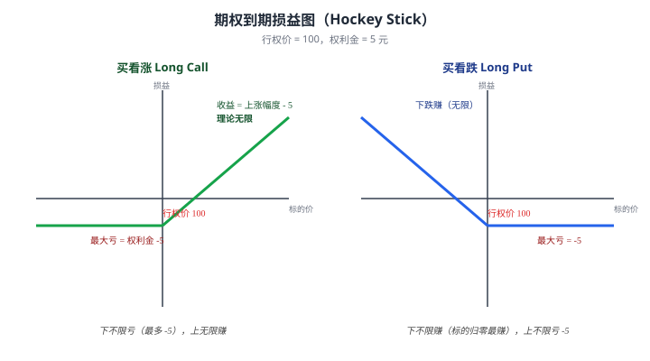
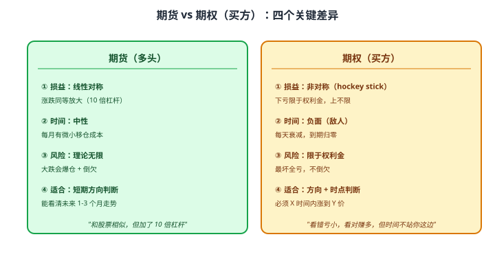

# 26 期货与期权直观理解

> **这一章要让你搞懂的事**
> 1. **期货**的核心机制：保证金 / 每日盯市 / 强平 / 移仓 / 到期
> 2. **期权**的核心机制：看涨 / 看跌 / 行权 / 到期损益图
> 3. **内在价值 vs 时间价值**——为什么期权"放着不动也亏"
> 4. **希腊字母**只讲 **Delta 和 Theta** 的直觉
> 5. 一个完整数字例子：**50ETF 期权怎么算盈亏**
> 6. 看懂期权报价表：行权价 / 到期日 / 权利金 / 持仓量
>
> **入门门槛**
> - 第 25 章：衍生品全景
>
> **声明**：本教程不构成投资建议；所有数字、合约为教学示例。**学完不代表你应该交易**——参见第 27 章。

---

## 0. 先讲个故事

**老豆农**有 100 吨大豆，6 个月后收获。当前价 5 元/斤，但担心收获时跌到 4 元/斤。

他有 **3 种选择**：

| 选择 | 怎么做 | 6 个月后价跌到 4 元 | 6 个月后价涨到 6 元 |
|---|---|---|---|
| **A 不做任何对冲** | 等收获了再卖 | 收 40 万（亏 10 万）| 收 60 万（多赚 10 万）|
| **B 卖出大豆期货**（锁价 5 元）| 6 个月后必须按 5 元交割 | 收 50 万（**对冲成功**）| 收 50 万（**少赚 10 万**）|
| **C 买入"看跌期权"**（权利金 1 万）| 有权按 5 元卖，但可以不卖 | 行权按 5 元卖 → 收 50 - 1 = **49 万** | **放弃行权，按 6 元市场卖 → 60 - 1 = 59 万** |

**对比**：
- 不对冲：风险全担
- 期货套保：**确定性**——好坏都是 5 元
- 期权套保：**最坏 49 万，最好 59 万**——付出 1 万"保险费"换"下跌保护 + 上涨弹性"

> 这章告诉你：**期货和期权各有适合的场景**——期货是"锁定确定性"，期权是"保留可能性"。两者**机制完全不同**。
>
> 学完你能：看懂任何期货 / 期权报价、算出基本盈亏、理解机构和散户在其中扮演的角色。

---

## 1. 期货机制

### 1.1 保证金交易

**核心**：你不需要付合约全额，**只需缴一小部分保证金**（5-15%）作为"履约担保"。

**例**：沪深 300 股指期货
- 1 手合约 = 沪深 300 指数 × 300 元 ≈ 100 万元
- 保证金率 12% → **缴 12 万元**就能控制 100 万元合约
- **杠杆 ≈ 8 倍**

### 1.2 每日盯市（Daily Mark-to-Market）

**机制**：每天收盘后，按结算价**重新计算你的盈亏**——直接进出你的保证金账户。

**例**：
- 周一 100 万合约买入，付保证金 12 万
- 周二指数涨 1% → 你赚 1 万 → **当天直接打到你账户**
- 周三指数跌 2% → 你亏 2 万 → **从保证金账户扣**
- ……持续到平仓或交割

**好处**：风险**每天结算**，不积累——避免最后大爆雷。

### 1.3 强平（Force Liquidation）

**机制**：
1. 你的保证金账户跌到 **"维持保证金线"**（通常初始保证金的 50-75%）
2. 券商通知你 **"追加保证金"**
3. **指定时间内不追**（如下个交易日开盘前）→ **强制平仓**
4. 强平价 = 当时市价（**可能比你预期糟很多**）

**翻译成人话**：**没足够保证金 = 被迫认亏出局**——不管你怎么看后市。

### 1.4 移仓（Roll-Over）

**机制**：期货合约**都有到期日**（如沪深 300 期货当月、下月、下下月、下季合约）。

**到期前必须**：
- **平仓**（卖掉手上合约）
- **或交割**（实际收 / 付标的物——商品期货）
- **或移仓**（卖近月、买远月 → 继续持有）

**移仓的成本**：
- 远月通常比近月**贵**（升水）→ **每次移仓亏一点**
- 长期持有期货 = 持续移仓 = **持续小亏**

**这就是为什么"原油 ETF 长期亏"**——背后是原油期货，每月移仓有成本。

### 1.5 期货 vs 现货损益对比

**核心特征**：期货是**线性损益**——价格涨 1%，杠杆 10 倍 → 你赚/亏 10%。

| 标的价格变化 | 现货损益 | 10 倍杠杆期货损益 |
|---|---|---|
| +10% | +10% | **+100%（翻倍）** |
| +5% | +5% | +50% |
| 0% | 0% | -0.5%（移仓成本）|
| -5% | -5% | **-50%** |
| -10% | -10% | **-100%（爆仓）** |

---

## 2. 期权机制

期权比期货复杂——但**机制非常优雅**。

### 2.1 四种基础组合

| 你的身份 | 看涨期权（Call）| 看跌期权（Put）|
|---|---|---|
| **买方**（Long）| 有权按行权价**买入**标的 | 有权按行权价**卖出**标的 |
| **卖方**（Short）| 有义务**卖给买方** | 有义务**从买方手中买入** |

**简单理解**：
- **买看涨**："我赌涨" + 给卖方一笔权利金
- **买看跌**："我赌跌" + 给卖方一笔权利金
- **卖看涨**："我赌不涨" + 收取买方权利金
- **卖看跌**："我赌不跌" + 收取买方权利金

### 2.2 关键概念

| 概念 | 含义 |
|---|---|
| **标的**（Underlying）| 期权对应的资产（如 50ETF、个股、商品）|
| **行权价**（Strike Price）| 合约约定的"买卖价"|
| **到期日**（Expiration Date）| 期权失效日 |
| **权利金**（Premium）| 买方付给卖方的"期权价格"|
| **行权**（Exercise）| 买方决定真的执行合约 |
| **平仓**（Close）| 在到期前把期权卖回市场 |

### 2.3 经典损益图（Hockey Stick）

期权最经典的可视化——**到期日损益图**：

**看图核心要点**：
- **买方损益是"折线" hockey stick**——这就是"有权而无义务"的体现
- **最大亏损 = 权利金**（横线段）
- **赚钱区域是斜线**（标的方向对了才赚）

### 2.4 期权卖方的损益（散户绝对要懂）

**反过来的图**：

| 你的身份 | 损益形状 | 最大收益 | 最大损失 |
|---|---|---|---|
| **买看涨** | hockey stick 向上 | 无限 | -权利金 |
| **买看跌** | hockey stick 向下 | 大（标的归零）| -权利金 |
| **卖看涨** | 倒 hockey stick 向下 | **+权利金（小）** | **理论无限** |
| **卖看跌** | 倒 hockey stick 向上 | **+权利金（小）** | **大** |

**核心警告**：**卖期权 = 收小钱赚小赢，承担极大尾部风险**。

**真实案例**：2018 年 2 月 5 日，美国"波动率末日"——VIX 单日暴涨 100%+ → **裸卖波动率期权的人 1 天爆仓**。

> 📌 **散户永远不要做期权卖方**——你赚的权利金永远小于一次极端事件的损失。

---

## 3. 内在价值 vs 时间价值

期权的权利金（价格）由**两部分**组成：

$$
\text{权利金} = \text{内在价值} + \text{时间价值}
$$

### 3.1 内在价值（Intrinsic Value）

**定义**：**如果立刻行权能拿到多少钱**。

**看涨期权**：
- 标的 > 行权价 → 内在价值 = 标的 - 行权价（**实值，In the Money**）
- 标的 ≤ 行权价 → 内在价值 = 0（**虚值，Out of the Money**）

**看跌期权**：
- 标的 < 行权价 → 内在价值 = 行权价 - 标的（实值）
- 标的 ≥ 行权价 → 内在价值 = 0（虚值）

**例**：50ETF = 2.8 元，行权价 2.5 的看涨期权
- 内在价值 = 2.8 - 2.5 = **0.3 元**

### 3.2 时间价值（Time Value）

**定义**：**因为还没到期，未来仍有"可能赚钱"的机会，市场愿意付的价值**。

**例**：上面那个 2.5 行权价的看涨期权
- 内在价值 0.3 元
- 市场实际报价 0.45 元
- **时间价值 = 0.45 - 0.3 = 0.15 元**

### 3.3 时间价值的"衰减"

**关键事实**：**时间价值随时间流逝衰减**——到期日**归零**。

**衰减不是线性的**——**最后一个月最快**：

| 剩余时间 | 时间价值的相对比例 |
|---|---|
| 90 天 | 100% |
| 60 天 | 80% |
| 30 天 | **60%** |
| 14 天 | **40%** |
| 7 天 | **25%** |
| 1 天 | **5%** |
| 0 天 | **0** |

**翻译成人话**：**期权越接近到期，时间价值"加速消失"** —— 这就是为什么"末日期权"赌博性最强。

### 3.4 这解释了 §0 故事

小张买的"末日深虚值看涨期权"：
- 内在价值 = 0（虚值）
- 全部价值是时间价值
- **3 天后到期 → 时间价值清零 → 全部归零**

要赚钱必须**3 天内标的暴涨到行权价以上**——这就是"赌博"的本质。

---

## 4. 希腊字母：只讲 Delta 和 Theta

希腊字母（Greeks）是期权价格的"敏感性指标"——共 5 个。**入门只讲 2 个**。

### 4.1 Delta：方向敏感度

**定义**：标的价格变 1 元，期权价格变多少。

**取值范围**：
- **看涨期权**：0 到 1（实值接近 1，虚值接近 0）
- **看跌期权**：-1 到 0（实值接近 -1，虚值接近 0）

**例**：50ETF = 2.8，看涨期权 Delta = 0.6
- 50ETF 涨 0.01 元 → 期权涨约 0.006 元

**实用意义**：
- **Delta 高（接近 1）**：期权"像股票"——涨跌跟着标的走
- **Delta 低（接近 0）**：期权"像虚值"——标的小变化不影响

### 4.2 Theta：时间衰减速度

**定义**：每天时间价值衰减多少（**通常是负数**）。

**例**：某 50ETF 期权 Theta = -0.005 元/天
- 即使标的不动，**每天期权价值跌 0.005 元**
- 30 天后跌 0.15 元（如果原来 0.45 元 → 现在 0.30 元）

**关键**：Theta **越接近到期越大**——这就是上面"时间价值加速衰减"的数学表达。

### 4.3 其他三个希腊字母（简单提一下）

| 字母 | 含义 |
|---|---|
| **Gamma** | Delta 的变化率（"加速度"）|
| **Vega** | 隐含波动率每变 1%，期权价格变多少 |
| **Rho** | 无风险利率每变 1%，期权价格变多少 |

详见第 27 章 + 进阶教材。

---

## 5. 一个完整数字例子：50ETF 期权

**场景**：今天 50ETF = 2.80 元，你看好下个月涨到 2.95 元。

### 5.1 选择期权

你打开 50ETF 期权 T 型报价（一个典型期权列表）：

| 行权价 | 看涨权利金 | Delta | 内在价值 | 时间价值 |
|---:|---:|---:|---:|---:|
| 2.60 | 0.220 | 0.92 | 0.20 | 0.02 |
| 2.70 | 0.135 | 0.75 | 0.10 | 0.035 |
| **2.80** | **0.075** | **0.50** | **0.00** | **0.075** |
| 2.90 | 0.035 | 0.28 | 0.00 | 0.035 |
| 3.00 | 0.015 | 0.13 | 0.00 | 0.015 |

**说明**：每张合约对应 **10,000 份 50ETF**（即 1 万元面值），所以权利金 0.075 元 = **每张合约 750 元**。

### 5.2 三种买法

**买法 1：行权价 2.60（深度实值，Deep ITM）**
- 权利金 0.22 元/份 × 10,000 = **2,200 元/张**
- Delta 0.92 → 像股票
- 50ETF 涨到 2.95 → 期权值约 0.35 元 → **赚 0.13 元/份 = 1,300 元/张**
- **回报率 ≈ +59%**（vs 50ETF 涨 5.4%）

**买法 2：行权价 2.80（平值，ATM）**
- 权利金 0.075 元/份 = **750 元/张**
- 50ETF 涨到 2.95 → 期权值约 0.15 元 → **赚 0.075 元/份 = 750 元/张**
- **回报率 = +100%**

**买法 3：行权价 3.00（虚值，OTM）**
- 权利金 0.015 元/份 = **150 元/张**
- 50ETF 涨到 2.95 → 仍是虚值，期权值约 0.02 元 → **赚 0.005 元/份 = 50 元/张**
- **回报率 = +33%**
- **但若标的只涨到 2.90 → 期权归零 → 全亏**

### 5.3 这告诉你什么

| 买法 | 杠杆 | 风险 |
|---|---|---|
| 深度实值 | 中（~10x）| 较低，像加杠杆的股票 |
| 平值 | 高（~30x）| 高，方向必须看对 |
| 深度虚值 | 极高（~100x）| 极高，**几乎赌博** |

**散户最容易踩的坑**：**追深度虚值（看着便宜，几百块就能玩）** —— 但**到期归零的概率 > 50%**。

### 5.4 50ETF 期权的特点

- 中国最早的场内股票期权（2015 上市）
- 现金交割（不是实物）
- 合约月份：当月、下月、下季、下下季
- 散户最熟悉的期权品种

**门槛**：50 万资金 + 6 个月经验 + 笔试考试 + 模拟交易。

---

## 6. 期货 vs 期权的核心对比

**一句话总结**：
- **期货**：**方向赌博，杠杆放大** —— 但最大风险是"被强平"
- **期权（买方）**：**时间和方向双重赌博** —— 但最大风险**已知**（权利金）

---

## 7. 进阶讨论

**入门读者可以跳过本节**。

### 7.1 期权的 5 个希腊字母完整版

| 字母 | 衡量 | 实用意义 |
|---|---|---|
| **Delta** | 方向敏感 | "期权的股票感" |
| **Gamma** | Delta 变化率 | "加速度" —— 越接近平值越大 |
| **Theta** | 时间衰减 | "敌人" —— 每天磨损 |
| **Vega** | 波动率敏感 | "波动率多 1%，期权多 X 元" |
| **Rho** | 利率敏感 | 通常很小，长期期权才重要 |

### 7.2 Black-Scholes 模型

**1973 年 Fischer Black 和 Myron Scholes 推导的期权定价公式**：

$$
C = S_0 \cdot N(d_1) - K \cdot e^{-rT} \cdot N(d_2)
$$

其中 $d_1$、$d_2$ 由标的价、行权价、波动率、利率、到期时间决定。

**用途**：
- 机构用它**算理论价格**——和市场价比较看是否高估 / 低估
- 散户**用模型 App 输入参数**直接算

**Scholes 1997 年因此获诺奖**（Black 1995 年去世未获奖）。

### 7.3 隐含波动率（IV）

**反推**：用市场期权价格反推"市场假设的标的波动率"——叫**隐含波动率（Implied Volatility, IV）**。

**应用**：
- **IV 高 = 期权贵**（市场担心大波动）
- **IV 低 = 期权便宜**（市场认为会平静）
- **VIX 指数 = 标普 500 期权的 IV**——也叫"恐慌指数"

### 7.4 期权组合策略

机构常用的组合（每个都有特定 hockey stick 形状）：

| 策略 | 组成 | 用途 |
|---|---|---|
| **备兑（Covered Call）** | 持股 + 卖看涨 | 增强收益 |
| **保护性看跌（Protective Put）** | 持股 + 买看跌 | 下跌保险 |
| **价差（Spread）** | 买一张 + 卖一张 | 限定盈亏区间 |
| **跨式（Straddle）** | 买看涨 + 买看跌（同行权价）| 押"大波动" |
| **领口（Collar）** | 持股 + 买看跌 + 卖看涨 | 0 成本下行保护 |

详见第 27 章。

### 7.5 期货的"价差交易"

机构常用的对冲策略：
- **跨期价差**：买当月 + 卖下月（或反过来）
- **跨品种价差**：买大豆 + 卖豆粕（产业链对冲）
- **跨市场价差**：上海铜 vs 伦敦铜

**散户慎入**：这些策略需要**多账户 + 实时监控 + 程序化执行**。

---

## 8. 小结

1. **期货 = 标准化的"必须履约"远期合约**。保证金 + 每日盯市 + 强平 + 移仓。
2. **期权 = "有权而无义务"的合约**。买方付权利金，卖方收权利金。**买方损失有限，卖方损失可能无限**。
3. **期权 4 种基础**：买看涨 / 买看跌 / 卖看涨 / 卖看跌。**散户原则上只做买方**。
4. **权利金 = 内在价值 + 时间价值**。**时间价值随到期日加速衰减**——"末日期权" 时间价值 = 0。
5. **Delta**：方向敏感度（看涨 0-1，看跌 -1-0）。**Theta**：时间衰减（永远为负）。
6. **50ETF 期权例子**：深度实值 ≈ 杠杆股票；平值 ≈ 高赔率赌博；深度虚值 ≈ 彩票（多数归零）。
7. **期货 vs 期权（买方）**：期货线性、时间中性、风险无限；期权非对称、时间为敌、风险已知。
8. **进阶工具**：BS 模型、隐含波动率、组合策略——**机构常用，散户少碰**。

> 🔗 **承上启下**：你现在懂了机制。但**散户到底该不该用衍生品**？什么场景能用？为什么大多数场景不该碰？下一章 **27 散户与衍生品**——本模块的收官，从"机制层"上升到"决策层"。

---

## 自测题

> 答案在文末折叠区。

1. 期货合约的"每日盯市"是什么意思？为什么不像股票那样"持有到平仓再算盈亏"？
2. 期权的"内在价值"和"时间价值"分别是什么？为什么"末日期权"的价格几乎全是时间价值？
3. Delta = 0.5 的看涨期权——标的涨 0.1 元，期权大约涨多少？这相当于多少倍杠杆？
4. 老张持有 50ETF 期权 30 天，标的不动。他的期权价值变化大约是多少？为什么？
5. **数学题**：50ETF = 3.00 元，3.10 元行权价的看涨期权权利金 0.06 元/份。
   - 内在价值是多少？
   - 时间价值是多少？
   - 50ETF 涨到 3.20 元 → 期权理论价值（假设 Delta 现在变成 0.85）大约多少？
6. 为什么散户绝对不要做"期权卖方"？说出 2 个原因。
7. **进阶题**：你看好下月 50ETF 从 2.80 涨到 3.00。三种选择：
   - A：直接买 50ETF 1 万元
   - B：买入沪深 300 期货 1 张（保证金 12 万）
   - C：买入 50ETF 行权价 2.85 看涨期权（权利金 700 元/张）20 张
   分别估算"标的涨到 3.00"和"标的跌到 2.65"两种情景下的盈亏。
8. **作业题**：打开支付宝 / 雪球，搜"50ETF 期权"。**找到当月平值合约**：
   - ① 看 T 型报价表 —— 你能找到行权价、权利金、Delta 吗？
   - ② 算这张合约的内在价值 + 时间价值
   - ③ 如果你今天买入，多少天后到期？时间价值每天衰减多少？

📖 参考答案

1. **每日盯市**：每天收盘后按结算价**重新计算盈亏**，直接进出你的保证金账户——赚的钱当天到，亏的钱当天扣。
   **为什么这样设计**：① 限制累积风险——每天结清，避免最后大爆雷 ② 触发追加保证金机制——亏到一定程度逼你补钱或强平 ③ 交易所对手方风险管理。

2. **内在价值**：立刻行权能拿到的钱（看涨 = max(标的-行权价, 0)；看跌 = max(行权价-标的, 0)）。**时间价值**：因为还没到期，未来仍可能赚钱的"溢价"。
   **末日期权全是时间价值的反例**：实际上"末日深虚值"权利金极小（几毛甚至几分），且**时间价值已经接近 0**——一旦到期，**几乎肯定归零**。这就是"赌博彩票"——多数情况是给卖方送钱。

3. 标的涨 0.1 → 期权涨约 **0.1 × 0.5 = 0.05 元**。
   **杠杆**：假设期权权利金 0.1 元 → 涨 50%（0.05/0.1）；同期 50ETF 假设是 3.00 元，涨 0.1 元 = 涨 3.3%。**期权杠杆 ≈ 50% / 3.3% ≈ 15 倍**。**关键洞察**：Delta 越高的实值期权，杠杆越低、风险越接近股票。

4. **价值会下降，下降幅度由 Theta 决定**。30 天前 Theta 可能 -0.001 元/天，越接近到期 Theta 越大（可能 -0.003 到 -0.005）。30 天累计衰减大约 -0.05 到 -0.10 元/份。**这就是"持有期权不动也亏"**——时间不是朋友。

5. 
   - 内在价值 = max(3.00 - 3.10, 0) = **0**（虚值期权）
   - 时间价值 = 0.06 - 0 = **0.06 元/份**（全部是时间价值）
   - 涨到 3.20 → 新内在价值 = 3.20 - 3.10 = 0.10；新 Delta 0.85 意味着期权"接近实值化"，时间价值剩余约 0.04（粗略估算）→ 总价值 ≈ **0.14 元/份**
   - **回报**：0.14 - 0.06 = +0.08 元/份 → 涨幅 **+133%** （50ETF 同期涨 6.67%）→ 杠杆约 20 倍

6. **散户不做期权卖方**：
   - ① **收益有限（权利金）但亏损可能无限**——非对称风险，赚小亏大
   - ② **保证金机制残酷**：卖方需要交保证金，标的反向波动时需追加，且追加幅度远超买股票
   - ③ **黑天鹅毁灭性**：2018 年 VIX 末日事件、2020 年原油负值——裸卖期权者 1 天内爆仓
   - ④ **机构对手盘**：你卖的期权多数是机构在套保，他们有定价模型，散户被定价偏差吞噬

7. 
   - **A（50ETF 现货 1 万）**：
     - 标的 2.80→3.00（+7.1%）→ +710 元
     - 标的 2.80→2.65（-5.4%）→ -540 元
   - **B（沪深 300 期货 1 张）**：
     - 沪深 300 涨跌幅约和 50ETF 同步，假设也是 +7.1% / -5.4%
     - 100 万合约 → +7.1 万 / -5.4 万
     - 但杠杆约 8 倍——5.4 万亏损吃掉一半保证金，**可能触发追加保证金**
   - **C（行权价 2.85 看涨期权 20 张，成本 14,000 元）**：
     - 标的涨到 3.00：期权变实值，价值约 0.15 + 0.02 时间价值 = 0.17 → 20 张 × 0.17 × 10,000 = **34,000 元**，**赚 20,000 元，+143%**
     - 标的跌到 2.65：期权深度虚值，几乎归零 → **亏 14,000 元，-100%**
   - **结论**：期权的"非对称收益"清楚 —— 看对赚 143%，看错亏 100%。**风险敞口比股票大，但比期货明确**。

8. 没有标准答案。**重点观察**：
   - **平值合约**：行权价最接近当前 50ETF 价格
   - **权利金**：通常 0.03-0.10 元（300-1000 元/张）
   - **Delta**：平值看涨约 0.50
   - **时间价值**：平值期权的内在价值 ≈ 0，几乎全是时间价值
   - **每日衰减**：剩余 30 天的合约，Theta 大约 -0.001 到 -0.002 元/天
   - **作业的真正价值**：让你**直观感受"时间价值是真金白银"**——每天放着不动就在亏，这和你买股票完全不同

---

## 延伸阅读

- 《期权、期货及其他衍生品》—— John Hull：圣经级教材
- 《期权波动率与定价》(*Option Volatility and Pricing*) —— Sheldon Natenberg：交易员实战经典
- 上交所：[50ETF 期权专题](http://www.sse.com.cn/)
- 集思录：免费查 50ETF 期权 T 型报价 + IV
- 期权 ABC 系列文章：天天基金 / 雪球期权专栏

---

## 下一章预告

**27 散户与衍生品** —— 04 模块收官：
- 散户**少数能用的场景**：备兑 / 保护性看跌 / 套保
- 散户**绝对不该碰的场景**：裸卖期权 / 短线期货投机 / 杠杆 ETF 长期
- **非对称风险**：理解"为什么 99% 散户失败"
- 心理陷阱：从"赚 10 倍"到"亏 100%"只需一个 FOMO
