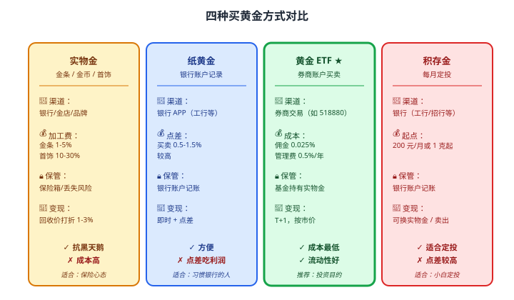
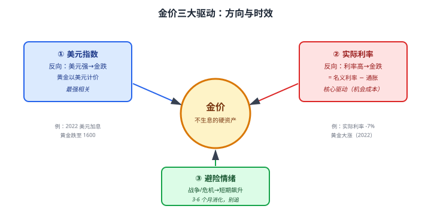

# 28 黄金

> **这一章要让你搞懂的事**
> 1. **黄金**为什么 5000 年来都是"硬通货"——它的价值从哪来
> 2. **四种买黄金方式**：实物金 / 纸黄金 / 黄金 ETF / 积存金——怎么选
> 3. **金价三大驱动**：美元 / 实际利率 / 避险情绪
> 4. **黄金抗通胀**的真相——长期 ✓，短期 ✗
> 5. **中国家庭配置黄金**的合理比例（5-15%）
> 6. **2022 起全球央行购金潮**——背后的逻辑
>
> **入门门槛**
> - 第 03 章：通胀与实际收益
> - 第 06 章:资产配置基础
> - 第 22 章：ETF
>
> **声明**：本教程不构成投资建议；所有价格、产品为教学示例。

---

## 📖 本章英文缩写速查

> 看到不认识的英文缩写，先回这张表查；完整术语见 [GLOSSARY.md](../GLOSSARY.md)。

| 缩写 | 英文全称 | 中文含义 |
|---|---|---|
| **ETF** | Exchange-Traded Fund | 交易所交易基金 |
| **AU99** | Au99.99 | 上海黄金交易所黄金现货合约代码 |
| **NAV** | Net Asset Value | 基金/资产净值 |

---

## 0. 先讲个故事

**2022 年 2 月 24 日，俄乌冲突爆发**。两位老人都听说"黄金避险"：

**老周**（70 岁）—— 周一一早去金店：
- 买 200 克实物金（金条）—— 当时金价 410 元/克
- 付款 **82,000 元**（含 5% 加工费 = 86,100 元）
- 装进保险箱

**老吴**（70 岁）—— 在儿子帮助下打开券商 APP：
- 买入 **华安黄金 ETF（518880）** —— 当时 4.10 元/份
- 投入 **82,000 元**（手续费几乎为 0）

**2024 年 12 月，金价涨到 600 元/克**：

| 项目 | 老周（实物金）| 老吴（黄金 ETF）|
|---|---|---|
| 持仓 200 克 | 200 克 | ≈ 200 克 |
| 当前市值 | 120,000 元 | 120,000 元 |
| 卖出价 | 金店回收价 580 元/克 → **116,000** | 二级市场卖出 **120,000** |
| 减去成本 | 86,100 元 | 82,000 元 |
| **净赚** | **29,900 元（+35%）** | **38,000 元（+46%）** |

老吴比老周多赚 **8,100 元** —— 没付加工费、卖出价不打折、买卖成本几乎为零。

**但老周的回应**：
> "我手上摸得到的是金条，**没账户密码、不怕电脑挂掉、不怕公司倒闭**。"

> 这章告诉你：
> 1. **黄金作为资产**有 5000 年历史 —— 比所有现代金融产品都久
> 2. **买黄金有 4 种方式**，各有取舍 —— 老周的实物金 vs 老吴的 ETF 各有道理
> 3. **黄金不是"暴富工具"**——是**对冲工具**，组合中放 5-15% 即可
> 4. **抗通胀是有条件的**：长期对，短期完全不对

---

## 1. 黄金到底是什么

### 1.1 三重身份

黄金有**三重身份**叠加：

| 身份 | 作用 |
|---|---|
| **商品** | 工业用途（电子/医疗）+ 珠宝消费 |
| **货币** | 5000 年的"通用价值储藏" |
| **金融资产** | 现代投资工具（ETF、期货、央行储备）|

**三重身份决定**：金价**不简单由"产量 / 工业需求"决定**——还由**货币 / 避险 / 利率**决定。

### 1.2 为什么黄金能"5000 年保值"

**核心属性**：
- **稀缺**：地球上提炼的所有黄金加起来约 21 万吨（**一个游泳池**就装完）
- **不腐蚀**：3000 年前的金器今天还能用
- **易分割**：可以做成 1 克、10 克、1000 克任意大小
- **跨文化共识**：从古埃及到现代央行，全世界都认它
- **无信用风险**：黄金不依赖任何政府 / 公司——**它就是它**

**对比纸币**：
- 民国法币 1948 年崩溃 → **价值归零**
- 委内瑞拉玻利瓦尔 2018-2019 通胀 100 万% → 纸币"洗手间贴墙"
- 黄金从来没"归零"过

### 1.3 黄金 vs 其他资产

| 维度 | 黄金 | 股票 | 债券 | 房产 |
|---|---|---|---|---|
| **收益来源** | 价格上涨 | 分红 + 增值 | 利息 | 租金 + 增值 |
| **现金流** | **无**（不分红）| 有 | 有 | 有 |
| **抗通胀** | 长期 ✓ | 长期 ✓ | 短期 ✗ | 长期 ✓ |
| **流动性** | 极高（ETF）| 极高 | 高 | 极低 |
| **波动性** | 中（年 15-25%）| 高 | 低 | 低 |

**关键认知**：**黄金不产生现金流**——它的全部回报来自**价格上涨**。这意味着：
- 配置太多 → **机会成本高**（不如股票分红）
- 配置太少 → **遇到危机没保护**
- **5-15% 是甜蜜区**

---

## 2. 四种买黄金方式

### 2.1 四种对比

### 2.2 推荐选择

| 你的需求 | 推荐 |
|---|---|
| **纯投资**（追求收益）| **黄金 ETF**（成本最低、流动性最好）|
| **小额定投** | 积存金 或 黄金 ETF 联接基金 |
| **保险心态 + 应对极端风险** | 少量**实物金**（1-2 根 50 克金条）|
| **不想开券商账户** | 纸黄金 |
| **送礼 / 收藏** | 实物金币 / 首饰（**接受高加工费**）|

> 💡 **大多数人最优**：**黄金 ETF 80% + 实物金 20%**（应对极端风险）。

### 2.3 黄金 ETF 主流品种

| 代码 | 简称 | 规模 | 管理费 |
|---|---|---|---|
| **518880** | 华安黄金 ETF | 大（>400 亿）| 0.5% |
| **518800** | 易方达黄金 ETF | 中等 | 0.5% |
| **159834** | 工银黄金 ETF | 中等 | 0.5% |

**特点**：
- 跟踪上海黄金交易所**AU99.99 合约**
- 1 份 ≈ 0.01 克黄金
- T+0 不允许（A 股商品 ETF 是 T+1）
- 持有"实物黄金"（在金库里）

---

## 3. 金价三大驱动

### 3.1 美元（最强相关）

**铁律**：**美元强 → 金价跌；美元弱 → 金价涨**。

**为什么**：黄金以**美元计价**——美元贬值 = 同样多黄金换更多美元。

**实证**：
- 1971 年美元脱离金本位 → 黄金从 35 美元 / 盎司涨到 200+
- 2008 金融危机美元贬值 → 黄金从 700 涨到 1900
- 2022 美元加息周期 → 黄金一度跌到 1600
- 2023-2024 降息预期 + 美元转弱 → 黄金涨到 2700+

### 3.2 实际利率（核心驱动）

**定义**：**实际利率 = 名义利率 - 通胀率**。

**铁律**：**实际利率高 → 金价跌；实际利率低 / 负 → 金价涨**。

**为什么**：黄金**不生息**——其他资产能生息时，黄金"机会成本"上升。

**例**：
- 美国 10 年期国债收益率 4% + 通胀 3% = 实际利率 1% → 黄金平静
- 美国 10 年期国债 1% + 通胀 8% = 实际利率 -7% → **黄金大涨**（2022 现象）

### 3.3 避险情绪（短期催化）

**铁律**：**地缘冲突 / 金融危机 / 经济衰退恐慌 → 金价短期飙升**。

**典型场景**：
- 战争（俄乌、中东）
- 银行倒闭（2023 硅谷银行事件）
- 货币危机（土耳其、阿根廷）
- 大国冲突预期

**特点**：**短期催化**——通常 3-6 个月内消化。**不要追"避险买黄金"**。

---

## 4. 抗通胀的真相

### 4.1 长期：确实抗通胀

**事实**：1971 年至今 50 多年，黄金年化回报约 **7-8%**，同期美国通胀年化 **3-4%** → **实际回报约 3-4%**（与股票实际回报 6-7% 还有差距，但跑赢通胀）。

### 4.2 短期：完全不靠谱

**反直觉数据**：
- **1980-2000**：通胀阶段性上行，但黄金**从 850 跌到 250**（-70%）
- **2011-2015**：通胀很低，但黄金**从 1900 跌到 1050**（-45%）

**原因**：短期金价主要看**美元 + 实际利率 + 避险**，**不直接看通胀**。

### 4.3 长期持有的"理论"vs"实践"

**理论**：黄金 = 长期抗通胀
**实践**：你能拿住 30 年才算长期。**多数人 3-5 年就卖**——而 3-5 年内黄金可能跑输。

> 💡 **结论**：把黄金当**保险**，不当**收益来源**——这样心态就对了。

---

## 5. 中国家庭配置黄金

### 5.1 合理比例

| 配置目标 | 黄金比例 |
|---|---|
| 极保守（怕风险）| **5-10%** |
| 平衡型 | **5-15%** |
| 进取型 | **5%** |
| 全部用于"保险"目的 | 5-10% 实物金 + 余下买股债 |

**核心原则**：**不超过 15%**。再多会牺牲长期复利。

### 5.2 怎么配

**简单方案**（10 万元的"5% 黄金配置"）：
- 黄金 ETF：4000 元
- 实物金（小额金条 10-20 克）：1000 元

**进阶方案**（100 万的"10% 黄金配置"）：
- 黄金 ETF：6 万元
- 黄金股 ETF（黄金矿业）：2 万元
- 实物金（保险柜）：2 万元

### 5.3 什么时候多配 / 少配

| 时点 | 操作 |
|---|---|
| 实际利率 < 0% | **多配**（上限）|
| 实际利率 > 3% | **少配**（下限）|
| 大国地缘紧张 | 短期多配 5% |
| 美元强势周期 | 暂缓增持 |
| 牛市末期 | 用黄金做组合"压舱石" |

### 5.4 怎么再平衡

**和股债再平衡一样**：
- 黄金涨太多（占比超过目标 +5%）→ 卖一部分换股 / 债
- 黄金跌太多（占比低于目标 -5%）→ 买入补足

**频率**：**每年 1 次**就够。

---

## 6. 央行购金潮（2022 起）

### 6.1 数据

**世界黄金协会**数据：
- 2022：全球央行净购金 **1136 吨**（55 年最高）
- 2023：1037 吨
- 2024：约 1000 吨（继续高位）

**领头央行**：中国、土耳其、印度、波兰、新加坡。

### 6.2 背后逻辑

| 原因 | 说明 |
|---|---|
| **美元武器化** | 俄乌战后美国冻结俄罗斯外汇储备 → 各国警惕 |
| **去美元化** | 减少对美元体系依赖 |
| **抗通胀** | 全球货币宽松后的通胀担忧 |
| **储备多元化** | 不把鸡蛋放美元一个篮子 |

### 6.3 对散户的启示

- **央行购金 = 长期看涨黄金的强烈信号**
- 但**散户不能用"央行节奏"操作** —— 央行有几十年视角
- **散户最优**：**保持基础配置（5-10%）+ 不追高**

---

## 7. 进阶讨论

**入门读者可以跳过本节**。

### 7.1 黄金股 vs 黄金本身

**黄金股**（黄金矿业公司股票）vs 黄金本身：
- **杠杆效应**：金价涨 10% → 黄金股可能涨 20-30%（运营成本固定，利润放大）
- **代价**：黄金股有"公司风险"——管理不善、矿难、政治风险
- **波动**：黄金股波动比金价大 2-3 倍

**主流标的**：
- 中国：紫金矿业、山东黄金
- 美国：Newmont（NEM）、Barrick（GOLD）
- ETF：黄金股 ETF（159831）

### 7.2 黄金期货 / 期权

**期货**：CME 黄金期货（GC）、上期所黄金期货（AU）
- 杠杆 10-20 倍
- 散户慎入（见第 25-27 章）

**期权**：复杂，几乎不适合散户。

### 7.3 数字黄金（PAXG 等）

**境外有**：PAXG = 1 张代币对应 1 盎司黄金，用区块链记账。
**境内**：监管限制，不可买卖。
**特点**：透明度高，但流动性远不如 ETF。

### 7.4 黄金的"非货币化"风险

**长期假设**：黄金永远有价值。
**反假设**：
- 如果未来"数字货币"完全替代黄金作为"硬通货"
- 如果央行抛售（不太可能但理论上可能）
- 如果年轻一代不认黄金的"价值共识"

**应对**：**配置 5-15% 而不是 50%** —— 避免单点风险。

### 7.5 国际对比

| 国家 | 家庭平均黄金占比 |
|---|---|
| **印度** | **15-25%**（黄金文化根深蒂固）|
| **中国** | 5-10% |
| **美国** | 1-3%（远低）|
| **欧洲** | 3-5% |
| **中东** | 10-20% |

**启示**：中国黄金消费在增长（央行 + 婚庆 + 投资三重需求）—— 长期需求支撑明确。

---

## 8. 小结

1. **黄金 = 商品 + 货币 + 金融资产**——5000 年价值储藏，无信用风险。
2. **四种买法**：实物金（保险心态）/ 纸黄金（不开券商）/ **黄金 ETF（投资首选）**/ 积存金（小额定投）。
3. **金价三大驱动**：美元（最强相关）/ 实际利率（核心）/ 避险情绪（短期催化）。
4. **抗通胀有条件**：长期 ✓（50 年实际回报 3-4%），短期 ✗（1980-2000 跌 70%）。**把黄金当保险，不当收益**。
5. **中国家庭最优**：黄金占比 **5-15%**。新手可从 **黄金 ETF 80% + 实物金 20%** 开始。
6. **2022 起央行购金潮** —— 长期看涨信号，但散户不该追高。
7. **黄金不产现金流** —— 配置太多机会成本高。**5-15% 是甜蜜区**。
8. **再平衡**：每年 1 次，超目标 +5% 卖出，低目标 -5% 补足。

> 🔗 **承上启下**：黄金讲完了。下一章 **29 REITs** —— 不动产投资的"基金化"工具，**让 1000 元的散户也能"当包租公"**。

---

## 自测题

> 答案在文末折叠区。

1. 黄金的"三重身份"分别是什么？
2. 你想配置 5 万元黄金，主要用于投资增值。选哪种方式？为什么？
3. 金价"三大驱动"中，**最强相关**的是哪个？为什么？
4. 实际利率 5% vs 实际利率 -3%——哪种环境对金价更友好？
5. "黄金长期抗通胀"是对的，为什么 1980-2000 年金价跌了 70%？
6. **进阶题**：50 万资产组合，目标配置黄金 10%。一年后金价涨 30%，股债不变。
   - 此时黄金占比变成多少？
   - 该不该再平衡？怎么操作？
7. **作业题**：打开银行 / 券商 APP，查询当前金价（按"克"或"盎司")。**对比**：
   - ① 上海黄金交易所 AU99.99 价格
   - ② 银行纸黄金的买入价和卖出价（**点差**多少？）
   - ③ 黄金 ETF（518880）的市价
   - ④ 周大福 / 老凤祥的实物金"标价"（含加工费）
   你发现 4 个价格"递增"的规律了吗？

📖 参考答案

1. **商品**（工业 + 珠宝）+ **货币**（5000 年通用价值储藏）+ **金融资产**（投资工具、央行储备）。三重身份叠加决定金价不简单由产量 / 需求决定。

2. **黄金 ETF（如 518880）**。原因：
   - 成本最低（佣金 0.025% + 管理费 0.5%/年），**纸黄金点差 0.5-1.5% / 实物加工费 1-30%**
   - 流动性最好（T+1 按市价卖出）
   - 不需要保管成本
   - 透明度高（基金持有实物金，每日披露）

3. **美元（最强相关）**。原因：黄金以美元计价 → 美元贬值 = 同样黄金换更多美元 → 金价上涨。美元和金价**长期负相关系数 -0.5 到 -0.7**。

4. **实际利率 -3% 更友好**。原因：黄金不生息，其他资产生息能力的高低决定黄金"机会成本"。实际利率为负（持有现金/债券都亏）→ 资金涌入黄金。2020-2022 正是负实际利率推动金价创新高。

5. **短期金价不由通胀决定**：
   - 1980-2000 期间**美元处于强势周期**（沃尔克加息 + 美元霸权确立）
   - **实际利率长期为正**（名义利率 > 通胀）→ 持有美债比黄金香
   - **没有大型避险事件**（无重大战争、无金融危机）
   - **结论**：长期（50 年）黄金跑赢通胀，但**任意 20 年**可能跑输。**只有真正"长期持有"才能享受抗通胀效益**。

6. 
   - 黄金原 5 万 → 5 × 1.3 = **6.5 万**
   - 总资产 5 + 13 × 1 = 50 万 → 仍是 50 万左右 + 1.5 万浮盈 = 51.5 万
   - 黄金占比 = 6.5 / 51.5 = **12.6%**
   - **超出目标 10% 但未超 +5% 阈值（即 15%）→ 暂不需要紧急再平衡**
   - **可选操作**：年底再平衡时卖出 1.5 万黄金，换成股债（拉回 10%）
   - **关键认知**：**再平衡 = 强制高抛低吸** —— 黄金高位减持 = 长期数学上有利

7. 没有标准答案。**典型递增规律**：
   - 上海金 AU99.99 = **市场基准价**（最便宜）
   - 黄金 ETF 市价 ≈ 上海金 ± 0.1%（接近基准）
   - 银行纸黄金买入价 = 上海金 + 0.3-0.8%（**点差**）
   - 实物金条 = 上海金 + 5-10%（加工费 + 渠道费）
   - 周大福金饰 = 上海金 + 20-30%（品牌溢价 + 工艺费）
   - **结论**：每往"实物"走一步，溢价就高一点——这就是为什么黄金 ETF 是投资首选。

---

## 延伸阅读

- 《货币战争》—— 宋鸿兵：理解金本位历史（虽有争议，但视角独特）
- 《新世界 黄金白银》—— 鄂志寰：央行黄金储备的视角
- 世界黄金协会：[gold.org](https://www.gold.org/) —— 全球最权威的黄金需求 / 央行购金数据
- 上海黄金交易所：[sge.com.cn](https://www.sge.com.cn/) —— 国内黄金价格基准
- 《通胀之祸》(*The Death of Money*) —— James Rickards：货币危机视角

---

## 下一章预告

**29 REITs** —— 不动产投资的"基金化"工具：
- **REITs** 是什么——"打包房产收租"
- 中国公募 REITs（2021 起步）—— 5 种类型对比
- **分派率 / P/NAV / 扩募** —— REITs 估值核心三指标
- 怎么买 + 风险点
