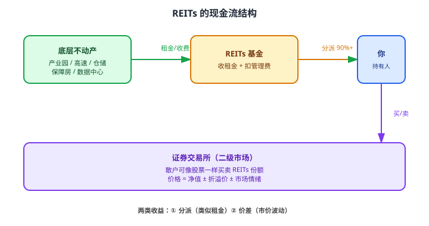

# 29 REITs

> **这一章要让你搞懂的事**
> 1. **REITs** 是什么——"打包房产收租"的金融工具
> 2. **中国公募 REITs**（2021 起步）—— 5 种类型对比
> 3. **分派率 / P/NAV** —— REITs 估值的两个核心指标
> 4. **扩募** —— REITs 的"增发"机制
> 5. 为什么 REITs 是**长期组合的好补充**（5-10%）
> 6. REITs 的**3 大风险**：底层项目 / 估值 / 流动性
>
> **入门门槛**
> - 第 11 章：YTM、债券基础
> - 第 22 章：ETF
>
> **声明**：本教程不构成投资建议；所有 REITs 名为教学示例。

---

## 0. 先讲个故事

**老李** 攒了 30 万，想买套房收租养老。

他算了一笔账：
- 北京/上海一套像样的小户型：**500 万起步**
- 他的 30 万 **首付都不够**
- 即使买得起 → **押了未来 30 年现金流** → 一旦失业就难了

**朋友推荐 REITs**：
- "我刚买了'**华夏中国交建高速 REIT**'——投高速公路收费权，**分派率 7%**"
- "1000 元起买，可以在券商账户随时卖出"
- "相当于**用 1000 元当包租公**——只是租客是高速过路费"

老李投入 10 万：
- **每年分派**：10 万 × 7% = **7,000 元**（**类似租金**）
- **3 年后**：累计分派 21,000 元 + REITs 市价上涨 8% → 总收益约 **2.9 万**
- **现金流**：每月平均 580 元 —— 不多，但**比 100 万定期存款的利息高 2 倍**

**老李感慨**：
> "我没买到真房子，但我**拿到了房子的现金流**——这才是收租的本质。"

> 这章告诉你：
> 1. **REITs = 房地产 + 基金**——让普通散户也能"分散投资不动产"
> 2. 中国 2021 年才起步，**还在初创期**——机会与风险并存
> 3. 关键看 **分派率 + P/NAV + 底层项目** 三个维度
> 4. 作为**组合补充**（5-10%）很合适，**作为核心**风险大

---

## 1. REITs 到底是什么

### 1.1 一句话定义

**REITs（Real Estate Investment Trust，不动产投资信托）= 把不动产打包成基金份额，让散户也能投资**。

**机制**：
1. 基金公司**收购**一批商业地产 / 基建项目（写字楼、产业园、高速公路）
2. **打包**成 REITs，**上市交易**
3. **租金 / 收费**作为基金收入，**按比例分派**给持有人
4. 散户**像买股票一样**买卖 REITs 份额

### 1.2 REITs 的现金流结构

### 1.3 与房地产 / 股票 / 债券的区别

| 维度 | 直接买房 | 房地产股票 | REITs | 债券 |
|---|---|---|---|---|
| **门槛** | 几十万首付 | 1000 元 | **1000 元** | 1000 元 |
| **收益来源** | 租金 + 增值 | 公司利润 | **租金 + 增值** | 利息 |
| **流动性** | **极差** | 高 | **高** | 高 |
| **管理** | 自己来 | 自动 | **自动** | 自动 |
| **税收** | 多税 | 红利税 | **优惠（部分免税）** | 利息税 |
| **分派** | 看个人运作 | 看分红政策 | **强制 90%+ 分派** | 固定 |

**核心特征**：REITs 兼具**股票的流动性 + 不动产的现金流**。

---

## 2. 中国公募 REITs

### 2.1 历史

| 时间 | 事件 |
|---|---|
| 2014-2020 | 探索阶段，多年讨论 |
| **2021-6-21** | **首批 9 只公募 REITs 上市**——历史性突破 |
| 2022-2024 | 持续扩容，新增 30+ 只 |
| 2024 至今 | **总规模超 1500 亿** |

**意义**：中国终于有了**面向散户的公募 REITs**——以前 REITs 是机构专属。

### 2.2 五大类型

| 类型 | 代表 | 现金流特征 |
|---|---|---|
| **产业园** | 张江光大园（180101.SZ）| 写字楼/厂房租金 |
| **仓储物流** | 中金普洛斯（508056.SH）| 物流地产租金 |
| **高速公路** | 平安广州交投（180201.SZ）| 过路费 |
| **保障性租赁住房** | 红土深圳人才安居（180501.SZ）| 政府/企业租金 |
| **能源 / 生态环保** | 中航首钢绿能（180801.SZ）| 垃圾处理费 / 发电 |

**新方向**（2024-2025）：消费类（购物中心）、数据中心、新能源（风电、光伏）等。

### 2.3 中国 REITs 的"特色"

| 特点 | 说明 |
|---|---|
| **基础设施为主** | 首批 9 只全是基础设施，**没有写字楼 / 商场**（差异于美国）|
| **强制分派 90%+** | 类似国际惯例 |
| **税收优惠** | 持有人**免缴所得税**（个人持有期间分派）|
| **流动性中等** | 单只规模较小（10-50 亿），机构持仓多 |
| **散户参与高** | 不像美国 REITs 机构占绝对主导 |

---

## 3. REITs 的两个核心指标

### 3.1 分派率（Distribution Yield）

**定义**：**REITs 每年分派的现金 ÷ 当前市价**。

**公式**：

$$
\text{分派率} = \frac{\text{年度现金分派}}{\text{REITs 市价}} \times 100\%
$$

**例**：某 REITs 现价 8 元/份，每年分派 0.50 元 → 分派率 = **6.25%**

**对比**：
- 同期国债 YTM：2.5%
- 银行理财：3-4%
- **REITs 分派率：5-9%**

**翻译成人话**：分派率 = 你**每年实际拿到手的"租金率"**。

### 3.2 P/NAV（市价 / 净资产）

**定义**：**REITs 市价 ÷ 每份净资产**。

**含义**：
- **P/NAV = 1**：市价 = 净资产（平价）
- **P/NAV > 1**：**溢价**（市场看好）
- **P/NAV < 1**：**折价**（市场担忧）

**实用范围**（中国市场）：
| P/NAV | 评价 |
|---|---|
| > 1.3 | 严重溢价，**慎入** |
| 1.0 - 1.3 | 合理偏高 |
| 0.8 - 1.0 | **甜蜜区**（推荐）|
| < 0.8 | 折价，**值得关注**（但要看为什么折价）|

**和分派率配合**：
- **分派率高 + P/NAV 低 = 真便宜**（买入信号）
- **分派率低 + P/NAV 高 = 严重高估**（避开）

### 3.3 一个完整估值例子

某产业园 REITs：
- 市价：7.50 元/份
- 净资产：8.30 元/份
- 年度分派：0.45 元/份

**计算**：
- **分派率** = 0.45 / 7.50 = **6.0%**
- **P/NAV** = 7.50 / 8.30 = **0.90**

**评价**：
- 分派率 6% > 国债 2.5% → **吸引人**
- P/NAV 0.90 < 1.0 → **轻微折价**
- **综合**：值得考虑（但要分析为什么折价——可能租约到期、地段问题等）

---

## 4. 扩募：REITs 的"增发"

### 4.1 扩募是什么

**扩募**：REITs 已上市后，**追加新的不动产到组合中**——通过**再发行新份额**募集资金。

**为什么需要扩募**：
- 原始基金规模小（几十亿）
- 想增加更多优质资产
- 类似公司"增发股票"

### 4.2 扩募对持有人的影响

| 影响 | 说明 |
|---|---|
| **稀释效应** | 新发份额可能摊薄每份净资产 |
| **资产升级** | 加入新资产可能提升整体质量 |
| **流动性提升** | 规模变大，二级市场流动性更好 |
| **再融资能力** | 证明 REITs 有持续运作能力 |

**散户的观察**：
- **扩募价 > 当前市价** → **利好**（市场认可）
- **扩募价 < 当前市价** → 短期摊薄，但长期看资产质量

---

## 5. 怎么买 REITs

### 5.1 渠道

| 渠道 | 起点 | 备注 |
|---|---|---|
| **券商账户** | 1,000 元（1 手 = 100 份 / 1000 份不等）| 主要渠道 |
| **基金代销平台** | 1 元 | 部分平台支持 |
| **REITs ETF** | 100 元起 | 一篮子 REITs，分散更好 |

### 5.2 操作

1. 开通券商账户（需开通"REITs 交易权限"——简单签个同意书）
2. 搜索代码（如 180101 张江光大园）
3. **像买股票一样**输入价格 + 数量
4. **T+1** 可卖

### 5.3 散户买 REITs 的"看 4 项"

| 项目 | 怎么看 |
|---|---|
| **① 底层项目质量** | 地段、租户、剩余年限、增长性 |
| **② 分派率** | 5-7% 是合理范围，**> 9% 警惕** |
| **③ P/NAV** | 0.8-1.1 甜蜜区 |
| **④ 流动性** | 看日均成交额，> 500 万较好 |

### 5.4 REITs ETF 的兴起

**2024 年起**中国推出**REITs ETF**：
- 一篮子 REITs 分散投资
- 解决"单只 REITs 流动性差"问题
- **新手友好**——不用挑具体 REIT

---

## 6. REITs 的 3 大风险

### 6.1 ① 底层项目恶化

**典型**：某产业园 REITs 的主要租户撤离 → 出租率下降 → 现金流减少 → 分派下降 → 市价跌。

**信号**：
- 季报披露"租户集中度过高"（前 5 大租户 > 60%）
- 出租率连续 2 季度下降
- 行业景气度下行（写字楼空置潮、电商挤压物流地产）

### 6.2 ② 估值波动

**典型**：2022 年下半年 REITs 集体大跌 → **首批 9 只多数跌 20-30%**。

**原因**：
- 部分项目业绩低于预期
- 利率上行 → REITs 相对吸引力下降
- 早期投资者解禁卖出

**启示**：**不要追涨 REITs**——上市初期溢价多，等回调后入场更稳。

### 6.3 ③ 流动性风险

**典型**：单只 REITs 日均成交 100-500 万 → 你想卖 100 万**可能要分 3-5 天**。

**应对**：
- 单只 REITs **仓位不超过总组合 5%**
- 优先选**规模 > 30 亿 + 成交活跃**的
- 通过**REITs ETF** 分散

---

## 7. 进阶讨论

**入门读者可以跳过本节**。

### 7.1 REITs 在组合中的角色

**学术研究**：在股债组合中加入 5-10% REITs，**长期夏普比率提升约 0.1-0.2**。

**为什么**：
- REITs 与股票相关性 0.5-0.7（不完全相关）
- 与债券相关性 0.3-0.5（提供差异化收益）
- 抗通胀（租金通常随通胀涨）

**推荐配置**：
- 平衡型组合：股 50% + 债 35% + REITs 10% + 黄金 5%
- 现金流偏好者：REITs 比例可提至 15%

### 7.2 中美 REITs 对比

| 维度 | 中国（2021- ）| 美国（1960- ）|
|---|---|---|
| **规模** | 1500 亿（小）| **$1.5 万亿**（中国 100 倍）|
| **品种** | 基础设施为主 | 全类型（含写字楼/商场/住宅）|
| **税收** | 持有人优惠 | 同等优惠 |
| **流动性** | 中 | 极好 |
| **历史回报** | 短，难评价 | 长期年化 8-10% |
| **机构占比** | 较高 | 极高 |

### 7.3 美国 REITs 的全球启示

- 长期跑赢通胀
- 但**短期波动**与股票相关性很高
- 利率上行时跌得多（如 2022 美联储加息）

**对中国市场**：**中国 REITs 还在初创期** —— 长期看好，但 5-10 年内波动会大。

### 7.4 REITs vs 房产投资

| 维度 | REITs | 直接买房 |
|---|---|---|
| 门槛 | 1000 元 | 几十万 |
| 多元化 | 自动 | 单房自担 |
| 管理 | 专业团队 | 自己来 |
| 流动性 | 高 | 极低 |
| 杠杆 | 无 | 房贷可达 70% |
| 增值潜力 | 中 | 视市场 |
| 适合 | 现金流需求 | 自住 / 长期增值 |

**散户结论**：**自住房买房**，**投资性不动产买 REITs**。

### 7.5 中国 REITs 未来趋势

- **数据中心 REITs**（2024 年试点）—— AI 时代的新 REITs
- **新能源 REITs**（风电/光伏）—— 配合"双碳"
- **消费类 REITs**（购物中心）—— 扩大 REITs 范围
- **预计 2030 年总规模突破 1 万亿**

---

## 8. 小结

1. **REITs = 把不动产打包成基金**——让 1000 元散户也能"当包租公"。
2. **中国公募 REITs（2021 起）**——5 大类型（产业园 / 仓储 / 高速 / 保障房 / 能源）+ 强制 90%+ 分派 + 个人税收优惠。
3. **核心估值两指标**：**分派率（5-9% 是合理范围）+ P/NAV（0.8-1.1 甜蜜区）**。
4. **扩募**：REITs 的"增发"——加入新资产 + 提升规模。扩募价 > 市价 = 利好信号。
5. **散户买 REITs 看四项**：① 底层项目质量 ② 分派率 ③ P/NAV ④ 流动性。
6. **3 大风险**：底层项目恶化 / 估值波动 / 流动性风险。**单只 ≤ 5% 仓位**。
7. **组合定位**：**5-10% 是甜蜜区**，与股债相关性低，提升组合夏普。
8. **新手最优**：**REITs ETF** 分散持有，避免单只流动性问题。

> 🔗 **承上启下**：REITs 让你用 1000 元投不动产。下一章 **30 外汇基础**——让你的视野跨越国界：人民币 / 美元 / 港币的逻辑、个人 5 万美元购汇额度、QDII 基金。

---

## 自测题

> 答案在文末折叠区。

1. REITs 兼具哪两类资产的优点？用一句话区分 REITs 和"买房 + 出租"。
2. 某 REITs 市价 6 元、净资产 7.5 元、年度分派 0.45 元。
   - 分派率多少？
   - P/NAV 多少？
   - 综合评价：值不值得考虑？
3. 中国公募 REITs 的 5 大类型分别是什么？哪类现金流最稳定？
4. 为什么"扩募价 > 当前市价"通常被视为利好？
5. REITs 单只仓位为什么建议 ≤ 5%？
6. **进阶题**：50 万组合，目前股 30 万 / 债 15 万 / 黄金 3 万 / 现金 2 万。**没有 REITs**。该不该加入 REITs？怎么加？
7. **作业题**：打开任意券商 APP，搜"REITs"。**选 1 只目前在交易的 REITs**：
   - ① 找出它的"分派率"和"P/NAV"
   - ② 看它属于哪种类型（产业园/仓储/高速/...）
   - ③ 看它的"前 5 大租户" 集中度
   - ④ 看它"近 6 个月"市价走势
   你会买它吗？说一个理由。

📖 参考答案

1. **REITs 兼具**：**股票的流动性 + 不动产的现金流**。**区分**：REITs 是"用 1000 元买一份不动产基金"，租金现金流自动到账；买房 + 出租是"自己当包租公，门槛 50 万+ 首付，自管租客 + 维修，流动性极差"。

2. 
   - **分派率** = 0.45 / 6 = **7.5%**
   - **P/NAV** = 6 / 7.5 = **0.80**
   - **综合评价**：分派率 7.5% 明显高于国债 2.5%（吸引力强）+ P/NAV 0.80 处于折价（市场可能过度悲观）→ **值得考虑**。但需要进一步研究**为什么折价**（项目租约即将到期？地段问题？租户撤离？）—— 折价可能反映真实风险。

3. **5 大类型**：①产业园 ②仓储物流 ③高速公路 ④保障性租赁住房 ⑤能源/生态环保。
   **最稳定**：**高速公路 / 保障性租赁住房**——前者是行政性收费（政府背景），后者是政府/企业租赁（稳定）。**最不稳定**：产业园（受写字楼空置率影响）、能源（受政策 + 价格波动）。

4. **扩募价 > 市价 = 市场愿意以更高价买入新份额** → 反映：
   - **机构投资者认可 REITs 的未来发展**
   - **新资产质量受认可**——市场愿意承担"摊薄"换取长期价值
   - **REITs 的再融资能力被证明**
   - **对老持有人**：短期摊薄但长期资产升级 → 净利好

5. **流动性风险**：单只 REITs 规模小（10-50 亿），**日均成交额可能只有几百万**。如果你持仓 10%（50 万），想全部卖出**可能需要 1 周以上**——遇到市场恐慌时**砸盘卖出会导致更大损失**。**5% 仓位 = 单次卖出对市场冲击小**。

6. **应该加入 REITs**。
   - 当前配置：股 60% / 债 30% / 黄金 6% / 现金 4% —— **缺少另类资产，组合偏单一**
   - **建议**：加入 5% REITs（2.5 万）—— 资金来源建议：
     - 1.5 万从股票减仓（股票占比降到 28.5/47.5 = 60% → 28.5/50 = 57%）
     - 1 万从现金转入
   - **新配置**：股 28.5万 / 债 15万 / 黄金 3万 / **REITs 2.5万** / 现金 1万
   - **建议买法**：分 2-3 个月分批买入"REITs ETF"——避免择时风险

7. 没有标准答案。**重点观察**：
   - **分派率**：如果 < 5%，可能高估；如果 > 8%，要查"为什么这么高"（可能项目问题）
   - **P/NAV**：> 1.3 慎入；< 0.8 关注但要查原因
   - **租户集中度**：前 5 大租户 < 50% 较分散；> 70% 集中度高 → 风险大
   - **市价走势**：近 6 月持续阴跌 → 慎入（除非已经接近 NAV 折价区）
   - **决策**：理性结论应该是"了解后再说"——而非"看到分派率高就买"

---

## 延伸阅读

- 《REITs 中国新机遇》—— 中信证券：国内 REITs 全面介绍
- 《不动产投资信托基金》(*Investing in REITs*) —— Ralph Block：美国 REITs 实战经典
- 上交所 / 深交所：[REITs 专区](http://www.sse.com.cn/) —— 所有公募 REITs 公告
- 国家发改委：[基础设施 REITs 政策](https://www.ndrc.gov.cn/) —— 监管动态
- 中国 REITs 论坛：[reitsforum.cn](http://www.reitsforum.cn/) —— 行业研究

---

## 下一章预告

**30 外汇基础** —— 跨越国界的视野：
- 汇率制度 / 人民币汇率机制
- 个人 5 万美元购汇额度
- QDII / 港股通 / 美股直投
- 汇率风险如何影响海外投资
