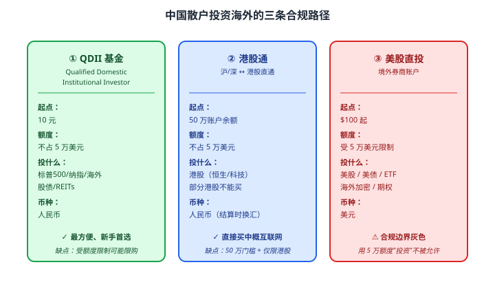

# 30 外汇基础

> **这一章要让你搞懂的事**
> 1. **汇率**到底是什么——为什么人民币 / 美元每天波动
> 2. **人民币汇率机制**——有管理的浮动汇率
> 3. **个人 5 万美元购汇额度**——什么能用、什么不能用
> 4. **QDII 基金 / 港股通 / 美股直投**——三条投资海外的合规路径
> 5. **汇率风险**：投资海外资产时谁在赚谁在亏
> 6. **外汇储备 / 中美利差** —— 看懂宏观新闻
>
> **入门门槛**
> - 第 03 章：通胀与实际收益
> - 第 11 章：利率
> - 第 22 章：ETF
>
> **声明**：本教程不构成投资建议；所有汇率、产品为教学示例。

---

## 0. 先讲个故事

**老李的儿子** 2024 年 9 月去美国留学。

学费 + 生活费 **每年约 6 万美元** —— 老李提前 3 个月开始准备。

**当时汇率**：1 USD = **7.30 RMB**

老李分两次操作：
- **7 月**：换了 **3 万美元**（7.25 RMB/USD）→ 花了 21.75 万人民币
- **9 月**：换了 **3 万美元**（7.10 RMB/USD）→ 花了 21.30 万人民币

**总成本**：43.05 万人民币

**反观隔壁老王**：
- 觉得"美元会涨"，6 月一次性换了 12 万美元（**老王儿子和老李儿子都在 9 月开学**）
- 当时汇率 7.30 → 花了 87.6 万人民币
- 9 月汇率跌到 7.10 → 老王的 12 万美元"账面亏"了 (7.30-7.10) × 12 万 = **2.4 万人民币**

**老李省下 2.4 万**——靠**分批换汇**。

> 这章告诉你：
> 1. **汇率不可预测**——专家都猜不准，散户更别想
> 2. **真实跨境需求**（留学/旅游/海外投资）→ **分批操作**降低汇率风险
> 3. **个人有 5 万美元/年购汇额度**——不是无限的
> 4. **想投资海外资产**有合规路径（QDII / 港股通 / 美股直投）

---

## 1. 汇率到底是什么

### 1.1 一句话定义

**汇率（Exchange Rate）= 一种货币兑换另一种货币的"价格"**。

**例**：1 USD = 7.10 RMB 意思是——"今天 1 美元能换 7.10 元人民币"。

### 1.2 谁决定汇率

**短期**：市场供需 + 投机
**中期**：利率差 + 通胀差 + 贸易差
**长期**：经济实力 + 生产率差异

**主流理论**：

| 理论 | 核心 |
|---|---|
| **购买力平价（PPP）** | 长期看，**两国通胀差决定汇率走势**——通胀高的货币贬值 |
| **利率平价（IRP）** | 短期看，**利率高的货币短期会升值** |
| **国际收支** | 贸易顺差大的国家货币长期升值 |

### 1.3 汇率"涨"和"跌"的方向

**关键**：**直接标价法 vs 间接标价法**——容易混。

**中国惯用**："1 USD = 7.10 RMB"
- 数字**上升**（7.10 → 7.30）= **人民币贬值**
- 数字**下降**（7.30 → 7.10）= **人民币升值**

**翻译成人话**：数字越大，**用更多人民币才能换 1 美元 = 人民币不值钱了**。

---

## 2. 人民币汇率机制

### 2.1 三种汇率制度

| 制度 | 含义 | 例子 |
|---|---|---|
| **固定汇率** | 央行牢牢锁定一个数 | 改革开放前的人民币 |
| **浮动汇率** | 完全由市场决定 | 美元 / 欧元 / 日元 |
| **有管理的浮动** | 央行有引导但允许波动 | **中国现在的人民币** |

### 2.2 中国的汇率改革史

| 时间 | 事件 |
|---|---|
| 1994 | 双轨制并轨，1 USD ≈ 8.7 RMB |
| 2005-7 | 汇改启动 → 人民币缓慢升值 |
| 2008-2010 | 金融危机期间锁定 6.83 |
| 2014 | 升值到 6.0（最强）|
| 2015-8 | "811 汇改"——一次性贬值 2% |
| 2018-2019 | 中美贸易战，破 7 |
| 2022-2024 | 在 6.8 - 7.3 区间波动 |

**中国汇率的"特点"**：
- 央行**每天公布"中间价"**
- 市场可以在中间价**±2% 范围内波动**
- 关键时刻**央行直接干预**（如"逆周期因子"）

### 2.3 在岸 vs 离岸人民币

| 名词 | 含义 |
|---|---|
| **CNY（在岸）** | 中国境内交易的人民币——央行严格管理 |
| **CNH（离岸）** | 香港等境外市场交易的人民币——更自由 |

**两者通常差异 < 0.5%**，但**关键时刻可能拉大到 1-2%**（如 2015 汇改）。

---

## 3. 个人 5 万美元购汇额度

### 3.1 规则

**国家外汇管理局规定**：
- 中国居民**每人每年**可购汇额度 **5 万美元等值**
- 也可结汇（换回人民币）**5 万美元等值**
- 不区分用途，但**严禁用于投资境外证券、保险、不动产**

### 3.2 5 万美元能干什么

✓ 允许：
- 出国旅游
- 留学学费 + 生活费
- 商务出差
- 探亲访友
- 跨境医疗

✗ 不允许：
- **直接买美股**（个人渠道）
- **买境外房产**
- **买境外保险**（含香港保险）
- **买虚拟货币**

### 3.3 超过 5 万怎么办

| 路径 | 说明 |
|---|---|
| **真实留学 / 医疗 / 商务** | 凭证明文件**可超额办理**（银行审批）|
| **每年 5 万滚动** | 5 年 = 25 万美元额度 |
| **家庭多账户** | 夫妻俩 + 父母 = **20 万美元/年**（同一目的需注意"分拆"风险）|
| **QDII / 港股通** | **合规跨境投资渠道**（不占 5 万额度）|

### 3.4 实操要点

**购汇渠道**：
- 银行 APP（最方便）
- 银行柜台
- ATM 部分支持

**注意**：
- **每年 1 月 1 日额度刷新**
- 部分银行**汇率比官方差**——比较 4-5 家
- 大额（>1 万美元）建议**多次小额操作**避开点差

---

## 4. 投资海外的三条合规路径

### 4.1 三条路径全景

### 4.2 QDII 基金详解

**QDII（合格境内机构投资者）**：基金公司用机构额度去海外买资产，散户买基金份额参与。

**主流 QDII**：

| 类型 | 代表 |
|---|---|
| 美股指数 | 标普 500 ETF（513500）、纳指 100 ETF（513100）|
| 港股指数 | H 股 ETF（510900）、恒生科技（513180）|
| 全球股 | 多个 MSCI ACWI 基金 |
| 海外债券 | 多个全球债基金 |
| 海外 REITs | 部分 QDII 涵盖 |

**关键问题**：**额度紧张时会限购**——出现"代持费"现象（场内 QDII 溢价 5-20%）。

> ⚠️ **不要追跨境 QDII 高溢价**——参见第 22 章。

### 4.3 港股通详解

**开通条件**：
- 证券账户连续 **20 个交易日日均资产 > 50 万**
- 完成风险测评

**能买的**：
- 港股通名单内股票（约 500 只）
- 包括腾讯、阿里、美团、小米等中概互联网

**交易特点**：
- T+0 不能（A 股规则）
- 红利税 20%
- 印花税 0.13%

### 4.4 美股直投：合规边界

**两种做法**：
- **A 类**：在中国境内通过持牌券商（如老虎、富途 ESOP 合规通道）—— **合规但用途受限**
- **B 类**：直接开境外券商（Charles Schwab、IB 等）—— **个人外汇 5 万额度不允许用于此类"投资"**

**现实**：很多散户用"旅游/留学"为由换汇，再投美股——**严格意义上不合规**，监管不定期收紧。

**建议**：**主要通过 QDII 路径**——合规、方便、币种风险已对冲。

---

## 5. 汇率风险

### 5.1 投资海外资产的"汇率叠加"

**例**：你买标普 500 ETF（QDII）

| 标普 500 涨跌 | USD/RMB 涨跌 | 你的实际收益 |
|---|---|---|
| +10% | 0% | +10% |
| +10% | **人民币升值 5%**（USD 跌）| **+5%** |
| +10% | **人民币贬值 5%**（USD 涨）| **+15%** |
| -10% | +5%（USD 涨）| -5% |
| -10% | -5%（USD 跌）| **-15%**（双重打击）|

**翻译成人话**：买海外资产 = 买**标的回报 + 汇率变化**。

### 5.2 汇率对冲

**部分 QDII 有"人民币对冲版"**：
- **R 类（对冲）**：扣除汇率影响，**纯股票回报**
- **A 类（不对冲）**：标的 + 汇率叠加

**对冲的代价**：年化 -0.5% 到 -1.5%（对冲成本）

**散户怎么选**：
- 看好美元 → 选 A 类（不对冲）
- 看跌美元 → 选 R 类（对冲）
- 不确定 → 50:50 各持一半

### 5.3 历史汇率波动

| 时段 | USD/RMB 变化 | 影响 |
|---|---|---|
| 2018-2019 贸易战 | 6.3 → 7.2 | 美股 QDII 多赚 14% |
| 2020-2021 美元宽松 | 7.0 → 6.3 | 美股 QDII 少赚 10% |
| 2022-2024 美元加息 | 6.3 → 7.3 | 美股 QDII 多赚 16% |

**结论**：**汇率波动 ±5-10%/年 是常态**。

---

## 6. 看懂宏观新闻

### 6.1 经常出现的术语

| 术语 | 含义 |
|---|---|
| **中间价** | 央行公布的官方汇率参考价 |
| **逆周期因子** | 央行调节"中间价"的工具 |
| **外汇储备** | 中国央行持有的外币资产 |
| **中美利差** | 中美 10 年国债 YTM 之差 |
| **汇率干预** | 央行卖美元买人民币（救汇率）|

### 6.2 中美利差对汇率的影响

**铁律**：**美国利率高 - 中国利率低 = 资金流向美元 = 人民币贬值压力**。

**2022-2024**：
- 美国 10 年国债 YTM 4-5%
- 中国 10 年国债 YTM 2-2.5%
- **利差 -2% 到 -3%** → 人民币持续贬值压力

**2025-2026 展望**：
- 如果美联储降息 → 利差缩小 → 人民币升值
- 如果中国降息更多 → 利差扩大 → 人民币贬值

### 6.3 看新闻的实用清单

| 新闻 | 含义 |
|---|---|
| "央行下调外汇存款准备金率" | 释放美元，**支撑人民币** |
| "重启逆周期因子" | 央行不希望人民币再贬 |
| "中间价偏强" | 央行透露希望人民币稳定 |
| "外汇储备下降" | 央行可能在卖美元救人民币 |

---

## 7. 进阶讨论

**入门读者可以跳过本节**。

### 7.1 SDR 与人民币国际化

**SDR（特别提款权）**：IMF 的"超主权货币篮子"，由 USD/EUR/JPY/GBP 组成。

**2016 年**：人民币正式加入 SDR 篮子 → **人民币成为"国际储备货币"之一**。

**意义**：
- 全球央行可持有人民币作为外汇储备
- 人民币逐步走向国际化
- 长期看好人民币国际地位

### 7.2 数字人民币

**2020 起试点**：
- 央行发行的数字版人民币
- 跨境支付潜力大
- 长期可能影响美元霸权

### 7.3 个人税收

**境外投资收益的税务处理**：
- QDII 基金分红：**部分免税**
- 港股通分红：20% 红利税
- 美股直投股息：30% 预扣税（中美税收协定可降至 10%）
- **资本利得**：中国大陆居民境外投资资本利得**目前免税**（政策可能变）

### 7.4 汇率投机

**散户做汇率"投机"**：
- 通过纸汇 / 离岸账户
- **失败率极高**——汇率受太多宏观因素影响
- **不要做**——和第 27 章讲的衍生品投机一样

### 7.5 资本管制的逻辑

**为什么中国有 5 万美元额度**：
- 防止资本大规模外流
- 稳定金融体系
- 保护人民币汇率

**对散户的现实**：
- 接受额度约束
- 主要通过 QDII 等合规渠道投海外
- **不要尝试"绕过"** —— 严格意义上违法且不安全

---

## 8. 小结

1. **汇率 = 一种货币兑换另一种的"价格"**。短期看供需 + 投机，长期看通胀差 + 经济基本面。
2. **人民币是"有管理的浮动汇率"**——央行每天公布中间价，市场 ±2% 浮动。
3. **个人每年 5 万美元购汇额度**——可用于真实跨境需求（旅游/留学/医疗），**不可用于直接投资境外证券/不动产**。
4. **投资海外三条路径**：① **QDII**（最方便，1 元起，不占额度）② **港股通**（50 万门槛，直接买港股）③ **美股直投**（合规边界灰色）。
5. **汇率风险**：投资海外资产 = 标的回报 + 汇率变化。**±5-10%/年是常态**。
6. **对冲版 QDII（R 类）**抹掉汇率影响，**成本 0.5-1.5%/年**。**不确定方向 → 50:50 配置**。
7. **看新闻三大要点**：中美利差 / 中间价 / 外汇储备。
8. **散户不做汇率投机**——和衍生品投机一样长期亏损。

> 🔗 **承上启下**：下一章 **31 保险作为理财工具**——保障型 vs 储蓄型的边界。重点学会**用 IRR 算法看穿"年化 4%"的真实回报**。

---

## 自测题

> 答案在文末折叠区。

1. 用一句话区分"汇率升值"和"汇率贬值"（以人民币 vs 美元为例）。
2. 个人每年 5 万美元购汇额度允许做什么、不允许做什么？说出至少各 2 项。
3. 投资海外资产的三条合规路径分别是什么？哪条最适合新手？
4. 你买美股标普 500 QDII。1 年内标普 500 涨 15%，同期 USD/RMB 从 7.2 跌到 6.8。你（A 类不对冲）的实际收益是多少？
5. "中美利差倒挂"对人民币汇率意味着什么？为什么？
6. **进阶题**：你有 20 万人民币想长期投资海外资产。三种选择：
   - A：全部买不对冲版美股 QDII
   - B：全部买对冲版（R 类）美股 QDII
   - C：50% 不对冲 + 50% 对冲
   假设 5 年内标普 500 涨 50%、USD/RMB 在 7.0 - 7.5 之间无趋势性波动。哪种最优？
7. **作业题**：打开任意基金平台，搜"标普 500 QDII"。**对比**：
   - ① 找到一只 A 类（不对冲）和一只 R 类（对冲）
   - ② 比较它们近 1 年的回报差异
   - ③ 查看它们的"申购费"和"管理费"
   - ④ 当前是否限购？

📖 参考答案

1. 中国惯用"1 USD = X RMB"：
   - **人民币升值**：X 变小（7.30 → 7.10）——**用更少人民币就能换 1 美元 = 人民币更值钱**
   - **人民币贬值**：X 变大（7.10 → 7.30）——**用更多人民币才能换 1 美元 = 人民币不值钱**

2. **允许**：① 出国旅游 ② 留学学费 + 生活费 ③ 商务出差 ④ 探亲访友 ⑤ 跨境医疗
   **不允许**：① 直接买美股 ② 买境外房产 ③ 买境外保险（含香港保险）④ 买虚拟货币

3. **三条路径**：
   - ① **QDII 基金**：1 元起、不占 5 万额度，**最适合新手**
   - ② **港股通**：50 万门槛、直接买港股
   - ③ **美股直投**：合规边界灰色，5 万额度不允许用于投资
   - **新手最优**：**QDII**——最方便、合规清晰、币种风险已被对冲版自动处理

4. 标普 500 涨 15% → 美元资产价值 ×1.15
   汇率从 7.2 → 6.8 → 美元贬值 = (7.2-6.8)/7.2 = -5.6%
   **实际收益** = 1.15 × (1 - 0.0556) - 1 = 1.15 × 0.9444 - 1 = **+8.6%**
   **结论**：标普涨 15%，但因为人民币升值，实际只赚 8.6%——**汇率吃掉了 6.4 个百分点**。

5. **中美利差倒挂（美国 > 中国）→ 人民币贬值压力**。原因：
   - 套利资金倾向于流向**收益率高的货币**（美元）
   - 中国资金外流压力增大
   - 央行可能干预，但长期趋势难逆转
   - **2022-2024**正是此现象的体现：美国加息 + 中国降息 = 利差 -2% 到 -3% → 人民币从 6.3 跌到 7.3

6. 假设场景：5 年标普涨 50%、USD/RMB 在 7.0 - 7.5 无趋势性波动（即起始和结束汇率相近）。
   - **A（不对冲）**：50% 标的回报 + 接近 0 的净汇率回报 = **约 50%**
   - **B（对冲）**：50% 标的回报 - 5 × 1% 对冲成本 = **约 45%**
   - **C（50:50）**：约 50% × 0.5 + 45% × 0.5 = **约 47.5%**
   - **最优**：**A** —— 因为汇率假设无趋势，对冲是"白付保险费"
   - **现实启示**：**对冲适合"汇率有明确趋势"或"已有美元资产想换回人民币"的场景**；**长期无明确趋势时，不对冲更优**

7. 没有标准答案。**重点观察**：
   - **R 类长期回报通常低于 A 类 0.5-1.5%/年**（对冲成本）
   - **A 类受人民币贬值影响时回报"高出"R 类**；人民币升值时反之
   - **申购费**：A 类 0.1-1.5% / R 类类似
   - **管理费**：A 类 R 类相近（0.6-1.5%/年）
   - **限购**：纳指 ETF 和标普 500 ETF 经常限购或场内大幅溢价——**说明 QDII 额度紧张**
   - **小贴士**：如果场内 ETF 溢价 > 3%，**坚决不追**——见第 22 章

---

## 延伸阅读

- 《人民币国际化报告》—— 中国人民银行年度发布
- 《汇率制度的选择》—— 余永定：中国汇率改革思路
- 国家外汇管理局：[safe.gov.cn](http://www.safe.gov.cn/) —— 个人购汇政策原文
- **彭博 / 路透汇率版**：实时查 USD/CNY/CNH 报价
- 《国际金融新格局下的人民币》—— 鄂志寰：人民币国际化前瞻
- IMF：[特别提款权（SDR）](https://www.imf.org/) —— 国际储备货币基础

---

## 下一章预告

**31 保险作为理财工具**：
- 保险的两种功能：**保障 vs 储蓄**
- 重疾 / 医疗 / 意外 / 寿险（保障型）
- 年金险 / 增额终身寿（储蓄型）
- **IRR 算法**：看穿"年化 4%"的真实回报
- 销售陷阱
