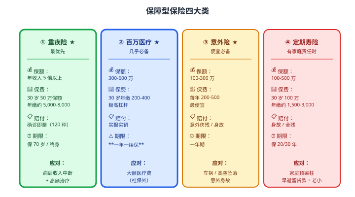
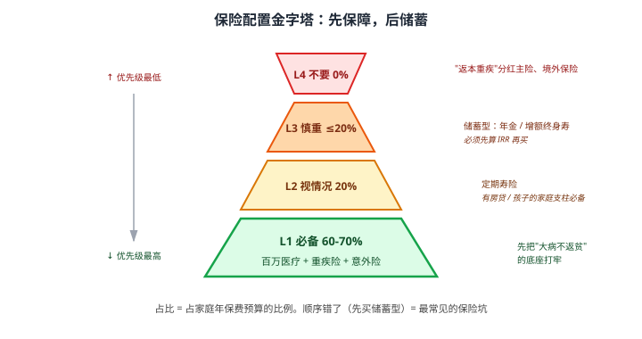

# 31 保险作为理财工具

> **这一章要让你搞懂的事**
> 1. 保险的**两种功能**：保障 vs 储蓄——大多数人买错了
> 2. **保障型 4 大类**：重疾 / 医疗 / 意外 / 寿险——优先级
> 3. **储蓄型 2 大类**：年金险 / 增额终身寿——它们是"理财"吗
> 4. **IRR 算法**——看穿"年化 4%"的真实回报（往往低于 3%）
> 5. **销售陷阱**：分红险演示利率、年金返还时点、退保损失
> 6. **正确顺序**：先保障 → 再投资 → 最后才考虑储蓄型
>
> **入门门槛**
> - 第 01 章：财务规划基础
> - 第 02 章：复利
> - 第 06 章：标准普尔象限的 ② 保命的钱
>
> **声明**：本教程不构成投资建议；不推荐任何具体保险产品；所有数字均为教学示例。

---

## 📖 本章英文缩写速查

> 看到不认识的英文缩写，先回这张表查；完整术语见 [GLOSSARY.md](../GLOSSARY.md)。

| 缩写 | 英文全称 | 中文含义 |
|---|---|---|
| **IRR** | Internal Rate of Return | 内部收益率 |
| **XIRR** | Extended Internal Rate of Return | 不规则现金流的内部收益率（真实年化收益） |

---

## 0. 先讲个故事

**老张** 2018 年被一位"理财顾问"推销了一份"增额终身寿险"：
- 每年缴 **5 万元**，缴 10 年
- 顾问说："**复利 3.5%，60 岁后随便取**"
- 老张算："**比银行定期高，还安全**"，签了

**6 年过去（2024 年）**，老张缴了 30 万。他用第 38 章学到的 **IRR 算法** 算了一笔账：

| 年份 | 缴费 | 现金价值 |
|---|---|---|
| 1 | -5 万 | 0.5 万 |
| 2 | -5 万 | 3.0 万 |
| 3 | -5 万 | 6.5 万 |
| 4 | -5 万 | 11.0 万 |
| 5 | -5 万 | 17.0 万 |
| 6 | -5 万 | 24.0 万 |

**6 年缴 30 万，现金价值 24 万** —— **如果现在退保，亏 6 万！**

老张去 Excel 拉 IRR 公式：**6 年的真实年化 ≈ -2%**

**销售员说的"3.5% 复利"**——是**对"保单价值"的复利**，**不是对你缴的钱**。**前 10 年退保都亏**。如果坚持持有：
- 缴费 10 年共 50 万 → 第 20 年时现金价值约 75 万 → **真实 IRR 约 2.8%**
- 第 30 年时约 110 万 → **真实 IRR 约 3.1%**
- 第 40 年时约 160 万 → **真实 IRR 约 3.3%**

**所以宣传的"3.5%" 是 30-40 年后才能勉强达到的数字**——不是"前期就有 3.5%"。

老张感慨：
> "我当初要是先学 IRR，就不会这么签了。"

> 这章告诉你：
> 1. **保险的本质是"风险转移"——不是赚钱**
> 2. **保障型保险**（重疾/医疗/意外/寿）—— **每个家庭必备**
> 3. **储蓄型保险**（年金/增额终身寿）—— **看似稳健但真实收益往往低于宣传**
> 4. **学会 IRR**才能看穿储蓄型保险的真实回报

---

## 1. 保险的两种功能

### 1.1 一句话区分

| 类型 | 核心功能 | 关键特征 |
|---|---|---|
| **保障型** | **转移风险**（大病 / 意外 / 早逝）| 一次性大额赔付 + 杠杆高（年缴几千保几十万）|
| **储蓄型** | **强制储蓄 + 锁定利率** | 长期返还 + 真实 IRR 2-3.5% |

### 1.2 中国家庭的"保险悲剧"

**典型场景**：
- 第一份保险是**储蓄型**（销售员喜欢卖）
- **保障型缺失**——重疾、医疗都没买
- 一旦生病 → **储蓄险退保亏一半 + 医疗费倒贴**

**正确顺序**：
1. ✅ **保障型先买齐**（重疾 + 医疗 + 意外，30-50 岁是必须）
2. ✅ **应急金存够**（6-12 个月，详见第 7 章）
3. ✅ **投资优先**（股基 + 债基，长期复利）
4. ⚠️ **才考虑储蓄型** —— 如果对长期锁定利率有强烈需求

---

## 2. 保障型保险：4 大类

### 2.1 四大保障类对比

### 2.2 优先级排序

| 优先级 | 类型 | 谁需要 |
|---|---|---|
| ① 必须 | **百万医疗** | 几乎所有人 |
| ② 必须 | **重疾险** | 25-55 岁人群 |
| ③ 必须 | **意外险** | 所有人（一年只要几百块）|
| ④ 视情况 | **定期寿险** | **有家庭责任**的人（有房贷、子女、老人赡养）|
| ⑤ 慎重 | **终身寿险** | 大额遗产规划，**普通家庭不必**|

### 2.3 经典配置（30 岁单身 vs 35 岁家庭）

**30 岁单身**：
- 百万医疗：300 元/年
- 重疾险：50 万保额，5,000 元/年
- 意外险：100 万保额，200 元/年
- **合计：5,500 元/年**

**35 岁家庭（有房贷 + 孩子）**：
- 百万医疗：500 元/年（自己 + 配偶）
- 重疾险：50 万保额 × 2，10,000 元/年
- 意外险：100 万 × 2，400 元/年
- **定期寿险**：100 万保额 × 2，4,000 元/年
- **合计：约 15,000 元/年**

**核心原则**：**保费占年收入 5-10%** 是合理范围。**超过 15% 就要警惕**。

---

## 3. 储蓄型保险：2 大类

### 3.1 年金险

**机制**：
- 你每年缴一笔（如缴 5-10 年）
- 到某个时点（如 60 岁）开始**每年领取一笔现金**
- 终身领取或定期（如 20 年）

**典型现金流**：

| 年份 | 你的行动 |
|---|---|
| 1-10 | 缴费每年 5 万 |
| 11-59 | 不缴不领（保单"成长"）|
| 60-终身 | 每年领 1.5 万 |

**真实回报**：IRR 通常 **2.5-3.5%**（活到 85+ 才能达到上限）

### 3.2 增额终身寿

**机制**：
- 你缴费几年（如 3-5 年或一次性）
- 保单"现金价值"按某个利率增长（**宣传 3.5% 复利**）
- 你可以**部分退保领钱** 或 **持有到死，传给家人**

**特点**：
- **灵活性**比年金高
- 真实 IRR 取决于持有时间：5 年 -10%、20 年 2.5%、40 年 3.0-3.2%
- **核心卖点**：**锁定长期利率**（在利率下行环境）

### 3.3 储蓄型保险的"利率锁定"价值

**反直觉点**：储蓄型保险**真正的价值不是"高收益"**，而是"**锁定 30-50 年的利率**"。

**对比**：
- 现在买银行定期：5 年 2.0%
- 现在买增额终身寿：40 年后 IRR 约 3.0-3.2%

**情景**：如果未来 20 年中国进入 0% 利率（参考日本），**储蓄型保险的"锁定 3.0%"就显得有价值**。

**这就是为什么**：在利率下行预期下，储蓄型保险**有时是合理选择**——但**只对接受 30+ 年锁定的人**。

---

## 4. IRR：看穿真实回报

### 4.1 为什么必须懂 IRR

**销售员话术**：
- "复利 3.5%"
- "8 年回本"
- "20 年翻倍"

**这些数字都是经过销售优化的**——**真实年化收益率是 IRR（Internal Rate of Return，内部收益率）**。

### 4.2 IRR 算法

**Excel 公式**：`=IRR(现金流数组)` 或 `=XIRR(现金流, 日期)`

**例**（增额终身寿）：

| 年 | 现金流 |
|---:|---:|
| 0 | -50,000（缴费）|
| 1 | -50,000 |
| 2 | -50,000 |
| ... | ... |
| 9 | -50,000 |
| 10 | 0（停缴）|
| 11-39 | 0 |
| 40 | +1,600,000（退保领回） |

**Excel**：`=IRR([-50000, -50000, ..., -50000, 0, ..., 1600000])`
**结果**：约 **3.05%**

### 4.3 看穿销售话术

| 销售说法 | 真实情况（IRR）|
|---|---|
| "复利 3.5%" | 持有 40+ 年才能勉强达到 |
| "保单价值 8 年回本" | 5-10 年内退保亏 5-15% |
| "前 5 年缴费，第 6 年开始返还" | 现金流计算后真实 IRR 仅 2% 左右 |
| "活到 85 岁能领回 200 万" | IRR 算下来仅 2.5%-3% |

### 4.4 多个产品的 IRR 对比

| 产品 | 持有期 | 真实 IRR |
|---|---|---|
| 银行 5 年定期 | 5 年 | 2.0% |
| 国债 10 年 | 10 年 | 2.5% |
| **储蓄型保险（持有 20 年）** | 20 年 | **2.8% 左右** |
| **储蓄型保险（持有 40 年）** | 40 年 | **3.0-3.2%** |
| 沪深 300 指数基金（长期）| 30 年 | 历史约 8% |

**翻译成人话**：储蓄型保险的"3.5% 复利"在**长期持有 40 年时勉强接近** —— 但**和指数基金长期回报相比仍差 5%**。

---

## 5. 销售陷阱

### 5.1 "演示利率"陷阱

**分红险 / 万能险**会展示多个收益场景：
- **保证收益**：写明合同（通常 1.5-2%）
- **中档演示**：4-4.5%
- **高档演示**：6%

**真相**：
- **保证收益是法律承诺**——一定有
- **中档/高档是"如果分红顺利"**——大概率拿不到

**实际数据**：过去 10 年多家保险公司分红实际只达到**中档的 50-70%**。

### 5.2 "返还时点"陷阱

**典型话术**："**前 5 年缴费，第 6 年开始每年返 10%**。"

**听起来**：5 年缴 25 万 → 第 6 年起每年返 5 万 → "5 年回本"！

**真实计算**：
- 现金流：-5, -5, -5, -5, -5, 5, 5, 5, ..., 5（持续 20 年）
- IRR ≈ **2.2%**——远低于宣传的"10% 返还"

**反思**：返还的"10%" 是按**初始保额**算的，不是按"复利"算。

### 5.3 退保损失

**铁律**：**前 5-10 年退保几乎都亏本金**。

**例**：缴 30 万到第 6 年 → 现金价值 24 万 → **退保亏 6 万**。

**原因**：保险公司的销售佣金 + 管理费在前期被提走。

### 5.4 "保险 + 投资"的不实宣传

**常见话术**：
- "**有保障 + 有理财**！"
- "**比定期高 + 终身有保障**"
- "**长期持有 = 投资 + 保险二合一**"

**真相**：
- "保障部分" 杠杆远低于纯保障险（重疾 / 医疗）
- "投资部分" 真实回报远低于股基 / 债基
- **二合一 = 两边都不顶用**

### 5.5 香港 / 境外保险

**销售话术**：
- "美元保单，**对冲人民币贬值**"
- "**收益 6%+**"
- "**法律保护好**"

**真相**：
- **个人 5 万美元额度不允许买境外保险**（见第 30 章）
- 境外保单**汇率风险大** —— 人民币升值时大亏
- "6% 收益"多为分红险**演示利率**——非保证
- 大陆居民境外保单**法律执行复杂**——理赔成本高

**结论**：境外保险**对绝大多数大陆家庭不适合**。

---

## 6. 正确顺序与配置

### 6.1 保险配置金字塔

| 层级 | 类型 | 占年保费 |
|---|---|---|
| L1 必备 | 百万医疗 + 重疾险 + 意外险 | **60-70%** |
| L2 视情况 | 定期寿险（家庭责任）| 20% |
| L3 慎重 | 储蓄型（年金 / 增额终身寿）| ≤ 20% |
| L4 不要 | 分红型主险（"返本重疾")、境外保险 | 0% |

### 6.2 各年龄段建议

| 年龄 | 重点 |
|---|---|
| **20-30 岁** | 意外险 + 医疗险 + 重疾险 |
| **30-40 岁** | 加定期寿险（如有房贷/孩子）|
| **40-55 岁** | 体检后加配重疾险、增额终身寿（如锁利率需求）|
| **55+ 岁** | 防癌险 + 医疗险 + 年金险（如养老需求）|

### 6.3 投保前必做

| 动作 | 为什么 |
|---|---|
| **健康告知**做到极度坦诚 | 隐瞒可能导致拒赔 |
| **多家公司比价** | 同等保障价差可达 30%+ |
| **看保险公司"理赔率"** | 通常 95%+ 较稳，看银保监数据 |
| **算 IRR** | 储蓄型保险必算 |
| **签前犹豫期** | 投保后 15 天内可全额退保 |

---

## 7. 进阶讨论

**入门读者可以跳过本节**。

### 7.1 保险公司不会倒闭吗

**中国监管**：
- 银保监会负责
- 设有"保险保障基金"（类似存款保险）
- 历史上有过破产案例（如安邦），但**保单全部继续有效**——监管会安排接管

**结论**：**单家公司倒闭不影响保单**——比存款更稳。

### 7.2 寿险的"逆周期"价值

**寿险公司是中国机构投资者中**：
- 持有大量长期债券（30 年国债）
- 受益于利率上行（再投资收益高）
- 受损于利率下行

**对个人启示**：**利率下行预期下储蓄型保险是合理选择**——你锁定的是保险公司"无法再锁定"的高利率。

### 7.3 "互助" 类产品

- 相互宝（已停运）、众托帮等
- **不是保险**——属于互助计划
- 监管不严，**保障性差** —— 不可替代正规保险

### 7.4 公司给员工的团险

很多公司给员工买**团体医疗险 / 意外险**：
- **保障基础**——但额度通常低
- **离职即终止** —— 需要个人补充
- **不要把公司保险当全部保障**

### 7.5 健康告知的"如实义务"

**保险法**：
- 投保人有"如实告知"义务
- **未如实告知 + 与出险相关**→ 保险公司可拒赔
- **未如实告知 + 与出险无关**→ 法院通常仍判保险公司理赔

**实操**：**有问必答，无问不答**——保险公司没问的不用主动说，但问到的必须诚实。

---

## 8. 小结

1. **保险分两类**：**保障型**（转移风险）vs **储蓄型**（强制储蓄）。**功能完全不同，不要混**。
2. **保障型 4 大类**：① 百万医疗（几乎必备）② 重疾险（25-55 岁必备）③ 意外险（最便宜必备）④ 定期寿险（家庭责任时）。
3. **保费占年收入 5-10% 合理**，超过 15% 警惕。
4. **储蓄型 2 大类**：年金险（定期返还）+ 增额终身寿（灵活）。**真实 IRR 通常 2.5-3.5%**——长期持有 30+ 年才接近"宣传利率"。
5. **必须学 IRR**：Excel `=IRR(现金流)` 或 `=XIRR(现金流, 日期)`。**看穿"复利 3.5%"** 的真实数字。
6. **5 大销售陷阱**：演示利率、返还时点、退保损失、"二合一"宣传、境外保险。
7. **正确顺序**：① 保障型买齐 ② 应急金存够 ③ 投资优先 ④ 才考虑储蓄型。
8. **境外 / 香港保险**：合规问题 + 汇率风险 + 法律执行复杂 → **对大陆家庭不适合**。

> 🔗 **承上启下**：保险讲完了。最后一章 **32 数字资产（审慎）**——比特币的逻辑、境内合规边界、为什么不应作为核心配置。**05 模块收官**。

---

## 自测题

> 答案在文末折叠区。

1. 用一句话区分"保障型"和"储蓄型"保险。哪类应该优先买？
2. 30 岁单身月薪 1.5 万，应该买哪几种保险？保费上限多少合理？
3. 销售员说"增额终身寿复利 3.5%"。真实情况下持有多久才能接近这个数字？
4. **数学题**：你买一份年金险，缴 5 年每年 5 万，第 10 年起每年领 2 万直到 30 年。
   - 用 Excel IRR 算真实回报率
   - 这个回报率合理吗？
5. 为什么"百万医疗险"年缴几百块就能保几百万？这种"高杠杆"的代价是什么？
6. "境外香港保险收益 6%+"——这种说法的 3 个陷阱是什么？
7. **进阶题**：35 岁、月薪 3 万、有房贷 100 万、1 个 5 岁孩子。请设计**合理的保险组合**，估算年保费总额（占收入比）。
8. **作业题**：你（或家人）有过购买储蓄型保险的经历？
   - ① 找出**保单合同**（多在 APP / 微信公众号 / 纸质合同）
   - ② 列出**所有缴费年和金额** + **所有领取年和预计金额**
   - ③ 用 Excel `=IRR(...)` 算真实回报率
   - ④ 比较销售员当年告诉你的"复利率"和真实 IRR 的差距

📖 参考答案

1. **保障型** = 用小钱（保费）转移大风险（重大疾病/意外/早逝）——**杠杆高**，年缴几千保几十万。**储蓄型** = 强制储蓄 + 锁定长期利率——**低杠杆**，真实 IRR 2-3.5%。
   **优先**：**保障型** —— 没保障的人遇到重大意外，所有储蓄都可能被吞噬。

2. 30 岁单身 1.5 万月薪 = 年收入 18 万。**保费上限 5-10% = 9,000-18,000 元/年**。
   - 百万医疗：300 元
   - 重疾险 50 万保额：5,000 元
   - 意外险 100 万保额：200 元
   - **合计约 5,500 元**——非常合理，留出充足收入做储蓄 / 投资。
   - **不需要寿险**（单身无家庭责任）

3. **30-40 年**。储蓄型保险前期"现金价值"远低于已缴保费——主要因为：
   - 销售佣金（前 5 年最高）
   - 管理费用前置
   - "复利"是针对保单价值，不是针对你已缴的钱
   - **前 5-10 年退保通常亏本金**；20 年勉强回本+一点；30-40 年才接近"宣传利率"

4. 现金流（Excel）：
   - 第 0-4 年：-50000（缴费 5 次）
   - 第 5-9 年：0
   - 第 10-29 年：+20000（领 20 次）
   - `=IRR([-50000, -50000, -50000, -50000, -50000, 0, 0, 0, 0, 0, 20000, 20000, ..., 20000])`
   - **结果约 1.9%**
   - **不合理**：30 年期 IRR 仅 1.9% —— **远低于国债 2.5%**，更别说股基 8%。**几乎不如直接买定期存款**。

5. 百万医疗险**高杠杆的本质**：
   - **大数定律**：1 万人中只有少数人会用到 300 万保额（重大疾病住院）
   - **保险公司精算**：平均每人理赔成本几百元 → 收 300 元仍有盈利
   - **代价**：
     - **一年一续保**——保险公司可以**次年拒续保 / 涨价**
     - **续保条件可能变**——年纪大后保费可能涨 5-10 倍
     - **健康告知严**——慢性病可能买不到
     - **理赔门槛**（免赔额 1 万）——小病不赔
   - **结论**：杠杆高的代价是**长期可靠性差** —— 但**短期保障非常便宜有效**

6. **境外（香港）保险"收益 6%+"的 3 大陷阱**：
   - ① **演示利率不保证**：6% 是分红险的"高档演示"，**保证收益通常只有 1.5-2%**，过去 10 年实际仅达到中档的 50-70%
   - ② **汇率风险**：美元 / 港币保单，人民币升值时大亏（你交人民币、领回去也是人民币）
   - ③ **合规与法律**：个人 5 万美元额度不允许买境外保险（违规）；理赔需赴港；法律纠纷在港处理
   - ④（补充）**销售误导**：境外保险代理高额佣金（前 3 年保费的 30-100%），售卖时优化宣传

7. 35 岁、月薪 3 万 = 年收入 36 万。**保费 5-10% = 18,000-36,000 元**。
   - 百万医疗：500 元（自己 + 配偶）
   - 重疾险 50 万 × 2：10,000 元
   - 意外险 100 万 × 2：400 元
   - **定期寿险 200 万 × 2**（覆盖房贷 + 抚养孩子到 22 岁）：约 6,000-8,000 元
   - **合计：约 17,000-19,000 元**（占年收入约 5%）
   - **不建议**：分红型重疾、储蓄型年金（35 岁优先投资股基 / 债基）

8. 没有标准答案。**重点观察**：
   - 多数人发现 IRR 比销售说的"复利率"**低 1-3 个百分点**
   - 多数储蓄型保险**前 5 年退保亏 20-50%**
   - 找出"我当初为什么签了"——往往是**情绪 + 销售话术** 而非理性计算
   - **结论可能让你想退保**——但**已经签了的、第 10 年后再退保的，建议持有到 30+ 年**（已经过了"亏本期"）
   - **重要**：**不要因为这章就盲目退保**——先咨询独立顾问

---

## 延伸阅读

- 《保险其实很简单》—— 闫安：国内独立保险教育者，解读条款陷阱
- 银保监会：[消费者权益保护](http://www.cbirc.gov.cn/) —— 拒赔投诉数据
- 中国保险行业协会：[iachina.cn](http://www.iachina.cn/) —— 保险产品备案查询
- **小雨伞 / 蜗牛保险 / 深蓝保**：第三方保险测评（独立性较强）
- 《漫长的告别》—— 写明保险条款细节的纪录片（理赔故事）

---

## 下一章预告

**32 数字资产（审慎）** —— 05 模块收官：
- 比特币的逻辑：货币学 + 区块链
- 主要数字资产对比
- 境内合规边界
- 为什么不应作为核心配置
- 真想了解，怎么做才合理
