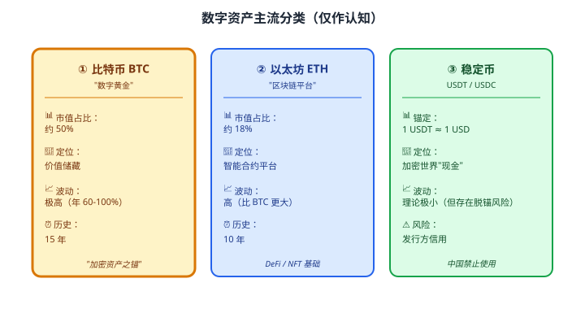
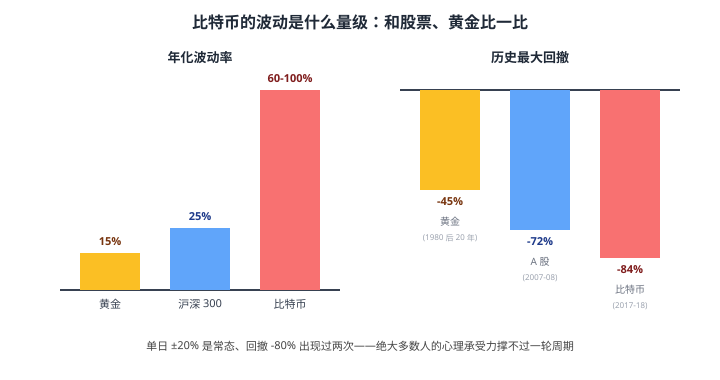

# 32 数字资产（审慎）

> **这一章要让你搞懂的事**
> 1. **比特币 / 数字资产**到底是什么——为什么 10 年涨了 100 万倍又跌了 80%
> 2. **比特币的逻辑**：货币学 + 区块链 + 储值
> 3. **境内合规边界**：2017 / 2021 两次"94" + 当前红线
> 4. 主要数字资产：比特币 / 以太坊 / 稳定币 / 其他山寨币
> 5. 为什么**普通家庭不应作为核心配置**——5 个原因
> 6. 如果**真想了解**，怎么做才合理——观察学习视角
>
> **入门门槛**
> - 第 06 章：资产配置基础
> - 第 25-27 章：衍生品 / 散户认知
> - 第 30 章：外汇基础
>
> **声明**：本教程不构成投资建议；**不教任何"如何买卖加密资产"**。中国境内**禁止虚拟货币交易**，本章仅作认知教育。

---

## 📖 本章英文缩写速查

> 看到不认识的英文缩写，先回这张表查；完整术语见 [GLOSSARY.md](../GLOSSARY.md)。

| 缩写 | 英文全称 | 中文含义 |
|---|---|---|
| **BTC** | Bitcoin | 比特币 |
| **ETF** | Exchange-Traded Fund | 交易所交易基金 |
| **QDII** | Qualified Domestic Institutional Investor | 合格境内机构投资者，借道投资海外的渠道 |
| **NFT** | Non-Fungible Token | 非同质化代币 |
| **USDT** | Tether | 泰达币（美元稳定币） |
| **ICO** | Initial Coin Offering | 首次代币发行（境内已属非法） |
| **P2P** | Peer-to-Peer lending | 网络借贷（已被清退） |
| **ETH** | Ethereum | 以太坊 |
| **CBDC** | Central Bank Digital Currency | 央行数字货币（如数字人民币） |
| **CNY** | Chinese Yuan (onshore) | 在岸人民币 |
| **USD** | US Dollar | 美元 |
| **FOMO** | Fear of Missing Out | 怕错过的焦虑情绪 |
| **OTC** | Over-The-Counter | 场外交易 |
| **KOL** | Key Opinion Leader | 关键意见领袖（网红大 V） |
| **SEC** | Securities and Exchange Commission | 美国证券交易委员会 |
| **MPT** | Modern Portfolio Theory | 现代投资组合理论 |
| **RMB** | Renminbi | 人民币 |
| **CAPM** | Capital Asset Pricing Model | 资本资产定价模型 |
| **IRR** | Internal Rate of Return | 内部收益率 |

---

## 0. 先讲个故事

**两个故事，同一个比特币**：

**故事一**：**程序员小李 2013 年 6 月**——在校时听同学说"比特币能挖矿赚钱"。
- 用宿舍的电脑挖了**5 个比特币**（当时 1 BTC ≈ 700 RMB）
- **总值 3500 元**——他没在意
- 2015 年清空电脑硬盘 → **5 个比特币丢失**
- **2024 年单价 ¥ 50 万 → 那 5 个比特币市值 250 万**——永远找不回

**故事二**：**老张 2021 年 4 月**——朋友圈各种"比特币破 10 万美元"刷屏
- 借朋友 5 万 + 自己 5 万 = 10 万 → 买入 BTC（当时 6.5 万美元）
- **6 个月后 BTC 跌到 3 万 → 老张账户 6 万**
- **2 年后 BTC 重回 6.5 万但老张已经早就割肉**
- 真实损失 4 万 + 还朋友的 5 万本金 → 老张**心脏出问题，住院 2 周**

> 两个故事告诉你：
> 1. **比特币 10 年涨过 100 万倍**——这是事实
> 2. **多数散户买入时已经是高点**——这也是事实
> 3. **真正"早期持有人"** 多数因为各种原因丢失或低价卖出
> 4. **现在入场的逻辑**和 2013 年完全不同——你**不是在淘金，是在博弈一个高风险资产**
>
> 这章告诉你：
> 1. **比特币的逻辑**：从 2009 年至今的故事
> 2. **境内合规边界**：禁止交易，但**可以学习**
> 3. **为什么不应作为核心配置**——5 个理由
> 4. **如果非要"了解"**，怎么做才合理

---

## 1. 比特币的逻辑

### 1.1 历史脉络

| 时间 | 事件 |
|---|---|
| 2008-10 | 中本聪发布《比特币白皮书》 |
| 2009-1 | 第一个比特币区块诞生 |
| 2010-5 | "**Pizza Day**"——1 万个 BTC 换两个披萨（当时价值约 41 美元）|
| 2013 | 第一次破 1000 美元 |
| 2017 | 破 2 万美元 → 暴跌到 3000 |
| 2021 | 破 6 万美元 → 暴跌到 1.6 万 |
| 2024 | 破 10 万美元 |

### 1.2 比特币的三个"叙事"

| 叙事 | 含义 |
|---|---|
| **"数字黄金"** | 总量 2100 万枚的稀缺资产——长期抗通胀 |
| **"价值储藏"** | 不依赖任何政府——抗法币贬值 |
| **"投机资产"** | 高波动 + 散户参与 + 网红效应 |

### 1.3 比特币的核心机制

**区块链 + 工作量证明（PoW）**：
- **去中心化记账**：没有央行，全网共同记账
- **挖矿**：用算力解数学题 → 获得新增比特币奖励
- **总量上限**：2100 万枚，**预计 2140 年全部挖完**
- **半减半（halving）**：每 4 年，挖矿奖励减半 → **稀缺性强化**

### 1.4 比特币的"价格驱动"

| 驱动 | 说明 |
|---|---|
| **半减半周期** | 每 4 年一次，历史上推动牛市 |
| **机构入场** | 2024 年美国 BTC ETF 通过 → 大量机构资金 |
| **美元 / 实际利率** | 与黄金类似——美元弱 / 实际利率低时上涨 |
| **避险情绪** | 部分时段（如 2020 疫情）和黄金一起涨 |
| **散户情绪** | FOMO / 媒体 / 网红——短期波动巨大 |

---

## 2. 中国境内的合规边界

### 2.1 监管时间线

| 时间 | 政策 |
|---|---|
| 2013-12 | 央行：比特币是"虚拟商品"，**不是货币** |
| 2017-9 | **"94 公告"**：禁止 ICO + 关停境内交易所 |
| 2021-5 | 国务院禁止比特币挖矿 + 关闭境内挖矿 |
| 2021-9 | **第二次 "924 公告"**：**所有虚拟货币业务都属非法金融活动** |
| 2024 至今 | 境内禁止任何虚拟货币交易、挖矿、ICO、相关服务 |

### 2.2 当前红线

| 行为 | 是否合规 |
|---|---|
| 持有比特币（个人钱包）| **法律灰色地带**（个人持有不违法，但相关纠纷不受法律保护）|
| 在境内交易所买卖 | **违法**——境内无合规交易所 |
| 翻墙到境外交易所 | **违法**（外汇 + 资本管制）|
| 用 P2P 私下交易 | **违法**——多人被刑事追究 |
| 挖矿 | **违法** |
| 教授"虚拟货币交易" | 可能涉嫌违法 |
| **学习区块链 / 比特币概念** | **完全合法** |

### 2.3 这意味着什么

**对中国大陆居民**：
- **不能合规买卖** —— 任何"交易"都游走在违法边缘
- **不被法律保护** —— 被骗 / 被盗 / 钱包丢失，无救济
- **税务问题** —— 即使境外赚到也面临申报困难
- **资金流动管制** —— 5 万美元额度不允许用于此

**所以**：**普通家庭不应该把比特币作为投资工具**——**不是看好不看好的问题，是合规问题**。

---

## 3. 主要数字资产

### 3.1 主流分类

### 3.2 其他类别（简要）

| 类别 | 代表 | 风险 |
|---|---|---|
| **山寨币 / 主流之外的"主流"** | SOL / ADA / XRP | 高（团队 + 项目风险）|
| **Meme 币** | DOGE / SHIB | **极高**（多数归零）|
| **NFT** | BAYC、CryptoPunks | **高**（流动性差、估值难）|
| **DeFi 代币** | UNI / AAVE | 高（智能合约风险）|

### 3.3 散户最容易踩的坑

| 坑 | 原因 |
|---|---|
| **追涨主流币** | 高位接盘——比特币 5 万美元入场，3 个月跌到 3 万 |
| **All in 山寨币** | "下一个百倍币"——多数归零 |
| **场外交易（OTC）** | 跨境洗钱涉案，账户被冻结 |
| **DeFi 高息陷阱** | 年化 50% 收益 → 项目跑路 |
| **NFT 投机** | 99% 项目最终归零 |

---

## 4. 为什么不应作为核心配置

### 4.1 5 个关键理由

**理由 1：监管风险**
- 中国境内**禁止交易**——任何参与都是合规灰色 / 违法
- 美国 / 欧洲监管不断收紧
- 一国政策变化可能让你的资产"清零"

**理由 2：波动性极端**
- 比特币年化波动 60-100%（沪深 300 约 25%）
- **单日 ±20% 是常态** —— 心理承受力极限
- 散户多数在情绪中买卖 → **追涨杀跌**

**理由 3：无现金流**
- 比特币不产生分红 / 利息（不像股票 / 债券 / REITs）
- 全部回报靠"价格上涨"
- **类似黄金，但波动是黄金的 5-10 倍**

**理由 4：实质用途有限**
- 真实"日常支付"使用极少（手续费高、确认慢）
- 主要是"投资 / 投机"用途
- 长期"使用价值"尚不明确

**理由 5：损失风险大**
- **私钥丢失** → 永久损失（无救济）
- **交易所被黑** → Mt.Gox / FTX 等历史事件
- **被骗** → 中国法律不保护虚拟货币交易纠纷
- **税务风险** → 申报困难

### 4.2 学术研究：组合的"非必需性"

**有学者建议**：组合中加入 1-3% 比特币 → 提升组合夏普
**也有学者反对**：

- 数据样本短（15 年）
- 监管 / 黑天鹅风险不可量化
- 普通家庭"心理承受力"远不到能 hold 住 ±60% 波动

**结论**：**对中国大陆家庭**——**不持有比特币也能完成长期财富目标**。比特币**不是必需品**。

### 4.3 假设你"非要持有"

**理性建议**：
- **比例 ≤ 1-2%**（一旦归零，不影响生活）
- **仅持有 BTC + ETH** —— 不碰山寨 / Meme / NFT
- **接受 100% 亏损**
- **不通过境内非法渠道购买**

**但前提是合规——中国境内当前几乎没有合规渠道**。这就是为什么本章定位是"**认知教育**"而不是"**投资指南**"。

---

## 5. 如果真想了解

### 5.1 学习不等于交易

**可以做的**：
- 读中本聪白皮书（英文 / 中文翻译都有）
- 学区块链技术（开源 + 大量教程）
- 看比特币 / 以太坊年度报告
- 参加学术研讨会

**不应该做的**：
- 翻墙到境外交易所
- 参与境内 P2P 交易
- 投资任何"声称带你赚钱"的群 / KOL / 课程

### 5.2 间接观察渠道

**美股市场的相关标的**（QDII 可投部分）：
- **MicroStrategy（MSTR）**：持有大量 BTC 的美国上市公司
- **Coinbase（COIN）**：美国合规加密交易所
- **Riot Platforms（RIOT）**：比特币挖矿公司

**这些是合规的间接观察方式**——但仍要承担**双重风险（标的 + 汇率）**。

### 5.3 用"小额学习"替代"大额投机"

**如果非要"沾"一点**：
- **数字**：100 美元等值——**就当学费**
- **目的**：学习钱包操作 / 链上转账 / 交易所交互
- **预期**：可能归零
- **不要超过这个金额** —— 超过就是投机不是学习

但**中国境内**这件事本身就**违规**——所以**最理性的做法是只学不买**。

### 5.4 给非常感兴趣的人的"替代方案"

| 替代 | 说明 |
|---|---|
| **学技术（区块链 + 智能合约）** | 完全合法 + 职业价值 |
| **关注央行数字货币（CBDC）** | 数字人民币是中国合规方向 |
| **读宏观 / 货币学** | 理解比特币的"叙事根源" |
| **关注 QDII 美股**中的加密相关公司 | 间接参与 + 合规 |

---

## 6. 进阶讨论

**入门读者可以跳过本节**。

### 6.1 央行数字货币（CBDC）

**数字人民币（e-CNY）**：
- **不是加密货币**——由中国央行发行
- 法定货币的数字形态
- 试点 2020 起，**逐步推广**

**与比特币的根本区别**：
- 比特币 = 去中心化、无政府背书
- e-CNY = **中心化、央行背书**——是数字人民币，**不是加密货币**

### 6.2 比特币的"半减半"

| 半减半年 | 矿工奖励 |
|---|---|
| 2009-2012 | 50 BTC / 区块 |
| 2012-2016 | 25 BTC |
| 2016-2020 | 12.5 BTC |
| 2020-2024 | 6.25 BTC |
| **2024-2028** | **3.125 BTC** |
| 2028-2032 | 1.5625 BTC |
| ... | ... |
| ~2140 | 趋近 0 |

**历史规律**：每次半减半后**牛市启动**——但**未来未必重复**。

### 6.3 美国比特币 ETF

**2024-1 月**：美国 SEC 批准多只比特币现货 ETF：
- BlackRock IBIT、Fidelity FBTC 等
- 机构资金大量入场
- 推动 BTC 创新高（10 万+）

**中国情况**：
- 香港 2024 年也推出加密 ETF
- 大陆 QDII 暂未开放比特币相关投资
- **未来可能通过 QDII 渠道间接持有**——但目前没有

### 6.4 国际监管分歧

| 国家 | 态度 |
|---|---|
| **美国** | 承认合法 + 严格监管（ETF 合规、SEC 严管）|
| **欧盟** | MiCA 法案（2024）—— 合规化框架 |
| **日本** | 早期承认、合规交易所 |
| **韩国** | 允许 + 严管 |
| **新加坡** | 友好但谨慎 |
| **中国** | **禁止**（最严厉之一）|
| **印度** | 高税 + 限制 |

**对中国家庭**：监管态度短期不会改变。

### 6.5 比特币的争议

**支持论点**：
- 抗法币贬值
- 资本管制下的"出口"
- 长期总量稀缺

**反对论点**：
- 实质使用价值有限
- 能源消耗大（挖矿）
- 可能崩盘（"郁金香泡沫"类比）

**学术界**：分歧巨大。**没有定论**——所以散户应**保守对待**。

---

## 7. 小结

1. **比特币 = 去中心化的"数字商品"**——3 个叙事：数字黄金 / 价值储藏 / 投机资产。15 年涨过 100 万倍，也跌过 80%。
2. **中国境内禁止交易**——2017 / 2021 两次清退后，任何境内 / 翻墙交易都不合规、不受法律保护。
3. **主流数字资产 3 类**：BTC（市值 50%）/ ETH（18%）/ 稳定币（USDT 等）。**山寨币 / Meme 币 / NFT 风险极大**。
4. **5 个不应核心配置的理由**：监管风险 / 极端波动 / 无现金流 / 实质用途有限 / 损失不可救济。
5. **不持有比特币也能完成长期财富目标**——它**不是必需品**。
6. **如果非要持有**：≤ 1-2% 仓位 + 仅 BTC/ETH + 接受 100% 损失。**但前提是合规渠道，中国大陆几乎没有**。
7. **学习不等于交易**——可以读白皮书、学区块链技术，**但不要被"赚钱"叙事卷入**。
8. **替代方案**：央行数字货币、QDII 间接参与（美国相关股票/ ETF）、关注宏观 + 区块链技术。

> 🔗 **承上启下**：**05 模块（其他资产）到此结束**。从 28 到 32，你已经了解：黄金 / REITs / 外汇 / 保险 / 数字资产——**5 类传统股债之外的资产**。
>
> 接下来 **06 组合与进阶**（33-37）—— 把所有资产组合起来。你将学到：现代投资组合理论（MPT）/ CAPM / 行为金融 / 税务 / 退休规划。这是把前 32 章的"工具"变成"完整体系"的关键。

---

## 自测题

> 答案在文末折叠区。

1. 比特币的"三个叙事"分别是什么？
2. 中国境内当前对虚拟货币的政策是什么？散户参与有什么风险？
3. 为什么稳定币（USDT）能保持 ≈ 1 美元？它没有风险吗？
4. 比特币"无现金流"——这意味着它的全部回报来自哪里？这和股票 / 债券 / REITs 有什么本质区别？
5. 假设你想"间接接触"比特币概念，**合规的做法**有哪些？
6. **进阶题**：如果某人说"我相信比特币长期会涨 10 倍，所以我把家里 50 万存款全部投进去"。请说出至少 4 个反对理由。
7. **作业题**：找一段最近的"比特币新闻"（从 36 氪 / 财新 / 华尔街见闻等正规媒体）。**分析**：
   - ① 这条新闻是看多还是看空？
   - ② 它的论据是什么？（数据 / 监管 / 机构动向）
   - ③ 如果你按这条新闻"做决策"，可能的风险是什么？
   - ④ 你能克制住"按新闻行动"的冲动吗？

📖 参考答案

1. **三个叙事**：
   - **"数字黄金"** —— 总量 2100 万枚的稀缺数字资产，对标黄金
   - **"价值储藏"** —— 不依赖任何政府，**抗法币贬值** + 跨国可转移
   - **"投机资产"** —— 高波动 + 散户参与 + 网红效应，短期博弈

2. **政策**：
   - 2017 / 2021 两次"94 公告" → **境内禁止所有虚拟货币交易、ICO、挖矿、相关金融服务**
   - 个人持有处法律灰色 —— 不违法但**相关纠纷不受法律保护**
   - 境内交易所全部清退
   **散户风险**：① 监管违规 ② 被骗 / 被盗无救济 ③ 翻墙到境外交易所同时违反外汇管制 ④ 税务申报问题 ⑤ 账户被冻结（OTC 涉案）

3. **稳定币 1 USDT ≈ 1 USD 的机制**：
   - **发行方（Tether）** 声称每发 1 USDT 持有 1 USD 等值储备
   - **市场套利**：偏离 1 USD 时套利者会"低买高卖"拉回
   - **风险**：
     - ① **发行方信用**：Tether 是否真的有等值储备？历史上被多次质疑
     - ② **脱锚风险**：2022 年 UST（另一稳定币）一夜归零
     - ③ **监管打击**：美国 / 中国可能进一步收紧
     - ④ **中国禁止使用**——无合规渠道

4. **全部回报来自"价格上涨"**——和黄金类似。
   **本质区别**：
   - **股票**：未来现金流（分红 + 增值）→ 有"内在价值"理论支撑
   - **债券**：固定利息 + 还本 → 有"折现现金流"估值
   - **REITs**：租金 + 增值 → 兼有现金流和增值
   - **比特币**：**无现金流** → 估值**完全靠"共识"和"叙事"** → 价格 = 全市场人愿意付多少
   - **结论**：没有任何客观"内在价值"锚——价格上下完全取决于市场情绪

5. **合规的间接接触**：
   - ① **学习技术** —— 读白皮书、学区块链 / 智能合约
   - ② **关注宏观新闻** —— 财新 / 36 氪 / 华尔街见闻报道
   - ③ **QDII 美股**中持有加密相关公司：
     - MicroStrategy（MSTR）—— 持大量 BTC
     - Coinbase（COIN）—— 合规交易所
     - Riot Platforms（RIOT）—— 矿业
   - ④ **关注 e-CNY / CBDC** —— 中国合规方向
   - **明确不要**：翻墙交易 + 国内 P2P + 任何"教你赚钱"的群 / KOL

6. **反对 4 个理由**：
   - ① **合规风险**：中国境内禁止交易——你怎么买？翻墙到境外是违法 + 5 万美元额度不允许
   - ② **波动风险**：50 万投入，半年可能 → 25 万。你能承受心理冲击吗？
   - ③ **机会成本**：50 万存款若投股基（年化 8%）30 年后约 500 万；若全损则归零
   - ④ **不可救济**：被骗 / 钱包丢失 / 交易所跑路 → 中国法律不保护
   - ⑤ **过度集中**：把全家 100% 流动资金赌一种资产 → 违反"分散投资"基本原则
   - ⑥ **基于一句"我相信"** → 这不是投资分析，是信仰——而**信仰不该用全部家产去赌**
   - ⑦ **没有"长期会涨 10 倍"的依据**——基于哪些数据？谁的预测？为什么相信？

7. 没有标准答案。**重点观察**：
   - 多数"看多"新闻引用的论据：机构入场、半减半周期、ETF 通过 → **都是过去的故事**
   - 多数"看空"新闻引用的论据：监管收紧、波动大、缺乏内在价值 → 也都是已知信息
   - **"按新闻做决策"的风险**：
     - 信息**滞后**——新闻发出来时市场已经反应过
     - **媒体偏向**——文章作者可能有持仓（不披露）
     - **情绪驱动**——文章往往引发 FOMO 或恐慌
   - **能否克制**：如果你能克制，说明你**已经具备投资人的核心素质**——大多数人做不到，所以输钱

---

## 延伸阅读

- 《精通比特币》(*Mastering Bitcoin*) —— Andreas Antonopoulos：技术圣经
- 《数字黄金》(*Digital Gold*) —— Nathaniel Popper：比特币早期历史
- 《区块链革命》—— Don Tapscott：宏观视角看区块链
- 央行：[关于进一步防范和处置虚拟货币交易炒作风险的通知](http://www.pbc.gov.cn/) —— 中国 924 公告原文
- Bitcoin.org：[bitcoin.org](https://bitcoin.org/) —— 官方白皮书
- 财新 / 华尔街见闻：合规财经媒体的加密报道

---

## 下一章预告

**33 现代投资组合理论（MPT）** —— 进入 06 组合与进阶模块：
- 马科维茨与"有效前沿"
- 分散化的数学：相关性 ρ 如何降低组合风险
- 资产配置 vs 选股：哪个对收益贡献更大
- 实操：在 Excel 算自己的组合有效前沿

---

## 模块小结：05 其他资产

**走完了 5 章（28-32）**，你应该已经掌握：

| 章 | 主题 | 核心结论 |
|---|---|---|
| 28 | 黄金 | 配置 5-15%，**黄金 ETF 是首选** |
| 29 | REITs | 现金流 + 不动产，**配置 5-10%** |
| 30 | 外汇基础 | 5 万美元额度 / QDII 是主要海外渠道 |
| 31 | 保险 | **先保障后储蓄**，必学 IRR |
| 32 | 数字资产 | **不应作为核心配置**，认知 > 交易 |

**这 5 章覆盖的资产特征**：
- **黄金** —— 抗通胀 / 避险 / 与股债低相关
- **REITs** —— 不动产 / 现金流
- **外汇** —— 跨境视野 / 海外资产配置
- **保险** —— 风险转移 / 长期锁利率
- **数字资产** —— 高风险高波动 / 监管限制

**接下来 06 模块（33-37）** —— 把前 32 章的工具组合起来。**这才是"理财"的真正终点**。
