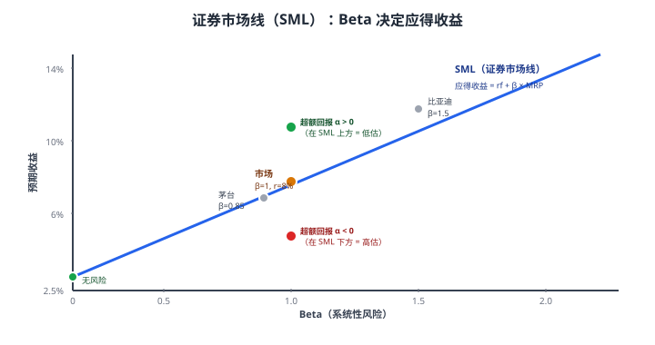
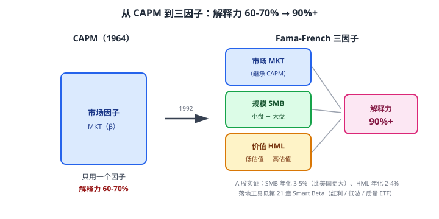

# 34 CAPM 与因子模型

> **这一章要让你搞懂的事**
> 1. **CAPM**（资本资产定价模型）：一只资产的"应得收益"是怎么算的
> 2. **Beta（β）**：股票相对市场的"敏感度"——为什么贵州茅台 Beta 高
> 3. **系统性风险才给溢价**——非系统性风险白白承担没回报
> 4. **Fama-French 三因子**：市场 + 规模（SMB）+ 价值（HML）
> 5. **五因子模型**：加上盈利能力 + 投资因子
> 6. 中国市场的**因子实证**：哪些因子在 A 股有效
>
> **入门门槛**
> - 第 04 章：波动率
> - 第 33 章：MPT、有效前沿
> - 第 21 章：指数与 Smart Beta
>
> **声明**：本教程不构成投资建议；所有公式、数据均为教学示例。

---

## 📖 本章英文缩写速查

> 看到不认识的英文缩写，先回这张表查；完整术语见 [GLOSSARY.md](../GLOSSARY.md)。

| 缩写 | 英文全称 | 中文含义 |
|---|---|---|
| **CAPM** | Capital Asset Pricing Model | 资本资产定价模型 |
| **ETF** | Exchange-Traded Fund | 交易所交易基金 |
| **SMB** | Small Minus Big | 规模因子（小盘减大盘） |
| **HML** | High Minus Low | 价值因子（高账面市值比减低） |
| **MKT** | Market factor | 市场因子 |
| **SML** | Security Market Line | 证券市场线 |
| **PB** | Price-to-Book ratio | 市净率：股价 ÷ 每股净资产 |
| **BM** | Book-to-Market ratio | 账面市值比 |
| **RMW** | Robust Minus Weak | 盈利因子 |
| **CMA** | Conservative Minus Aggressive | 投资因子 |
| **PE** | Price-to-Earnings ratio | 市盈率：股价 ÷ 每股收益 |
| **MPT** | Modern Portfolio Theory | 现代投资组合理论 |
| **ROE** | Return on Equity | 净资产收益率，衡量股东回报 |
| **FF** | Fama-French | 法玛-佛伦奇（三/五因子模型作者） |
| **QDII** | Qualified Domestic Institutional Investor | 合格境内机构投资者，借道投资海外的渠道 |
| **UMD** | Up Minus Down | 动量因子 |

---

## 0. 先讲个故事

**问题**：为什么过去 10 年——
- **贵州茅台**年化 25%（**高 Beta + 高回报**）
- **中国电信**年化 5%（**低 Beta + 低回报**）

**很多人的回答**："茅台是好公司，电信是烂公司。"

**金融学的回答**：**茅台高回报是因为它承担了更多"系统性风险"**——理论上，**承担更多系统性风险的资产，应该有更高的预期收益**。这就是 CAPM 的核心命题。

**进一步问题**：
- 为什么**小市值股票**长期跑赢**大市值股票**？
- 为什么**低估值股**长期跑赢**高估值股**？
- 为什么**高质量公司股**长期跑赢**低质量公司股**？

**Fama-French 等学者的回答**：这些都是**风险因子**——承担"小盘风险 + 价值风险 + 质量风险"的人，应该获得**额外的风险溢价**。

> 这章告诉你：
> 1. **CAPM**：单只资产的应得收益怎么算（Beta + 市场风险溢价）
> 2. **因子模型**：超越 CAPM 的"多元风险定价"
> 3. **A 股因子实证**：规模、价值、动量、质量哪个有效
> 4. **对你的实操**：怎么用因子思维选 ETF

---

## 1. CAPM：资本资产定价模型

### 1.1 公式

$$
E(r_i) = r_f + \beta_i \cdot [E(r_m) - r_f]
$$

**翻译**：

$$
\text{某只股的应得收益} = \text{无风险利率} + \beta \times \text{市场风险溢价}
$$

| 符号 | 含义 | 例子 |
|---|---|---|
| $r_f$ | 无风险利率 | 国债 2.5% |
| $E(r_m)$ | 市场预期收益 | 沪深 300 长期年化 8% |
| $E(r_m) - r_f$ | 市场风险溢价 | 8% - 2.5% = 5.5% |
| $\beta_i$ | 这只资产对市场的"敏感度" | 茅台 β≈0.9，电信 β≈0.5 |

### 1.2 Beta 怎么算

**直观理解**：**市场涨 1%，这只股涨多少**

| Beta | 含义 | 例子 |
|---|---|---|
| **β = 1** | 跟市场同步 | 沪深 300 ETF |
| β = 1.5 | 比市场敏感 50% | 高弹性成长股 |
| β = 0.5 | 比市场迟钝一半 | 公用事业 / 银行 |
| **β = 0** | 与市场无关 | 国债 |
| β < 0 | 与市场反向（罕见）| 部分黄金股 |

**计算**：

$$
\beta_i = \frac{\text{Cov}(r_i, r_m)}{\text{Var}(r_m)}
$$

**Excel 公式**：`=SLOPE(资产收益序列, 市场收益序列)`

### 1.3 一个完整例子

**贵州茅台**：
- Beta ≈ 0.85（教学估值，**比市场略不敏感**——茅台波动更多来自基本面）
- 无风险 2.5%、市场预期 8.5%
- **CAPM 应得收益** = 2.5% + 0.85 × (8.5% - 2.5%) = **7.6%**

**比亚迪**（高弹性成长）：
- Beta ≈ 1.5
- CAPM 应得 = 2.5% + 1.5 × 6% = **11.5%**

**结论**：高 Beta 的股票，**理论上"应得"更高收益** —— 因为承担了更多系统性风险。

### 1.4 CAPM 的核心命题

> **只有"系统性风险"（无法分散的风险）才能获得溢价。**

这是 CAPM 最重要的认知——**非系统性风险 = 白白承担**。

**翻译成人话**：
- 你买 100 只股 + 1 只茅台 → 茅台公司风险被分散了 → 茅台多承担的"公司风险"**不给你溢价**
- 茅台高回报来自**它对市场的 Beta 暴露** —— 不是"公司本身好"

### 1.5 证券市场线（SML）

**SML 上的点 = CAPM 公允定价**
**SML 上方 = α > 0**（被低估，未来上涨概率大）
**SML 下方 = α < 0**（被高估，未来表现差）

**主动管理的目标**：找 α > 0 的股票。

---

## 2. CAPM 的局限

### 2.1 实证上不完美

**事实**：用 60 年数据回测——CAPM 解释的"收益差异"**只有 60-70%**。

**问题**：还有 30-40% 的收益差异由什么解释？

### 2.2 著名"异常"

学术界发现的"CAPM 解释不了"的现象：

| 异常 | 描述 |
|---|---|
| **小市值溢价** | 小盘股长期跑赢大盘股 |
| **价值溢价** | 低 PE/PB 股长期跑赢高 PE/PB 股 |
| **动量** | 过去 1 年涨幅大的股，下一年仍倾向于涨 |
| **质量** | 高 ROE / 低杠杆公司长期跑赢 |
| **低波动** | 低波动股长期回报反而更高 |

**这些异常无法用 CAPM 解释** → 需要**因子模型**。

---

## 3. Fama-French 三因子模型

### 3.1 公式

$$
E(r_i) = r_f + \beta_M \cdot \text{MKT} + \beta_S \cdot \text{SMB} + \beta_V \cdot \text{HML}
$$

| 因子 | 含义 |
|---|---|
| **MKT**（市场）| 市场风险溢价（与 CAPM 一致）|
| **SMB**（Small Minus Big）| 小市值股 - 大市值股的回报差 |
| **HML**（High Minus Low）| 高 BM (低 PB) - 低 BM 股的回报差 |

### 3.2 因子的"故事"

**SMB（规模因子）**：
- 小市值股**长期跑赢**大市值股
- 解释：小公司风险大、流动性差、信息不透明 → **应得"小盘溢价"**
- 美国数据：1927-2024 SMB 年化 ≈ 1-2%
- A 股数据：SMB 年化 ≈ 3-5%（**比美国更大**）

**HML（价值因子）**：
- 低估值（低 PE/PB）股**长期跑赢**高估值股
- 解释：价值股代表"困难公司"，承担更多公司风险 → **应得"价值溢价"**
- 美国数据：HML 年化 ≈ 3-4%
- A 股数据：HML 年化 ≈ 2-4%

### 3.3 1992 年 Fama-French 的发现

**论文标题**：《The Cross-Section of Expected Stock Returns》

**结论**：
- 三因子模型解释**收益差异的 90%+**
- **远好于 CAPM 的 60-70%**
- 改变了金融学

**法玛 2013 年获诺贝尔经济学奖**。

### 3.4 应用：因子投资

**学界发现的因子 → 投资界做成 ETF**：

| 因子 | 对应 ETF |
|---|---|
| 规模 | 中证 500（小市值倾向）、中证 1000 |
| 价值 | 红利 ETF（510880）、深红利 |
| 动量 | 动量 ETF（部分基金）|
| 质量 | 质量因子 ETF |
| 低波动 | 低波 100 ETF（515300）|

**详见第 21 章 Smart Beta**。

---

## 4. 五因子模型（2015）

### 4.1 公式

法玛和弗伦奇 2015 年加入两个因子：

$$
E(r_i) = r_f + \beta_M \cdot \text{MKT} + \beta_S \cdot \text{SMB} + \beta_V \cdot \text{HML} + \beta_P \cdot \text{RMW} + \beta_I \cdot \text{CMA}
$$

| 新因子 | 含义 |
|---|---|
| **RMW**（Robust Minus Weak）| 高盈利能力 - 低盈利能力（**质量因子**）|
| **CMA**（Conservative Minus Aggressive）| 低投资 - 高投资（**保守因子**）|

### 4.2 五因子表现

| 因子 | A 股年化溢价 | 美股年化溢价 |
|---|---|---|
| MKT 市场 | ~5-7% | ~5-7% |
| SMB 规模 | ~3-5% | ~1-2% |
| HML 价值 | ~2-4% | ~3-4% |
| RMW 质量 | ~2-4% | ~3-5% |
| CMA 保守 | ~1-3% | ~2-3% |
| 动量（非 FF 模型）| ~5-8% | ~6-8% |

### 4.3 因子相关性

| 因子组合 | 相关性 |
|---|---|
| MKT vs SMB | ~0.3 |
| MKT vs HML | ~0.1 |
| SMB vs HML | ~0.0（独立）|
| 价值 vs 动量 | -0.3（负相关）|

**结论**：**多因子分散，比单一市场分散更有效**——这就是 Smart Beta 的理论基础。

---

## 5. 中国市场因子实证

### 5.1 哪些因子在 A 股有效

| 因子 | A 股有效性 | 备注 |
|---|---|---|
| **市场** | ★★★★★ | 当然有效（CAPM 基础）|
| **规模 SMB** | ★★★★ | **比美国更显著**——A 股小盘溢价大 |
| **价值 HML** | ★★★ | 有效但波动大 |
| **动量** | ★★★★ | 显著，3-12 月动量效应 |
| **质量** | ★★★★ | ROE 高的公司长期跑赢 |
| **低波动** | ★★★ | 有效但近年减弱 |
| **红利** | ★★★★ | 高股息长期稳健 |

### 5.2 A 股的"特殊性"

| 特点 | 影响 |
|---|---|
| **散户主导（60%+）** | **动量 / 反转因子**比海外更强 |
| **政策驱动** | 主题轮动快——因子稳定性较差 |
| **流动性两极化** | 小盘溢价大但流动性差 |
| **市值约束** | 部分因子受限于规模选股 |

### 5.3 实操：散户的因子组合

**经典"多因子组合"**：
- 沪深 300 ETF（市场）：30%
- 中证 500 ETF（规模 + 部分价值）：20%
- 红利 ETF（价值 + 高股息）：20%
- 标普 500 QDII（海外市场）：15%
- 中证 800 质量 ETF（质量）：15%

**预期效果**：长期跑赢单一沪深 300 约 1-3%/年（**理论**）。

---

## 6. 实操：用 Beta 做组合管理

### 6.1 组合 Beta

**组合 Beta = 各持仓 Beta 的加权平均**：

$$
\beta_p = \sum_i w_i \beta_i
$$

**例**：
- 沪深 300 ETF 50%（β=1.0）
- 国债 30%（β=0.0）
- 黄金 ETF 10%（β=0.15）
- 标普 500 ETF 10%（β=0.35）

组合 Beta = 0.5×1 + 0.3×0 + 0.1×0.15 + 0.1×0.35 = **0.55**

**翻译成人话**：当沪深 300 涨 10% 时，你的组合大约涨 5.5%。

### 6.2 用 Beta 调节风险

| 想要 | 怎么做 |
|---|---|
| 降低组合 Beta | 加债 / 现金，减股 |
| 提高组合 Beta | 加高 Beta 股，加杠杆 |
| 对冲市场风险 | 卖空股指期货（Beta ≈ -1 的工具）|

### 6.3 Beta 不是全部

**重要警告**：
- Beta 只衡量"系统性风险"
- **未必反映"未来下跌风险"**
- 危机时 Beta 会"漂移"——突然变大

**实务**：Beta 是工具，不是预测——配合其他指标使用。

---

## 7. 进阶讨论

**入门读者可以跳过本节**。

### 7.1 因子定价的"风险解释"vs"行为解释"

**两派学术观点**：

| 学派 | 解释 |
|---|---|
| **风险派**（法玛）| 因子代表风险，溢价 = 风险补偿 |
| **行为派**（Thaler 等）| 因子反映投资者偏差，溢价 = 套利空间 |

**关键问题**：如果是风险补偿，因子**应该永远存在**；如果是套利空间，因子**会被市场消化**。

**实证**：部分因子（如小市值溢价）2000 年后明显减弱——支持"行为派"。

### 7.2 因子衰减

**美股数据**：
- 1990 年代后小市值溢价下降
- 价值溢价 2010-2020 表现差
- 这叫**因子衰减**

**原因**：
- 学术发表 → 投资者学习 → 套利消失
- ETF 兴起 → 因子曝光增加 → 收益压缩

**对散户**：**不要盲目相信"因子永远有效"**。

### 7.3 Carhart 四因子（加动量）

**1997 年 Carhart**：在 FF 三因子上加**动量因子**（UMD: Up Minus Down）。

**用途**：评价共同基金业绩——剥离"运气"。

### 7.4 因子拥挤

**当一个因子被大量基金追逐时**：
- 估值被推高
- 后续回报下降
- 转折时可能"踩踏"

**2015 年 A 股**：小盘因子拥挤 → 后续暴跌 → 量化基金集体回撤。

### 7.5 因子投资的局限

- **数据挖掘**：算了 1000 个指标总能找出"假因子"
- **样本期依赖**：不同时段表现差异大
- **执行成本**：因子组合换手率高，吃掉部分超额

---

## 8. 小结

1. **CAPM 公式**：应得收益 = 无风险 + β × 市场风险溢价。**只有系统性风险给溢价**，非系统性风险白担。
2. **Beta** = 市场涨 1% 时该股涨多少。**茅台 β≈0.85，比亚迪 β≈1.5**。
3. **CAPM 的局限**：解释 60-70% 收益，还有 30-40% 由其他因子解释。
4. **Fama-French 三因子**：MKT + SMB（小盘）+ HML（价值）—— 解释 90%+ 收益。
5. **五因子模型**：再加 RMW（质量）+ CMA（保守）。
6. **A 股因子有效性**：规模 ★★★★，价值 ★★★，动量 ★★★★，质量 ★★★★，低波 ★★★，红利 ★★★★。
7. **多因子组合**：沪深 300 + 中证 500 + 红利 + 海外 + 质量。**长期超额 1-3%/年（理论）**。
8. **因子也会衰减**——不要盲目相信"因子永远有效"。

> 🔗 **承上启下**：MPT + CAPM + 因子模型告诉你"理性投资者应该怎么做"。但**真人不是理性的**！下一章 **35 行为金融学**——告诉你为什么散户实际做的事和数学最优解差距巨大。

---

## 自测题

> 答案在文末折叠区。

1. CAPM 的核心命题是什么？为什么说"非系统性风险白白承担"？
2. 某股票 Beta = 1.2，无风险利率 2.5%，市场预期收益 8%。它的"应得收益"是多少？
3. 假设这只股实际给了 12% 的回报——是"高估"还是"低估"？α 是多少？
4. Fama-French 三因子比 CAPM 多了哪两个因子？分别代表什么风险？
5. A 股的"规模因子"比美国更强——为什么？给出 1 个推测原因。
6. **进阶题**：组合：沪深 300 ETF 40% + 中证 500 ETF 30% + 国债 20% + 黄金 10%。各资产 Beta 分别为 1.0、1.2、0、0.15。
   - 组合 Beta 是多少？
   - 当沪深 300 涨 10% 时，预期组合涨多少？
   - 如果你想把组合 Beta 调到 0.5，怎么调整？
7. **作业题**：选 3 只你持有 / 关注的股票或 ETF。**查询 / 估算它们的 Beta**：
   - 雪球 / Choice / 万得：查"Beta"
   - 自己算：用 1 年月度回报 vs 沪深 300，`=SLOPE(资产回报, 市场回报)`
   - 它们的 Beta 是否符合你的"预期"？
   - 你的组合整体 Beta 是多少？

📖 参考答案

1. **CAPM 核心命题**：**只有系统性风险才能获得溢价**。
   **为什么"非系统性风险白担"**：通过分散化（持有多只股 / ETF）可以消除非系统性风险——市场不会为"已经可以免费消除的风险"给你支付溢价。**结论**：买单一股票承担的"公司风险"，市场不会补偿你。

2. CAPM 应得 = 2.5% + 1.2 × (8% - 2.5%) = 2.5% + 1.2 × 5.5% = 2.5% + 6.6% = **9.1%**

3. 实际收益 12% > 应得收益 9.1%。
   **α = 12% - 9.1% = +2.9%** —— **超额回报**。
   **判断**：从历史看是"被低估"（实际比理论应得高）。但**注意**：① α 是事后算的，事前难判断 ② 单期 α 可能是运气，不一定是"持续超额能力"。

4. **SMB（规模因子）**：小市值股 - 大市值股的回报差——代表"小盘风险"。
   **HML（价值因子）**：高 BM（即低 PB）- 低 BM 股的回报差——代表"价值股风险"。
   **共同点**：两个因子都是"承担额外风险 → 获得长期溢价"的体现。

5. 任答 1 个：
   - **散户主导**：A 股散户占 60%+ 交易量，散户偏好小盘股 → 推高小盘估值/波动
   - **流动性溢价**：A 股小盘股流动性较差，需要更高补偿
   - **信息不透明**：A 股小公司信息披露质量差，需要更高风险溢价
   - **政策驱动**：小盘股更受政策刺激（如专精特新），波动大
   - **市场不成熟**：机构定价能力有限，小盘溢价没被完全套利掉

6. 
   - 组合 Beta = 0.4×1.0 + 0.3×1.2 + 0.2×0 + 0.1×0.15 = 0.4 + 0.36 + 0 + 0.015 = **0.775**
   - 沪深 300 涨 10% → 组合预期涨 **7.75%**（注：中证 500 不完全和沪深 300 同步，所以这是估算）
   - **调到 0.5**：
     - 当前 Beta 0.775 - 目标 0.5 = 需要降 0.275
     - 简单方法：把 30% 中证 500 减一半（变 15%）+ 加 15% 国债 → 新组合 Beta ≈ 0.4×1.0 + 0.15×1.2 + 0.35×0 + 0.10×0.15 = 0.595
     - 进一步：把沪深 300 减 10% 加国债 → 0.30×1.0 + 0.15×1.2 + 0.45×0 + 0.10×0.15 = 0.495 ≈ **0.5**
     - **关键**：降 Beta = 减股票仓位 + 加债 / 现金

7. 没有标准答案。**重点观察**：
   - 大盘股（茅台、招行、工行）Beta 通常 0.6-0.9
   - 中盘股（A 股 1000-3000 亿市值）Beta 通常 1.0-1.3
   - 小盘股 Beta 1.2-1.8
   - 行业 ETF：周期性行业（券商、有色）Beta 1.3-1.6；防御性（公用事业、消费）0.7-0.9
   - **作业的真正价值**：让你看到"自己的组合到底有多激进"——很多人持仓 Beta 1.5+ 自己不知道

---

## 延伸阅读

- 《资本资产定价：原理与实证》—— Eugene Fama：因子模型的原文
- 《漫步华尔街》—— Burton Malkiel：CAPM 的散户解读
- 《因子投资》(*Your Complete Guide to Factor-Based Investing*) —— Andrew Berkin & Larry Swedroe
- AQR Research：[aqr.com](https://www.aqr.com/) —— 因子投资的实务派研究
- 《量化投资 - 策略与技术》—— 丁鹏：A 股因子实证

---

## 下一章预告

**35 行为金融学** —— 真人不是理性的：
- **前景理论**：损失厌恶 + 价值函数
- **处置效应**：散户的"卖盈持亏"
- **锚定 / 框架 / 心理账户**
- **过度自信 + 羊群效应**
- 应对：**制度替代意志**
