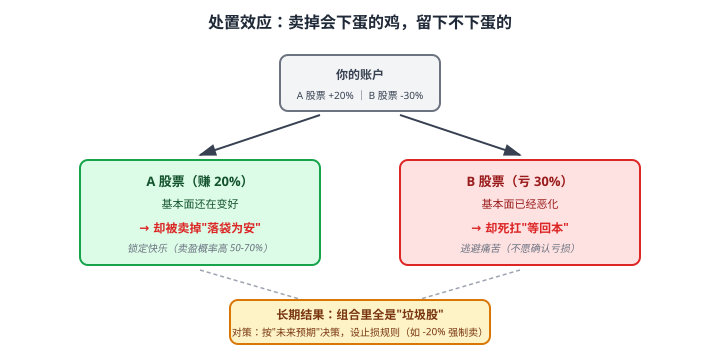

# 35 行为金融学

> **这一章要让你搞懂的事**
> 1. **真人不是 MPT 假设的"理性投资者"**——这就是为什么散户实际收益远低于"基金收益"
> 2. **损失厌恶**：丢 100 元的痛苦 = 捡 200 元的快乐（**前景理论**）
> 3. **处置效应**：散户最常犯的错——**卖盈持亏**
> 4. **锚定 / 框架 / 心理账户**：你被自己的"心理标签"骗了多少次
> 5. **过度自信 + 羊群效应**：为什么 80% 散户认为自己"高于平均"
> 6. **应对方案**：**用"制度"替代"意志"** —— 这是唯一可行的解
>
> **入门门槛**
> - 第 04 章：风险与回报
> - 第 33-34 章：MPT / CAPM
>
> **声明**：本教程不构成投资建议；本章是"认知教育"——理解人性偏差。

---

## 0. 先讲个故事

**典型散户的一年**：

**1 月**：朋友推荐"医疗主题基金"近 1 年涨 80% → 投 5 万 → **3 月跌 -10%**
**4 月**：心痛但"不能割肉，要等回本" → **6 月再跌 -25%**
**7 月**：账户从 5 万跌到 3 万 → **割肉卖出**
**9 月**：医疗基金从底部反弹 40% —— **没你的事**
**11 月**：又看到"AI 主题基金涨 60%" → 用剩下的 3 万追 → **次年 1 月跌 -20%**

**一年下来**：
- 心理体验：**焦虑 + 失眠 + 与配偶吵架**
- 真金白银：**亏掉 40%**
- 实际操作的"勤奋"：**每天看盘 3 小时**

**对比**：他朋友老周
- 2024 年 1 月买入沪深 300 ETF 50%、债基 30%、黄金 20%
- 全年**不看盘**
- 1 月 1 日做了一次再平衡（10 分钟）
- 全年收益 **+5%**

老周说：
> "我比你蠢——我**承认自己掌控不了市场**，就把所有决策**交给规则**。"

> 这章告诉你：
> 1. **人性的 8 个偏差**——它们在你身上每天都在发生
> 2. **这些偏差不是 "我比别人强就能克服"**——诺奖得主也克服不了
> 3. **唯一的解**：**制度 + 规则 + 自动化** 替代"自己判断"
> 4. **这就是为什么"懒人投资法"长期跑赢"勤奋型"**

---

## 1. 前景理论：损失的痛苦 vs 收益的快乐

### 1.1 卡尼曼 + 特沃斯基

**1979 年**，心理学家**卡尼曼**和**特沃斯基**用一系列实验颠覆了"理性投资者"假设——提出**前景理论（Prospect Theory）**。

**卡尼曼 2002 年获诺贝尔经济学奖**（首位获诺奖的心理学家）。

### 1.2 核心实验

**问题 1**：你被给了 1000 元。然后从两个选项里选：
- A：再确定得到 500 元
- B：50% 概率再得 1000 元，50% 概率不得

**多数人选 A**（确定的小赚）。

**问题 2**：你被给了 2000 元。然后从两个选项里选：
- A：确定失去 500 元
- B：50% 概率失去 1000 元，50% 概率不失去

**多数人选 B**（赌一下避免损失）。

**反直觉**：两题的"期望终值"完全相同（1500 元）。但人们的选择**截然不同**。

**结论**：
- **面对收益 → 风险规避**（落袋为安）
- **面对损失 → 风险偏好**（赌一下回本）

### 1.3 价值函数

**核心特征**：
- **损失曲线远比收益曲线陡** —— 损失 1000 的痛苦 ≈ 收益 2000 的快乐
- **两边都凹/凸** —— 边际效用递减

### 1.4 这对投资意味着什么

| 偏差 | 行为 |
|---|---|
| **过度规避波动** | 不敢买股票（怕亏） |
| **不敢清仓亏损股** | "我不卖就不算亏"（鸵鸟心态）|
| **过早卖盈利股** | "落袋为安"|
| **加倍下注亏损** | "再加点就能回本" |

---

## 2. 处置效应：散户最常见的错

### 2.1 现象

**处置效应（Disposition Effect）**：散户倾向于：
- **卖盈利股** —— 锁定快乐
- **持有亏损股** —— 避免痛苦

### 2.2 数据

**多项研究发现**：
- 散户**卖出"赚钱股"的概率**比"亏钱股"**高 50-70%**
- 反过来——**亏钱股留在账户里"等回本"**

### 2.3 为什么这是错的

**理性视角**：
- 决策应该基于**未来预期**，不是"已经赚了 / 亏了"
- 一只股**因为基本面变差**应该卖——不管你亏了赚了
- 一只股**因为基本面变好**应该买——不管它涨了跌了

**散户的实际逻辑**：
- "亏 30% 不能割肉" → 但其实是基本面变差了
- "赚 20% 落袋" → 但其实公司还在变好

**结果**：**清仓优质股 + 持有垃圾股 = 长期亏损**。

### 2.4 实操对策

| 错误 | 正确做法 |
|---|---|
| 看"是否赚钱" 决定卖出 | 看"未来预期"决定 |
| "回本就卖" | **设止损规则**（如 -20% 强制卖）|
| "再涨 10% 就卖" | **基本面变好就持有，变差就卖** |

---

## 3. 锚定、框架、心理账户

### 3.1 锚定效应（Anchoring）

**机制**：人会被"第一个数字"影响判断。

**经典实验**：转盘随机选数字（10 or 65）→ 然后问"非洲国家占联合国比例"
- 看到 10 的人平均答 25%
- 看到 65 的人平均答 45%

**投资中的锚定**：
- **买入价**：你买入价 50 → 跌到 40 你"亏 10"，涨到 60 你"赚 10"——市场不在乎你的成本
- **历史高点**：股价从 100 跌到 60 → 你觉得"便宜"，但可能本来就值 60
- **"整数关口"**：3000 点、10 万美元——心理标签

### 3.2 框架效应（Framing）

**机制**：同样的事实用不同方式描述，影响选择。

**例**：
- "**90% 存活率**" vs "**10% 死亡率**" —— 医生给的描述影响病人决定
- 投资：基金宣传"**近 3 年涨 50%**" vs "**3 年前买入年化 14.5%**"
- 衍生品：销售员说"**最高潜在收益 20%**" vs "**期望收益 5%**"

**对策**：**始终用同一种"框架"看数据**——年化、最大回撤、夏普——避免被"包装话术"影响。

### 3.3 心理账户（Mental Accounting）

**机制**：人会把钱分成不同"心理类别"，每类有不同决策规则。

**例**：
- "**这是赌博赚的钱**" → 加倍下注（"反正不是辛苦钱"）
- "**这是辛苦工资**" → 极度谨慎
- "**这是炒股专款**" → 可以亏；"**这是养老金**" → 不能亏

**理性视角**：钱就是钱——**不应该按"来源"决定使用方式**。

**但**：心理账户**有时也有用**——把"应急金"严格区分，避免被"投资亏损"波及（见第 7 章）。

### 3.4 应对清单

| 偏差 | 应对 |
|---|---|
| 锚定 | 看长期数据，不看"买入价 / 历史高点" |
| 框架 | 始终用同一种指标（年化、夏普）|
| 心理账户 | 把账户分成"目的明确的桶"——但桶内要理性 |

---

## 4. 过度自信 + 羊群效应

### 4.1 过度自信（Overconfidence）

**实验**：让司机评价自己驾驶技术
- **88% 的人认为自己"高于平均"**
- 数学上不可能

**投资中**：
- "我和散户不一样"——80% 散户都这么认为
- "我能看清市场"——多数人对宏观判断错误
- "我能选出好基金"——长期数据显示几乎无可重复性

### 4.2 羊群效应（Herding）

**机制**：跟着多数人走 = 心理舒适。

**例**：
- 2015 年牛市末期：所有人都买股 → 你也买
- 2020 年消费白酒抱团：基金集体买茅台 → 散户跟买
- 2024 年 AI 概念：所有人都讲故事 → 你也追

**结果**：**跟到"高潮"** → **跟到"谷底卖出"** → **完美的反向操作**。

### 4.3 巴菲特的金句

> "**别人贪婪时我恐惧，别人恐惧时我贪婪**。"

这就是**反羊群效应**——但**做起来极难**，因为人性是社交的。

### 4.4 对策

| 偏差 | 对策 |
|---|---|
| 过度自信 | **承认自己是平均水平** → 用指数基金 |
| 羊群效应 | **设规则替代判断** → 定投 + 再平衡 |
| **"我能跑赢市场"** | **80%+ 的"专业"基金都跑输 → 你凭什么**？ |

---

## 5. 其他常见偏差

### 5.1 沉没成本谬误

**机制**：因为"已经投入了"而继续——明知不对。

**例**：电影看了一半很难看——继续看完（避免"白浪费 50 元票钱"）
**投资**：基金亏了 30% —— 继续持有"等回本"（已经亏的钱影响判断）

**理性**：**沉没成本与未来决策无关**——卖出与否只看"未来预期"。

### 5.2 后视偏差（Hindsight Bias）

**机制**：事后看，**"早知道我就 X 了"**——其实事前没人知道。

**例**：
- 比特币涨到 10 万："早知道 2013 年买"
- 2020 年茅台暴跌："早知道我没买"

**问题**：让人**误以为"未来也能预测"** → 增加过度自信。

### 5.3 可得性启发

**机制**：**最近发生 / 印象深刻的事件**影响判断。

**例**：
- 看到一篇"某基金 1 年涨 80%" → 误以为是常态
- 看到"飞机失事新闻" → 害怕坐飞机（其实比开车安全 1000 倍）
- 听说朋友赚钱 → 跟买（不知道更多人亏钱）

### 5.4 损失厌恶 × 长期复利

**机制**：损失厌恶让你**不敢长期持股**。

**数据**：标普 500 长期年化 10%，但**1/3 的年份是负的**。
- 每天看盘的人：每月有 50% 概率看到"账户跌"
- 每年看一次的人：每 3 年才看到 1 次"负年"

**结论**：**看盘越频繁 = 损失厌恶被激活越多 = 越倾向于"非理性决策"**。

---

## 6. 应对：制度替代意志

### 6.1 核心原则

**意志力是有限的**——人不可能 24/7 都理性。

**唯一可行的解**：**用"规则 + 制度"替代"实时判断"**——让规则在你"理性时"制定，让制度执行"非理性时刻"的决策。

### 6.2 制度清单

| 决策 | 制度 |
|---|---|
| **买入** | **每月固定日期定投**（不看市场）|
| **再平衡** | 每年 1 月 1 日 + 偏离 ±20% 触发 |
| **止损** | 单只资产亏 -30% 强制审视 |
| **止盈** | 不设（持有到目标达成）|
| **看盘频率** | **每月最多 1 次**（不是每天）|
| **新基金 / 新股票** | **观察 1 年再决定**（避免追热点）|

### 6.3 自动化

**最强方案**：让机器替你执行。

| 工具 | 用途 |
|---|---|
| **基金 APP 定投** | 每月 X 日自动扣款 |
| **券商 ETF 定投** | 部分券商支持 |
| **目标日期基金（TDF）** | 自动按年龄调整股债比 |
| **再平衡 ETF** | 自动 60/40 等组合 |

### 6.4 "无聊"是种美德

**反直觉**：投资越**无聊**，长期回报越好。

**美股研究**：
- 频繁交易者年化跑输大盘 6.5%
- 长期持有者年化跑赢 1-2%
- **差距 7-8%/年——主要来自"少操作"**

**翻译成人话**：**别动 = 赚钱**。

---

## 7. 进阶讨论

**入门读者可以跳过本节**。

### 7.1 行为投资组合理论（BPT）

**Statman 1995 年提出**：散户实际持有的不是"MPT 最优组合"，而是按"心理账户"分层：

- **底层（安全）**：避免极度贫穷的钱
- **中层（保障）**：维持现状的钱
- **顶层（增值）**：追求更富的钱

**实际投资行为**：
- 底层 → 存款 / 国债
- 中层 → 平衡基金
- 顶层 → 股票 / 衍生品 / 加密

**这个理论比 MPT 更贴近散户实际行为**。

### 7.2 投资者收益缺口

**晨星调研**：
- 主动基金 20 年回报 +8%
- 同期持有人实际拿到的回报 +6.3%
- **缺口 -1.7%/年**——来自"追涨杀跌"

**对中国市场**：缺口可能更大（散户行为更激进）。

### 7.3 神经金融学

**最新研究**：用 fMRI 扫描投资者大脑：
- 看到收益 → 多巴胺激活（伏隔核）
- 看到损失 → 杏仁核激活（恐惧中心）
- 这些**生理反应** → 影响决策

**结论**：**理性投资是"对抗本能"**——这就是为什么如此困难。

### 7.4 "聪明人"也犯错

**著名例子**：
- 牛顿炒南海公司（1720）—— 大亏，留下"我能算出天体运行轨迹，但算不出人心"
- LTCM（1998）—— 两位诺奖得主主导，破产
- 长青基金（2008）—— 顶尖量化基金，金融危机时损失惨重

**结论**：**偏差不分智商高低**——制度永远胜过个人判断。

### 7.5 行为金融在 ESG / 政策中的应用

**Nudge（助推）**：用行为设计引导更好决策：
- **默认选项**：默认 401(k) 自动入选 → 储蓄率大幅提升
- **简化选择**：减少选项数量 → 决策质量提升
- **承诺设备**：提前设定规则 → 抵御短期诱惑

**应用到个人**：**提前设规则 + 自动化**——就是 Nudge 的精髓。

---

## 8. 小结

1. **真人不是理性投资者**——这就是为什么 MPT 在实操中常常失效。
2. **前景理论**：损失的痛苦 ≈ 2 倍同等收益的快乐 → 过度规避波动 + 不敢清仓亏损股。
3. **处置效应**：散户最常见的错——**卖盈持亏**。正确做法是看未来预期，不看"已赚已亏"。
4. **锚定 / 框架 / 心理账户**：你被自己的心理标签骗——市场不在乎你的成本价。
5. **过度自信 + 羊群效应**：80% 人自评"高于平均"+ 集体追涨杀跌 = 散户系统性失败。
6. **其他偏差**：沉没成本、后视偏差、可得性启发——每个都影响决策。
7. **应对方案**：**用制度替代意志**——定投 + 再平衡规则 + 减少看盘 + 自动化。
8. **"无聊"是美德**：频繁交易者跑输大盘 6.5%/年；长期持有跑赢 1-2%。**别动 = 赚钱**。

> 🔗 **承上启下**：MPT + CAPM + 行为金融 = 完整的"投资理论体系"。但还有一件每个家庭都关心的事——**税务**。下一章 **36 税务与社保** 讲清楚个税 / 专项扣除 / 五险一金 / 个人养老金。

---

## 自测题

> 答案在文末折叠区。

1. 前景理论的两个核心结论是什么？为什么对投资有重大影响？
2. 处置效应是什么？散户的"卖盈持亏"为什么是错的？
3. 你 5 年前买入某基金 100 元/份，现在跌到 70 元/份——你"亏 30%"。这个 30% 是怎么算的？市场在乎你的成本价吗？
4. 80% 散户认为自己"高于平均水平"——这种过度自信对投资有什么具体影响？
5. 为什么"频繁看盘"反而让你亏钱？说出 2 个心理学原因。
6. **进阶题**：你的朋友 2024 年 1 月跟风买入"AI 主题基金" 5 万元——半年跌 -25% 后割肉。问他**至少 3 个反思问题**，帮他识别自己的偏差。
7. **作业题**：回顾你过去 2 年的投资记录：
   - ① 列出你**已卖出**的资产 —— 大多数是"赚"还是"亏"？
   - ② 列出你**仍持有的亏损资产** —— 它们的"基本面"还好吗？
   - ③ 你"持有时间最长"的资产 —— 是赚钱的吗？
   - ④ 你**每天看盘的频率** —— 改成"每月 1 次"会有什么影响？

📖 参考答案

1. **两大核心**：
   - ① **面对收益时风险规避**："落袋为安"，过早卖出涨幅股
   - ② **面对损失时风险偏好**："不甘心，等回本"，持有亏损股甚至加倍下注
   - ③（补充）**损失曲线远比收益曲线陡**：损失 1000 的痛苦 ≈ 收益 2000 的快乐
   **对投资的影响**：
   - 让人"不敢买股票"（怕跌）
   - 让人"不敢卖亏损股"（怕认输）
   - 让人"过早卖盈利股"（怕回吐）
   - 综合 = 系统性亏损

2. **处置效应**：散户倾向于"卖盈利股，持有亏损股"。
   **为什么错**：
   - 卖出决策应基于**未来预期** —— 公司基本面是否还好
   - 不是基于**过去已发生**的盈亏
   - **赚钱的股可能还会涨**（卖掉错过）
   - **亏钱的股可能继续跌**（持有继续亏）
   - **结果**：清仓优质股 + 持有垃圾股 = 长期亏损

3. **30% 是怎么算的**：(100 - 70) / 100 = 30%——以**你的买入价 100 元**为基准
   **市场在乎吗**：**完全不在乎**。这只基金对所有人是同一个价格 70 元——它在另一个人眼里可能是"+50%"（他是 46 元买入）。
   **正确思考方式**：基金未来值多少**和你买入价无关**。卖出与否只看"现在 70 元，未来预期是涨还是跌"。

4. **过度自信对投资的具体影响**：
   - **频繁交易**：自信能"抓住短期机会" → 多次买卖 → 手续费 + 错过反弹
   - **集中持仓**：自信能"选出最好的" → 不分散 → 单点风险大
   - **不学习**：自信"我懂了" → 不读书 / 不复盘 → 持续犯同样的错
   - **听不进建议**：自信"我看法对" → 配偶 / 朋友 / 专业建议都被屏蔽
   - **结果**：散户实际年化收益**比基金年化低 1-2%**（"投资者收益缺口"）

5. **2 个心理学原因**：
   - ① **损失厌恶被频繁激活**：标普 500 长期上涨，但 30%+ 的交易日是负的——每天看盘 = 每月遭遇多次"账户跌"心理冲击 → 倾向于做出非理性决策
   - ② **多巴胺奖励循环**：看盘 → 涨了快乐 / 跌了焦虑 → 想"操作"调节情绪 → 更多交易 → 手续费 + 错误时机
   - ③（补充）**短期波动给人"我能预测"错觉**：天天看盘的人更容易认为"明天能猜对" → 增强过度自信

6. **3 个反思问题**：
   - **"为什么买它？"** ——是基于"基本面分析"还是"看到别人都在买"（羊群效应）？
   - **"半年跌 25% 时你的心理过程是什么？"** ——是基于"基本面变差"卖的，还是"心理承受不了"卖的（损失厌恶 + 处置效应）？
   - **"如果当时你不知道这是 'AI 主题'，只知道一只基金跌了 25%，你会做同样决定吗？"** ——揭示框架效应
   - **"过去 1 年你看了多少次账户？"** ——看盘频率与亏损的相关性
   - **"未来 1 年，你打算改什么？"** ——从复盘到行动

7. 没有标准答案。**重点观察**：
   - 多数人"已卖出"的赚钱多于亏钱——**处置效应的明证**
   - 多数人"仍持有的亏损资产" 基本面其实已经变差——但你"等回本"
   - "持有时间最长" 的反而是赚钱的——印证"长期持有"威力
   - 看盘频率改成 1 次/月：你会发现 ① 你少做了很多错误操作 ② 心情变好 ③ 收益反而上升
   - **作业的真正价值**：让你**面对自己的真实行为**——而不是"自以为的理性"

---

## 延伸阅读

- 《思考，快与慢》(*Thinking, Fast and Slow*) —— Daniel Kahneman：诺奖得主写的心理学经典
- 《错误的行为》(*Misbehaving*) —— Richard Thaler：行为经济学之父讲述行为偏差
- 《行为投资者》(*The Behavioral Investor*) —— Daniel Crosby：投资心理实战
- 《助推》(*Nudge*) —— Thaler & Sunstein：用行为设计帮助决策
- 《非理性繁荣》(*Irrational Exuberance*) —— Robert Shiller：从行为视角看资产泡沫

---

## 下一章预告

**36 税务与社保** —— 每个家庭都要懂：
- 个税框架：综合所得 + 专项附加扣除
- 五险一金的"养老"作用
- **个人养老金**（2022 起，每年 1.2 万抵税）
- 税延养老险
- 资本利得税与基金 / 股票
