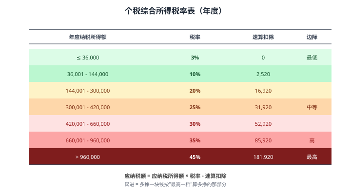
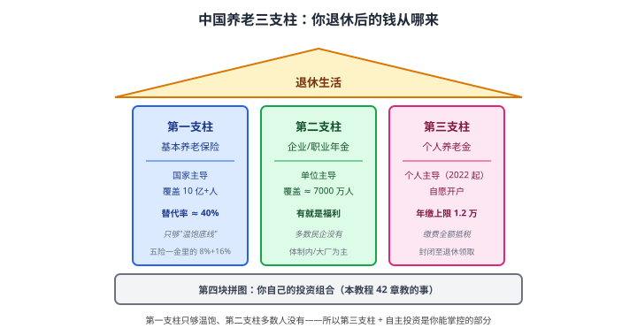

# 36 税务与社保

> **这一章要让你搞懂的事**
> 1. **个人所得税框架**：综合所得 / 经营所得 / 资本利得分别怎么算
> 2. **7 类专项附加扣除**——每年合理省下 1-3 万元税
> 3. **五险一金**的真实价值——养老 / 医疗 / 住房公积金
> 4. **个人养老金账户**（2022 起）—— 每年最多抵税 5400 元
> 5. **税延养老险 / 企业年金 / 职业年金** —— 三大支柱
> 6. **资本利得**：A 股 / 基金 / 国债 / 房产 / 数字资产分别怎么交税
>
> **入门门槛**
> - 第 01 章：储蓄率、收支
> - 第 33-35 章：组合理论
>
> **声明**：本教程不构成投资建议；税务政策可能调整，**实际操作请咨询税务师或参考最新法规**。

---

## 📖 本章英文缩写速查

> 看到不认识的英文缩写，先回这张表查；完整术语见 [GLOSSARY.md](../GLOSSARY.md)。

| 缩写 | 英文全称 | 中文含义 |
|---|---|---|
| **QDII** | Qualified Domestic Institutional Investor | 合格境内机构投资者，借道投资海外的渠道 |
| **FIRE** | Financial Independence, Retire Early | 财务独立、提前退休运动 |
| **IRR** | Internal Rate of Return | 内部收益率 |

---

## 0. 先讲个故事

**两个年薪 50 万的程序员**：

**老张**：
- 工资按月发，**未做任何专项附加扣除**
- 没买任何"税收优惠"的金融产品
- 一年下来——**实际拿到手 35 万**（缴税约 11 万）

**老王**：
- 同样年薪 50 万，但**做了完整的税务规划**：
- **专项附加扣除**：房贷利息 + 赡养老人 + 子女教育 + 继续教育 = **每月减税基础 5500 元**
- **企业年金**：每月公司 + 个人共缴 1500 元
- **个人养老金**：每年存 1.2 万抵税
- **税延养老险**：每月 500 元
- 一年下来——**实际拿到手 38 万**（缴税约 8 万）

**老王比老张多 3 万人民币**——**只是因为**：
- 知道有这些政策
- 主动申报 / 缴存

> 这章告诉你：
> 1. **税务规划不是"避税"** —— 是用足国家给的合法优惠
> 2. **专项附加扣除**：7 类，多数人能用 3-5 类
> 3. **三大养老支柱**：基本养老 + 企业 / 职业年金 + 个人养老金 + 商业养老保险
> 4. **资本利得**：A 股个人**免税**！基金股票交易也大多免——这是中国市场的特别优惠

---

## 1. 个人所得税框架

### 1.1 9 种应税所得

中国个税分 **9 类**——但绝大多数人只涉及前几类：

| 类别 | 谁交 | 税率 |
|---|---|---|
| **① 工资薪金** | 上班族 | 3-45% 累进 |
| ② 劳务报酬 | 兼职 / 一次性服务 | 20-40% |
| ③ 稿酬 | 作者 | 20%（按 70% 计税）|
| ④ 特许权使用费 | 专利 / 版权 | 20% |
| ⑤ 经营所得 | 个体户 / 个独 | 5-35% 累进 |
| ⑥ 利息股息红利 | 投资者 | 20% |
| ⑦ 财产租赁 | 房东 | 20% |
| ⑧ 财产转让 | 卖房 / 卖股 | 20% |
| ⑨ 偶然所得 | 中奖 | 20% |

### 1.2 综合所得（前 4 类合并）

**2019 年改革**：①工资 + ②劳务 + ③稿酬 + ④特许权 **合并为"综合所得"**，**按年度汇算**。

**计算步骤**：

$$
\text{应纳税所得额} = \text{年综合所得} - 60000 - \text{专项扣除} - \text{专项附加扣除} - \text{其他扣除}
$$

| 扣除项 | 含义 |
|---|---|
| **60,000 元** | 基本减除费用（每月 5000）|
| **专项扣除** | 五险一金个人部分 |
| **专项附加扣除** | 7 类（详见 §2）|
| **其他扣除** | 个人养老金、税延养老险等 |

### 1.3 综合所得税率表（2024 版）

**例**：年薪 30 万，五险一金 4.5 万，专项附加 2 万。
- 应纳税所得额 = 30 万 - 6 万 - 4.5 万 - 2 万 = **17.5 万**
- 17.5 万落在 14.4-30 万档（20% 税率）
- 应纳税 = 17.5 万 × 20% - 1.692 万 = **1.808 万**
- 实际税率 = 1.808 / 30 = **6.0%**

### 1.4 累进的本质

**易错点**：很多人以为"工资到第 6 档 = 全部按 35% 缴" —— **错**！

**真相**：累进意味着——**每一档分别按对应税率**。

**例**：年应纳税所得额 100 万
- 前 3.6 万按 3%
- 3.6-14.4 万部分按 10%
- 14.4-30 万按 20%
- 30-42 万按 25%
- 42-66 万按 30%
- 66-96 万按 35%
- 96-100 万按 45%

**用速算扣除简化**：100 万 × 45% - 18.192 万 = **26.81 万**——平均税率 26.8%。

---

## 2. 7 类专项附加扣除

### 2.1 全部清单

| 扣除项 | 标准 | 适用 |
|---|---|---|
| **① 子女教育** | 每个孩子 2000/月 | 3 岁起到博士 |
| **② 继续教育** | 学历 400/月 / 职业 3600 一次性 | 学历提升 / 职业证书 |
| **③ 大病医疗** | 实际 1.5 万以上部分 | 个人 / 配偶 / 子女 |
| **④ 住房贷款利息** | 1000/月 | 首套房贷期间 |
| **⑤ 住房租金** | 800-1500/月（按城市）| 无房（不与房贷同享）|
| **⑥ 赡养老人** | 独生 3000/月 / 非独 分摊 | 60 岁以上父母 |
| **⑦ 3 岁以下婴幼儿照护** | 2000/月 | 0-3 岁孩子 |

### 2.2 这些扣除值多少钱

**例**：年收入 30 万，假设你能用 4 项扣除：
- 子女教育：2000 × 12 = 2.4 万
- 房贷利息：1000 × 12 = 1.2 万
- 赡养老人（独生子）：3000 × 12 = 3.6 万
- 大病医疗：1.5 万（年度）
- **合计：8.7 万扣除**

**节税效果**（20% 边际税率）：8.7 万 × 20% = **1.74 万/年**

**翻译成人话**：**主动申报 7 类扣除，年节税 1-3 万**——这是国家给你的合法税收红包。

### 2.3 怎么申报

**渠道**：
- **个税 APP**（"个人所得税"，国家税务总局官方）
- 注册 → 填报 → 公司按月扣除 / 自己年度汇算时退税

**关键提醒**：
- **必须主动申报**（不申报就拿不到）
- **每年专项附加扣除信息**可在 12 月更新（次年起生效）
- **次年 3-6 月**汇算清缴 —— 多退少补

---

## 3. 五险一金

### 3.1 缴费比例

| 项目 | 个人 | 公司 | 总和 |
|---|---|---|---|
| **养老保险** | 8% | 16% | 24% |
| **医疗保险** | 2% + 大病 | 6-10% | 8-12% |
| **失业保险** | 0.5% | 0.5-1% | 1-1.5% |
| **工伤保险** | 0 | 0.2-2% | 0.2-2% |
| **生育保险** | 0 | 0.5-1% | 0.5-1% |
| **住房公积金** | 5-12% | 5-12% | 10-24% |

**注**：各地比例略有差异。

### 3.2 五险一金的真实价值

**对个人的价值远超"账面缴费"**：

| 项目 | 价值 |
|---|---|
| **养老保险** | 退休后基本养老金（详见第 37 章）|
| **医疗保险** | 大病重症的"基础保护"——配合商业医疗险 |
| **失业保险** | 失业 6-24 个月领取最低工资部分 |
| **工伤保险** | 工伤医疗 + 伤残津贴 |
| **生育保险** | 产假工资 + 生育医疗 |
| **住房公积金** | 利率约 3.1%（远低于商贷），且**强制储蓄** |

### 3.3 公积金的"隐藏福利"

| 用途 | 说明 |
|---|---|
| 买房贷款 | 利率 3.1%（vs 商贷 4-5%）|
| 装修 / 大修 | 可提取 |
| 退休一次性提取 | 累计的钱归你 |
| 离职 / 退休前**租房可提取** | 一定额度内 |

**重要技巧**：**主动办理"租房提取"** —— 没买房的人每年提 1-3 万。

### 3.4 缴费基数上限

| 城市 | 月基数上限（2024 区间）|
|---|---|
| 北京 | 35,283 |
| 上海 | 36,549 |
| 深圳 | 33,891 |
| 广州 | 32,604 |

**含义**：月薪超过这个数，按上限缴——多出部分**不再缴五险一金**。

---

## 4. 个人养老金（2022 起新政）

### 4.1 是什么

**2022 年 11 月**起施行的"**第三支柱**" 个人养老金账户：
- **年度缴存上限**：12,000 元
- **抵税**：当年综合所得**全额扣除**
- **投资**：账户内可买专属基金 / 储蓄 / 保险 / 国债
- **领取**：60 岁后按 3% 优惠税率缴税

### 4.2 节税效果

| 边际税率 | 每年节税 |
|---|---|
| 3% | 360 元 |
| 10% | 1,200 元 |
| 20% | 2,400 元 |
| 25% | 3,000 元 |
| **30%** | **3,600 元** |
| 35% | 4,200 元 |
| **45%** | **5,400 元** |

**翻译成人话**：高收入人群每年存 1.2 万 → **省 4-5 千元税** → 等于"年化 30-45% 的隐含回报"（前提是 60 岁后真领出来）。

### 4.3 谁适合开

| 人群 | 适合度 |
|---|---|
| 年薪 < 6 万（不缴税） | ★（无抵税效果）|
| 年薪 6-15 万（10% 档）| ★★ |
| 年薪 15-30 万（20% 档）| ★★★★ |
| 年薪 30+ 万（25%+ 档）| ★★★★★ |

### 4.4 怎么开

1. 在**任意一家商业银行**（工行、建行、招行等）开个人养老金资金账户
2. 在**社保 APP** 注册个人养老金账户
3. 银行 APP 内**缴存** + **购买投资产品**

### 4.5 缴存的"误区"

| 误区 | 真相 |
|---|---|
| "买保险类产品才有用" | 错，可买基金 / 存款 / 国债 |
| "60 岁前不能动" | 对，**这是"锁定 30 年"的代价** |
| "年化收益保证" | 错，账户内投资有风险 |
| "我自己存钱就行了" | **错** —— **抵税 = 国家送的现金** |

---

## 5. 商业养老保险（第三支柱补充）

### 5.1 税延养老险

**机制**：
- 缴费时**按一定比例税前抵扣**（上限 1000 元/月）
- 投资在保险账户内增长
- **领取时缴税**（25% 优惠税率）

**特点**：
- 抵税效果 < 个人养老金
- 收益较低（多为分红型）
- **2022 年后被个人养老金"替代"**——重要性下降

### 5.2 增额终身寿 / 年金险

详见**第 31 章**。

**核心**：
- IRR 通常 2.5-3.5%（持有 30+ 年）
- 在利率下行预期下有"锁定利率"价值
- **不要把它当"投资工具"**，是"强制储蓄 + 长期锁利率"

---

## 6. 资本利得税

### 6.1 中国大陆的"超友好"政策

**A 股 / 公募基金 / 国债 / 储蓄国债**：**个人买卖资本利得免税**！

| 资产 | 资本利得税 |
|---|---|
| A 股 | **免**（机构有印花税）|
| 公募基金（境内） | **免** |
| 国债 / 储蓄国债 | **免** |
| 公司债 | 利息收入 20% |
| **港股通** | 红利 20% 税，**资本利得免** |
| **美股 QDII** | 资本利得视基金分红方式 |
| **房产** | 个人房产税 + 增值税 + 个税（视地区）|
| **数字资产** | **不被法律保护，征税也不明确** |

### 6.2 A 股的具体税务

| 项目 | 税率 |
|---|---|
| **印花税** | 卖出 0.05%（个人和机构都缴）|
| **过户费** | 极小（万 0.04）|
| **佣金** | 万 1-3 |
| **股息红利** | 持股 < 1 月 20%；1-12 月 10%；> 1 年 **免** |
| **资本利得** | **个人免！** |

**翻译成人话**：A 股是全球罕见的"散户资本利得免税"市场。**长期持股 + 长期持有股**——税收最优。

### 6.3 房产税务

**买入**：契税 1-3%（视面积 / 是否首套）
**持有**：物业费 + 物业税（部分城市试点）
**卖出**：
- 满 5 年 + 唯一住房：**免增值税 + 个税**
- 不满 5 年：增值税 5.6% + 个税 1-3%

**翻译成人话**：**满 5 年 + 唯一住房卖出几乎免税**——这就是为什么中国家庭把房产作为长期资产的部分原因。

---

## 7. 进阶讨论

**入门读者可以跳过本节**。

### 7.1 年终奖税务规划

**规则（2024 起）**：年终奖可选**单独计税** 或 **并入综合所得**。

**如何选**：
- 综合所得在低档（如 < 14.4 万）→ **并入更省税**
- 综合所得在高档（如 > 30 万）→ **单独计税更省税**
- **临界点测算**很关键——年初要让公司帮你算

### 7.2 海外收入

**个人海外收入**（如海外薪酬、海外资本利得）：
- 中国大陆居民**全球纳税**
- 海外已缴税可抵免
- 2022 起执行更严

**实务**：海外股息 / QDII 收入由基金代扣，**个人较少自报**。

### 7.3 企业年金 + 职业年金

**企业年金**（私企）/ **职业年金**（事业单位）：
- 公司 + 个人共缴
- 个人缴费部分**当期免税**
- 增长部分**免税**
- 领取时**按工资标准缴税**

**对你的意义**：**有企业年金的公司 = 实际收入 +5-10%** —— 求职时这是重要福利。

### 7.4 慈善捐赠扣除

**条件**：通过公益性社会团体 / 国家机关向公益事业捐赠
**扣除**：不超过当年综合所得 30%

**对高净值人群**：**大额捐赠是合法的税务规划工具**。

### 7.5 离职补偿金的税务

**规则**：
- 离职补偿金 **3 倍当地月平均工资以内免税**
- 超出部分**单独计税**

**例**：北京月平均工资约 1.5 万 × 3 = 4.5 万免税

---

## 8. 小结

1. **个税框架**：综合所得（4 类合并）+ 5 类分项，**累进税率 3-45%**。
2. **7 类专项附加扣除**：子女教育 / 继续教育 / 大病医疗 / 房贷利息 / 住房租金 / 赡养老人 / 婴幼儿照护——**主动申报**每年省 1-3 万。
3. **五险一金真实价值远超"账面缴费"**：养老 + 医疗 + 公积金（3.1% 低息贷款）。
4. **公积金提取小技巧**：没买房的"租房提取"每年 1-3 万。
5. **个人养老金**（2022 起）：每年缴 1.2 万**全额抵税**——高收入人群年省 4-5 千元税。
6. **资本利得税**：A 股 / 公募基金 / 国债**个人免税** —— 中国市场的散户福利。
7. **房产**：满 5 年 + 唯一住房**卖出几乎免税**。
8. **进阶**：年终奖单独计税 vs 并入选择、海外全球纳税、企业 / 职业年金。

> 🔗 **承上启下**：税务讲完了。最后一章 **37 退休规划**——把前 36 章的所有知识汇总到一个具体问题：**你需要多少钱才能退休**？4% 法则 + 储蓄率→工作年数 + FIRE 运动。**06 模块收官**。

---

## 自测题

> 答案在文末折叠区。

1. 综合所得包含哪 4 类？基本减除费用每年多少？
2. 7 类专项附加扣除分别是什么？你能用其中几类？
3. 年薪 25 万、五险一金 4 万、专项附加扣除 3 万——应纳税额是多少？
4. 个人养老金账户每年最多缴 1.2 万——对边际税率 30% 的人，每年节税多少？
5. A 股个人资本利得"免税"——这种政策在国际上常见吗？给散户带来什么红利？
6. **进阶题**：你年薪 40 万，没买房在北京租房，独生子 2 岁，独生子赡养 65 岁母亲。请列出你"应该"申请的专项附加扣除——并算节税金额（边际税率 25%）。
7. **作业题**：打开"个人所得税" APP（国家税务总局官方），**核对你的现状**：
   - ① 已填报哪些专项附加扣除？
   - ② 有没有遗漏（如租房 / 赡养 / 大病医疗）？
   - ③ 去年汇算清缴是退税还是补税？为什么？
   - ④ 你能在 30 分钟内更新填报 → 次年起多省 X 元？

📖 参考答案

1. **综合所得 4 类**：① 工资薪金 ② 劳务报酬 ③ 稿酬 ④ 特许权使用费。**基本减除费用**：60,000 元/年（5000/月）。

2. **7 类专项附加扣除**：
   - ① 子女教育（2000/月/娃）
   - ② 继续教育（学历 400/月 / 职业证书 3600 一次性）
   - ③ 大病医疗（实际 1.5 万以上部分）
   - ④ 住房贷款利息（1000/月）
   - ⑤ 住房租金（800-1500/月，按城市）
   - ⑥ 赡养老人（独生 3000/月 / 非独分摊）
   - ⑦ 3 岁以下婴幼儿照护（2000/月）
   - **多数人能用 3-5 类**

3. 
   - 应纳税所得额 = 25 万 - 6 万 - 4 万 - 3 万 = **12 万**
   - 落在 36,000-144,000 档（10% 税率）
   - 应纳税额 = 12 万 × 10% - 2,520 = **9,480 元**
   - 实际税率 ≈ 3.8%

4. 边际税率 30% → 1.2 万 × 30% = **3,600 元/年节税**
   - **隐含回报率**：3,600 / 12,000 = **30%**（一次性）
   - **如果坚持每年缴**：30 年下来累计节税 10 万+
   - **再加上账户内的投资增值**——长期"养老 + 节税"双重收益

5. **国际上少见**：
   - 美国：股票资本利得短期按工资率（最高 37%），长期 0-20%
   - 欧洲多数：资本利得税 15-25%
   - 日本：20.315%
   - 中国大陆：**A 股 / 公募基金 / 国债个人免！**
   **散户红利**：
   - 长期持有几乎不交资本利得税
   - 个人定投基金 → 增值部分 0 税
   - **结论**：A 股市场对个人投资者**税收非常友好**——这是长期持有 + 定投策略的重要支撑

6. **应申请的专项附加扣除**：
   - **住房租金（北京）**：1500/月 × 12 = 1.8 万
   - **赡养老人（独生）**：3000/月 × 12 = 3.6 万
   - **3 岁以下婴幼儿照护**：2000/月 × 12 = 2.4 万
   - **合计扣除**：7.8 万
   - **节税**：7.8 万 × 25% = **19,500 元/年**
   - **关键**：很多人只申请了 1-2 项 → 多交了 1-2 万税！

7. 没有标准答案。**重点观察**：
   - 多数人发现自己漏报了 1-2 项扣除
   - 多数人发现"租房" 完全没申请（因为以为不能用）
   - 多数人"父母 60+ 岁" 也没填赡养老人扣除（不知道独生子 3000/月）
   - 去年汇算"退税"的人 = 平时多交了；"补税"的人 = 平时少交了（可能多个收入来源）
   - **作业的真正价值**：30 分钟操作 → 一年省 1-3 万元 —— **时薪 2000-6000 元，比你工资还高**

---

## 延伸阅读

- 国家税务总局：[chinatax.gov.cn](http://www.chinatax.gov.cn/) —— 政策原文
- "个人所得税" APP —— 官方申报工具
- 《税务筹划与税务规划》—— 实用工具书
- 人社部：[养老保险政策](http://www.mohrss.gov.cn/) —— 第三支柱权威解读
- 财政部 + 税务总局《关于个人养老金有关个人所得税政策的公告》

---

## 下一章预告

**37 退休规划** —— 06 模块收官：
- **退休缺口测算**：你需要多少
- **4% 法则**：从 25 倍年支出推导
- **储蓄率 → 工作年数表**（接 01 章伏笔）
- 三大养老支柱
- **FIRE 运动**：财务独立、提前退休
