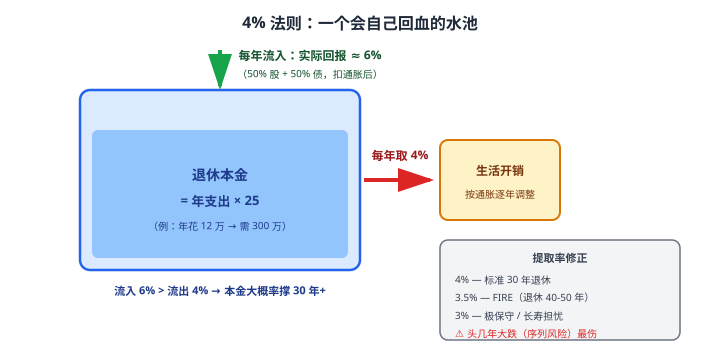
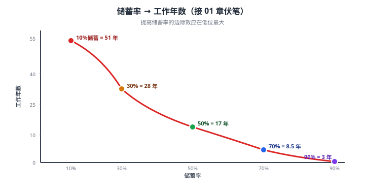

# 37 退休规划

> **这一章要让你搞懂的事**
> 1. **退休规划**回答的核心问题：**你需要多少钱才能不再工作**
> 2. **4% 法则**：为什么 25 倍年支出 = 财务自由的数学起点
> 3. **储蓄率 → 工作年数表**（接 01 章的悬念）—— 这才是"早退休"的真相
> 4. **三大养老支柱**：基本养老 / 企业年金 / 个人养老金（+ 商业养老）
> 5. **中国养老体系的现状与挑战** —— 你不能只指望国家养老
> 6. **FIRE 运动**：财务独立、提前退休（Financial Independence, Retire Early）的可行性
>
> **入门门槛**
> - 第 01 章：储蓄率
> - 第 02 章：复利
> - 第 03 章：通胀与实际收益
> - 第 06 章：资产配置
> - 第 33-36 章：组合 / 行为 / 税务
>
> **声明**：本教程不构成投资建议；所有数字、公式为教学示例。

---

## 📖 本章英文缩写速查

> 看到不认识的英文缩写，先回这张表查；完整术语见 [GLOSSARY.md](../GLOSSARY.md)。

| 缩写 | 英文全称 | 中文含义 |
|---|---|---|
| **FIRE** | Financial Independence, Retire Early | 财务独立、提前退休运动 |
| **XIRR** | Extended Internal Rate of Return | 不规则现金流的内部收益率（真实年化收益） |
| **PMT** | Payment | 每期等额支付金额（Excel 函数） |
| **MPT** | Modern Portfolio Theory | 现代投资组合理论 |
| **CAPM** | Capital Asset Pricing Model | 资本资产定价模型 |
| **TIPS** | Treasury Inflation-Protected Securities | 美国通胀保值国债 |

---

## 0. 先讲个故事

**老张和小李，同年龄，但完全不同的退休轨迹**：

**老张（55 岁，规划退休 60 岁）**：
- 月支出 1 万元
- 一辈子没规划，**净资产 80 万**
- 60 岁退休时基本养老金月领 4,000 元 → **每月差 6000**
- 80 万 ÷ 6000/月 = **111 个月 ≈ 9.3 年用完**
- **60 岁退休 + 69 岁返贫** → 70 岁后只能靠 4000 元养老金 + 子女接济

**小李（55 岁，已经"半退休"）**：
- 月支出 1 万元
- 40 岁起认真理财（储蓄率 40-50%），**净资产 400 万**
- 投在低风险组合（年化 5% 实际收益）
- 每年安全提取 4% = 16 万 = **月 1.33 万** ≈ **覆盖支出**
- **本金长期不动** → 一辈子不用工作也能维持生活

**两人的差距**：
- 老张本金 80 万 / 小李 400 万 —— **差 5 倍**
- 关键不在"运气" → 在 **15 年前的储蓄率差距**

> 这章告诉你：
> 1. **退休规划不是 60 岁的事，是 30 岁的事**——前 30 年决定后 30 年
> 2. **4% 法则**给出"够花一辈子" 的数学边界
> 3. **储蓄率 → 工作年数**：储蓄率 70% 的人 8.5 年退休、储蓄率 10% 的人 51 年退休
> 4. **中国养老体系**：基本养老只够"温饱"，必须自己规划
> 5. **FIRE 运动**：年轻人对"60 岁退休"的反叛——可行但有代价

---

## 1. 退休缺口测算

### 1.1 三个关键数字

| 数字 | 含义 |
|---|---|
| **退休时年支出** | 你退休后每年要花多少钱 |
| **退休后预期寿命** | 你预计还活多少年 |
| **资产年化回报** | 你的退休组合能跑赢通胀多少 |

### 1.2 简单测算公式

**最朴素的版本**：

$$
\text{退休所需本金} = \text{年支出} \times \text{预期退休年数}
$$

**例**：月支出 1 万元 × 12 = 年支出 12 万；60 岁退休 + 预期活到 85 岁 = 25 年。
- 需要 12 × 25 = **300 万**

**问题**：这没考虑投资回报 + 通胀。

### 1.3 进阶版（考虑投资回报）

如果退休组合**实际年化回报 = 提取率**（即投资增长正好抵消提取），本金**永远不会减少**。

**这就引出"4% 法则"**。

---

## 2. 4% 法则

### 2.1 历史背景

**1994 年**：财务规划师**William Bengen** 用 70 年美国市场数据回测——发现：

> **每年从退休本金中提取 4%（按通胀调整），70%+ 概率本金能撑 30 年以上。**

**1998 年 Trinity Study**（三一研究）扩展验证：4% 法则在各种股债比组合下都成立。

### 2.2 4% 法则的核心命题

$$
\text{财务自由数} = \text{年支出} \times 25
$$

**因为**：1 / 4% = 25

**翻译成人话**：**你需要的本金 = 年支出 × 25**。

**例**：
- 月支出 1 万 → 年支出 12 万 → **需要本金 300 万**
- 月支出 2 万 → 年支出 24 万 → **需要本金 600 万**
- 月支出 5 万 → 年支出 60 万 → **需要本金 1500 万**



### 2.3 4% 怎么来的

**假设**：
- 退休组合：50% 股 + 50% 债
- 长期实际回报：6-7%（扣通胀后）
- 退休 30 年 + 留有缓冲

**计算**：
- 每年提 4% → 平均下来本金能持续 30 年（甚至更久）
- 实际回报 6% > 提取 4% → 通常本金还增长

### 2.4 4% 法则的局限

| 局限 | 说明 |
|---|---|
| **基于美国历史**：未来不一定重复 | 中国市场样本短 |
| **股债 50/50 组合**：完全保守的人不够 | 偏债组合可能需要 3.5% |
| **30 年时长**：FIRE 人群需要 40-50 年 | 提取率可能需降到 3-3.5% |
| **不含医疗大额支出** | 现代人长寿+医疗成本 |
| **不考虑早期市场暴跌**（"序列风险"）| 最初 5-10 年大跌可能毁掉计划 |

### 2.5 修正版本

| 提取率 | 适用 |
|---|---|
| 4% | 标准 30 年退休 |
| **3.5%** | 退休 40-50 年（FIRE）|
| **3%** | 极保守 / 长寿担忧 |
| 5% | 退休 20 年 / 有其他收入 |

---

## 3. 储蓄率 → 工作年数表

### 3.1 接 01 章的悬念

**第 01 章**留下了这张著名的表（Mr. Money Mustache 推广）：

| 储蓄率 | 工作年数到财务自由 |
|---|---|
| 10% | **51 年** |
| 20% | 37 年 |
| 30% | 28 年 |
| 40% | 22 年 |
| 50% | **17 年** |
| 60% | 12.5 年 |
| 70% | **8.5 年** |
| 80% | 5.5 年 |
| 90% | 3 年 |

### 3.2 推导

**假设**：
- 退休后实际回报 5%
- 提取率 4%
- 退休生活方式与工作时**相同**（关键！）

**逻辑**：
- 你存的钱 ratio = 储蓄率
- 你花的钱 ratio = 1 - 储蓄率
- 财务自由需要本金 = 25 × (1 - 储蓄率) × 年收入
- 每年存的钱 = 储蓄率 × 年收入
- 年化复利 5%
- → 年数 = log(...) 公式（参见 §6）

### 3.3 反直觉

| 储蓄率从 → 到 | 工作年数减少 |
|---|---|
| 10% → 20% | 51 - 37 = **省 14 年** |
| 30% → 40% | 28 - 22 = 省 6 年 |
| 50% → 60% | 17 - 12.5 = 省 4.5 年 |
| 70% → 80% | 8.5 - 5.5 = 省 3 年 |

**翻译成人话**：**储蓄率提升的边际效应在低位最大**——储蓄率 10% 提升到 20% **省 14 年人生**！

### 3.4 视觉化



### 3.5 关键洞察

**这张表告诉你**：
1. **储蓄率比收益率重要**（前期）—— 储蓄率从 10% 提到 50% **省 34 年**
2. **高储蓄率可行的前提**：**降低支出 + 维持收入** —— 不是"勒紧裤腰带过日子"
3. **早开始**：30 岁开始储蓄率 50% → 47 岁就财务自由
4. **FIRE 运动的数学基础**：高储蓄率人群能在 30-40 岁退休

---

## 4. 中国养老体系

### 4.1 三大支柱

| 支柱 | 谁出钱 | 性质 |
|---|---|---|
| **第一支柱** | 国家社保（基本养老）| 强制、人人参与 |
| **第二支柱** | 企业年金 / 职业年金 | 公司提供 |
| **第三支柱** | 个人养老金 + 商业养老保险 | 个人自愿 |

### 4.2 第一支柱：基本养老金

**机制**：
- 工作时：每月缴费基数 × 8%（个人） + 16%（公司）
- 退休时：领取（**基础养老金 + 个人账户养老金**）

**退休金水平**：
- 一线城市平均月退休金：**3,500-5,500 元**（2024 数据）
- **替代率**：退休工资 / 退休前工资 ≈ **40-50%**

**核心问题**：**只够"温饱"**——远不足以维持工作时的生活水平。

### 4.3 第二支柱：企业年金 / 职业年金

| 类型 | 适用 | 现状 |
|---|---|---|
| **企业年金** | 私企（自愿） | 覆盖率 < 10% |
| **职业年金** | 事业单位 / 公务员（强制）| 覆盖率 100% |

**对个人**：
- 公司缴 4-8%，个人 4%
- 个人缴费部分**当期免税**
- 增长部分**免税**
- 领取时按工资标准缴税

**重要**：**有企业年金的工作 = 实际收入 +5-10%** —— 求职时是重要福利。

### 4.4 第三支柱：个人养老金 + 商业养老保险

**个人养老金账户**（2022 起）：详见**第 36 章**。

**商业养老保险**（年金险等）：详见**第 31 章**。

### 4.5 现实的"养老组合"

**对中国 30-50 岁人群的推荐配置**：

| 支柱 | 占未来退休金来源 |
|---|---|
| 第一支柱（基本养老）| 30% |
| 第二支柱（企业年金）| 10-20% |
| **第三支柱（个人养老金 + 投资）** | **50-60%** |

**关键认知**：**不能只指望国家** —— 必须主动规划第三支柱。

---

## 5. FIRE 运动

### 5.1 什么是 FIRE

**FIRE = Financial Independence, Retire Early**（财务独立、提前退休）。

**核心理念**：
- 通过**高储蓄率**（50-70%）+ **指数投资**
- 在 30-40 岁达到"财务自由"
- 之后可以"不工作 / 做喜欢的事 / 半工作"

### 5.2 FIRE 的几种流派

| 流派 | 特点 |
|---|---|
| **Lean FIRE**（精瘦型）| 极低支出 → 本金小 → 早退休但需省吃俭用 |
| **Fat FIRE**（充裕型）| 中高支出 → 本金大（500 万+）→ 退休后生活质量高 |
| **Coast FIRE**（漂浮型）| 早期攒一笔，之后只需"覆盖当前支出"，让本金继续增长 |
| **Barista FIRE**（咖啡师型）| 半 FIRE + 兼职低压工作（如咖啡师）|

### 5.3 中国 FIRE 的可行性

**有利条件**：
- 房产升值红利（2020 前）
- 部分行业高薪（互联网 / 金融 / 半导体）
- A 股个人免资本利得税

**不利条件**：
- 工资税率较高（中产 25-35%）
- 医疗保障对早退休者不友好（55 岁前无医保 → 商业医疗险贵）
- 文化压力（"不工作 = 异类"）

**核心可行人群**：
- 一线城市夫妻双高薪
- 储蓄率 50%+ 5-10 年
- 已有 1-2 套房 + 500 万流动资产

### 5.4 FIRE 的代价

| 代价 | 说明 |
|---|---|
| **延迟享受** | 30-40 岁极简生活 |
| **错过事业巅峰** | 40-50 岁可能是收入最高时 |
| **社交脱节** | 不工作 → 社交圈萎缩 |
| **心理空虚** | 没有工作目标 → 部分人不适应 |
| **配偶不支持** | FIRE 通常是个人决定，难单独执行 |

### 5.5 现实主义版"FIRE Lite"

**对多数中国人**：
- **目标不是"30 岁退休"** —— 是 50-55 岁财务独立
- **降低工作压力**：储蓄率 30-40% + 工作到 50 岁 + 退休后做喜欢的事
- **不追求 100% 不工作** —— 部分时间工作 + 部分时间陪家人

**这才是适合中国家庭的"FIRE 哲学"**——不极端、不内卷、不躺平。

---

## 6. 实操：你需要多少钱

### 6.1 简化计算流程

**第 1 步**：估算退休后年支出
- 当前年支出 × (1 + 通胀)^年数
- 例：30 岁年支出 12 万，60 岁通胀后约 36 万（3% 通胀 30 年）

**第 2 步**：计算财务自由数
- 财务自由数 = 退休时年支出 × 25
- 例：36 万 × 25 = **900 万**

**第 3 步**：减去预期社保 + 其他养老金
- 基本养老金 5000/月 × 12 × 25 = 150 万（按年金现值简化）
- 净需求：900 - 150 = **750 万**

**第 4 步**：算你需要每月存多少
- 30 年累积到 750 万 + 假设年化 6%
- **每月需投入约 7500 元**

### 6.2 Excel 计算

**Excel 公式（年金现值）**：
```excel
所需月投入 = -PMT(年化率/12, 年数*12, 0, 目标本金)
```

**例**：年化 6%、30 年、目标 750 万：
- `=PMT(6%/12, 360, 0, -7500000)` = **7,475 元/月**

### 6.3 储蓄率公式（推导）

设：
- 收入 $I$
- 储蓄率 $s$
- 年化回报 $r$
- 年支出 = $I \times (1-s)$
- 目标 = 年支出 × 25 = $25 \times I \times (1-s)$

每年存 $s \times I$，n 年后累积 $\frac{sI[(1+r)^n - 1]}{r}$

**财务自由条件**：$\frac{sI[(1+r)^n - 1]}{r} = 25I(1-s)$

**解 n**：
$$
n = \frac{\ln\left[\frac{25(1-s)r}{s} + 1\right]}{\ln(1+r)}
$$

**例**：s = 50%、r = 5%：
$$
n = \frac{\ln[25 \times 0.5 \times 0.05 / 0.5 + 1]}{\ln 1.05} = \frac{\ln 2.25}{\ln 1.05} \approx \frac{0.811}{0.0488} \approx 17 \text{ 年}
$$

**验证**：50% 储蓄率 = 17 年 ✓

---

## 7. 进阶讨论

**入门读者可以跳过本节**。

### 7.1 序列风险（Sequence Risk）

**问题**：即使长期年化 6%，**退休初期遇上大跌**会毁掉计划。

**例**：退休时本金 500 万 → 第 1 年市场跌 -30%：
- 本金变 350 万
- 提取 4%（仍按 500 万的 4% = 20 万）
- 剩余 330 万 → 之后每年提 4% × 500 万 = 20 万 → 资金消耗加速

**对策**：
- **退休前 5-10 年降低股票比例**（"退休滑坡"）
- **保留 2-3 年支出现金**（避免熊市卖股）
- **灵活提取**：市场跌时少提（4% → 3%）

### 7.2 通胀对退休的影响

**长期通胀**：每年 3% → 30 年价格涨 **2.43 倍**。

**意味着**：
- 今天 12 万年支出 → 30 年后等价于 29 万
- 资产配置必须**长期跑赢通胀** → 不能全债 / 全现金

**抗通胀资产**：
- 股票（长期最佳）
- REITs
- 黄金（部分时段）
- 通胀挂钩债券（TIPS，中国暂无）

### 7.3 医疗与长期护理

**老年医疗 / 长期护理是最大的退休风险**：
- 大病 / 长期住院可能花 50-100 万
- 失能后请保姆 / 养老院 6000-2 万/月

**对策**：
- 商业重疾险（详见第 31 章）
- 百万医疗险（一年一续保）
- **退休时本金需要包含"医疗准备金"**（30-100 万）

### 7.4 国际 FIRE 实证

| 国家 | FIRE 流行度 |
|---|---|
| 美国 | 高（FIRE 运动起源） |
| 欧洲 | 中（部分国家高福利削弱动机）|
| 日本 | 低（终身雇佣文化）|
| 中国 | 上升中（90 后 / 00 后开始） |

### 7.5 退休后的"目标重构"

**研究发现**：仅"财务自由 → 不工作"不能带来长期幸福。

**关键**：退休后**仍需要**：
- 目标感（Purpose）
- 社交（Community）
- 学习（Growth）
- 健康（Health）

**最幸福的退休者**：**财务自由 + 持续做喜欢的工作（但有选择权）**。

---

## 8. 小结

1. **退休规划核心问题**：你需要多少钱才能不再工作。**答案 = 年支出 × 25**。
2. **4% 法则**：每年从本金提取 4%（按通胀调整），70%+ 概率本金能撑 30 年。
3. **储蓄率→工作年数**：储蓄率 10% = 51 年；50% = 17 年；70% = 8.5 年。**储蓄率是退休的国王**。
4. **中国三大养老支柱**：基本养老（只够温饱）/ 企业年金（覆盖低）/ **个人养老金 + 投资**（必须自己抓）。
5. **基本养老金替代率 40-50%**——**只指望国家养老 = 大幅度降低退休生活质量**。
6. **FIRE 运动**：高储蓄率 + 指数投资 + 30-40 岁财务自由。**适合一线高薪人群**。
7. **"FIRE Lite"** 对多数中国家庭更现实：50-55 岁财务独立 + 部分时间工作。
8. **核心实操**：① 算财务自由数（年支出 × 25）② 估算社保 / 其他支柱贡献 ③ 算每月需投入 ④ 自动定投。

> 🔗 **承上启下**：**06 模块（组合与进阶）到此结束**。从 33 到 37，你已经掌握：MPT / CAPM / 行为金融 / 税务 / 退休——**完整的"理论 + 制度"体系**。
>
> **接下来 07 模块（38-42）** —— **工具与实操**：XIRR / Excel & Python 模板 / 财报阅读 / 数据源 / 复盘系统。**这是把"知识"变成"日常工具"的最后一步**。

---

## 自测题

> 答案在文末折叠区。

1. 4% 法则给出的"财务自由公式"是什么？为什么是 25 倍而不是 30 倍？
2. 月支出 1.5 万，60 岁退休。按 4% 法则，你需要多少本金？考虑 30 年通胀后呢？
3. **数学题**：你 30 岁，月薪 2 万，储蓄率 30%。按本章 §6.3 公式估算多少年达到财务自由？
4. 储蓄率从 30% 提到 50% —— 工作年数减少多少？这意味着什么？
5. 中国基本养老金"替代率"是多少？只靠基本养老金退休会怎么样？
6. **进阶题**：你 40 岁，月支出 2 万元，当前净资产 200 万元。你想 55 岁退休——可行吗？需要每月存多少（假设年化 6%）？
7. **作业题**：用 Excel 算你的"退休规划"：
   - ① 当前月支出 × 1.03^(退休年份 - 当前年份) = 退休时月支出
   - ② × 12 × 25 = 财务自由数
   - ③ 减去预期社保（如月 5000 × 12 × 25 = 150 万）
   - ④ 净缺口 ÷ (年化 5% × 复利) = 每月需投入
   - 结果是否在你的承受范围内？

<details>
<summary>📖 参考答案</summary>

1. **公式**：**财务自由数 = 年支出 × 25**。
   **为什么 25 倍**：4% 法则的"提取率倒数" = 1 / 4% = 25。**4% 来自 1994 年 Bengen 用美国 70 年数据回测**——每年从退休本金提 4%（按通胀调整），**70%+ 概率本金能撑 30 年**。**如果改 30 倍**（提取率 3.33%）：更保守，能撑 50 年，适合 FIRE 早退休的人。

2. 
   - 当前年支出：1.5 万 × 12 = 18 万
   - 假设你 30 岁、60 岁退休（30 年后），3% 通胀：
     - 退休时年支出 ≈ 18 × 1.03^30 ≈ **43.7 万**
     - 财务自由数 = 43.7 × 25 ≈ **1093 万**
   - **不考虑通胀**：18 × 25 = 450 万
   - **关键启示**：30 年通胀让真实需求**翻 2.4 倍**——长期规划必须考虑通胀

3. 套用 §6.3 公式：
   - s = 30%、r = 5%（保守假设）
   - n = ln[25 × 0.7 × 0.05 / 0.3 + 1] / ln(1.05)
       = ln[2.917 + 1] / ln(1.05)
       = ln(3.917) / 0.0488
       ≈ 1.365 / 0.0488
       ≈ **28 年**
   - 验证：与本章表"30% 储蓄率 = 28 年"一致 ✓
   - 30 岁 + 28 年 = **58 岁财务自由**

4. 30% → 50%：28 - 17 = **省 11 年**
   **意味着**：
   - 多攒 20% 储蓄率 ≈ 多 10+ 年自由人生
   - 储蓄率是退休的"杠杆"——比"赚多 1 万"更重要
   - 关键在"控制支出 + 提高储蓄率"，而不是"追求 10% 收益率"

5. **替代率约 40-50%**——退休后基本养老金大致是退休前工资的 40-50%。
   **只靠基本养老金**：
   - 大幅降低生活质量（不能再随意旅游、消费）
   - 一线城市仅够"温饱"
   - 医疗大额支出无力承担
   - **结论**：**必须主动规划第三支柱**——个人养老金 + 投资 + 商业养老险

6. 
   - 月支出 2 万 × 12 = 24 万年支出
   - 假设退休后年支出仍 24 万（不考虑通胀简化）→ 财务自由数 = 24 × 25 = **600 万**
   - 缺口 = 600 - 200 = 400 万
   - 时间 = 15 年
   - 月投入计算：`=PMT(6%/12, 15*12, -200万, -600万)` ≈ **每月约 1.5-1.8 万**
   - **是否可行**：取决于他的月薪 —— 月薪 4 万+ 才能存 1.5 万+
   - **如果月薪 3 万**：每月最多存 1 万 → 55 岁不够 → 推迟到 60 岁退休
   - **如果月薪 2 万**：储蓄率不够 → 必须降低退休后支出（如月 1.5 万） → 财务自由数降到 450 万 → 月需投入 8,000 元

7. 没有标准答案。**重点检查**：
   - 多数人发现**真实缺口比"以为"的大**——通胀复利让数字翻倍
   - 多数人发现"每月需投入"高于当前**真实结余**——意味着**要么增加收入，要么降低支出，要么推迟退休**
   - 如果数字让你觉得"绝望"——**好消息是**：①你比"不算的人"早觉醒 10 年 ② 复利的力量在长期会显现 ③ 哪怕只能 30% 的执行，也比 0% 强
   - **作业的真正价值**：把"退休"从"60 岁那年的事" → 变成"今天就要做决策的事"

</details>

---

## 延伸阅读

- 《财务自由之路》—— Mr Money Mustache 博客：FIRE 运动启蒙
- 《4% 法则原始论文》—— William Bengen 1994
- 《漫长的告别》—— 美国养老金体系反思
- 中国社科院：[中国养老金发展报告] —— 第三支柱政策研究
- 人社部 [基本养老金计发办法] —— 官方测算工具
- 《罗马人的故事》—— 盐野七生：长寿文明对养老的反思

---

## 下一章预告

**38 真实年化收益（XIRR）** —— 进入"07 工具与实操"模块：
- 为什么"简单收益率"会严重高估定投回报
- **XIRR**：不规则现金流的真实年化
- Excel + Python 双工具
- 一个真实案例：5 年定投基金的真实回报

---

## 模块小结：06 组合与进阶

**走完了 5 章（33-37）**，你应该已经掌握：

| 章 | 主题 | 核心结论 |
|---|---|---|
| 33 | MPT | 分散化是免费午餐 + 有效前沿 |
| 34 | CAPM + 因子 | Beta + 多因子模型 |
| 35 | 行为金融 | 制度替代意志 |
| 36 | 税务社保 | 主动申报 = 年省 1-3 万 |
| 37 | 退休规划 | 4% 法则 + 储蓄率→工作年数 |

**这 5 章覆盖的"完整投资体系"**：
- **理论**：MPT + CAPM + 因子（资产配置最优化）
- **现实**：行为金融（人性偏差）
- **制度**：税务 + 社保（合法优惠）
- **目标**：退休规划（终极目的）

**接下来 07 模块（38-42）** —— 把所有理论变成日常工具：
- 38 XIRR
- 39 Excel/Python 复利模板
- 40 读基金季报
- 41 数据源（同花顺/天天/雪球/晨星）
- 42 投资记录系统

**这是收官 5 章**——让你 5 年后还能持续运转的"个人理财基础设施"。
