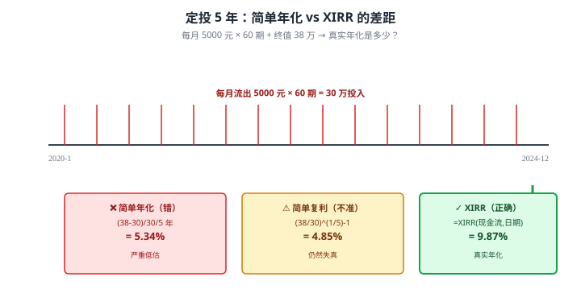
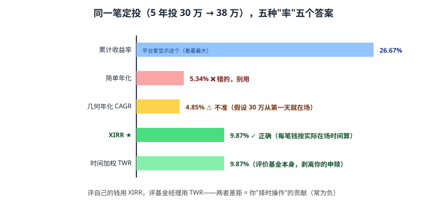

# 38 真实年化收益（XIRR）

> **这一章要让你搞懂的事**
> 1. 为什么"**简单年化收益率**"在定投场景下**严重失真**
> 2. **IRR**（Internal Rate of Return，内部收益率）的数学定义
> 3. **XIRR**：考虑日期的 IRR——**定投真实年化的唯一正确算法**
> 4. **完整案例**：5 年月定投基金的真实回报
> 5. **Excel + Python 实战**：5 分钟掌握
> 6. **各种"率"的辨析**：累计收益 / 年化 / IRR / XIRR / 时间加权
>
> **入门门槛**
> - 第 02 章：复利
> - 第 24 章：基金筛选与持有
> - 第 31 章：保险 IRR（已经接触过）
>
> **声明**：本教程不构成投资建议；所有数字为教学示例。

---

## 0. 先讲个故事

**小王 2020-2024 年坚持月定投沪深 300 ETF**：
- 每月固定投入 5,000 元
- 5 年共投入 30 万元
- 2024 年末账户余额 **38 万元**

**他打开基金 APP**，看到醒目的数字：
> **"持有收益：+26.67%"**

小王心想："5 年涨 26.67%，**年化 5.34%** —— 比定期高一倍嘛！"

**但他朋友老李是金融背景**，告诉他：
> "你算错了。**真实年化收益率约 10%**，不是 5.34%。"

小王不解：(38 - 30) / 30 = 26.67%；26.67% / 5 = 5.34%——**怎么会错**？

老李解释：
> "你**第 1 期投入的钱实际投了 5 年**——但**第 60 期投入的钱只投了 1 个月**！你不能把 30 万都当成"全程在场"的钱。"
> "正确算法叫 **XIRR**——考虑每笔钱投入的具体日期。"

老李帮小王在 Excel 里算了一下：
- 列出 60 笔流出（每月 -5000）+ 1 笔流入（+380,000）
- 输入 `=XIRR(现金流, 日期)`
- **结果：9.87%**

**小王恍然大悟**：
> "原来我每月的钱真实贡献了**接近 10% 的年化**——比我以为的高近一倍。"

> 这章告诉你：
> 1. **简单收益率 / 26.67%** —— 完全失真，**严重低估**定投回报
> 2. **XIRR 算法** —— 考虑每笔钱"在场时间"的真实年化
> 3. **学会 XIRR 后，你能识破**：销售员说的"复利 3.5%"、平台的"持有收益 26%"、自己以为的"年化 5%"——**真实可能完全不同**
> 4. **这是理财人必备工具**——10 分钟学会，受益终身

---

## 1. 为什么"简单年化"失真

### 1.1 简单年化公式（错误的）

$$
\text{简单年化（错）} = \frac{\text{累计收益}}{\text{累计投入}} \times \frac{1}{\text{年数}}
$$

**例**：投入 30 万、收益 8 万、5 年
- 累计收益率 = 8 / 30 = 26.67%
- "年化" = 26.67% / 5 = **5.34%**

### 1.2 这种算法的两大错误

**错误 1：没有考虑复利**

5 年累计 26.67% ≠ 简单除以 5 = 5.34%。
- **真实复利**：(1.2667)^(1/5) - 1 = **4.85%**——但即便这样算还是错的，因为：

**错误 2：忽略了"每笔钱的在场时间"**

定投：第 1 期投入的钱"在场"5 年；第 60 期投入的钱只"在场"1 个月。

**简单平均算法把所有钱都当成"全程在场"——严重低估了"短期投入" 真正贡献的回报率**。

### 1.3 直观对比



**结论**：**简单算法低估了一半的回报**——这就是为什么必须用 XIRR。

---

## 2. IRR 的数学定义

### 2.1 净现值（NPV）

**净现值（Net Present Value, NPV）**：把所有未来现金流**折现到今天**的总价值。

$$
\text{NPV} = \sum_{t=0}^{N} \frac{C_t}{(1+r)^t}
$$

其中：
- $C_t$ 是第 $t$ 期的现金流（流入正，流出负）
- $r$ 是折现率

### 2.2 IRR 的定义

**IRR = 让 NPV = 0 的折现率**。

$$
\sum_{t=0}^{N} \frac{C_t}{(1+\text{IRR})^t} = 0
$$

**翻译成人话**：**IRR 是"假设投资按这个年化率增长，恰好能让现金流自洽"的利率**。

### 2.3 简单例子

**场景**：今天投入 100 元，1 年后拿回 110 元。
- $C_0 = -100$（流出）
- $C_1 = +110$（流入）
- NPV = -100 + 110/(1+r) = 0
- 解：r = 10% → **IRR = 10%**

**这就是你的"年化回报率"**。

### 2.4 多期场景

**场景**：今天投 100、1 年后再投 100、2 年后拿回 230。
- $C_0 = -100$
- $C_1 = -100$
- $C_2 = +230$
- NPV = -100 - 100/(1+r) + 230/(1+r)^2 = 0
- 解（Excel）：r ≈ **9.0%**

**手算**很麻烦——所以 Excel 的 IRR / XIRR 函数是关键工具。

---

## 3. XIRR：考虑日期的 IRR

### 3.1 IRR vs XIRR 区别

| 函数 | 假设期间 | 用法 |
|---|---|---|
| **IRR** | **固定间隔**（每年 / 每月）| 简单——但限制大 |
| **XIRR** | **任意日期** | 现实——定投 / 不规则现金流 |

### 3.2 XIRR 公式

$$
\sum_{i=0}^{N} \frac{C_i}{(1+\text{XIRR})^{(d_i - d_0)/365}} = 0
$$

其中：
- $C_i$ 是第 i 笔现金流
- $d_i$ 是第 i 笔的日期
- $d_0$ 是基准日期

**核心**：**日期** $d_i$ 决定了每笔钱"在场了多久" → 这是 XIRR 的本质。

### 3.3 Excel 公式

```excel
=XIRR(现金流范围, 日期范围, 初始猜测值)
```

**初始猜测值**通常省略——Excel 默认 0.1。

---

## 4. 完整案例：5 年月定投

### 4.1 数据准备

**场景**：2020 年 1 月起，每月 1 日投入 5,000 元；持续 60 个月；2024 年 12 月 31 日账户余额 380,000 元。

**Excel 数据表**（部分）：

| 日期 | 现金流 |
|---|---:|
| 2020-1-1 | -5,000 |
| 2020-2-1 | -5,000 |
| ... | ... |
| 2024-12-1 | -5,000 |
| 2024-12-31 | **+380,000** |

### 4.2 Excel 操作

**单元格 C1**：
```excel
=XIRR(B2:B62, A2:A62)
```

**结果**：**9.87%**

### 4.3 解读

- **真实年化回报 9.87%** ≈ 沪深 300 ETF 在过去 5 年的年化（合理）
- **比"简单除以 5"** 高近 1 倍
- **比"简单复利公式"** 也高 1 倍

**翻译成人话**：定投的真实回报**远高于** 表面"累计收益 / 累计投入"算出的数字。

---

## 5. Excel + Python 实战

### 5.1 Excel 完整模板

```excel
A 列              B 列
日期              现金流
2020-1-1         -5000
2020-2-1         -5000
...
2024-12-1        -5000
2024-12-31       +380000

C1 单元格：
=XIRR(B2:B62, A2:A62)
```

**结果就是真实年化**。

### 5.2 Python 等价

```python
from scipy.optimize import brentq
from datetime import datetime

def xirr(cash_flows, dates):
    """
    cash_flows: list of floats (流出为负, 流入为正)
    dates: list of datetime objects
    """
    d0 = dates[0]
    def npv(r):
        return sum(cf / (1+r)**((d - d0).days / 365.0)
                   for cf, d in zip(cash_flows, dates))
    # 用 Brent 法在 -0.99 和 10 之间找根
    return brentq(npv, -0.99, 10)

# 例子
cash_flows = [-5000] * 60 + [380000]
dates = [datetime(2020 + i // 12, (i % 12) + 1, 1) for i in range(60)]
dates.append(datetime(2024, 12, 31))

result = xirr(cash_flows, dates)
print(f"XIRR: {result:.4f}")  # 0.0987 ≈ 9.87%
```

### 5.3 numpy_financial 库

```python
import numpy_financial as npf
# 注意：numpy_financial.irr 只支持固定间隔
# 不规则日期需要自己实现或用 pyxirr 库

# pyxirr（推荐）：
# pip install pyxirr
from pyxirr import xirr
result = xirr(dates, cash_flows)
print(result)  # 0.0987
```

### 5.4 在线工具

- **基金平台**：天天基金 / 蛋卷支持"持有收益分析"——但 XIRR 计算口径**因平台而异**
- **WPS / Office 365** 网页版直接用 XIRR

### 5.5 验证

**3 个验证检查**：
1. **量级合理性**：定投 ETF 5 年，XIRR 在 5-15% 之间是合理范围
2. **手算极端**：第 1 期投入 + 终值 ——用 (终值/第1期)^(1/5)-1 应该接近 XIRR
3. **多个 XIRR 解**：现金流多次正负切换时，Excel 可能返回非主解——**给初始猜测调整**

---

## 6. 各种"率"辨析

### 6.1 5 种常见"率"

| 指标 | 含义 | 适用场景 |
|---|---|---|
| **累计收益率** | (终值-投入)/投入 | 一次性投入 |
| **简单年化** | 累计 / 年数 | **错的！别用** |
| **几何年化（CAGR）** | (终值/初值)^(1/n)-1 | 一次性投入 |
| **XIRR** | 净现值=0 的折现率 | **不规则现金流** ★ |
| **时间加权（TWR）** | 剥离申赎影响的"基金本身回报" | 评价基金经理 |

### 6.2 例子对比

**场景**：5 年定投 30 万、终值 38 万

| 指标 | 数值 | 备注 |
|---|---|---|
| 累计收益率 | 26.67% | 平台显示 |
| 简单年化 | 5.34% | **错** |
| 几何年化（按全程 30 万）| 4.85% | **不准** |
| **XIRR** | **9.87%** | **正确** |
| TWR | **9.87%** | （基金回报本身） |

**结论**：**对个人投资者，XIRR 是评价"自己钱的真实回报"** 的金标准。



### 6.3 TWR vs XIRR

| 维度 | XIRR | TWR |
|---|---|---|
| 评价对象 | **你的钱** | **基金本身** |
| 受申赎影响 | ✓（包含申赎效应）| ✗（剥离申赎）|
| 适用 | 个人复盘 | 基金经理评价 / 投顾 |

**例**：基金 TWR 10%，但你"高位定投、低位赎回" → XIRR 可能 5%——**差距来自你的操作**。

---

## 7. 进阶讨论

**入门读者可以跳过本节**。

### 7.1 多解问题

**问题**：现金流多次正负切换时，IRR 方程**可能有多个解**。

**例**：
- 年 0：-100
- 年 1：+250
- 年 2：-150

NPV(r) = 0 有两个解：r ≈ 50% 和 r ≈ 0%（数学上）

**Excel 处理**：返回最接近"初始猜测"的解。
**实务**：**为初始猜测值提供合理估算**（如 5-10%）—— 避免拿到极端解。

### 7.2 XIRR 的"安全检查"

```python
def safe_xirr(cash_flows, dates, guess=0.1):
    try:
        result = xirr(cash_flows, dates, guess=guess)
        if result < -0.99 or result > 10:
            return None  # 异常值
        return result
    except:
        return None
```

### 7.3 比较多个基金 / 组合

**比较 A、B 两个基金的 XIRR**：
- 同样起止日期
- 同样投入节奏
- 计算各自的 XIRR

**不公平比较**：
- A 投了 5 年、B 投了 2 年 → 时间长度差距大
- 解决方案：用 **TWR** 比较"基金本身能力"

### 7.4 XIRR 的局限

| 局限 | 说明 |
|---|---|
| **无法预测未来** | XIRR 只反映**已发生**的回报 |
| **依赖准确数据** | 漏记一笔现金流 → 结果偏差大 |
| **不显示风险** | 同 XIRR 的两个组合，波动可能差很多 |
| **不告诉你"为什么"** | 需配合归因分析 |

### 7.5 实务中的 XIRR 应用

| 场景 | 用 XIRR |
|---|---|
| **基金定投复盘** | 必用 |
| **保险产品评估** | 必用（见第 31 章）|
| **房产投资回报** | 必用（首付 + 月供 + 出租 + 卖出）|
| **股权投资** | 必用 |
| **个人净资产增长** | 可用（衡量自己"总财富年化"）|

---

## 8. 小结

1. **"简单年化"在不规则现金流下严重失真**——定投按 (终值-投入)/投入/年数 算只能得到一半的真实回报。
2. **IRR 数学定义**：让 NPV = 0 的折现率——回答"假设按这个年化率，现金流是否自洽"。
3. **XIRR = 考虑日期的 IRR**——这是不规则现金流（定投、保险、房产）的唯一正确算法。
4. **5 年定投例子**：累计收益 26.67%、简单年化 5.34%、**XIRR 9.87%**——真实回报近 2 倍。
5. **Excel 一行公式**：`=XIRR(现金流, 日期)` —— 10 分钟学会，受益终身。
6. **Python 实现**：`pyxirr.xirr(dates, cash_flows)` 或自己用 scipy.optimize.brentq。
7. **TWR vs XIRR**：TWR 评价基金本身回报；XIRR 评价**你的钱**的真实回报。
8. **必用场景**：基金定投复盘、保险评估、房产投资、个人净资产年化。

> 🔗 **承上启下**：XIRR 是工具的开始。下一章 **39 Excel 与 Python 模板** —— 把更多金融计算（复利 / 资产配置 / 蒙特卡洛）变成你能直接用的模板。

---

## 自测题

> 答案在文末折叠区。

1. 用一句话解释为什么"定投累计收益率 / 年数"算法是错的。
2. IRR 的数学定义是什么？XIRR 比 IRR 多了什么？
3. **数学题**：你 2022-1-1 投入 10 万，2024-1-1 拿回 12 万。XIRR 是多少？
4. **数学题**：你 2020-1-1 一次性投入 30 万，2020-12-1 又投 5 万，2024-12-1 账户余额 50 万。**估算** XIRR 大约多少？（不需精确解，给量级）
5. TWR 和 XIRR 的区别是什么？什么时候用哪个？
6. **进阶题**：销售员说储蓄险"复利 3.5%"——你怎么用 XIRR 验证？
7. **作业题**：用 Excel 打开你的基金定投记录（如果没有，模拟一份）：
   - ① 列出所有"扣款日期 + 金额"（负数）
   - ② 加最后一行"今天日期 + 当前账户余额"（正数）
   - ③ 用 `=XIRR(现金流, 日期)` 计算
   - ④ 对比基金平台显示的"持有收益率"
   - 两者是否一致？为什么不一致？

<details>
<summary>📖 参考答案</summary>

1. 因为这种算法**忽略了"每笔钱的在场时间"**。定投第 1 期的钱投了 N 年，第 N 期的钱只投了 1 个月——但简单算法把所有钱都当成"全程在场"，严重低估了"短期投入"的真实贡献率。

2. **IRR**：让 NPV（净现值）= 0 的折现率——回答"假设按这个年化率，所有现金流加权折现后自洽"的利率。**XIRR 比 IRR 多了"考虑实际日期"**——IRR 假设现金流是固定间隔（每年/每月），XIRR 直接用日期计算每笔钱的"在场时间"，适用任意不规则现金流。

3. NPV = -10 + 12/(1+r)^2 = 0 → (1+r)^2 = 1.2 → r = √1.2 - 1 = **9.54%**。
   验证：Excel `=XIRR({-100000, 120000}, {2022-1-1, 2024-1-1})` ≈ **9.54%**。

4. **估算思路**：
   - 总投入 30 + 5 = 35 万，终值 50 万 → 累计 +43%
   - 但 30 万投了近 5 年，5 万只投了 4 年
   - 平均"加权在场时间"约 4.7 年
   - 几何年化估算：(50/35)^(1/4.7) - 1 ≈ 7.9%
   - **XIRR 应该在 6-9% 区间**——具体由 Excel 算
   - 用 Excel 算精确结果应该约 **7.5-8.5%**

5. 
   - **TWR**（时间加权回报）：评价**基金本身**的回报——剥离申赎影响
   - **XIRR**：评价**你的钱**的真实回报——包含申赎效应
   - **何时用 TWR**：评价基金经理 / 投顾的"投资能力"
   - **何时用 XIRR**：评价你自己的"投资结果"
   - **同一基金，TWR 和 XIRR 可能差距大**——差距来自你的操作（高位买、低位卖）

6. **验证步骤**：
   - 列出所有"缴费日期 + 金额"（负数）
   - 列出所有"领取日期 + 金额"（正数）
   - 用 `=XIRR(现金流, 日期)` 计算
   - **真实 IRR 通常远低于销售员说的"3.5%"**：
     - 持有 5 年：可能 -5% 到 -10%（前期退保亏损）
     - 持有 20 年：约 2.5-3%
     - 持有 40 年：约 3.0-3.2%
   - **销售员说的"3.5%"** 是"保单价值"的复利，**不是你缴的钱的真实回报**

7. 没有标准答案。**重点观察**：
   - **基金平台显示的"持有收益率"** 通常是"(当前市值 - 累计投入) / 累计投入"——这是**累计收益率**，不是年化
   - **XIRR 计算结果**：通常比"持有收益率 / 年数"高 50-80%（因为后者严重低估）
   - **平台 ≠ XIRR 的原因**：① 平台口径多样 ② 部分平台用"年化收益"显示但实质是简单除以年数 ③ 极少数平台显示真正的 XIRR
   - **作业的真正价值**：让你**第一次知道自己定投的真实年化** —— 多数人会发现"比想象中高"，从而更有信心坚持

</details>

---

## 延伸阅读

- 《现金流量与公司价值》—— 财务管理教科书：NPV / IRR 数学基础
- Microsoft Office：[XIRR 函数文档](https://support.microsoft.com/) —— 官方说明
- pyxirr 库：[pyxirr GitHub](https://github.com/Anexen/pyxirr) —— Python 高性能 XIRR
- 《量化投资 - 以 Python 为工具》—— 蔡立耑：金融计算 Python 实战
- Bogleheads 论坛：XIRR 在退休规划中的应用

---

## 下一章预告

**39 Excel 与 Python 模板** —— 工具实战：
- Excel 必备金融函数（FV / PV / PMT / RATE / SLOPE / XIRR）
- **复利计算器**模板
- **资产配置**计算器
- **蒙特卡洛模拟**：估算"未来 30 年"的可能区间
- Python 等价工具
