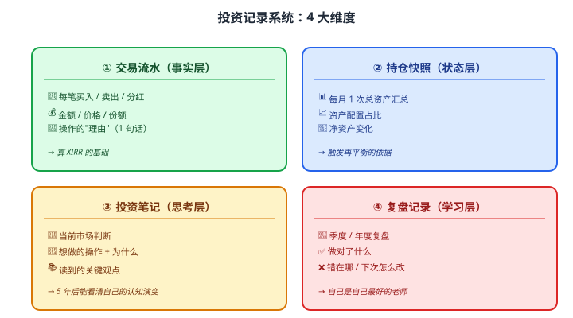

# 42 建立投资记录系统

> **这一章要让你搞懂的事**
> 1. **4 大记录维度**：交易流水 / 持仓快照 / 投资笔记 / 复盘记录
> 2. **月度 / 季度 / 年度复盘节奏**——让"投资"变成"可持续的习惯"
> 3. **工具对比**：Excel / Notion / Obsidian / 专用 APP
> 4. **5 年后还能用的"个人理财基础设施"** —— 抗工具变化
> 5. **从"被动持有"到"主动管理"** —— 这是普通人和"理财高手"的真正分界
>
> **入门门槛**
> - 第 24 章：基金筛选与持有
> - 第 35 章：行为金融（制度替代意志）
> - 第 38 章：XIRR
>
> **声明**：本教程不构成投资建议；本章工具方法均为教学示例。

---

## 0. 先讲个故事（也是全书的结尾）

**老周 5 年前开始理财——和你现在一样**：
- 看了 2 本书
- 在天天基金注册了账户
- 月定投 5000 沪深 300

**5 年过去**——他打开账户看到："累计 +35%"——很高兴。

但**接下来的对话**让他后悔：

"老周，**你过去 5 年具体投了多少钱？哪些月份投了？什么时候涨的？什么时候跌的？你有没有改过策略**？"

老周愣住了。**他什么都不记得**。

平台只显示"当前持仓"——他**根本不知道自己 5 年走过的路**。
- 真实年化是多少？**不知道**（基金 APP 不算 XIRR）
- 最深亏损时是不是想割肉？**忘了**
- 中间有没有错误操作？**记不清**

他朋友老李，同样 5 年定投，但**写了月度日记 + 季度复盘**：

- **2020-3**："美股熔断 → 想割肉，但记得"长期持有"原则，没操作。"
- **2021-2**："抱团股暴跌 → 重读 35 章行为金融 → 没追涨。"
- **2024-1**："5 年复盘：XIRR 9.87%。最大错误：2023 年抱团 AI 主题基亏 -15%。教训：风格漂移 = 卖。"

**老李的 5 年是"可复盘的"**——他知道**自己怎么走过来的**、**犯了什么错**、**学到了什么**。

而老周虽然账户也涨了 35%——但**他下个 5 年不知道怎么继续走**——因为他从未**真正"在场"**过。

> **这就是全书的最后一课**：
> 1. **理财不是"买入持有就完了"** —— 是一个**5 年、10 年、30 年的过程**
> 2. **记录系统是这个过程的"基础设施"** —— 没有它，你每次都从零开始
> 3. **复盘比"看新基金"更有价值** —— 你最大的老师是"自己的历史"
> 4. **42 章学完，你需要的最后一件事是**：**建立你自己的系统**

---

## 1. 4 大记录维度

### 1.1 总览



### 1.2 4 大维度的关系

- ① **事实层**——你做了什么
- ② **状态层**——你现在拥有什么
- ③ **思考层**——你在想什么
- ④ **学习层**——你学到了什么

**最重要**：**没有 ④ 的人，10 年后还在犯同样的错**。

---

## 2. 交易流水（事实层）

### 2.1 最简模板（Excel）

| 日期 | 类型 | 标的 | 代码 | 价格 | 份额 | 金额 | 备注 |
|---|---|---|---|---|---|---|---|
| 2024-01-15 | 买入 | 沪深 300 ETF | 510300 | 4.15 | 2410 | -10,000 | 月定投 |
| 2024-02-15 | 买入 | 沪深 300 ETF | 510300 | 4.05 | 2469 | -10,000 | 月定投 |
| 2024-03-15 | 买入 | 沪深 300 ETF | 510300 | 4.20 | 2381 | -10,000 | 月定投 |
| 2024-06-01 | 卖出 | 沪深 300 ETF | 510300 | 4.50 | -1000 | +4,500 | 再平衡，股仓位 65%超目标 |
| 2024-06-01 | 买入 | 国债 ETF | 511010 | 1.05 | 4286 | -4,500 | 再平衡，加债 |

**关键字段**：
- **日期**：精确到日（XIRR 需要）
- **金额**：买入负、卖出正
- **备注**：1 句话——5 年后你还能看懂的"为什么"

### 2.2 多账户合并

**如果你有多个账户**（券商 + 基金 + 银行）：
- **每个账户一个 Tab**
- **汇总 Tab**：跨账户合并

**关键**：**每月对账** —— 用 APP 截图核对真实余额。

### 2.3 高级版：自动 XIRR

**每月末**在 Excel 加一行：
```excel
日期：2024-12-31
类型：估值
金额：+当前总市值（正数）
```

**然后**：
```excel
=XIRR(金额列, 日期列)
```

**输出**：**真实年化** —— 比任何 APP 显示的"收益率"都准。

---

## 3. 持仓快照（状态层）

### 3.1 月度净资产快照

| 日期 | 现金 | 货基 | 国债 | A股基金 | QDII | 黄金 | 房产 | 总资产 | 房贷 | 净资产 |
|---|---|---|---|---|---|---|---|---|---|---|
| 2024-01-31 | 30K | 50K | 80K | 150K | 60K | 20K | 1.5M | 1.89M | -800K | 1.09M |
| 2024-02-28 | 25K | 55K | 80K | 145K | 65K | 22K | 1.5M | 1.892M | -798K | 1.094M |
| 2024-03-31 | 32K | 50K | 82K | 158K | 64K | 24K | 1.5M | 1.91M | -795K | 1.115M |
| ... | ... | ... | ... | ... | ... | ... | ... | ... | ... | ... |

### 3.2 配置占比 + 偏离

| 类别 | 当前 | 目标 | 偏离 | 是否触发 |
|---|---|---|---|---|
| 现金类 | 7% | 5% | +2% | 否 |
| 国债 | 5% | 10% | -5% | **触发再平衡** |
| A 股 ETF | 28% | 25% | +3% | 否 |
| QDII | 12% | 15% | -3% | 否 |
| 黄金 | 5% | 5% | 0% | 否 |
| 房产 | 43% | 40% | +3% | 否 |

**自动公式**：`=IF(ABS(偏离)>=5%, "触发", "否")`

### 3.3 净资产图表

**Excel 插入折线图** —— 横轴月份、纵轴净资产。

**12 个月后看图** —— 你会看到自己的"财富轨迹"。

---

## 4. 投资笔记（思考层）

### 4.1 月度笔记模板

```
日期：2024-11-01
当月市场印象：
- 沪深 300：估值百分位 22%（处于历史偏低）
- 标普 500：估值百分位 78%（偏高）
- 美元：USD/CNY 7.15，相对稳定

当月操作：
- 11-5 月定投 5000 沪深 300 ETF（按计划）
- 无其他操作

当月思考：
- 看到一篇雪球深度文，分析"美股估值高 + 中国估值低"
- 没决定调整——决定本月观望，看下月情况
- 提醒自己：不要因"一篇文章"就调整长期配置

待跟踪：
- 美联储 12 月议息——可能影响汇率
- A 股 11 月 PMI 数据
```

### 4.2 为什么"每月写一段"重要

- **强化思考**：写下来 = 真正想清楚
- **抵御诱惑**：写下"决定观望" → 实际行动会更克制
- **5 年后看**：你能看到自己**思维成长的轨迹**

### 4.3 关键内容清单

| 必写 | 选写 |
|---|---|
| 当月市场印象 | 读到的关键文章 |
| 当月操作 | 想做但没做的操作 + 为什么 |
| 当月思考 | 学到的新知识点 |
| 下月计划 | 长期方向调整 |

---

## 5. 复盘记录（学习层）

### 5.1 季度复盘（30 分钟）

**模板**：

```
2024-Q4 复盘

数字总结：
- 总资产从 X → Y（净增 Z）
- XIRR：W%
- 最大账户：是赚还是亏？

操作回顾：
- 本季买入：列出
- 本季卖出：列出
- 再平衡：是否做了

错误识别：
- 哪个操作事后看是错的？
- 错在哪？情绪还是判断？

学习收获：
- 这季最大的认知改变

下季计划：
- 定投不变
- 再平衡时间
- 关注重点
```

### 5.2 年度复盘（2 小时）

**框架**：

```
2024 年度复盘

数字：
- 全年净资产增长 X%
- 全年 XIRR Y%
- 与去年对比：增长还是放缓？

最大成功：
- 例如"坚持了定投"、"成功避开主题基金"

最大失败：
- 例如"被某新闻影响追高"

学习要点：
- 3-5 条具体认知

下年规划：
- 是否调整资产配置
- 是否调整定投金额
- 是否需要学习新知识
- 是否需要调整复盘频率
```

### 5.3 5 年复盘（仪式感）

**5 年是分水岭**——值得用半天写一份完整的：
- **财富轨迹图**：5 年净资产折线
- **关键操作回顾**：5 大对、5 大错
- **认知成长**：5 年前你认为对的、现在不再相信的
- **下个 5 年**：基于现在的认知，规划

**这份复盘 = 你的"个人理财史"** —— 可能是你最有价值的文档之一。

---

## 6. 工具选择

### 6.1 三大主流方案

| 工具 | 优势 | 劣势 |
|---|---|---|
| **Excel** | 公式强、可计算 XIRR | 文本写作弱 |
| **Notion** | 笔记 + 数据库灵活 | 国内访问偶尔慢 |
| **Obsidian** | 本地 Markdown + 双向链接 | 学习成本 |

### 6.2 推荐组合

**新手最优**：
- **交易流水 + 持仓快照** → **Excel**
- **投资笔记 + 复盘** → **Notion 或 Obsidian**

**专业进阶**：
- **数据计算** → Excel / Python
- **文档管理** → Obsidian + Git
- **可视化** → Tableau / Power BI / matplotlib

### 6.3 几个"反推荐"

| 不推荐 | 原因 |
|---|---|
| **基金 APP 的"日记功能"** | 不能跨平台、5 年后可能 APP 没了 |
| **微信收藏** | 不可搜索 / 不结构化 |
| **手写笔记本** | 难以搜索 / 备份 |
| **付费理财日记 APP** | 锁定 / 数据迁移困难 |

**核心原则**：**用通用格式**（Excel / Markdown）— 5 年后**任何工具都能打开**。

---

## 7. 进阶讨论

**入门读者可以跳过本节**。

### 7.1 自动化的最后一公里

**理想状态**：
1. 月末自动抓取所有账户余额（Python + 浏览器自动化）
2. 自动写入 Excel
3. 触发再平衡邮件
4. 生成月度报告

**实现路径**：
- 基金 / 券商账户：部分有 API / CSV 导出
- 银行：手动录入（更新慢）
- **初期 80% 手动**也可以——养成习惯比工具完美更重要

### 7.2 Notion 模板示例

**4 个数据库**：
1. **交易记录**：每行一笔操作
2. **月度快照**：每月一行
3. **投资笔记**：每月一篇
4. **复盘**：季度 / 年度

**关系链接**：
- 交易记录 ↔ 月度快照（按日期）
- 月度笔记 → 季度复盘（汇总）

### 7.3 Obsidian + Git 方案

**优势**：
- 本地 Markdown 文件 → 通用
- Git → 版本管理（看到自己 5 年前怎么写的）
- 双向链接 → 知识网络

**例**：
```
- 交易/2024-11/2024-11-05-沪深300ETF定投.md
- 笔记/2024-11-月度市场印象.md
- 复盘/2024-Q4-季度复盘.md
- 复盘/2024-年度复盘.md
```

### 7.4 隐私与安全

| 风险 | 应对 |
|---|---|
| 账户信息泄露 | 不在记录中存账户密码 |
| 余额暴露 | 文件加密 / 不用云盘 |
| 数据丢失 | 本地 + 1 处备份 |
| 工具锁定 | 用通用格式（Excel / Markdown）|

### 7.5 长期维护

**最大挑战**：**坚持 5 年以上**。

**建议**：
- **简化优先**：能用 Excel 解决就不用 Notion；能用 Notion 解决就不用 Obsidian
- **形成仪式感**：每月 1 号晚上 + 每季度末 + 每年最后一天 —— 固定时间
- **接受不完美**：偶尔漏一个月也没关系，**不要因此放弃**
- **越简单越能坚持**

---

## 8. 全书收尾

走过 42 章，你已经掌握：

| 模块 | 核心能力 |
|---|---|
| **00 基础篇** | 思维 + 储蓄率 + 复利 |
| **01 现金储蓄** | 应急金 + 货基 + 国债逆回购 |
| **02 固定收益** | 国债 / 信用债 / 可转债 / 理财 / 债基 |
| **03 权益证券** | 股票 + ETF + 指数 + 主动基金 |
| **04 衍生品** | 知道是什么、为何不碰 |
| **05 其他资产** | 黄金 + REITs + 外汇 + 保险 + 数字资产 |
| **06 组合进阶** | MPT + CAPM + 行为金融 + 税务 + 退休 |
| **07 工具实操** | XIRR + Excel + 季报 + 数据源 + 记录系统 |

### 全书的 8 个核心信念

1. **理财 ≠ 投资 ≠ 致富**——绝大多数人需要的是理财，不是致富。
2. **储蓄率 > 收益率**（前 10 年）—— 习惯比智商更重要。
3. **分散化是免费午餐**——MPT 给的数学礼物。
4. **A 股个人免资本利得税** —— 中国市场的散户红利，长期持有最大化。
5. **指数基金 > 主动基金**（对多数人）—— 巴菲特立遗嘱推荐。
6. **真人不是理性的** —— 用制度替代意志。
7. **看盘越少 = 赚钱越多** —— 反直觉但被数据反复验证。
8. **记录与复盘** —— 你最好的老师是自己。

### 你不需要的 8 件事

1. **追逐"高收益"基金** —— 99% 是规模魔咒 + 均值回归。
2. **频繁看盘** —— 损失厌恶的"心理伤害"日复一日。
3. **跟随网红 / KOL** —— 多数有利益不一致 + 个人化建议。
4. **衍生品交易** —— 散户失败率 70-90%。
5. **海外交易所** —— 不合规 + 不受保护。
6. **储蓄型保险作为"投资"** —— IRR 通常远低于宣传。
7. **频繁切换基金** —— 申赎成本 + 错过反弹。
8. **过度分散** —— 持有 15+ 只基金 = 伪指数。

### 最后一句话

**理财不是终点，是过程**。

42 章的知识只是地图——**地图不是路**。

真正的路从这里开始：
- 今天打开 Excel，建立你的第一份"月度净资产快照"
- 这周看一次你最大持仓基金的最新季报
- 这月底写第一次"月度投资笔记"——哪怕只有 3 行
- 下季度做第一次"季度复盘"

**5 年后**——你会感谢今天的自己。

---

## 自测题（全书最后）

> 这一章的自测题，是关于"全书最重要的认知"。

1. **如果你只能记住 1 个本章观点**，是哪个？为什么？
2. **如果你只能记住 1 个全书观点**，是哪个？为什么？
3. 4 大记录维度中，哪个**你最容易坚持**？哪个**最难**？
4. 月度 / 季度 / 年度复盘——你打算从**哪个**开始？什么时间？
5. **进阶题**：假设你过去 3 年没记录任何东西——**今天能补救吗**？怎么开始？
6. **进阶题**：你 65 岁时，希望自己**5 年后的复盘记录**长什么样？
7. **作业题**（**这是全书最后一个作业**）：
   - ① **今天**：在 Excel / Notion 建立你的"投资记录系统"——4 个 Tab / 4 个数据库
   - ② **本周**：填入你**所有**当前账户的"持仓快照"
   - ③ **本月底**：写下你的第一份"月度投资笔记"（哪怕只有 3 行）
   - ④ **本季度末**：写下你的第一份"季度复盘"
   - ⑤ **5 年后**：回头看这第一篇笔记 —— 你会看到自己走过的路

<details>
<summary>📖 参考答案（一次性给出）</summary>

1-2. 没有标准答案。**重点观察**：
   - 选"记录与复盘"——理财即过程的思维
   - 选"储蓄率 > 收益率"——根本起点
   - 选"看盘越少越好"——抵御本能
   - 选"指数基金 > 主动"——务实

3-4. **多数人**：
   - **最容易坚持**：持仓快照（数字明确）
   - **最难**：投资笔记（需要思考）
   - **建议从季度复盘开始**——3 个月 1 次，门槛低

5. **能补救**。
   - 用各账户的"历史交易记录"导出 CSV
   - 补充到 Excel
   - 算出 XIRR
   - 回忆 / 写下"过去 3 年的关键决策"——哪怕模糊
   - **从今天开始**正式记录

6. 没有标准答案。**思考要点**：
   - 数字层：清楚的 XIRR + 净资产轨迹
   - 故事层：能看到 5 年来的"市场反应 + 自己决策"
   - 认知层：能看到自己思维成长
   - **一份你 70 岁能给孩子看的"理财家史"**——这就是最高目标

7. 没有标准答案。**唯一重要的事**：**开始做** —— 而不是"等完美再做"。

</details>

---

## 延伸阅读

- 《原则》(*Principles*) —— Ray Dalio：建立"原则系统" 的思维
- 《巴菲特致股东信》—— 50 年的"年度复盘"典范
- 《如何打造一种思维》—— 个人知识管理的方法
- **Notion 模板**：搜"Personal Finance Tracker"——开源模板
- **Bogleheads Wiki**：[Investment Policy Statement](https://www.bogleheads.org/wiki/Investment_policy_statement) —— 投资政策声明
- 《财务自由之路》—— 持续记录 + 复盘的实战案例

---

## 模块小结：07 工具与实操

| 章 | 主题 | 核心结论 |
|---|---|---|
| 38 | XIRR | 不规则现金流唯一正确算法 |
| 39 | Excel + Python | 7 大金融函数 + 蒙特卡洛 |
| 40 | 基金季报 | 10 分钟看 5 页 |
| 41 | 数据源 | 同源 > 多源，免费够用 |
| 42 | 记录系统 | 4 大维度 + 复盘节奏 |

---

# 🎓 全书完结

**42 章 / 7 大模块 / 32+ 张 SVG / 约 35 万字**——你已经走完了从"零基础"到"独立理财"的完整路径。

**最后的提醒**：
- 这本书不是"结束"，是"开始"
- 真正的理财技能 = **复盘 + 时间**
- **5 年后再来看 42 章** —— 你会有完全不同的理解

**愿你 5 年后回头看**——能对今天的自己说：

> **"那一年我开始认真理财，是我做过最对的决定之一。"**

---

🌱 *本教程的所有内容仅为教学示例，不构成任何投资建议。*
*市场有风险，投资需谨慎。*
*Aaron 与 Claude，2026 年于 financial-management 项目。*
