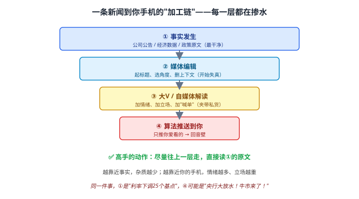
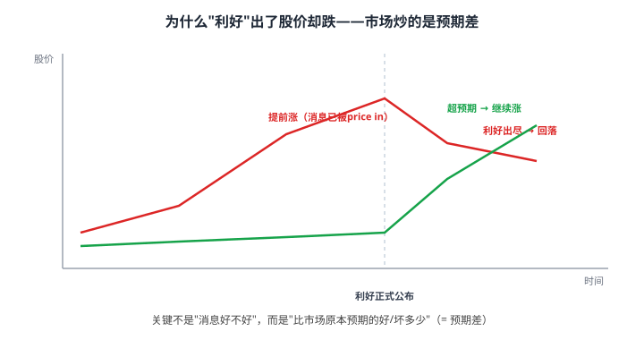

# 43 看懂财经新闻与信息甄别

> **这一章要让你搞懂的事**
> 1. **新闻是"加工品"**：一条消息从发生到你手机，经过 4 层掺水
> 2. **预期差**：为什么"利好出尽是利空"——市场炒的是预期，不是消息本身
> 3. **三类新闻**：事件类 / 数据类 / 观点类——分别怎么读
> 4. **信息甄别六问**：把一条消息从"标题党"还原成"事实"
> 5. **怎么读宏观数据**：CPI、PMI、社融、利率——看方向不看绝对值
> 6. **建立你的"读新闻纪律"**：少看、看源头、反向阅读
>
> **入门门槛**
> - 第 03 章：通货膨胀与 CPI
> - 第 18 章：估值（PE 与预期）
> - 第 41 章：数据源与平台
>
> **声明**：本教程不构成投资建议；所有新闻、案例均为教学示例。

---

## 📖 本章英文缩写速查

> 看到不认识的英文缩写，先回这张表查；完整术语见 [GLOSSARY.md](../GLOSSARY.md)。

| 缩写 | 英文全称 | 中文含义 |
|---|---|---|
| **CPI** | Consumer Price Index | 居民消费价格指数，衡量通胀 |
| **PMI** | Purchasing Managers' Index | 采购经理指数，荣枯线为 50 |
| **LPR** | Loan Prime Rate | 贷款市场报价利率 |
| **M2** | Money Supply M2 | 广义货币（M1+定期及储蓄存款），衡量市场钱量 |
| **PE** | Price-to-Earnings ratio | 市盈率：股价 ÷ 每股收益 |
| **GDP** | Gross Domestic Product | 国内生产总值 |
| **PPI** | Producer Price Index | 工业生产者出厂价格指数 |

---

## 0. 先讲个故事

**2024 年某天早上**，三个人看到同一条新闻：**"央行降息 25 个基点"**。

- **小张**刷到抖音："央行大放水！牛市来了！满仓干！" → 当天追高买入。
- **小李**看了财新快讯："1 年期 LPR 下调 25BP，符合市场预期。" → 没动。
- **老周**翻到央行官网原文，看完只说了一句："**早被 price in 了，今天股市大概高开低走。**"

**收盘**：大盘高开 1.5%，尾盘几乎平收。小张追在最高点站了岗，小李和老周毫发无伤。

**差别在哪？**
- 小张看的是**第 4 层加工品**（情绪 + 喊单）。
- 老周看的是**第 1 层原文**，而且懂"**消息是否已被市场预期**"。

> 这一章告诉你：**新闻不是用来"跟着做"的，是用来"理解世界"的**。会读新闻的人，不是消息最灵通的人，而是**最懂得过滤噪音、识别预期差的人**。

---

## 1. 新闻是"加工品"：信息的掺水链

### 1.1 一条新闻到你手机的 4 层

| 层级 | 是什么 | 失真程度 |
|---|---|---|
| **① 事实** | 公司公告、经济数据、政策原文 | 最干净 |
| **② 媒体编辑** | 起标题、选角度、删上下文 | 开始失真 |
| **③ 大V / 自媒体** | 加情绪、加立场、夹带"喊单" | 严重失真 |
| **④ 算法推送** | 只推你爱看的 → 信息回音壁 | 完全为流量服务 |

**核心动作**：**尽量往上一层走**。能看①就别只看④。

> 同一件事：
> - **①**："1 年期 LPR 下调 25 个基点。"
> - **④**："央行大放水！这次真的不一样！再不上车就晚了！"
>
> **信息没变，掺的水变了。**

### 1.2 标题党的三个套路

| 套路 | 例子 | 真相 |
|---|---|---|
| **绝对化** | "暴涨""崩盘""史上最强" | 多是情绪词，没信息量 |
| **制造紧迫** | "最后机会""错过再等十年" | 销售/流量话术 |
| **断章取义** | 引用专家半句话当标题 | 看原文常是相反意思 |

---

## 2. 预期差：市场炒的不是消息，是"预期之外"

### 2.1 为什么"利好出尽是利空"

**关键认知**：**股价提前反映预期**。

- 一个利好如果**人人都知道会来**，股价**在公布前就涨上去了**（price in）。
- 等利好**正式落地**，反而没人买了 → **利好出尽，回落**。
- 只有**超出市场预期**的部分（= 预期差），才会带来新的上涨。

### 2.2 一张判断表

| 实际情况 vs 市场预期 | 股价大概率反应 |
|---|---|
| 利好，且**超预期** | 涨 |
| 利好，但**符合预期** | 不动或小涨（已 price in）|
| 利好，但**不及预期** | **跌**（"才这么点？"）|
| 利空，但**好于最坏预期** | **涨**（"没那么糟"）|
| 利空，且**超出预期** | 跌 |

> 📌 **小白最常踩的坑**：看到"利好新闻"就追。**会读新闻的人先问一句：这消息市场早知道了吗？**

### 2.3 怎么判断"是否已被预期"

- 新闻里有没有"**符合预期 / 略超预期 / 不及预期**"的措辞（专业财经媒体会写）。
- 看公布**前几天**股价有没有提前异动（提前涨 = 大概率已 price in）。
- 看**一致预期**：券商研报、Wind 一致预期值，和实际数字比。

---

## 3. 三类新闻，三种读法

### 3.1 事件类（公司公告、并购、政策）

**读法**：直接读**原文/公告**，问"对**现金流和长期竞争力**有没有实质影响"。

- ✅ 实质影响：签了大订单、核心专利、龙头被反垄断
- ❌ 噪音：换 logo、高管"看好行业"、签"战略合作框架协议"（多数是 PR）

### 3.2 数据类（CPI、GDP、社融、业绩）

**读法**：**看方向和趋势，不看单点绝对值**；和**预期**比，不只和上期比。

### 3.3 观点类（专家、研报、大V）

**读法**：当**参考**，不当**结论**。永远问三件事：

| 问 | 为什么 |
|---|---|
| **谁说的** | 立场决定结论（卖方券商天然偏多）|
| **有没有利益** | 推荐的人是不是持仓 / 收了推广费 |
| **能不能证伪** | "长期看好"无法证伪 = 没有信息量 |

---

## 4. 信息甄别六问

看到一条让你"想立刻操作"的新闻，先用这六问过一遍：

| # | 问自己 | 目的 |
|---|---|---|
| 1 | **原文是什么？** | 回到第①层，别看转述 |
| 2 | **谁发的、有什么立场？** | 识别利益与偏见 |
| 3 | **市场早知道了吗？** | 判断预期差 |
| 4 | **对基本面有实质影响吗？** | 区分信号与噪音 |
| 5 | **时间尺度对得上吗？** | 长期资金别被日内消息牵着走 |
| 6 | **如果我不知道这条新闻，会改变我的计划吗？** | 多数答案是"不会" |

> 💡 第 6 问是"杀手锏"：**绝大多数新闻，对一个有计划的长期投资者来说，都是可以无视的。**

---

## 5. 怎么读懂宏观数据

普通人不用成为经济学家，但要能"看懂方向"。记住这几个高频指标：

| 指标 | 反映 | 怎么看 |
|---|---|---|
| **CPI** | 通胀（物价）| 太高→可能加息；太低/通缩→可能宽松（详见第 03 章）|
| **PMI** | 制造业景气 | > 50 扩张，< 50 收缩；看**荣枯线**和趋势 |
| **社融 / M2** | 钱多不多 | 增速回升 = 流动性宽松，利好风险资产 |
| **LPR / 利率** | 资金价格 | 降息→利好债券、成长股；升息相反（第 11 章）|
| **PPI** | 工业品出厂价 | 领先 CPI，看企业利润方向 |

**核心原则**：
- **看变化方向 + 预期差**，不背绝对数字。
- 单月数据有噪音，**看 3 个月趋势**。
- 数据→政策→资产，有**传导时滞**，别指望"今天数据出，明天就涨"。

---

## 6. 建立你的"读新闻纪律"

### 6.1 三条铁律

| 铁律 | 怎么做 |
|---|---|
| **少看** | 每天 ≤ 15 分钟（呼应第 41 章信息工作流）|
| **看源头** | 优先官网原文 / 严肃财经，少看短视频解读 |
| **反向阅读** | 故意看"和你观点相反"的分析，破回音壁 |

### 6.2 推荐的"信息食谱"

- **主食（每天 5 分钟）**：一个严肃财经头条（财新 / 第一财经），扫一眼隔夜外盘。
- **加餐（每周 1 次）**：一篇深度文（看逻辑，不看结论）。
- **戒掉**：实时弹窗、盘中喊单群、"X 老师"直播间。

### 6.3 危险信号清单（看到就拉黑）

- "一定涨""稳赚""内部消息""保本高息"
- "限时""最后名额""错过再等十年"
- "加我微信/进群领牛股"

> ⚠️ 这些不是"信息",是**收割话术**。详见第 41 章"危险信号"。

---

## 7. 进阶：信息优势从哪来

**入门读者可以跳过本节。**

### 7.1 散户的"信息劣势"是结构性的

机构有更快的终端（Wind/Bloomberg）、更专业的团队、更早的调研。**在"速度和广度"上，散户永远输。**

**散户的真正优势是"时间"**：机构被考核季度排名，必须追涨杀跌；散户可以**拿三五年**。**把战场从"信息速度"换到"持有时间"，是散户唯一能赢的玩法。**

### 7.2 一手信息 > 二手解读

想了解一家公司，**读它的年报和招股书**（第 40 章），比读 100 篇"分析"更接近真相。想了解政策，**读政府工作报告 / 部委原文**，比看解读更准。

### 7.3 警惕"幸存者偏差"

你看到的"靠消息赚钱"的故事，都是**赢家在说话**。同样听消息亏掉的人，没人发帖。**新闻造就的"股神",绝大多数是运气的幸存者。**

---

## 8. 小结

1. **新闻是加工品**——从事实到你的手机有 4 层掺水，**尽量读第①层原文**。
2. **市场炒预期差**——"利好出尽是利空",先问"消息早知道了吗"。
3. **三类新闻三种读法**——事件看实质、数据看方向、观点看立场。
4. **信息甄别六问**——尤其第 6 问："不知道这条，会改计划吗?"多数答案是"不会"。
5. **宏观数据看方向 + 预期差**，看 3 个月趋势，别背绝对值。
6. **读新闻纪律**：少看、看源头、反向阅读——你的优势是时间，不是速度。

> 🔗 **承上启下**：会读新闻、会过滤情绪之后，下一步是把"判断"系统化——下一章 **44 量化投资入门与数据获取**，教你用规则和数据替代"凭感觉"，并亲手拿到能分析的数据。

---

## 自测题

> 答案在文末折叠区。

1. 一条新闻从"事实"到"你的手机"经过哪 4 层？哪一层最该直接去读？
2. 用"预期差"解释：为什么某公司发布"净利润大涨 50%"的财报后，股价反而跌了？
3. 看到"某专家强烈看好新能源"，你应该追问哪三件事？
4. CPI、PMI、社融分别反映什么？看这些数据的核心原则是什么？
5. "信息甄别六问"里，你觉得对你个人最有用的是哪一问？为什么？
6. **进阶题**：散户在"信息速度"上永远输给机构，那散户唯一的结构性优势是什么？怎么把它变成实际打法？
7. **作业题**：找一条你最近"看了就想买/卖"的新闻，用"信息甄别六问"逐条过一遍，最后回答："如果我没看到这条，会改变我的投资计划吗？"

📖 参考答案

1. **① 事实 → ② 媒体编辑 → ③ 大V/自媒体 → ④ 算法推送**。最该直接读**第①层原文**（公告、数据、政策原文）。
2. 因为市场**早就预期**利润大涨（甚至预期涨 60%），股价**提前涨上去了**（price in）。财报落地"只涨 50%"= **不及预期**，于是"利好出尽"回落。**关键是实际 vs 预期，不是实际 vs 去年**。
3. ① **谁说的**（立场，卖方天然偏多）；② **有没有利益**（是否持仓 / 收推广费）；③ **能不能证伪**（"长期看好"无法证伪 = 没信息量）。
4. CPI = 通胀/物价；PMI = 制造业景气（荣枯线 50）；社融/M2 = 流动性多不多。**核心原则**：看**方向和趋势 + 预期差**，看 3 个月趋势，不背单点绝对值。
5. 没有标准答案。多数人会选第 6 问——它能直接拦下 80% 的冲动操作。
6. 唯一结构性优势是**时间**（可以拿三五年，不被季度排名考核）。打法：**把战场从"信息速度"换到"持有时间"**——做长期资产配置和指数定投，而不是追盘中消息。
7. 没有标准答案。重点是体会：绝大多数"想立刻操作"的新闻，过完六问后会发现**根本不该动**。

---

## 延伸阅读

- 《信号与噪音》(*The Signal and the Noise*) —— Nate Silver：从噪音里识别真信号
- 《思考，快与慢》(*Thinking, Fast and Slow*) —— Kahneman：为什么我们容易被新闻情绪带走
- 《黑天鹅》(*The Black Swan*) —— Taleb：警惕"事后归因"的叙事陷阱
- 各部委 / 央行 / 国家统计局官网：第①层原文的来源
- 财新、第一财经：相对严肃的二手信息源

---

## 下一章预告

**44 量化投资入门与数据获取** —— 把"凭感觉"升级成"按规则"：
- 量化到底是什么——以及散户量化的真正价值（不是更聪明，是更有纪律）
- 量化六步闭环：数据 → 因子 → 策略 → 回测 → 执行 → 复盘
- 最常用的几个因子：低估值、动量、质量、低波动
- 回测的最大陷阱：过拟合与"未来函数"
- 手把手：用 AkShare 拿到一段真实数据并做最简单的策略
