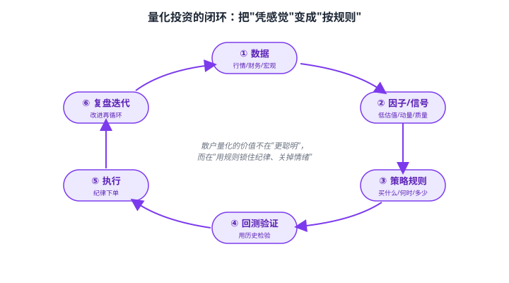
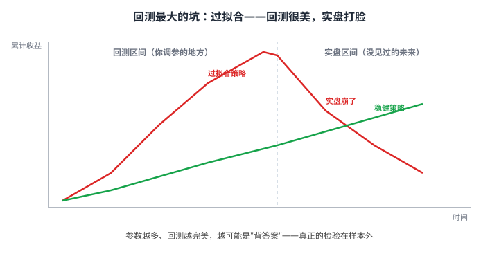

# 44 量化投资入门与数据获取

> **这一章要让你搞懂的事**
> 1. **量化是什么**：用数据和规则做决策，而不是凭感觉
> 2. **散户量化的真正价值**：不是更聪明，而是**用规则锁住纪律、关掉情绪**
> 3. **量化六步闭环**：数据 → 因子 → 策略 → 回测 → 执行 → 复盘
> 4. **常用因子**：低估值、动量、质量、低波动——它们为什么"有效"
> 5. **回测的陷阱**：过拟合、未来函数、幸存者偏差——回测很美、实盘打脸
> 6. **动手**：用 AkShare 免费拿到真实数据，跑一个最简单的策略
>
> **入门门槛**
> - 第 06 章：资产配置；第 24 章：基金筛选
> - 第 34 章：CAPM 与因子模型（强烈建议先读）
> - 第 39 章：Excel 与 Python 模板；第 41 章：数据源
>
> **声明**：本教程不构成投资建议；所有代码、参数、策略均为教学示例，**不可直接用于实盘**。

---

## 📖 本章英文缩写速查

> 看到不认识的英文缩写，先回这张表查；完整术语见 [GLOSSARY.md](../GLOSSARY.md)。

| 缩写 | 英文全称 | 中文含义 |
|---|---|---|
| **CAPM** | Capital Asset Pricing Model | 资本资产定价模型 |
| **ROE** | Return on Equity | 净资产收益率，衡量股东回报 |
| **PE** | Price-to-Earnings ratio | 市盈率：股价 ÷ 每股收益 |
| **PB** | Price-to-Book ratio | 市净率：股价 ÷ 每股净资产 |

---

## 0. 先讲个故事

**两个工程师都想"用程序炒股"。**

- **小陈**：花三个月写了个复杂模型，30 多个参数，在 2015–2020 的历史数据上**回测年化 80%**。激动地上实盘，**半年亏 40%**。
- **老吴**：只写了 20 行代码做一件事——"**沪深 300 估值百分位 < 30% 就定投加码，> 80% 就减仓，其余不动**"。五年下来**稳稳跑赢自己手动操作的成绩**。

**差别在哪？**
- 小陈做的是"**在历史里背答案**"（过拟合）——参数越多越像神，实盘越像鬼。
- 老吴做的是"**用规则锁住纪律**"——策略简单到不可能过拟合，价值在于**它替他扛住了情绪**。

> **散户量化的真相**：99% 的价值不在"算法多牛"，而在"**让规则替你做决定，把贪婪和恐惧关在门外**"。这一章就按这个定位讲。

---

## 1. 量化投资是什么

### 1.1 一句话

**量化投资 = 把投资决策写成明确的、可重复的规则，用数据驱动执行。**

和"凭感觉"的对比：

| 维度 | 凭感觉 | 量化 |
|---|---|---|
| 决策依据 | 直觉、消息、情绪 | 数据 + 明确规则 |
| 可重复 | 否（今天和明天不一样）| 是（规则固定）|
| 可检验 | 否 | 是（能回测）|
| 抗情绪 | 弱（追涨杀跌）| 强（规则不慌）|

### 1.2 散户量化 ≠ 高频交易

| 类型 | 谁在做 | 散户能碰吗 |
|---|---|---|
| **高频交易** | 机构，拼算力 + 速度（微秒级）| ❌ 完全不可能 |
| **机构多因子** | 私募/公募量化团队 | ❌ 拼不过 |
| **散户规则化投资** | 你 | ✅ **这才是本章的重点** |

> 📌 **认清定位**：你不是要去和机构拼速度，而是用**简单规则**解决自己最大的敌人——**情绪**（第 35 章）。

---

## 2. 量化六步闭环



| 步 | 做什么 | 散户怎么落地 |
|---|---|---|
| **① 数据** | 拿到行情/财务/宏观数据 | AkShare（免费，见第 6 节）|
| **② 因子/信号** | 找"和未来收益相关"的指标 | 估值百分位、动量、ROE |
| **③ 策略规则** | 定义买什么、何时、买多少 | "估值低分位→加码" |
| **④ 回测验证** | 用历史检验规则 | Excel 或 Python |
| **⑤ 执行** | 按规则纪律下单 | 定投扣款 / 手动按表 |
| **⑥ 复盘迭代** | 检查偏差，改进规则 | 季度复盘（第 42 章）|

**核心**：这是个**闭环**——执行完要复盘，复盘后改规则，再循环。

---

## 3. 常用因子：收益从哪来

"因子"就是**一类能解释/预测收益的共同特征**（第 34 章打过底）。最经得起检验的几个：

| 因子 | 直觉 | 怎么衡量 |
|---|---|---|
| **价值（低估值）** | 便宜的东西长期回报高 | PE、PB、股息率、估值百分位 |
| **动量** | 近期强的短期内倾向于继续强 | 过去 3–12 个月涨幅 |
| **质量** | 好公司长期跑赢 | 高 ROE、低负债、稳定现金流 |
| **低波动** | 波动小的反而长期不输 | 历史波动率/最大回撤 |
| **规模** | 小盘长期略有溢价（波动大）| 市值 |

### 3.1 因子不是"永远有效"

> ⚠️ **关键警告**：因子会**轮动、会失效、会拥挤**。
> - 某因子被太多人用 → 拥挤 → 超额收益消失。
> - 价值因子曾连续多年跑输成长。
> - **没有"圣杯因子"**——分散用几个因子，比押注一个稳健。

### 3.2 散户最实用的一个因子：估值百分位

对指数基金投资者，**最简单有效**的量化信号就是**宽基指数的估值百分位**：

- 当前 PE/PB 在历史 **< 30% 分位** → 相对便宜，倾向加码
- 在 **> 80% 分位** → 相对贵，倾向减仓 / 暂停
- 中间 → 正常定投

这就是老吴的策略，简单到不会过拟合，却抓住了"低买高卖"的核心。

---

## 4. 回测：用历史检验规则

### 4.1 回测是什么

**回测 = 把你的规则套用到历史数据上，看"如果当年这么做，结果会怎样"。**

关键产出指标（很多在第 04 章学过）：

| 指标 | 含义 | 看什么 |
|---|---|---|
| **年化收益** | 平均每年赚多少 | 越高越好（但别只看它）|
| **最大回撤** | 最惨时亏多少 | 越小越好——**比收益更重要** |
| **夏普比率** | 每单位风险换多少收益 | > 1 还行，> 2 优秀 |
| **卡玛比率** | 年化收益 / 最大回撤 | 衡量"赚得稳不稳" |

### 4.2 回测最大的坑：过拟合



**过拟合 = 你的规则只是"背下了历史的答案",换个时间段就失灵。**

- 参数越多、回测曲线越完美 → 越可疑。
- 真正的检验是**样本外**（out-of-sample）：用一段你**没拿来调参**的数据验证。

### 4.3 回测的三大陷阱

| 陷阱 | 是什么 | 后果 |
|---|---|---|
| **过拟合** | 参数太多，背历史答案 | 实盘崩 |
| **未来函数** | 不小心用了"当时还不知道"的数据 | 回测虚高 |
| **幸存者偏差** | 只用"活到今天"的股票回测 | 高估收益（退市的没算）|

> 💡 **散户避坑铁律**：**规则越简单越好**。能用 3 个参数说清的策略，别用 30 个。简单 = 抗过拟合 = 实盘更可信。

---

## 5. 一个最简单的规则化策略（教学示例）

**策略：估值定投 + 网格再平衡**（不构成投资建议）

```
每月发工资日：
  查沪深300当前PE历史百分位 p
  若 p < 30%：本月定投金额 × 1.5（加码）
  若 p > 80%：本月暂停定投，并赎回5%权益仓位（减仓）
  否则：正常定投
每年末：再平衡回目标股债比（见第6/24章）
```

**为什么这个策略"配得上"散户：**
- 只有 1 个核心信号（估值百分位）→ 不会过拟合
- 把"低买高卖"写成规则 → 关掉情绪
- 不需要盯盘、不需要预测 → 可持续

> ⚠️ 这是**教学框架**，不是给你抄的实盘策略。真实使用前必须自己回测、理解每一条规则的风险。

---

## 6. 动手：用 AkShare 拿到真实数据

**AkShare 免费、开源**，是散户量化最友好的入口（第 41 章提过）。

### 6.1 安装

```bash
pip install akshare pandas
```

### 6.2 拿一段沪深 300 历史行情

```python
import akshare as ak
import pandas as pd

# 沪深 300 指数日线
hs300 = ak.stock_zh_index_daily(symbol="sh000300")
hs300 = hs300.tail(250)          # 近一年
print(hs300[["date", "close"]].head())
```

### 6.3 算一个最简单的信号：20 日 / 60 日均线

```python
hs300["ma20"] = hs300["close"].rolling(20).mean()
hs300["ma60"] = hs300["close"].rolling(60).mean()

# 金叉/死叉信号（仅教学，胜率有限，见第 20 章）
hs300["signal"] = (hs300["ma20"] > hs300["ma60"]).astype(int)
print(hs300[["date", "close", "ma20", "ma60", "signal"]].tail())
```

### 6.4 拿基金净值 / 估值数据

```python
# 某指数基金净值走势
nav = ak.fund_open_fund_info_em(fund="510300", indicator="单位净值走势")

# 指数估值（市盈率历史）——用于"估值百分位"策略
pe = ak.index_value_hist_funddb(symbol="沪深300", indicator="市盈率")
```

### 6.5 自动化思路（呼应第 41 章）

| 任务 | 实现 |
|---|---|
| 每月算估值百分位 | AkShare + cron / 任务计划 |
| 触发加减仓提醒 | 算百分位 → 邮件/微信提醒自己 |
| 月度组合报表 | Jupyter Notebook 自动生成 |

> **自动化的意义不是省时间，是"避免情绪在关键时刻干预决策"。**

---

## 7. 进阶：散户量化的边界

**入门读者可以跳过本节。**

### 7.1 你不该期待的事

- ❌ 靠量化"稳定暴利"——能稳定暴利的早被机构套利没了
- ❌ 靠复杂模型战胜机构——你没有它们的数据、算力、团队
- ❌ 找到"永远有效的因子"——因子会拥挤、会失效

### 7.2 你可以合理期待的事

- ✅ 用规则**消除情绪化操作**（这本身就能提升 1–3% 年化）
- ✅ 用估值信号**做更好的择时辅助**（不是预测，是纪律）
- ✅ 用自动化**坚持长期计划**（最难的是"拿得住")

### 7.3 工具阶梯

| 阶段 | 工具 |
|---|---|
| 入门 | Excel + 手动记录 |
| 进阶 | Python + AkShare（免费）|
| 数据更全 | Tushare Pro（部分付费）|
| 想做系统回测 | backtrader / vectorbt 等开源框架 |
| 机构级 | Choice / Wind（贵，散户基本不必）|

### 7.4 一个诚实的提醒

**市面上卖"量化课程""量化指标"的，绝大多数在收割。** 真有稳定盈利策略的人，会闭嘴自己赚，不会卖给你。**量化的门槛不是代码，是对"过拟合"和"幸存者偏差"的敬畏。**

---

## 8. 小结

1. **量化 = 把决策写成规则，用数据驱动**——可重复、可检验、抗情绪。
2. **散户量化的价值不是更聪明，而是用规则锁住纪律**——别去和机构拼速度。
3. **六步闭环**：数据 → 因子 → 策略 → 回测 → 执行 → 复盘，且要**循环迭代**。
4. **常用因子**：价值、动量、质量、低波动——但**没有圣杯，会失效会拥挤**。
5. **回测三大坑**：过拟合、未来函数、幸存者偏差——**规则越简单越抗坑**。
6. **AkShare 免费上手**：几行代码就能拿到真实行情、净值、估值数据。
7. **散户最实用的一个信号**：宽基估值百分位——简单到不会过拟合，却抓住了低买高卖。

> 🔗 **承上启下**：量化给了你"规则化纪律"。下一章 **45 养基宝：基金实战养成手册**，把前面所有零件（资产配置、指数基金、定投、估值信号、再平衡）拼成一套**普通人可以照着做的基金实战体系**。

---

## 自测题

> 答案在文末折叠区。

1. 用一句话说清"散户量化的真正价值"。它和高频交易有什么本质区别？
2. 量化六步闭环是哪六步？为什么说它是"闭环"而不是"流水线"？
3. 列出三个常用因子，并各用一句话说它的直觉。为什么"没有圣杯因子"？
4. 什么是过拟合？为什么"参数越多、回测越完美"反而越危险？
5. 回测里，最大回撤为什么常常比年化收益更重要？
6. **进阶题**：朋友给你一个回测"年化 60%、20 个参数"的策略要你跟。你应该问哪些问题、做哪些验证？
7. **作业题**：装好 AkShare，拿到沪深 300 近一年日线，算出 20 日和 60 日均线，找出最近一次"金叉"或"死叉"出现在哪一天。（提示：用第 6 节代码）

<details>
<summary>📖 参考答案</summary>

1. **散户量化的价值是"用规则锁住纪律、关掉情绪",不是更聪明。** 和高频交易的本质区别：高频拼算力和速度（微秒级，机构专属），散户量化拼的是**规则化的长期纪律**——完全不在一个赛道。
2. **数据 → 因子/信号 → 策略规则 → 回测 → 执行 → 复盘迭代**。是"闭环"因为**复盘后要改进规则、重新循环**，不是一次走完就结束。
3. 举例：**价值**（便宜的长期回报高）、**动量**（近期强的短期倾向继续强）、**质量**（好公司长期跑赢）。没有圣杯因子是因为因子会**轮动、失效、拥挤**——用的人多了超额收益就消失。
4. 过拟合 = 规则只是"背下了历史答案",换时间段就失灵。参数越多越危险，因为**自由度越高越容易把历史的噪音也当成规律拟合进去**——回测完美但实盘崩。
5. 因为**最大回撤决定你能不能拿住**。年化再高，如果中途回撤 60%，多数人会在底部割肉离场，根本拿不到那个收益。回撤还关系到杠杆/流动性风险。
6. 该问：① 样本外测过吗（用没调参的时间段）？② 20 个参数是否过拟合？能不能砍到 3 个？③ 算过最大回撤和夏普吗？④ 数据有没有未来函数 / 幸存者偏差？⑤ 交易成本算进去了吗？**结论通常是：不要跟。**
7. 没有标准答案——重点是**真的把代码跑通、拿到真实数据**。能定位出金叉/死叉日期即可。顺带体会：金叉死叉胜率有限（第 20 章），这只是练手。

</details>

---

## 延伸阅读

- 《主动投资组合管理》(*Active Portfolio Management*) —— Grinold & Kahn：因子与信息比率（偏专业）
- 《打开量化投资的黑箱》(*Inside the Black Box*) —— Rishi Narang：量化全景，通俗
- 《Advances in Financial Machine Learning》—— Marcos López de Prado：过拟合与回测陷阱（进阶）
- AkShare 文档：[akshare.akfamily.xyz](https://akshare.akfamily.xyz/)
- 第 34 章《CAPM 与因子模型》、第 35 章《行为金融学》——本章的理论与心理学基础

---

## 下一章预告

**45 养基宝：基金实战养成手册** —— 把前面所有零件拼成可执行的体系：
- 基金组合金字塔：核心打底、卫星增强
- 四步养成法：选基 → 建仓 → 定投/止盈 → 再平衡
- 定投微笑曲线：跌的时候多买份额的数学
- 止盈的三种方法：目标止盈、估值止盈、回撤止盈
- 一份"懒人养基"年度作息表
