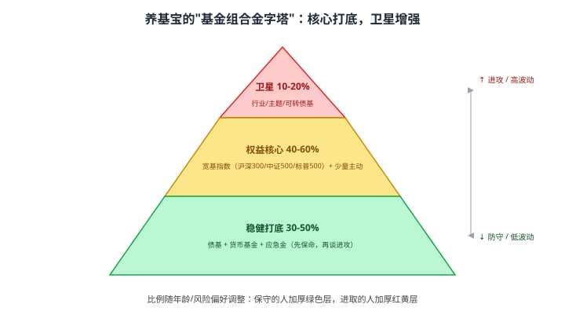
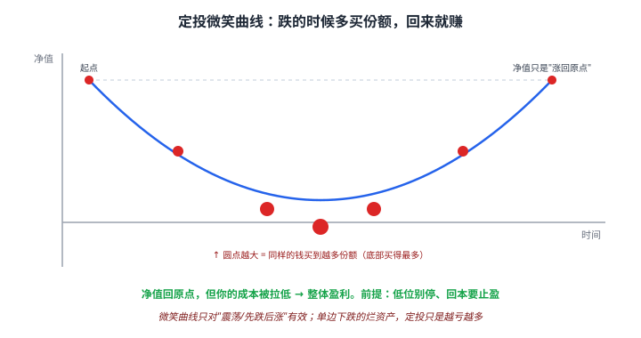
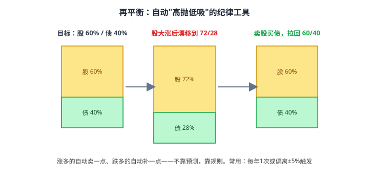

# 45 养基宝：基金实战养成手册

> **"养基"是"养鸡"的谐音**——基金不是"买了就涨"的彩票，而是像养一群下蛋的鸡：**选好品种、按节奏喂养、定期照料、该收蛋时收蛋**。这一章就是这套"养成手册"。

> **这一章要让你搞懂的事**
> 1. **基金组合金字塔**：核心打底、卫星增强——先搭骨架再填肉
> 2. **四步养成法**：选基 → 建仓 → 定投/止盈 → 再平衡
> 3. **定投微笑曲线**：为什么"跌着跌着反而赚了"——以及它的前提
> 4. **止盈三法**：目标止盈 / 估值止盈 / 回撤止盈——买容易卖难
> 5. **再平衡**：自动"高抛低吸"的纪律工具
> 6. **一份"懒人养基"年度作息表**：每天/每月/每年各做什么
>
> **入门门槛（本章是"集大成",务必先读这些）**
> - 第 06 章：资产配置；第 21 章：指数基金；第 22 章：ETF/LOF
> - 第 23 章：主动型基金；第 24 章：基金筛选与持有
> - 第 38 章：XIRR；第 44 章：估值信号
>
> **声明**：本教程不构成投资建议；所有比例、代码、产品均为教学示例。

---

## 📖 本章英文缩写速查

> 看到不认识的英文缩写，先回这张表查；完整术语见 [GLOSSARY.md](../GLOSSARY.md)。

| 缩写 | 英文全称 | 中文含义 |
|---|---|---|
| **XIRR** | Extended Internal Rate of Return | 不规则现金流的内部收益率（真实年化收益） |
| **ETF** | Exchange-Traded Fund | 交易所交易基金 |
| **LOF** | Listed Open-Ended Fund | 上市型开放式基金 |
| **QDII** | Qualified Domestic Institutional Investor | 合格境内机构投资者，借道投资海外的渠道 |

---

## 0. 先讲个故事

**小美 2021 年初"养基"，三种养法：**

- **追星式**：哪只基金涨得猛买哪只，明星基金经理一窝蜂上。结果买在高点，**两年亏 35%**，割肉离场。
- **撒手式**：随便买了 8 只听都没听过的基金，从不打理。两年后打开一看，**一堆重复持仓 + 一只清盘**，整体小亏。
- **养成式（老周教的）**：先用**金字塔**搭好股债结构，核心买宽基指数定投，卫星配一点行业，**估值低就多投、目标到了就止盈、每年再平衡一次**。两年下来**正收益,而且睡得着**。

**差别不在"选到哪只神基",而在有没有一套"养成体系"。**

> 这一章把全书学过的零件——资产配置、指数基金、定投、估值信号、再平衡——拼成一套**普通人照着就能做**的基金实战手册。

---

## 1. 先搭骨架：基金组合金字塔

**别一上来就挑基金，先决定"结构"。** 一个健康的基金组合像金字塔：

| 层 | 占比（示例）| 放什么 | 作用 |
|---|---|---|---|
| **稳健打底** | 30–50% | 债基 + 货币基金 + 应急金 | 先保命，降低波动 |
| **权益核心** | 40–60% | 宽基指数（沪深300/中证500/标普500）+ 少量主动 | 长期收益主引擎 |
| **卫星增强** | 10–20% | 行业/主题基、可转债基 | 博超额，亏了也不伤筋动骨 |

**比例怎么定**（呼应第 05、06 章）：
- 简单法则：**权益比例 ≈ (100 − 年龄)%**，再按风险偏好微调。
- 保守的人加厚绿色层，进取的人加厚红黄层。

> 📌 **核心原则**：**先有结构，再选产品**。结构决定 90% 的结果，选哪只"明星基"只决定剩下 10%。

---

## 2. 第一步：选基——好基金的筛子

详细方法在第 23、24 章，这里给一张**实战速查**：

| 维度 | 看什么 | 红线 |
|---|---|---|
| **类型匹配** | 是否符合金字塔的那一层 | 别用行业基当核心 |
| **指数 vs 主动** | 核心优先指数（费率低、不赌人）| 主动看长期 + 经理稳定 |
| **费率** | 管理费 + 托管费 + 申赎费 | 指数基金优选低费率 |
| **规模** | 太小有清盘风险，太大有"规模魔咒"| < 2 亿警惕，主动基别太巨 |
| **历史** | 至少穿越一轮牛熊（≥ 3–5 年）| 别追"成立一年涨 100%"|
| **跟踪误差**（指数）| 越小越好 | 偏离指数太多别要 |

### 2.1 避坑清单

- ❌ **追排行榜冠军**：冠军基金次年大概率均值回归（第 23 章）。
- ❌ **买一堆重复持仓**：3 只"沪深 300"= 1 只，没分散到。
- ❌ **被"日历效应/明星"营销带节奏**。
- ✅ **核心用 2–4 只宽基指数就够**，卫星再加 1–3 只。

---

## 3. 第二步：建仓——一次性 vs 定投

| 方式 | 适合 | 要点 |
|---|---|---|
| **一次性买入** | 有一笔闲钱 + 估值不贵时 | 长期看期望收益略高，但考验心态 |
| **定投（分批）** | 工资流入 / 怕买在高点 | 平滑成本、抗情绪——**新手首选** |
| **估值建仓** | 想兼顾两者 | 估值低多投、估值高少投（第 44 章）|

> 💡 第 24 章已论证：长期看一次性的期望收益略高于定投，**但定投的真正价值是"让你拿得住、敢开始"**。对绝大多数人，**能坚持的定投 > 拿不住的一次性**。

---

## 4. 第三步（上）：定投——微笑曲线的数学

### 4.1 为什么"跌着跌着反而赚了"

定投的魔力在于**固定金额 → 跌时自动买到更多份额**：

| 月 | 净值 | 投入 | 买到份额 |
|---|---|---|---|
| 1 | 1.00 | 1000 | 1000 |
| 2 | 0.80 | 1000 | 1250 |
| 3 | 0.50 | 1000 | 2000 |
| 4 | 0.80 | 1000 | 1250 |
| 5 | 1.00 | 1000 | 1000 |

- 净值最后只是**涨回 1.00（原点）**，
- 但平均成本被拉到约 **0.79**，5000 元变约 6300 元——**赚了 ~26%**。

**这就是"微笑曲线":先跌后涨，底部买得最多。**

### 4.2 定投的两个铁律

| 铁律 | 原因 |
|---|---|
| **低位绝不停投** | 越跌越是在"打折囤份额"——停投=放弃微笑左半边 |
| **回本就要想止盈** | 微笑曲线赚的是"过程",不止盈 = 坐过山车回原地 |

### 4.3 定投的适用边界

> ⚠️ **微笑曲线只对"震荡 / 先跌后涨"的资产有效。**
> - 对**单边下跌的烂资产**（基本面崩了的行业/个股），定投只是"越亏越多"= 微笑变**苦笑**。
> - 所以定投标的要选**长期向上的宽基指数**，别定投会归零的东西。

---

## 5. 第三步（下）：止盈——买容易卖难

**"会买的是徒弟，会卖的是师傅。"** 多数人栽在不会卖。给三种可执行的止盈法：

| 方法 | 规则 | 适合 |
|---|---|---|
| **目标止盈** | 收益到 X%（如 +30%）就分批卖 | 简单、纪律强 |
| **估值止盈** | 估值百分位 > 80% 分批卖 | 跟着便宜/贵走（第 44 章）|
| **回撤止盈** | 从最高点回撤 X%（如 −10%）就卖 | 让利润奔跑、保住大头 |

### 5.1 实战建议

- **分批止盈**，别一把清——卖 1/3、1/2，留一点搏延续。
- 止盈后**回到金字塔结构**：卖出的钱补到稳健层或等待再投。
- **止盈是针对卫星和阶段性收益**；核心宽基长期持有可以"只再平衡、不轻易清仓"。

> 📌 **止盈不是预测顶部**，是**执行纪律**。能在 +30% 落袋，好过等 +50% 又跌回 +5% 还不甘心。

---

## 6. 第四步：再平衡——自动的高抛低吸

**再平衡 = 定期把组合拉回目标比例**（第 06 章核心工具）。

- 目标股债 60/40，股票大涨后漂移到 72/28 → **卖股买债，拉回 60/40**。
- 效果：**自动"高抛低吸"**——涨多的卖一点、跌多的补一点，**不靠预测,靠规则**。

| 触发方式 | 规则 | 特点 |
|---|---|---|
| **定期** | 每年/每半年固定时点 | 简单、省心 |
| **阈值** | 偏离目标 ±5% 就动 | 更精准，需监控 |
| **混合** | 定期检查 + 超阈值才动 | 实战常用 |

> 💡 再平衡每年做 1 次通常就够。**做太勤 = 交易成本侵蚀；从不做 = 风险悄悄飙升**（牛市末期股票占比越来越高，正好在最危险时风险最大）。

---

## 7. 一份"懒人养基"年度作息表

把上面四步落成一张**可以贴在墙上**的作息表：

| 频率 | 动作 | 时长 |
|---|---|---|
| **每天** | **什么都不做**（别看盘）| 0 分钟 |
| **每月发薪日** | 按计划定投；估值低可加码（第 44 章）| 5 分钟 |
| **每季度** | 看一眼持仓基金季报（第 40 章）；记录复盘 | 30 分钟 |
| **每半年** | 检查是否触发估值止盈 | 20 分钟 |
| **每年末** | 再平衡回目标比例；用 XIRR 算真实收益（第 38 章）；规划次年 | 半天 |

> 🌱 **"养基"的最高境界是无聊**：好的基金组合应该让你**几乎没事可做**。频繁操作的人，往往是在用"勤奋"喂养自己的焦虑，而不是喂养收益。

---

## 8. 进阶：几个常见纠结

**入门读者可以跳过本节。**

### 8.1 该持有几只基金？

**核心 2–4 只 + 卫星 1–3 只，总共别超过 8 只。** 超过 10 只基金，大概率**互相重复**，等于一只"全市场指数",还多付了管理费。

### 8.2 基金亏了要不要补仓？

先问**为什么亏**：
- 是**整体市场下跌**（指数基金）→ 可按估值规则补，微笑曲线左半边。
- 是**这只基本身出了问题**（经理换人、风格漂移、规模异常）→ **该止损,不是补仓**。
- **别用"摊薄成本"安慰自己去补一只烂基。**

### 8.3 网格交易适合养基吗？

网格（在区间内"跌一格买、涨一格卖"）适合**宽幅震荡**的标的，本质是再平衡的高频版。**对新手：先掌握定投+再平衡，网格属于第 46 章的"其他方式",别一上来就玩。**

### 8.4 "养基"和直接养"投顾组合"

懒得自己搭金字塔的人，可以用**基金投顾/组合工具**（第 41 章提到的且慢、蛋卷等）。**好处**：省心、自动再平衡。**代价**：多一层费用 + 仍要自己懂原理，否则照样拿不住。

---

## 9. 小结

1. **先搭骨架再选基**：金字塔——稳健打底 / 权益核心 / 卫星增强，结构决定 90% 结果。
2. **选基速查**：类型匹配、低费率、规模适中、穿越牛熊；**别追排行榜冠军、别买重复持仓**。
3. **建仓**：新手首选定投；想兼顾就估值建仓。**能坚持的定投 > 拿不住的一次性**。
4. **定投微笑曲线**：跌时多买份额，回原点也能赚——但**只对长期向上的标的有效**，低位别停。
5. **止盈三法**：目标 / 估值 / 回撤止盈——**分批卖**，止盈是纪律不是预测顶部。
6. **再平衡**：每年 1 次，自动高抛低吸；太勤伤于成本，从不做风险悄悄飙升。
7. **懒人作息表**：每天什么都不做，每月定投，每年再平衡——**养基的最高境界是无聊**。

> 🔗 **承上启下**：金字塔 + 定投 + 止盈 + 再平衡，已经是 90% 普通人最该用的体系。最后一章 **46 其他投资方式与渠道速览**，把打新、网格、跟投、智能投顾、套利等"其他玩法"放进一张风险地图——告诉你哪些可以浅尝、哪些最好别碰。

---

## 自测题

> 答案在文末折叠区。

1. 基金组合金字塔分哪三层？各放什么、各起什么作用？为什么说"先有结构再选产品"？
2. 一只基金第 1 月净值 1.00、第 3 月跌到 0.50、第 5 月回到 1.00，每月定投 1000 元。净值"涨回原点",你赚了还是亏了？为什么？
3. 定投的两个铁律是什么？微笑曲线在什么情况下会变成"苦笑曲线"？
4. 说出三种止盈方法。为什么强调"分批止盈"而不是"一把清仓"？
5. 再平衡为什么是"自动高抛低吸"？做太勤和从不做各有什么问题？
6. **进阶题**：你的一只行业卫星基亏了 25%。你打算补仓"摊薄成本"。在补之前必须先回答什么问题？什么情况下应该止损而不是补仓？
7. **作业题**：照着"金字塔"给自己设计一个基金组合：① 写出三层各占多少%（结合你的年龄/风险偏好）② 每层各放 1–2 只什么类型的基金 ③ 定下你的定投金额、止盈规则、再平衡频率。做成一张可以贴墙上的表。

📖 参考答案

1. **稳健打底**（债基+货基+应急金，30–50%，降波动保命）、**权益核心**（宽基指数+少量主动，40–60%，长期收益引擎）、**卫星增强**（行业/主题/可转债基，10–20%，博超额）。"先有结构"是因为**资产配置结构决定约 90% 的长期结果**，选哪只具体基金只决定剩下 10%。
2. **赚了（约 +26%）**。虽然净值涨回原点，但你在 0.50 时用同样的钱买到了 2 倍份额，**平均成本被拉低到约 0.79**，净值 1.00 > 成本 0.79 → 盈利。这就是微笑曲线。
3. 两个铁律：**① 低位绝不停投**（越跌越是打折囤份额）；**② 回本就要想止盈**（不止盈=坐过山车回原地）。当标的是**单边下跌的烂资产**（基本面崩了）时，微笑变苦笑——定投只是越亏越多。
4. **目标止盈**（到 +X% 卖）、**估值止盈**（估值百分位 > 80% 卖）、**回撤止盈**（从高点回撤 X% 卖）。强调分批是因为**没人能精准卖在顶部**——分批卖既能落袋，又留一点搏延续，避免"全卖飞了"或"等顶部又跌回来"。
5. 因为再平衡是把**涨多的（占比超标的）卖掉一点、跌多的（占比不足的）补一点**，机械地实现了低买高卖。做太勤 → **交易成本侵蚀收益**；从不做 → 牛市里股票占比越来越高，**在最危险的时候承担最大风险**。
6. 先回答**"为什么亏"**：如果是整体市场下跌（宽基指数），可按估值规则补（微笑左半边）；如果是**这只基本身出问题**（换经理、风格漂移、规模异常、跑输同类很多），应该**止损而不是补仓**——别用"摊薄成本"为一只烂基找借口。
7. 没有标准答案。检查点：✓ 三层比例合理且与年龄/风险偏好匹配 ✓ 核心用宽基指数、卫星不超配 ✓ 明确写出定投金额 + 止盈规则 + 再平衡频率（可执行、可贴墙）。

---

## 延伸阅读

- 《指数基金投资指南》—— 银行螺丝钉：估值定投的实战经典
- 《漫步华尔街》(*A Random Walk Down Wall Street*) —— Malkiel：指数 + 长期持有的理论根基
- 《共同基金常识》(*Common Sense on Mutual Funds*) —— John Bogle：低成本指数基金之父
- 《有效资产管理》(*The Intelligent Asset Allocator*) —— William Bernstein：再平衡的力量
- 第 24 章《基金筛选与持有》、第 06 章《资产配置基础》——本章的两大支柱

---

## 下一章预告

**46 其他投资方式与渠道速览** —— 全书实战收官：
- 一张"玩法风险地图":门槛、风险、收益的取舍
- 打新股 / 可转债打新：低风险"薅羊毛"的流程与边界
- 网格交易、跟投/抄作业、智能投顾：能用吗、坑在哪
- QDII、套利等其他渠道速览
- 终极原则：90% 的人只需要前 45 章，剩下的"其他方式"——知道就好
