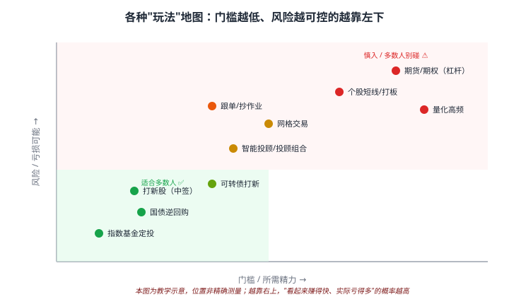
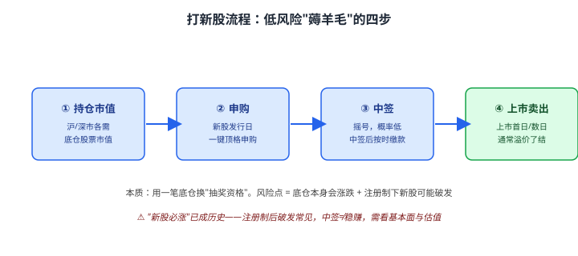

# 46 其他投资方式与渠道速览

> **这一章要让你搞懂的事**
> 1. **一张"玩法风险地图"**：门槛、风险、收益怎么取舍
> 2. **低风险"薅羊毛"**：打新股、可转债打新、国债逆回购的流程与边界
> 3. **半自动玩法**：网格交易、智能投顾/基金投顾——能用吗、坑在哪
> 4. **高风险慎入**：跟投/抄作业、个股短线、杠杆——为什么多数人别碰
> 5. **跨境与套利**：QDII、折溢价套利——知道是什么就好
> 6. **终极原则**：90% 的人只需要前 45 章，"其他方式"知道即可
>
> **入门门槛**
> - 第 10 章：国债逆回购；第 14 章：可转债；第 17 章：股票市场结构
> - 第 22 章：ETF/LOF（套利）；第 27 章：散户与衍生品；第 30 章：外汇/QDII
> - 第 45 章：养基宝（先把主线打法学会）
>
> **声明**：本教程不构成投资建议；所有玩法、流程均为教学示例，**很多玩法多数人并不适合**。

---

## 0. 先讲个故事

**老周的徒弟学完前 45 章，问："还有没有别的赚钱方式？"**

老周笑了："**多得很——但你要先想清楚一件事：你是来'投资'的，还是来'找刺激'的？**"

他画了一张图："这些'其他方式'，绝大多数有一个共同点——**看起来赚得快，实际亏得多**。真正适合普通人的，就是你已经学会的那套：**指数 + 定投 + 再平衡**。剩下的，**知道是什么、知道为什么不碰，就够了**。"

> 这一章不是教你"多学几招去搏杀",而是给你一张**地图**——让你看清每种玩法在"门槛—风险—收益"上的位置，**有能力判断"该不该碰"，而不是被营销忽悠进去**。

---

## 1. 先看全景：玩法风险地图

**横轴 = 门槛/精力，纵轴 = 风险/亏损可能。** 越靠左下越适合普通人，越靠右上越该慎入。

| 区域 | 玩法 | 谁适合 |
|---|---|---|
| **左下（绿，适合多数人）** | 指数定投、国债逆回购、打新股 | ✅ 几乎所有人 |
| **中部（黄，可浅尝）** | 可转债打新、智能投顾、网格 | ⚠️ 懂规则后小仓位 |
| **右上（红，慎入）** | 个股短线/打板、期货期权、量化高频、跟单 | ❌ 多数人别碰 |

> 📌 **看图记一句**：**"赚得快"的代价通常是"亏得也快"**。本章按"绿 → 黄 → 红"顺序讲。

---

## 2. 绿区：低风险"薅羊毛"

### 2.1 国债逆回购（已学，第 10 章）

把钱借给市场、拿固定利息，**几乎零风险**。**节假日前利率常飙高**，是现金管理的好工具。详见第 10 章。

### 2.2 打新股

**本质**：用一笔**底仓股票市值**换"抽奖资格"，中签后新股上市通常溢价卖出。

| 步骤 | 要点 |
|---|---|
| ① 持仓市值 | 沪/深市需各自有底仓市值才有额度 |
| ② 申购 | 发行日"一键顶格申购",不占用额外资金 |
| ③ 中签 | 摇号，概率低；中签后**务必按时缴款** |
| ④ 上市卖出 | 首日/数日溢价了结 |

> ⚠️ **"新股必涨"已成历史**：注册制后**破发常见**，中签≠稳赚。而且底仓本身会涨跌——**羊毛可能被底仓亏损抵消**。

### 2.3 可转债打新（黄绿之间）

可转债打新**不需要底仓、顶格申购**，中签缴款约千元，门槛极低（第 14 章）。曾经"稳赚",**现在也会破发**——要看**转股价值和溢价率**再决定上市是否卖出。

---

## 3. 黄区：半自动玩法（懂了再小仓位）

### 3.1 网格交易

**规则**：在一个价格区间里，**跌一格买一份、涨一格卖一份**，赚震荡的钱。

| 适合 | 不适合 |
|---|---|
| 宽幅**震荡**的标的（宽基 ETF）| **单边趋势**——单边上涨踏空、单边下跌套牢加无限 |

**本质**是高频版的再平衡。**新手别先玩网格**，先掌握第 45 章的定投 + 再平衡。

### 3.2 智能投顾 / 基金投顾

**机器人/持牌机构按你的风险偏好自动配置 + 再平衡**（第 41 章提过且慢、蛋卷等）。

| 好处 | 代价 |
|---|---|
| 省心、自动再平衡、强制纪律 | 多一层费用；仍需懂原理，否则照样拿不住 |

适合**懒得自己搭金字塔**但愿意付一点钱买省心的人。

---

## 4. 红区：高风险，多数人别碰

### 4.1 跟投 / 抄作业

跟着大V、"晒单博主"、明星基金经理买。

> ⚠️ **三大致命问题**：
> 1. **时机不同步**：他建仓你不知道，等你看到帖子他可能要卖了。
> 2. **风险不匹配**：他能承受 -50%，你不能。
> 3. **幸存者偏差 + 利益**：晒单的都是赢家/收推广费的，亏的不发帖（第 43 章）。

### 4.2 个股短线 / 打板

追涨停、做 T、博消息。**第 20 章已用数据说明：约 70% 活跃散户长期亏损或仅小赚**。**机构用算法在你前面割走信号,你在捡碎屑。**

### 4.3 杠杆与衍生品

期货、期权、融资融券——**杠杆放大的是波动，不是胜率**（第 25–27 章）。**爆仓是单向门**：一次极端行情就能让你归零。**99% 的场景不该碰。**

---

## 5. 跨境与套利：知道就好

### 5.1 QDII（投资海外，第 30 章）

普通人配置美股/海外资产的**合规渠道**，无需 5 万美元购汇额度。注意**额度限购、申赎慢、汇率波动**。可作为金字塔里**分散区域风险**的一块。

### 5.2 折溢价套利（第 22 章）

LOF/ETF、封闭式基金有时**市价 ≠ 净值**，理论上可套利。但**散户难抢、成本高、风险不小**——**了解原理即可,别当主业**。

### 5.3 可转债的"下有保底"（第 14 章）

可转债"债底 + 看涨期权"的非对称结构本身是好工具，但**强赎、溢价率陷阱**很多——属于**进阶**，不是入门玩法。

---

## 6. 终极原则：克制比技巧更值钱

### 6.1 三条压舱石原则

| 原则 | 含义 |
|---|---|
| **能力圈** | 不懂的不碰——"看不懂为什么赚钱"就是看不懂为什么会亏钱 |
| **仓位纪律** | 任何"红区"玩法，总仓位 ≤ 5–10%，亏光也不伤主线 |
| **别用杠杆赌单一结果** | 杠杆 + 集中 = 归零的最短路径 |

### 6.2 一句话收束全书实战

> **90% 的普通人，做好前 45 章的"指数 + 定投 + 资产配置 + 再平衡"就够了。**
> 这一章的"其他方式"——**知道它们是什么、知道自己为什么不碰，本身就是一种能力。**

**真正的高手不是会的招式最多，而是知道哪些招式不该用。**

---

## 7. 进阶：怎么判断一个"新玩法"该不该碰

**入门读者可以跳过本节。** 遇到任何没见过的"理财方式/产品",用这张表自检：

| 自检问题 | 危险信号 |
|---|---|
| 收益从哪来？能说清吗？ | 说不清 / 只强调"高收益" |
| 谁在亏钱？（你赚的钱谁出的）| 答不出 = 可能是你 |
| 最坏能亏多少？ | "保本""稳赚"= 骗局 |
| 有没有杠杆？爆仓会怎样？ | 杠杆 + 不可控 = 远离 |
| 流动性如何？想退能退吗？ | 退出难 = 高风险 |
| 是否合规/持牌？ | 无牌"高息" = 大概率诈骗 |

> 💡 **凡是"高收益 + 保本 + 急着让你进"三者同时出现的，100% 是坑。**

---

## 8. 小结

1. **玩法风险地图**：左下（指数定投/逆回购/打新）适合多数人，右上（短线/杠杆/跟单）多数人别碰。
2. **绿区薅羊毛**：逆回购零风险；打新/可转债打新门槛低，但**注册制后会破发，不再稳赚**。
3. **黄区半自动**：网格只适合震荡且不适合新手；智能投顾省心但多一层费、仍需懂原理。
4. **红区慎入**：跟投有时机/风险/幸存者偏差三重坑；短线 70% 散户亏；杠杆爆仓是单向门。
5. **跨境与套利**：QDII 是配海外的合规渠道；折溢价套利、可转债进阶玩法**了解即可**。
6. **终极原则**：能力圈 + 仓位纪律 + 不用杠杆赌单一结果。**90% 的人做好前 45 章就够了。**
7. **新玩法自检**：收益从哪来、谁在亏、最坏亏多少、有无杠杆、能不能退、合不合规——**高收益+保本+催你进 = 100% 是坑**。

> 🔗 **承上启下**：到这里，全书的"实战模块"讲完了——从看新闻、量化、养基，到看清所有"其他方式"。请翻到 **[08 投资实战 · 复盘](复盘.md)**，做最后一次模块复盘，给整套学习画上句号。

---

## 自测题

> 答案在文末折叠区。

1. 在"玩法风险地图"上，指数定投、打新股、个股短线、期货分别大概在哪个区域？这张图想传达的一句话是什么？
2. 打新股的本质是什么？为什么说"中签≠稳赚"？
3. 网格交易在什么行情下有效、什么行情下会出事？为什么不建议新手先玩？
4. "跟投/抄作业"有哪三大致命问题？
5. 判断一个陌生"理财新玩法"该不该碰，你会问哪几个问题？哪种组合"100% 是坑"？
6. **进阶题**：朋友推荐一个"年化 15%、保本保息、私募内部份额、本周关闭申购"的产品。用第 7 节自检表逐条分析，给出你的判断。
7. **作业题**：盘点你自己（或身边人）正在用或动过心的"其他玩法",在风险地图上给它们标位置，并对每一个回答："它在我的总仓位里占多少？这个比例合理吗？"

📖 参考答案

1. 指数定投——**左下绿区**；打新股——**左下偏中（低风险但需底仓）**；个股短线——**右上红区**；期货——**右上红区（带杠杆，最危险）**。一句话：**"赚得快"通常意味着"亏得也快",越靠右上越该慎入。**
2. 本质是**用一笔底仓市值换"新股抽奖资格"**，中签后上市溢价卖出。"中签≠稳赚"因为：① **注册制后新股会破发**；② **底仓本身会涨跌**，羊毛可能被底仓亏损抵消。
3. 网格在**宽幅震荡**行情有效（来回赚差价）；在**单边趋势**会出事——单边上涨过早卖光踏空，单边下跌越买越套。不建议新手先玩，因为它是**高频版再平衡**，应先掌握定投+再平衡的基本纪律。
4. ① **时机不同步**（他买你不知道，你看到时他可能要卖）；② **风险不匹配**（他能扛 -50%，你不能）；③ **幸存者偏差 + 利益**（晒单都是赢家/收推广费，亏的不发帖）。
5. 问：收益从哪来、谁在亏钱、最坏亏多少、有没有杠杆/爆仓、流动性能不能退、是否合规持牌。**"高收益 + 保本 + 催你赶紧进"三者同时出现 = 100% 是坑。**
6. 逐条：收益来源说不清（只强调高息）；"保本保息"本身违反风险常识（已是危险信号）；私募"内部份额"+"本周关闭"= 制造稀缺催单；多半无合规披露。**判断：典型骗局特征，坚决远离，并提醒朋友。**
7. 没有标准答案。重点是养成习惯：**任何红区/黄区玩法，总仓位都应 ≤ 5–10%**，并诚实评估自己是否只是"在找刺激"。

---

## 延伸阅读

- 《漫步华尔街》(*A Random Walk Down Wall Street*) —— Malkiel：为什么大多数"招式"跑不赢指数
- 《赌客信条》/《概率论与赌博》—— 理解"看起来赚、长期亏"的数学
- 《非对称风险》(*Skin in the Game*) —— Taleb：警惕"晒单不晒亏"的人
- 集思录：可转债 / 套利社区（进阶，谨慎参考）
- 第 27 章《散户与衍生品》、第 43 章《看懂财经新闻与信息甄别》——本章的风险与甄别基础

---

## 下一节

**[08 投资实战 · 复盘](复盘.md)** —— 整套实战模块的收尾复盘，也是全书的最后一篇复盘。
